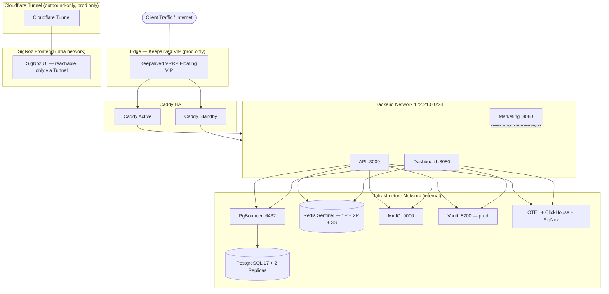

<div align="center">

# Infrastructure Platform

**Production-grade Docker Compose infrastructure** with multi-environment support,
high availability, secrets management, and full observability.

[](docs/architecture/overview.md)
[](docs/architecture/deployment-model.md)
[-orange>)](docs/services/_index.md)
[](docs/architecture/adr/README.md)

</div>

---

## What Is This?

A self-hosted infrastructure platform built entirely on Docker Compose. It provides
a complete stack for running web applications with databases, caching, object
storage, secrets management, observability, and high availability — all
orchestrated through a single [`justfile`](justfile) CLI.

The platform is **application-agnostic**: the API, Dashboard, and Marketing
service slots each build from their own Dockerfile under `app/`, allowing the
entire infrastructure to be validated end-to-end.

---

## Quick Start

```bash
# 1. Install prerequisites (Docker, Just, Bun, Trivy, jq, nmap)
bash scripts/setup/prerequisites.sh

# 2. Configure environment
cp .env.example .env

# 3. Bootstrap and start the dev environment (5 services)
just setup-dev

# 4. Verify everything is healthy
just health
```

---

## Architecture



### Three-Layer Network Isolation (ADR-004)

| Network          | Subnet        | Purpose                                        |
| ---------------- | ------------- | ---------------------------------------------- |
| `edge`           | 172.20.0.0/24 | Caddy + Keepalived (public-facing)             |
| `backend`        | 172.21.0.0/24 | API + Dashboard + Marketing (application tier) |
| `infrastructure` | 172.22.0.0/24 | Databases, caches, storage, observability      |

---

## Environments

| Environment | Services | What Runs                                                           | Command            |
| :---------- | :------: | ------------------------------------------------------------------- | ------------------ |
| **Dev**     |    5     | PostgreSQL, PgBouncer, Redis, MinIO, PowerSync                      | `just dev`         |
| **Staging** |    11    | Dev + ClickHouse, OTEL Collector, SigNoz, API, Dashboard, Marketing | `just staging`     |
| **Prod**    |    25    | Staging + Caddy HA, Keepalived, Vault, replicas, Cloudflared        | `just deploy prod` |

---

## Service Catalog

### Infrastructure

| Service            | Image                                | Role                                          | Environments |
| ------------------ | ------------------------------------ | --------------------------------------------- | :----------: |
| PostgreSQL 17      | `postgres:17-alpine`                 | Primary database                              |     all      |
| PostgreSQL Replica | custom                               | Read replicas (2x)                            |     prod     |
| PgBouncer          | `edoburu/pgbouncer:v1.23.1-p3`       | Connection pooler                             |     all      |
| Redis              | `redis:7.4-alpine` (custom)          | Cache with Sentinel HA                        |     all      |
| MinIO              | `minio/minio:latest`                 | S3-compatible object storage                  |     all      |
| PowerSync (sync)   | `journeyapps/powersync-service:1.24` | Real-time sync replication worker (singleton) |     all      |
| PowerSync (api)    | `journeyapps/powersync-service:1.24` | Client sync API (stateless)                   |     all      |

### Application Layer

| Service   | Port | Description                                | Environments  |
| --------- | :--: | ------------------------------------------ | :-----------: |
| API       | 3000 | REST backend (`app/api`)                   | staging, prod |
| Dashboard | 8080 | TanStack Start dashboard (`app/dashboard`) | staging, prod |
| Marketing | 8080 | Astro landing page (`app/marketing`)       | staging, prod |

### Edge & Security (prod only)

| Service                  | Image                             | Role                                         |
| ------------------------ | --------------------------------- | -------------------------------------------- |
| Caddy (active + standby) | `caddy:2.8.4-alpine` (custom)     | Reverse proxy with automatic TLS             |
| Keepalived               | `osixia/keepalived:2.0.20-alpine` | VRRP floating VIP, <5s failover              |
| Vault                    | `hashicorp/vault:1.18-alpine`     | Secrets management, PKI, dynamic credentials |
| Cloudflared              | `cloudflare/cloudflared:latest`   | Outbound tunnel for SigNoz access            |

### Observability

| Service        | Role                                          | Environments  |
| -------------- | --------------------------------------------- | :-----------: |
| ClickHouse     | Observability storage (traces, metrics, logs) | staging, prod |
| OTEL Collector | Telemetry pipeline (traces, metrics, logs)    | staging, prod |
| SigNoz         | Dashboards, queries, alerting                 | staging, prod |

---

## Project Structure

```
.
├── app/
│   ├── api/                    # Hono REST API (@abugida/api)
│   ├── dashboard/              # TanStack Start dashboard (@abugida/dashboard)
│   └── marketing/              # Astro landing page (@abugida/marketing)
├── docker/
│   ├── compose/                # 11-file modular Compose structure
│   │   ├── base.yml            # Core infrastructure (all environments)
│   │   ├── app.yml             # API + Dashboard + Marketing services
│   │   ├── edge.yml            # Caddy HA + Cloudflared
│   │   ├── observability.yml   # OTEL + SigNoz
│   │   ├── scaling.yml         # Redis/PostgreSQL replicas + Sentinels
│   │   ├── security.yml        # Vault + MinIO backup (Staging + Prod)
│   │   ├── networks.yml        # Network definitions + IPAM
│   │   ├── volumes.yml         # Named volume declarations
│   │   └── profiles/           # Environment-specific overrides
│   │       ├── dev.override.yml
│   │       ├── staging.override.yml
│   │       └── prod.override.yml
│   ├── config/                 # Service configuration files
│   │   ├── caddy/              # Caddyfile, upstreams, security snippets
│   │   ├── postgres/           # postgresql.conf, pg_hba, init SQL
│   │   ├── redis/              # redis.conf, sentinel.conf, ACL
│   │   ├── vault/              # Vault HCL, policies, bootstrap scripts
│   │   ├── minio/              # Bucket policies
│   │   ├── pgbouncer/          # pgbouncer.ini, userlist
│   │   ├── clickhouse/         # config.xml, TTL tables
│   │   ├── opentelemetry/      # Collector config + pipelines
│   │   ├── signoz/             # Dashboards, alerts
│   │   ├── powersync/          # service.yaml + sync streams (Sync Streams)
│   │   ├── keepalived/         # VRRP config + template
│   │   └── cloudflared/        # Tunnel config
│   ├── dockerfiles/            # Multi-stage Dockerfiles (infra services)
│   │   ├── caddy/              # Custom Caddy build
│   │   ├── redis/              # Redis with ACL + Sentinel support
│   │   └── postgres-replica/   # Streaming replica builder
│   ├── init/                   # Service initialization scripts
│   └── tests/                  # Integration + security tests
├── scripts/
│   ├── setup/                  # Prerequisites + environment bootstrap
│   ├── backup/                 # Backup, retention, S3 lifecycle
│   ├── restore/                # Point-in-time recovery
│   ├── deploy/                 # Blue-green, canary, rollback
│   ├── monitoring/             # Health, replication lag, diagnostics
│   └── security/               # Firewall, secret rotation, audits
├── docs/
│   ├── architecture/           # Overview, networking, security model, ADRs
│   ├── services/               # Per-service documentation
│   ├── onboarding/             # Quick start, prerequisites, installation
│   ├── runbooks/               # Incident response, deploy, maintenance
│   ├── configuration/          # Compose overlays, Caddy, Redis, Vault
│   └── development/            # Dockerfile guidelines, testing, workflow
├── justfile                    # Central CLI (Just v1.40.0+)
├── .env.example                # Environment configuration template
└── readme.md                   # This file
```

---

## Common Commands

```bash
just                    # List all available commands
just setup-dev          # Full dev bootstrap (.env + services)
just dev                # Start dev environment
just staging            # Start staging environment
just health             # Check all service health
just status             # Service health overview with details
just logs <service>     # Tail service logs
just down               # Stop all services
just scan               # Run Trivy image vulnerability scan
just vault-init         # Initialize HashiCorp Vault (prod)
just vault-unseal       # Unseal Vault after restart
just deploy prod        # Full production deployment
just rollback           # Rollback to previous version
just backup-full        # Full backup (Postgres + Redis + MinIO + config)
```

---

## Key Design Decisions

Selected ADRs from the [full registry](docs/architecture/adr/README.md):

| ADR     | Decision                                                                              |
| ------- | ------------------------------------------------------------------------------------- |
| ADR-004 | Three-layer network isolation (edge / backend / infrastructure)                       |
| ADR-006 | Secret layering: `.env` for dev, HashiCorp Vault for staging/prod                     |
| ADR-008 | Blue-green deployment via Caddy weighted upstreams                                    |
| ADR-013 | ~~Website reads directly from PostgreSQL~~ Superseded: all apps connect via PgBouncer |
| ADR-014 | Redis Sentinel for HA (1 primary + 2 replicas + 3 sentinels)                          |
| ADR-019 | PgBouncer transaction-mode pooling with scram-sha-256                                 |
| ADR-024 | 12-file modular Compose structure with profile overrides                              |

---

## Documentation

| Topic                 | Link                                                                                       |
| --------------------- | ------------------------------------------------------------------------------------------ |
| Quick Start           | [docs/onboarding/quick-start.md](docs/onboarding/quick-start.md)                           |
| Prerequisites         | [docs/onboarding/prerequisites.md](docs/onboarding/prerequisites.md)                       |
| Installation          | [docs/onboarding/installation.md](docs/onboarding/installation.md)                         |
| Architecture Overview | [docs/architecture/overview.md](docs/architecture/overview.md)                             |
| Deployment Model      | [docs/architecture/deployment-model.md](docs/architecture/deployment-model.md)             |
| Security Model        | [docs/architecture/security-model.md](docs/architecture/security-model.md)                 |
| Networking            | [docs/architecture/networking.md](docs/architecture/networking.md)                         |
| Runbooks              | [docs/runbooks/README.md](docs/runbooks/README.md)                                         |
| Service Docs          | [docs/services/_index.md](docs/services/_index.md)                                         |
| All ADRs              | [docs/architecture/adr/README.md](docs/architecture/adr/README.md)                         |
| Adding a Service      | [docs/configuration/adding-a-service.md](docs/configuration/adding-a-service.md)           |
| Environment Variables | [docs/configuration/environment-variables.md](docs/configuration/environment-variables.md) |

---

## Placeholder Services

Each app under `app/` ships a multi-stage Dockerfile that builds from the
monorepo root context. This allows the full production stack to be
validated end-to-end.

To integrate your application:

1. Edit the source in `app/<service>/` and its `Dockerfile` as needed
2. Un-comment the `COPY` and `RUN` blocks in the corresponding Dockerfile
3. Remove the stub health server section
4. Ensure your app exposes `GET /health` returning `200 {"status":"ok"}`

---

## Requirements

| Resource |                           Minimum                           |   Recommended    |
| -------- | :---------------------------------------------------------: | :--------------: |
| OS       | Ubuntu 22.04+ (Linux host required for Keepalived/iptables) | Ubuntu 24.04 LTS |
| CPU      |                           4 cores                           |     8 cores      |
| RAM      |                            8 GB                             |      16 GB       |
| Disk     |                          40 GB SSD                          |   100 GB NVMe    |
| Docker   |                            24.0+                            |      27.0+       |
| Just     |                           1.40.0+                           |      latest      |

---

## License

This project is provided as-is for infrastructure orchestration. See individual
configuration files for upstream license attributions.
