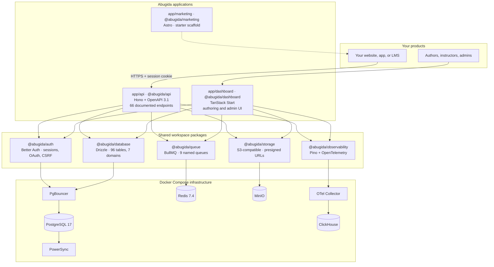

<div align="center">

# Abugida

**Headless course builder** — author structured learning content in Abugida, then deliver
it through your own websites, apps, and learning products.

[](https://bun.sh)
[](https://pnpm.io)
[](https://www.typescriptlang.org)
[](https://hono.dev)
[](app/api/src/modules/system/system.routes.ts)
[](https://www.postgresql.org)
[](https://www.docker.com)
[](LICENSE)

</div>

---

## What this is

Abugida is the **content layer underneath a learning product**. It does three things:

1. **Stores** your courses in a normalized PostgreSQL model.
2. **Lets authors build them** in a dashboard — `app/dashboard`.
3. **Publishes them** over a REST API — `app/api` — that _your_ site, app, or LMS reads.

It is deliberately **not** a student-facing LMS and **not** a course marketplace. There is
no learner UI in the delivery path, no storefront, and no sync or export step between
authoring and delivery. A course that an author publishes is immediately readable over the
API.

### The three moving parts

| Role          | Path                | What it is                                                                |
| ------------- | ------------------- | ------------------------------------------------------------------------- |
| **Authoring** | `app/dashboard`     | Instructor and admin UI where courses are built, reviewed, and published. |
| **Delivery**  | `app/api`           | REST API published as an OpenAPI 3.1 spec. Your product is the client.    |
| **The model** | `packages/database` | One shared content model in PostgreSQL that both apps read and write.     |

The two apps are separate runtimes and never import each other. They stay decoupled because
they share the database, not code paths.

### Vocabulary

- **Course** — the top-level unit: title, slug, price, status.
- **Module** — a chapter within a course; ordered, with its own duration.
- **Lesson** — the smallest content unit, typed as `pdf`, `video`, `quiz`, `exercise`, or
  `link`.
- **Content Library** — the folder-based asset store lessons draw on, with versioning and
  presigned uploads.
- **Cohort** — a scheduled group of enrollments sharing a start date.
- **Lifecycle** — `draft → published → archived`. Only `published` rows appear in catalog
  listings.
- **publicId** — the UUID that identifies a record in API URLs, as opposed to the internal
  `bigint` key.

### Why not a conventional LMS

Most learning platforms bundle authoring, delivery, and monetization into one
application. That works until you need your content somewhere else — inside an existing
product, on a different domain, under a different brand, in a system you already own.

|                       | Conventional LMS                          | Abugida                                            |
| --------------------- | ----------------------------------------- | -------------------------------------------------- |
| Where learners browse | Inside the vendor's UI                    | Your UI — Abugida is not in the learner path       |
| Content model         | Page/section oriented, tied to a template | Normalized course → module → lesson graph          |
| Delivery contract     | Proprietary SDK or HTML widgets           | Plain HTTP + JSON with an OpenAPI 3.1 contract     |
| Hosting               | Vendor SaaS or vendor-managed containers  | Self-hosted Docker Compose, three environments     |
| Extensibility         | Add-ons within the vendor's platform      | Direct database access and shared packages in-repo |

Commerce and assessment primitives — purchases, quizzes, reviews, cohorts, badges,
certificates — are included, because course operations need them. They are domain modules
you consume, not a marketplace you must adopt wholesale.

## Contents

- [What this is](#what-this-is) — the moving parts, vocabulary, and how it differs from an LMS
- [Quick start](#quick-start) — running locally in five steps
- [Core capabilities](#core-capabilities) — what the dashboard and the API do today
- [How it works](#how-it-works) — author → publish → consume, and a worked example
- [Architecture](#architecture) — system diagram and design rules
- [Repository layout](#repository-layout) — where things live
- [Technology stack](#technology-stack) — versions in use
- [Integration model](#integration-model) — auth, CSRF, CORS, extension points
- [Development workflow](#development-workflow) — scripts, hooks, style
- [Current status and roadmap](#current-status-and-roadmap) — known gaps
- [Documentation](#documentation) · [Contributing](#contributing) · [License](#license)

## Quick start

### Prerequisites

Bun ≥ 1.4.2 (pinned in `.bun-version`, enforced by `engines`/`devEngines`), pnpm 12.x,
Docker 27.0+, Docker Compose v2.24.0+, just 1.40.0+. `trivy`, `jq`, and `nmap` are optional
and only used by security and diagnostics recipes. See
[`docs/onboarding/prerequisites.md`](docs/onboarding/prerequisites.md).

### 1. Install

```bash
pnpm install
```

pnpm owns the dependency graph. `bunfig.toml` sets `frozenLockfile = true` so Bun can never
write a competing lockfile — do not run `bun install` or `bun add`.

### 2. Configure

```bash
cp .env.example .env
cp app/api/.env.example app/api/.env
cp app/dashboard/.env.example app/dashboard/.env
```

The API validates its environment up front with a Zod schema in
`app/api/src/config/app_config.ts` and fails fast with a clear report, never echoing
secrets.

Required: `DATABASE_URL`, `BETTER_AUTH_SECRET` (min 32 chars), `BETTER_AUTH_URL`, and at
least one OAuth provider (`GOOGLE_CLIENT_ID`/`_SECRET` or
`TELEGRAM_OIDC_CLIENT_ID`/`_SECRET`). Redis and object storage are optional — the API
boots without them. See [`app/api/.env.example`](app/api/.env.example) for every variable.

### 3. Start infrastructure

```bash
just setup-dev   # .env + dev services + wait for health + apply schema + init MinIO buckets
just health      # probe service health
just psql        # psql against postgres-primary
just dev-down    # stop the dev tier
```

The dev tier is **infrastructure only** — PostgreSQL, PgBouncer, Redis, MinIO, PowerSync.
Published ports come from `.env`. Run `just --list` for the full recipe index (health, logs,
shell, backup, deploy, Vault, security audit, and more).

### 4. Run the apps

```bash
pnpm dev                    # all workspaces
pnpm dev --filter=@abugida/api   # or scope to one
```

| App       | Dev URL                 | Notes                                                 |
| --------- | ----------------------- | ----------------------------------------------------- |
| API       | `http://localhost:3001` | `PORT` in `app/api/.env`; the container stays on 3000 |
| Dashboard | `http://localhost:3000` | Port is fixed in the app's `dev` script               |
| Marketing | `http://localhost:4321` | Astro's default dev port                              |

```bash
curl http://localhost:3001/health
open http://localhost:3001/docs      # OpenAPI 3.1 (non-production only)
open http://localhost:3001/scalar    # interactive reference
```

### 5. Database

```bash
pnpm --filter @abugida/database db:generate   # migration from schema changes
pnpm --filter @abugida/database db:migrate    # apply pending migrations
pnpm --filter @abugida/database db:push       # push schema directly (dev bootstrap)
pnpm --filter @abugida/database db:pull       # introspect an existing database
pnpm --filter @abugida/database db:studio     # Drizzle Studio
```

## Core capabilities

Everything in this section is **implemented** — wired into a running surface, not planned.

### Authoring — `app/dashboard`

- **Course structure** — `course → module → lesson` with drag-and-drop ordering, course and
  lesson duplication, per-module duration, and preview visibility.
- **Lifecycle** — `draft → published → archived`, plus scheduled publishing, enrollment
  windows, capacity limits, and approval-gated enrollment. Lessons carry a review workflow
  (`draft → in_review → changes_requested → approved`).
- **Lesson types** — `pdf`, `video`, `quiz`, `exercise`, `link`, with per-course completion
  rules.
- **Content Library** — assets in folders, with versioning, usage tracking, permission
  checks, and presigned uploads to object storage. Transcripts with timed segments and SRT
  handling.
- **Classification** — exam-type hierarchy, tags, and bundles. Course templates clone a
  course's structure.
- **AI drafting** — course-outline and quiz-draft generators via TanStack AI (OpenAI,
  Anthropic, Gemini, Ollama), falling back to a deterministic local synthesizer. Drafts are
  never applied silently; an author reviews and accepts.
- **Operations** — analytics and drop-off, cohorts, enrollment rules, waitlists, badges,
  campaigns, coupons, affiliates, testimonials, support tickets, roles, settings.

### Delivery API — `app/api`

66 documented endpoints across 14 modules. The full contract is served at `GET /docs`
(OpenAPI 3.1) with a Scalar reference UI at `GET /scalar`, both disabled in production.

| Group            | Surface                                                                   |
| ---------------- | ------------------------------------------------------------------------- |
| Catalog          | `/courses/*`, `/modules/{id}/lessons`, `/resources/{id}`, `/exam-types/*` |
| Discovery        | `/tags/*`, `/bundles/*`, `/search/bundles`                                |
| Learner state    | `/users/me/progress`, `/enrollments/*`, `/bookmarks`, `/recommendations`  |
| Assessments      | `/resources/{id}/quiz`, `/quiz/attempts/*`                                |
| Social proof     | `/courses/{id}/ratings`, `/courses/{id}/reviews`                          |
| Commerce         | `/courses/{id}/purchase-options`, `/purchases*`                           |
| Offline delivery | `/courses/{id}/download`, `/status`, `/presigned-url`                     |
| Account          | `/users/me`, `/onboarding`, `/consents`, `/devices`, `/export`            |
| Inbound webhooks | `/webhooks/telebirr`, `/webhooks/sms-delivery` — `X-API-Key`              |
| Health           | `/`, `/health`, `/health/ready`                                           |
| Authentication   | Better Auth mounted under `/auth/*`                                       |

Anonymous `GET`s under `/courses`, `/exam-types`, `/tags`, `/bundles`, `/modules`,
`/resources`, `/quiz`, and `/search` are public. Everything else requires a session.

### Platform services

Better Auth 1.6.26 (Google OAuth + Telegram OIDC) · BullMQ across nine queues (`purchases`,
`enrollments`, `notifications`, `exports`, `webhooks`, `moderation`, `statistics`, `audit`,
`maintenance`) · S3-compatible storage with presigned URLs and multipart uploads · Pino
logging and OpenTelemetry traces/metrics over OTLP · PowerSync replication for offline
delivery · RFC 9457 `problem+json` errors, request IDs, per-route rate limiting, a 10 MB body
limit, and a 30-second request timeout.

## How it works

1. **Author** in the dashboard. Catalog listings filter to `status = 'published'` and exclude
   soft-deleted rows, so unpublished work stays out of catalogs by default.
2. **Publish.** Publishing the course moves it to `published` — now or on a schedule — and
   sets `publishedAt`. Records are soft-deleted via `deletedAt`.
3. **Consume.** Your frontend calls the API. Catalog reads need no credentials; learner
   state is scoped to the caller's session.

### Conventions every response follows

- **IDs** — identifiers crossing the API boundary are UUID `publicId`s, never internal
  `bigint` keys. Public IDs are unique per table, so a `courseId` can never be confused
  with a `moduleId`.
- **Envelope** — responses are wrapped in a `data` envelope; lists add `meta` with `cursor`,
  `limit`, and `hasMore`.
- **Status filtering** — listings are status-filtered, but a single-course read is not: it
  returns the course's `status`, so check it yourself.

### Example

```bash
curl http://localhost:3001/courses/$COURSE_PUBLIC_ID
```

```json
{
  "data": {
    "courseId": "9c1f4d2a-…",
    "title": "Foundations of Data Structures",
    "slug": "foundations-of-data-structures",
    "priceAmount": "450.0000",
    "priceCurrency": "ETB",
    "status": "published",
    "publishedAt": "2026-08-14T09:00:00.000Z",
    "version": 3,
    "averageRating": "4.6",
    "totalEnrollments": 1543
  }
}
```

> [!WARNING]
> **The content hierarchy is not traversable over the API yet.**
>
> - `GET /courses/{courseId}/curriculum` returns the course and its ordered modules, but
>   populates `lessons` with an empty array.
> - `GET /modules/{moduleId}/lessons` parses the UUID `moduleId` as an integer
>   (`Number.parseInt(moduleId, 10) || 0`), so it resolves module `0`.
>
> The reliably usable content reads today are `GET /courses/{courseId}`,
> `GET /courses/{courseId}/curriculum` (module list), and `GET /courses/{courseId}/modules`
> (with `lessonCount`). Read lesson-level content directly from `@abugida/database` in the
> meantime.

## Architecture


```mermaid
flowchart TB
  subgraph consumers["Your products"]
    SITE["Your website, app, or LMS"]
    OPS["Authors, instructors, admins"]
  end

  subgraph apps["Abugida applications"]
    API["app/api · @abugida/api<br/>Hono + OpenAPI 3.1<br/>66 documented endpoints"]
    DASH["app/dashboard · @abugida/dashboard<br/>TanStack Start<br/>authoring and admin UI"]
    MKT["app/marketing · @abugida/marketing<br/>Astro · starter scaffold"]
  end

  subgraph shared["Shared workspace packages"]
    AUTH["@abugida/auth<br/>Better Auth · sessions, OAuth, CSRF"]
    DB["@abugida/database<br/>Drizzle · 96 tables, 7 domains"]
    QUEUE["@abugida/queue<br/>BullMQ · 9 named queues"]
    STORAGE["@abugida/storage<br/>S3-compatible · presigned URLs"]
    OBS["@abugida/observability<br/>Pino + OpenTelemetry"]
  end

  subgraph infra["Docker Compose infrastructure"]
    PGB["PgBouncer"]
    PG[("PostgreSQL 17")]
    RED[("Redis 7.4")]
    MINIO[("MinIO")]
    PSYNC["PowerSync"]
    OTEL["OTel Collector"]
    CH[("ClickHouse")]
  end

  SITE -->|"HTTPS + session cookie"| API
  OPS --> DASH

  API --> AUTH
  API --> DB
  API --> QUEUE
  API --> STORAGE
  API --> OBS

  DASH --> AUTH
  DASH --> DB
  DASH --> QUEUE
  DASH --> STORAGE
  DASH --> OBS

  AUTH --> PGB
  DB --> PGB
  PGB --> PG

  QUEUE --> RED
  STORAGE --> MINIO
  PG --> PSYNC

  OBS --> OTEL
  OTEL --> CH

  MKT -.-> SITE
```

Four rules explain most of the layout:

- **No cross-app imports.** `app/api` and `app/dashboard` are separate runtimes with
  separate auth instances and clients. They never import each other; the dashboard reaches
  data through its own server functions, and the API serves external consumers.
- **Shared packages.** Auth, database, queue, storage, and observability are single-source
  under `packages/`, with framework-specific subpath exports (`/hono`, `/tanstack`,
  `/astro`).
- **One content model.** 96 tables across `auth`, `catalog`, `finance`, `learning`,
  `marketing`, `ops`, `shared`, with Drizzle relations and `drizzle-zod` schemas generated
  from the same definitions. Content tables carry `rowVersion` for concurrent-edit
  detection, and most define partial indexes that exclude soft-deleted rows.
- **Graceful degradation.** The API boots without Redis or object storage: those features
  are skipped with a warning and rate limiting falls back to in-memory limiters.

## Repository layout

pnpm workspaces orchestrated by Turborepo.

```text
.
├── app/
│   ├── api/          # @abugida/api — Hono REST API (Bun, dev port 3001)
│   │   └── src/      # config/ (Zod env) · middleware/ · modules/ (routes, service, repository)
│   ├── dashboard/    # @abugida/dashboard — TanStack Start authoring UI (port 3000)
│   │   └── src/      # routes/ · features/ (13 domains) · components/ · config/ · server/
│   └── marketing/    # @abugida/marketing — Astro site (starter scaffold, port 4321)
├── packages/
│   ├── auth/         # Better Auth core + /hono, /tanstack, /providers
│   ├── database/     # Drizzle schema (7 domains), 18 migrations, createClient
│   ├── observability/# Pino + OpenTelemetry + /hono, /tanstack, /astro
│   ├── queue/        # BullMQ queues, job types, processors
│   └── storage/      # S3-compatible storage, presigned URLs
├── docker/           # compose/ (8 files + 3 profiles) · config/ · dockerfiles/ · init/ · tests/
├── docs/             # Architecture, ADRs, services, runbooks, onboarding, development
├── scripts/          # setup · backup · restore · deploy · monitoring · security
└── justfile          # Task runner for all infrastructure operations
```

Conventions are documented in `AGENTS.md` at the root and in `app/dashboard/`,
`app/marketing/`.

## Technology stack

| Layer           | Technologies                                                                                                                                         |
| --------------- | ---------------------------------------------------------------------------------------------------------------------------------------------------- |
| Runtime & tools | Bun 1.4.2 (runtime + test runner) · pnpm 12.5.1 · Turborepo 2 · TypeScript 6 strict · Docker Compose · just · ESLint + Prettier · husky + commitlint |
| API             | Hono 4 + Zod OpenAPI · Zod 4 · Better Auth 1.6.26 · Drizzle ORM 0.45 + `pg` · BullMQ 6.3 · rate-limiter-flexible                                     |
| Dashboard       | TanStack Start + Router + Query + Charts · React 19 + Vite · Tailwind 4 + shadcn · `@dnd-kit` · TipTap · TanStack AI                                 |
| Data            | PostgreSQL 17 · PgBouncer 1.23 · Redis 7.4 · MinIO · PowerSync 1.24                                                                                  |
| Observability   | Pino 9.6 · OpenTelemetry 1.30 (OTLP) · ClickHouse + SigNoz                                                                                           |
| Edge & secrets  | Caddy 2.8.4 · Keepalived 2.0.20 · HashiCorp Vault 1.18 · Cloudflared · Astro 7                                                                       |

## Integration model

- **Contract-first.** `GET /docs` returns the OpenAPI 3.1 document and `GET /scalar` renders
  it interactively. Both are disabled in production, so treat them as an integration surface
  rather than a production endpoint.
- **Auth.** Session cookie for feature routes (`withSession` + `requireAuth` outside the
  documented public allowlist); `X-API-Key` for server-to-server `/webhooks/*` — the key is
  SHA-256 hashed and matched against `ops.api_keys`, and must be active and unexpired.
- **CSRF and CORS.** CORS uses one origin list shared with Better Auth's trusted-origin
  check. CSRF runs on every feature route except `/auth/*` and `/webhooks/*`.
- **Extension points.** `@abugida/database` exposes per-domain subpaths, so you can read the
  schema directly when the HTTP surface does not cover a query. Each API module is
  self-contained — routes, schemas, service, repository, handlers — and registered in
  `app/api/src/app.ts`.
- **What it does not do.** No learner interface, no storefront, and no arbitrary payment
  providers out of the box (Telebirr is the one implemented integration). Catalog
  presentation, checkout UX, and learner-facing routing are yours.

## Development workflow

```bash
pnpm dev          # watch all workspaces
pnpm build        # build all, honoring ^build ordering
pnpm typecheck    # tsc --noEmit across workspaces
pnpm lint         # eslint
pnpm format       # prettier + eslint --fix
pnpm test         # bun test
```

- **Tests run on Bun**, not Vitest or Jest. `app/api` and `app/dashboard` pass
  `--pass-with-no-tests`.
- **After adding or renaming dashboard routes**, run
  `pnpm --filter @abugida/dashboard generate-routes`.
- **Code style** is Prettier with no semicolons, single quotes, trailing commas,
  `printWidth` 100, plus TypeScript strict mode.
- **Husky hooks are enforced** — do not bypass them. `commit-msg` requires Conventional
  Commits; `pre-commit` runs ESLint `--fix` and Prettier on staged files; `pre-push` runs
  `pnpm typecheck` across all workspaces.

## Current status and roadmap

Under active development; not released as a package. Below are the concrete gaps visible in
the repository today, described as current state rather than as commitments.

| Status             | Meaning                                                  |
| ------------------ | -------------------------------------------------------- |
| **Implemented**    | Wired into a running surface.                            |
| **Dashboard-only** | Modelled and managed in the authoring UI, no public API. |
| **Not started**    | No working surface yet.                                  |

- **Content hierarchy is not traversable over the API** — the most significant gap for
  anyone integrating now. Details in [How it works](#how-it-works).
- **No authoring API.** Content writes are only possible from the dashboard's server
  functions.
- **No programmatic API-key management.** `ops.api_keys` exists and authenticates inbound
  webhooks, but keys are managed from dashboard settings.
- **Dashboard-only domains.** Cohorts, badges, certificates, waitlists, enrollment rules,
  live sessions, course templates, content licensing, and the marketing and support domains
  have schemas and screens but no delivery endpoints.
- **`app/marketing` is the unmodified Astro starter** and carries no Abugida content.
- **Commerce is Telebirr-specific.** Other gateways have schema
  (`finance.payment_gateways`) but no implemented provider.
- **No release packaging.** No release tags and no published images; the five libraries
  under `packages/` are publishable, the three apps are not.

Roadmap priorities are set by the maintainers.

## Documentation

Infrastructure and operations docs live under [`docs/`](docs/README.md).

| Topic                  | Document                                                                                                                          |
| ---------------------- | --------------------------------------------------------------------------------------------------------------------------------- |
| Quick start            | [docs/onboarding/quick-start.md](docs/onboarding/quick-start.md)                                                                  |
| Architecture overview  | [docs/architecture/overview.md](docs/architecture/overview.md)                                                                    |
| Deployment model       | [docs/architecture/deployment-model.md](docs/architecture/deployment-model.md)                                                    |
| Security model         | [docs/architecture/security-model.md](docs/architecture/security-model.md)                                                        |
| ADRs                   | [docs/architecture/adr/README.md](docs/architecture/adr/README.md)                                                                |
| Service catalog        | [docs/services/_index.md](docs/services/_index.md)                                                                                |
| Runbooks               | [docs/runbooks/README.md](docs/runbooks/README.md)                                                                                |
| Dev workflow / testing | [docs/development/dev-workflow.md](docs/development/dev-workflow.md) · [docs/development/testing.md](docs/development/testing.md) |

## Contributing

Not currently open for outside contributions, but these conventions are enforced:

1. Read `AGENTS.md` and the relevant app's or package's `AGENTS.md` first.
2. Keep app boundaries intact — `app/api` and `app/dashboard` must not import each other.
   Share code through `packages/`.
3. Never read `process.env` outside a centralized config module; add new variables to that
   module's Zod schema and the relevant `.env.example`.
4. Run `pnpm lint`, `pnpm typecheck`, and `pnpm test` before opening a change.

## License

[MIT](LICENSE). Every workspace declares `"license": "MIT"`. The five libraries under
`packages/` are also `"private": false` so they can be published independently; the three
applications under `app/` remain `"private": true` because they are deployable services
rather than libraries.
