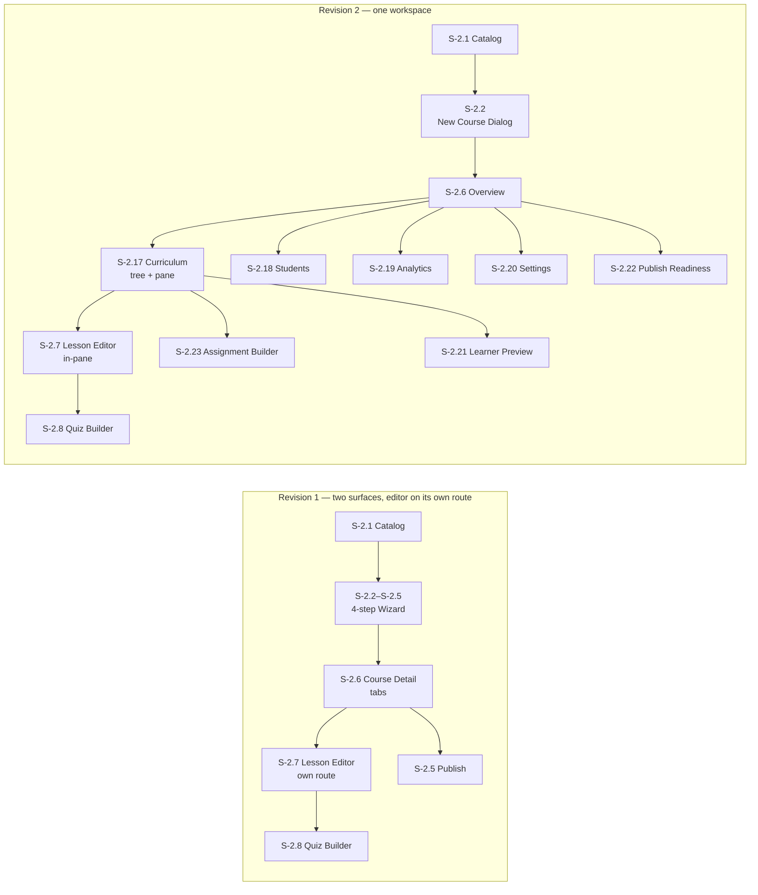

# Abugida Academy — UX Design Specification

This document is the authoritative user-experience blueprint for the Abugida Academy course-operations platform. It specifies every screen, workflow, shared component, and design-system token required to design, build, and evaluate the product. It is written for cross-functional use by product designers, engineers, QA, and stakeholders, and it describes the target experience rather than any particular release of it.

**Scope:** The admin-facing workspace — authentication, dashboard, courses, content library, students, analytics, marketing, and settings.
**Convention:** Screens carry stable IDs (`S-x.y`) that are referenced throughout the document; every screen ID in the sitemap links to the module file that holds its full definition.

---

## How to Read This Specification

### Precedence

1. **[Part 11](11-Global-Standards.md)** owns every cross-cutting rule: design tokens, roles, accessibility, formatting, notification delivery, resilience states, and the save-state contract. A screen that contradicts Part 11 is wrong.
2. **[Part 13](13-Identity-and-Workspaces.md)** owns identity: the workspace model, the two role systems, role capabilities, and what is configurable where. A screen that names a role or a limit defers to Part 13.
3. **[Part 09](09-Shared-Components.md)** owns shared component behavior. Part 11's component list is an **index**, not a second source of truth.
4. **[`DESIGN.md`](../DESIGN.md)** owns visual and interaction rules and its §15 conflict register. **Where this specification and a resolved `DESIGN.md` §15 item disagree, the §15 item wins.** Unresolved §15 items are open questions, not decisions.
5. **The owning module file** owns everything else about its screens.

### The Screen Template

Every screen is defined with these fields. A screen missing a required field is not finished.

| Field                                 | Required | Purpose                                                      |
| ------------------------------------- | -------- | ------------------------------------------------------------ |
| `##### Screen Name: S-x.y`            | ✔        | Stable ID plus a status marker                               |
| `- **Purpose:**`                      | ✔        | What the screen is for, in one line                          |
| `- **User Role(s):**`                 | ✔        | Referencing the Part 11 role matrix — never a free-text list |
| `- **Wireframe Layout:**`             | ✔        | Text wireframe                                               |
| `- **Primary Actions:**`              | ✔        | Numbered, verb-first                                         |
| `- **Data Displayed/Modified:**`      | ✔        | Schema names that resolve to `packages/database`             |
| `- **Validation & Feedback:**`        | —        | Required wherever the screen accepts input                   |
| `- **States:**`                       | ✔        | Including loading, empty, zero-result, and error             |
| `- **Resilience:**`                   | ✔        | 403, 404, offline, session expiry, conflict — per Part 11    |
| `- **Keyboard & Focus:**`             | —        | Required wherever the screen is interactive                  |
| `- **Navigation:**`                   | ✔        | Every outbound link, as a screen ID                          |
| `- **Instrumentation & acceptance:**` | —        | Events, binary criteria, budgets — per Part 11               |

### Glossary

Terms that were used inconsistently across Revisions 1 and 2, fixed here once.

| Term                  | Means                                                                                       | Never means                                           |
| --------------------- | ------------------------------------------------------------------------------------------- | ----------------------------------------------------- |
| **Section**           | A display label for a `modules` row. The two-level curriculum container.                    | A new tree node, or a scheduling term                 |
| **Item**              | A display label for a `lessons` row. The leaf of the curriculum.                            | An activity, or a chapter                             |
| **Item kind**         | `lesson`, `quiz`, or `assignment`.                                                          | A content type (`markdown`, `video`, `pdf`)           |
| **Course lifecycle**  | `Draft → In Review → Approved → Published → Archived`, plus `Unlisted`.                     | Item review state                                     |
| **Item review state** | The approval status of one item: Draft, In Review, Changes Requested, Approved.             | The course's lifecycle                                |
| **Visibility**        | Per-item `draft` / `published` / `scheduled` — whether a student can see it.                | A review state                                        |
| **Unlisted**          | A course unpublished for new enrolment that keeps access for the students already enrolled. | An archived course, or a `draft` with an empty roster |
| **Section published** | A section containing at least one item whose `visibility` is `published`.                   | A lifecycle status of the section itself              |
| **Archive**           | A reversible hide. Reversible until purge.                                                  | Delete                                                |
| **Delete**            | Soft-delete with a retention window. Irreversible after it.                                 | Archive                                               |
| **Unpublish**         | Removes student access. Distinct from both of the above.                                    | Archive or delete                                     |
| **Prose**             | Body text with markdown syntax stripped, excluding headings, tables, and embeds.            | Raw characters, or byte length                        |
| **Published set**     | Items whose `visibility` is `published`, which RC-3 and RC-4 evaluate.                      | Everything in the course, or only `lesson` kinds      |
| **Fix**               | A deep link to the exact field, on the exact tab, **with focus moved to it.**               | A link to the containing screen                       |
| **Blocker**           | A readiness check that prevents publish.                                                    | An advisory                                           |

**Identity terms are defined in [Part 13](13-Identity-and-Workspaces.md)**, the authority for workspaces and roles: **Workspace** (one `organization` row), **Member role** (`member.role`, workspace-wide), **Course role** (`roles` + `course_roles`, per course), **Effective role** (the union, capped by the member role), and **Active workspace** (the `organizationId` in the session).

**Revision 2 — Course Workspace redesign.** This revision reorganises the entire course experience around a persistent **Course Workspace** with a curriculum-first authoring workflow (ClassroomIO-inspired information architecture, Abugida-native UX). It supersedes the previous "Course Detail + 4-step wizard" model. The authoritative list of every changed, retired, and newly proposed requirement is the [Change Register](#revision-2--course-workspace-redesign-change-register) at the end of this file. Screen IDs from Revision 1 are preserved wherever a screen survives; retired IDs are never reused.

---

## Reading the Markers

Every screen heading in this specification carries a status marker so that readers can tell at a glance what Revision 2 touched.

| Marker        | Meaning                                                                                         |
| ------------- | ----------------------------------------------------------------------------------------------- |
| _(no marker)_ | **Retained.** Carried over from Revision 1 without material change.                             |
| `🔄 CHANGED`  | The screen still exists under the same ID, but its layout, actions, or states changed.          |
| `🆕 NEW`      | A screen introduced by Revision 2.                                                              |
| `⛔ RETIRED`  | The screen no longer exists as a screen. Its capability moved elsewhere; the mapping is stated. |

---

## High-Level Sitemap / Page Hierarchy

| Section / Module                   | Screen Name                           | Screen ID                                            | Status       |
| ---------------------------------- | ------------------------------------- | ---------------------------------------------------- | ------------ |
| **0. Authentication & Onboarding** | Login                                 | [S-0.1](01-Authentication-and-Onboarding.md#scr-0-1) | _(retained)_ |
|                                    | Organization Sign-Up & Onboarding     | [S-0.2](01-Authentication-and-Onboarding.md#scr-0-2) | _(retained)_ |
|                                    | Multi-Factor Authentication Challenge | [S-0.3](01-Authentication-and-Onboarding.md#scr-0-3) | _(retained)_ |
|                                    | Multi-Factor Enrollment               | [S-0.4](01-Authentication-and-Onboarding.md#scr-0-4) | 🆕 NEW       |
| **A. Global Navigation**           | Main App Shell (Sidebar + Header)     | [S-A.1](02-Global-Navigation.md#scr-a-1)             | 🔄 CHANGED   |
| **1. Dashboard**                   | Analytics Overview                    | [S-1.1](03-Dashboard.md#scr-1-1)                     | 🔄 CHANGED   |
|                                    | Revenue Analytics                     | [S-1.2](03-Dashboard.md#scr-1-2)                     | _(retained)_ |
|                                    | Global Search Results                 | [S-1.3](03-Dashboard.md#scr-1-3)                     | 🔄 CHANGED   |
|                                    | Notifications Center                  | [S-1.4](03-Dashboard.md#scr-1-4)                     | 🔄 CHANGED   |
| **2. Courses (Primary)**           | Course Catalog / Grid                 | [S-2.1](04-Courses.md#scr-2-1)                       | 🔄 CHANGED   |
|                                    | New Course Dialog                     | [S-2.2](04-Courses.md#scr-2-2)                       | 🔄 CHANGED   |
| **Course Workspace**               | **Overview**                          | [S-2.6](04-Courses.md#scr-2-6)                       | 🔄 CHANGED   |
|                                    | **Curriculum**                        | [S-2.17](04-Courses.md#scr-2-17)                     | 🆕 NEW       |
|                                    | **Students**                          | [S-2.18](04-Courses.md#scr-2-18)                     | 🆕 NEW       |
|                                    | **Analytics**                         | [S-2.19](04-Courses.md#scr-2-19)                     | 🆕 NEW       |
|                                    | **Settings**                          | [S-2.20](04-Courses.md#scr-2-20)                     | 🆕 NEW       |
| **Course Authoring**               | Lesson Editor (in-workspace pane)     | [S-2.7](04-Courses.md#scr-2-7)                       | 🔄 CHANGED   |
|                                    | Quiz Builder                          | [S-2.8](04-Courses.md#scr-2-8)                       | 🔄 CHANGED   |
|                                    | Assignment Builder                    | [S-2.23](04-Courses.md#scr-2-23)                     | 🆕 NEW       |
|                                    | Live Session Scheduler                | [S-2.9](04-Courses.md#scr-2-9)                       | 🔄 CHANGED   |
|                                    | Certificates & Completion Rules       | [S-2.10](04-Courses.md#scr-2-10)                     | 🔄 CHANGED   |
|                                    | Learner Preview                       | [S-2.21](04-Courses.md#scr-2-21)                     | 🆕 NEW       |
|                                    | Publish Readiness & Course Review     | [S-2.22](04-Courses.md#scr-2-22)                     | 🆕 NEW       |
| **Course Generation**              | AI Course Generator                   | [S-2.11](04-Courses.md#scr-2-11)                     | 🔄 CHANGED   |
|                                    | Template Library                      | [S-2.12](04-Courses.md#scr-2-12)                     | 🔄 CHANGED   |
|                                    | Bulk Section & Item Import            | [S-2.13](04-Courses.md#scr-2-13)                     | 🔄 CHANGED   |
|                                    | Review & Approval Queue               | [S-2.14](04-Courses.md#scr-2-14)                     | 🔄 CHANGED   |
|                                    | Prerequisites & Unlock Rules          | [S-2.15](04-Courses.md#scr-2-15)                     | 🔄 CHANGED   |
|                                    | AI Quiz Generator                     | [S-2.16](04-Courses.md#scr-2-16)                     | 🔄 CHANGED   |
| **3. Content Library**             | Asset Repository                      | [S-3.1](05-Content-Library.md#scr-3-1)               | 🔄 CHANGED   |
|                                    | Asset Upload Modal                    | [S-3.2](05-Content-Library.md#scr-3-2)               | _(retained)_ |
|                                    | Asset Detail View                     | [S-3.3](05-Content-Library.md#scr-3-3)               | 🔄 CHANGED   |
|                                    | Folders & Collections                 | [S-3.4](05-Content-Library.md#scr-3-4)               | _(retained)_ |
|                                    | File Preview Modal                    | [S-3.5](05-Content-Library.md#scr-3-5)               | _(retained)_ |
|                                    | Transcription & Subtitle Editor       | [S-3.6](05-Content-Library.md#scr-3-6)               | 🔄 CHANGED   |
| **4. Students**                    | Student Directory                     | [S-4.1](06-Students.md#scr-4-1)                      | 🔄 CHANGED   |
|                                    | Student Profile                       | [S-4.2](06-Students.md#scr-4-2)                      | _(retained)_ |
|                                    | Student Progress Dashboard            | [S-4.3](06-Students.md#scr-4-3)                      | _(retained)_ |
|                                    | Cohort Management                     | [S-4.4](06-Students.md#scr-4-4)                      | _(retained)_ |
|                                    | Messaging Center                      | [S-4.5](06-Students.md#scr-4-5)                      | _(retained)_ |
|                                    | Enrollment Requests / Waitlist        | [S-4.6](06-Students.md#scr-4-6)                      | _(retained)_ |
|                                    | Badges & Achievements                 | [S-4.7](06-Students.md#scr-4-7)                      | _(retained)_ |
|                                    | Automated Enrollment Rules            | [S-4.8](06-Students.md#scr-4-8)                      | _(retained)_ |
| **5. Analytics**                   | Course Performance                    | [S-5.1](07-Analytics.md#scr-5-1)                     | 🔄 CHANGED   |
|                                    | Quiz Analytics                        | [S-5.2](07-Analytics.md#scr-5-2)                     | _(retained)_ |
|                                    | Drop-off Analysis                     | [S-5.3](07-Analytics.md#scr-5-3)                     | 🔄 CHANGED   |
|                                    | Export Reports                        | [S-5.4](07-Analytics.md#scr-5-4)                     | _(retained)_ |
|                                    | Cohort Comparison Report              | [S-5.5](07-Analytics.md#scr-5-5)                     | _(retained)_ |
| **6. Settings**                    | General Settings                      | [S-6.1](08-Settings.md#scr-6-1)                      | 🔄 CHANGED   |
|                                    | Team Management                       | [S-6.2](08-Settings.md#scr-6-2)                      | 🔄 CHANGED   |
|                                    | Roles & Permissions                   | [S-6.9](08-Settings.md#scr-6-9)                      | 🔄 CHANGED   |
|                                    | Integrations                          | [S-6.3](08-Settings.md#scr-6-3)                      | _(retained)_ |
|                                    | Branding                              | [S-6.4](08-Settings.md#scr-6-4)                      | 🔄 CHANGED   |
|                                    | Billing & Subscription                | [S-6.6](08-Settings.md#scr-6-6)                      | 🔄 CHANGED   |
|                                    | API & Webhooks                        | [S-6.7](08-Settings.md#scr-6-7)                      | 🔄 CHANGED   |
|                                    | Security & Audit Log                  | [S-6.8](08-Settings.md#scr-6-8)                      | 🔄 CHANGED   |
|                                    | My Profile & Account                  | [S-6.5](08-Settings.md#scr-6-5)                      | 🔄 CHANGED   |
|                                    | Privacy & Data Retention              | [S-6.10](08-Settings.md#scr-6-10)                    | 🔄 CHANGED   |
|                                    | **Danger Zone**                       | [S-6.11](08-Settings.md#scr-6-11)                    | 🆕 NEW       |
| **6. Settings (cont.)**            | Workspace Configuration               | [S-13.1](13-Identity-and-Workspaces.md#scr-13-1)     | 🆕 NEW       |
|                                    | Workspace Switcher                    | [S-13.2](13-Identity-and-Workspaces.md#scr-13-2)     | 🆕 NEW       |
|                                    | Role Assignment                       | [S-13.3](13-Identity-and-Workspaces.md#scr-13-3)     | 🆕 NEW       |
| **7. Shared Components**           | Confirmation Dialog                   | [S-7.1](09-Shared-Components.md#scr-7-1)             | 🔄 CHANGED   |
|                                    | Toast Notifications                   | [S-7.2](09-Shared-Components.md#scr-7-2)             | 🔄 CHANGED   |
|                                    | Empty State Component                 | [S-7.3](09-Shared-Components.md#scr-7-3)             | 🔄 CHANGED   |
|                                    | Help & Support Panel                  | [S-7.4](09-Shared-Components.md#scr-7-4)             | 🔄 CHANGED   |
|                                    | Command Palette                       | [S-7.5](09-Shared-Components.md#scr-7-5)             | 🔄 CHANGED   |
|                                    | Onboarding Tour                       | [S-7.6](09-Shared-Components.md#scr-7-6)             | 🔄 CHANGED   |
|                                    | Duplicate Item Modal                  | [S-7.7](09-Shared-Components.md#scr-7-7)             | 🔄 CHANGED   |
|                                    | **Save-State Indicator**              | [S-7.8](09-Shared-Components.md#scr-7-8)             | 🆕 NEW       |
|                                    | **Curriculum Tree**                   | [S-7.9](09-Shared-Components.md#scr-7-9)             | 🆕 NEW       |
|                                    | **Curriculum Item Actions Menu**      | [S-7.10](09-Shared-Components.md#scr-7-10)           | 🆕 NEW       |
|                                    | **Publish Readiness Checklist**       | [S-7.11](09-Shared-Components.md#scr-7-11)           | 🆕 NEW       |
|                                    | **Form & Data Primitives**            | [S-7.12](09-Shared-Components.md#scr-7-12)           | 🆕 NEW       |
| **8. Marketing & Growth**          | Email Campaigns                       | [S-8.1](10-Marketing-and-Growth.md#scr-8-1)          | _(retained)_ |
|                                    | Email Template Editor                 | [S-8.2](10-Marketing-and-Growth.md#scr-8-2)          | _(retained)_ |
|                                    | Discount & Coupon Codes               | [S-8.3](10-Marketing-and-Growth.md#scr-8-3)          | _(retained)_ |
|                                    | Affiliate Program                     | [S-8.4](10-Marketing-and-Growth.md#scr-8-4)          | _(retained)_ |
|                                    | Student Testimonials                  | [S-8.5](10-Marketing-and-Growth.md#scr-8-5)          | _(retained)_ |

### Retired Screen IDs

These IDs are permanently retired. They are never reused for a different screen.

| Retired ID                           | Screen it described       | Where the capability lives now                                                                  |
| ------------------------------------ | ------------------------- | ----------------------------------------------------------------------------------------------- |
| [S-2.3](04-Courses.md#retired-s-2-3) | Wizard Step 2: Curriculum | [S-2.17](04-Courses.md#scr-2-17) Curriculum tab of the Course Workspace                         |
| [S-2.4](04-Courses.md#retired-s-2-4) | Wizard Step 3: Pricing    | [S-2.20](04-Courses.md#scr-2-20) → _Pricing & Enrollment_ section of the workspace Settings tab |
| [S-2.5](04-Courses.md#retired-s-2-5) | Wizard Step 4: Publish    | [S-2.22](04-Courses.md#scr-2-22) Publish Readiness & Course Review                              |

---

## Document Map — Files in This Split

The specification is split into one file per module, exactly as listed in the sitemap table above. Screen-ID links (e.g. `[S-2.17]`) jump straight to the definition inside the owning file.

| Part | File                                                                         | Module (per sitemap table)                                                                                                                                | Screens         |
| ---- | ---------------------------------------------------------------------------- | --------------------------------------------------------------------------------------------------------------------------------------------------------- | --------------- |
| 00   | `00-Overview-and-Sitemap.md`                                                 | Introduction, scope & sitemap, **Revision 2 change register**                                                                                             | — (this file)   |
| 01   | [01-Authentication-and-Onboarding.md](01-Authentication-and-Onboarding.md)   | 0. Authentication & Onboarding                                                                                                                            | S-0.1 – S-0.3   |
| 02   | [02-Global-Navigation.md](02-Global-Navigation.md)                           | A. Global Navigation                                                                                                                                      | S-A.1           |
| 03   | [03-Dashboard.md](03-Dashboard.md)                                           | 1. Dashboard                                                                                                                                              | S-1.1 – S-1.4   |
| 04   | [04-Courses.md](04-Courses.md)                                               | 2. Courses — **Course Workspace & authoring**                                                                                                             | S-2.1 – S-2.23  |
| 05   | [05-Content-Library.md](05-Content-Library.md)                               | 3. Content Library                                                                                                                                        | S-3.1 – S-3.6   |
| 06   | [06-Students.md](06-Students.md)                                             | 4. Students                                                                                                                                               | S-4.1 – S-4.8   |
| 07   | [07-Analytics.md](07-Analytics.md)                                           | 5. Analytics                                                                                                                                              | S-5.1 – S-5.5   |
| 08   | [08-Settings.md](08-Settings.md)                                             | 6. Settings                                                                                                                                               | S-6.1 – S-6.10  |
| 09   | [09-Shared-Components.md](09-Shared-Components.md)                           | 7. Shared Components                                                                                                                                      | S-7.1 – S-7.11  |
| 10   | [10-Marketing-and-Growth.md](10-Marketing-and-Growth.md)                     | 8. Marketing & Growth                                                                                                                                     | S-8.1 – S-8.5   |
| 11   | [11-Global-Standards.md](11-Global-Standards.md)                             | Cross-cutting UX, roles & permissions, design system, responsive, accessibility, navigation flow                                                          | —               |
| 12   | [12-Course-Editor-Markdown-Lessons.md](12-Course-Editor-Markdown-Lessons.md) | **Companion doc.** Course Editor — Markdown lesson authoring with Tiptap: content model, storage, migration                                               | S-2.7 (extends) |
| 13   | [13-Identity-and-Workspaces.md](13-Identity-and-Workspaces.md)               | **Identity authority** — Better Auth `organization()` and `twoFactor()`: workspace model, the two role systems, configuration, active-workspace switching | S-13.1 – S-13.3 |

> **Note on Part 12:** it is a _companion_ engineering specification rather than a twelfth UX module, and it does not renumber Parts 01–11. It extends [S-2.7](04-Courses.md#scr-2-7), which remains the authoritative definition of the Lesson Editor's layout, states, and navigation. Revision 2 adds a workspace-integration section to it ([Part 12 § 16](12-Course-Editor-Markdown-Lessons.md#16-revision-2--workspace-integration)) that covers the curriculum-pane host, per-item save state, and preview reuse. Revision 3 hardens the authoring interaction — the draft mirror, split-mode sync, offline autosave, conflict resolution, media, and AI — while declaring the content model, storage contract, and round-trip invariants **unchanged**.

---

## Cross-Screen Contract

Rules that hold across every module. A screen that needs to deviate states the deviation explicitly.

### Routing & deep links

| Surface              | Contract                                                                                                                                                                                                   |
| -------------------- | ---------------------------------------------------------------------------------------------------------------------------------------------------------------------------------------------------------- |
| **URL is state**     | Every list filter, sort, tab, and selection that changes what is on screen is reflected in the URL, so a link reproduces the view.                                                                         |
| **Workspace route**  | `/_app/courses/$courseId?tab=overview\|curriculum\|students\|analytics\|settings&item=<publicId>&atab=<analytics sub-tab>`. `tab` defaults to `overview`; `item` and `atab` are ignored outside their tab. |
| **Focus on arrival** | A deep link moves focus to its target control and announces the destination in a polite live region. A `Fix` link focuses the **offending field**, not the screen containing it.                           |
| **Back behaviour**   | Browser Back returns to the previous view with scroll position and selection preserved. It never silently discards a dirty buffer.                                                                         |
| **Stale links**      | A retired or deleted target renders the 404 state with a request ID and a route back to the module — never a blank screen.                                                                                 |
| **Reachability**     | Every screen is reachable in **≤ 2 navigations** from [S-2.1](04-Courses.md#scr-2-1), and authoring any curriculum item never requires leaving the workspace.                                              |

### Naming, copying, and time

- Screen and field names are **externalized strings**. There is no hardcoded UI copy anywhere.
- Dates, times, money, names, and search all follow [Part 11 § Localization & Formatting](11-Global-Standards.md#localization--formatting). **No per-screen format exceptions exist.**
- Every outbound message follows [Part 11 § Notification Delivery](11-Global-Standards.md#notification-delivery). No surface assumes an email address exists.

### Feeds, toasts, and destructive actions

- The in-app feed is the **system of record for notification**; a toast is transient feedback, never the only place an outcome is reported.
- Errors state **what happened and what to do**, in the product's voice, and offer Retry plus a request ID.
- A destructive action always offers its reversible counterpart first, per [Part 11](11-Global-Standards.md#global-validation-and-feedback-patterns).

---

## Revision 3 — Specification Hardening (Change Register)

Revision 3 changes **no information architecture, no screen IDs, and no workflows.** It closes the gaps that left parts of this specification unbuildable. The authoritative cross-cutting rules are in [Part 11](11-Global-Standards.md); this register only records where they landed.

### 3.1 Cross-cutting rules added to Part 11

| Rule                                   | What it replaces                                                                                                                                                                                                                                                   |
| -------------------------------------- | ------------------------------------------------------------------------------------------------------------------------------------------------------------------------------------------------------------------------------------------------------------------ |
| **Fill / text / tint status tokens**   | Single hues used as text. Measured: `--color-success` was 2.28:1, `--color-warning` 2.80:1, `--color-archived` 2.56:1, `--color-badge-gold` 2.15:1 — four tokens below the 3:1 UI floor and all ten below 4.5:1. Every `-text` token is now measured and asserted. |
| **`--color-primary` → `#7c3aed`**      | `#8b5cf6`, where white text measured 4.23:1. Retained as `--color-brand-mark` for the focus ring, large UI, and chart marks.                                                                                                                                       |
| **Script-aware typography**            | A single `Inter` stack and a fixed 1.5 line height. Now `Inter, "Noto Sans Ethiopic", system-ui`, `line-height: 1.6` for `am`/`ti`/`gez`, `letter-spacing: normal`, and **no fixed-px line clamps anywhere**.                                                      |
| **Localization & Formatting**          | New normative section. Per-block `lang`, `dir="auto"` for mixed runs, `Intl.NumberFormat` with the currency code always visible, one time format, Ethiopian-calendar toggle, Ge'ez 2-syllable n-gram search, script-aware read time.                               |
| **Notification Delivery**              | The implicit assumption that an email address exists. In-app always, Telegram default, email optional and disabled-with-reason, plus a delivery-failure copy on every outbound surface.                                                                            |
| **Resilience States**                  | 403 / 404 / offline / reconnected / session-expiry / conflict / partial-failure / server-error were absent from **73 of 73 screens**. Now a required `- **Resilience:**` block.                                                                                    |
| **Success Criteria & Instrumentation** | No screen had acceptance criteria, events, or budgets. Now a required optional block, with a cross-cutting performance budget table.                                                                                                                               |
| **Three-case permission rule**         | Two contradictory rules. Now: out-of-capability → absent · state-blocked → disabled with a reason in a tooltip and `aria-describedby` · surface-locked → replaced with an explanation.                                                                             |
| **Full Support grant**                 | Support's access was ambiguous on three matrix rows, which is why S-1.1 and S-2.18 contradicted it. Now an explicit grant, plus `finance.view_revenue` **redacted server-side**.                                                                                   |

### 3.2 Per-module changes

| Part | Change                                                                                                                                                                                                                                                                                                                                                                                                                                                                                             |
| ---- | -------------------------------------------------------------------------------------------------------------------------------------------------------------------------------------------------------------------------------------------------------------------------------------------------------------------------------------------------------------------------------------------------------------------------------------------------------------------------------------------------- |
| 00   | This file: precedence rules, the screen template, the glossary, and the cross-screen contract.                                                                                                                                                                                                                                                                                                                                                                                                     |
| 01   | MFA **enrollment** as its own flow (QR _or_ manual key, verified before the toggle flips, 10 backup codes); admin-lockout recovery; provider-identity errors replace email-mismatch errors.                                                                                                                                                                                                                                                                                                        |
| 02   | Role list reconciled with the Part 11 matrix; sidebar accessibility contract; conditional **Resume authoring**.                                                                                                                                                                                                                                                                                                                                                                                    |
| 03   | Revenue **redacted server-side** for Support, Reviewer added; emoji status dots replaced with the status pill; zero-result state; stat-card comparison defined; date range specified.                                                                                                                                                                                                                                                                                                              |
| 04   | Fifth lifecycle state (**Approved**); item **visibility**; RC-4 split per item kind; the unpublish/roster contradiction; bulk-publish runs readiness; three role contradictions; save semantics table; IndexedDB draft mirror; three-way conflict resolution; **version history**; recently-deleted view; content language and translations; metric definitions and `?atab=`; live-session states; AI/template pre-create step; field lock table; Ethiopic text expansion; tree bulk-select rules. |
| 05   | **Resumable upload** (progress, cancel, retry, resume, per-file reasons); delete **usage-impact preview**; folder depth and keyboard move; preview-modal accessibility.                                                                                                                                                                                                                                                                                                                            |
| 06   | Student identity is **Telegram-capable** — a handle column replaces the email column, and Add Student issues a claimable link or code. Messaging gains a channel decision.                                                                                                                                                                                                                                                                                                                         |
| 07   | **Metric dictionary** — numerator, denominator, window, timezone, inclusion rule for every metric. Insights display `n`. Export is asynchronous and redacts revenue for Support.                                                                                                                                                                                                                                                                                                                   |
| 08   | Settings IA is a **left sub-nav** (was stated three ways). New **S-6.11 Danger Zone**. GDPR export is in-app behind re-auth, not emailed. Invites are claimable links/codes. Custom CSS is token-only. Full MFA enrollment, admin-lockout prevention, session management, one capability vocabulary, ETB/Telebirr billing, scoped and rotatable API keys.                                                                                                                                          |
| 09   | New **S-7.12 Form & Data Primitives** — the cross-cutting controls Parts 05, 06, 08, and 10 were rendering without a spec, including the Forbidden and Offline surfaces. S-7.1 gains a props contract and the **Unsaved Changes** variant. S-7.2 uses the tint triples. S-7.9's multi-select is defined. ARIA, responsive, and shortcut tables added.                                                                                                                                              |
| 10   | The module stops assuming email: **Telegram campaign delivery**, a scoped verified-email audience where appropriate, and a send-failure path. Coupons gain currency and stacking rules.                                                                                                                                                                                                                                                                                                            |
| 11   | The four cross-cutting sections above. Typography script-aware; the "dark mode" claim corrected; the legacy two-level list entry deleted.                                                                                                                                                                                                                                                                                                                                                          |
| 12   | IndexedDB draft mirror and `beforeunload` guard; split-mode sync conflict table; the offline autosave matrix; three-way conflict resolution; media with **required alt text**; paste sanitization; find/replace and read time; preview parity table; link/image-404 audit; revision history; the AI draft block contract; heading-level rules; per-block `lang`; corrected live regions; budgets, criteria, and events.                                                                            |
| 13   | **New part — the identity authority.** Defines organization = workspace; reconciles the **two** role systems (`member.role` workspace-wide vs `course_roles` per course) and the effective-role union; adds the **active-workspace switcher**, **workspace configuration**, and **role assignment** surfaces; and records four blocking implementation gaps against the configured Better Auth `organization()` plugin.                                                                            |

### 3.3 Corrections to prior revisions

These were wrong as written and are now fixed at the source:

| Prior claim                                                                                   | Correction                                                                     |
| --------------------------------------------------------------------------------------------- | ------------------------------------------------------------------------------ |
| `Published` pill is purple (03 wireframes)                                                    | Published is **green**; purple is reserved for interaction and brand.          |
| S-1.1 shows revenue to Support while the matrix denies it                                     | Revenue is **redacted server-side**; the card renders an explanation.          |
| S-1.1 omits Reviewer; S-A.1 says "single role"                                                | Both reconciled with the Part 11 matrix; roles are per-workspace.              |
| Lifecycle is four states while the stepper has five                                           | **Five**, plus `Unlisted` for unpublish.                                       |
| Unpublish defaults to keeping students enrolled, but the roster is then "empty by definition" | Unlisted courses keep access for enrolled learners; new enrolment is disabled. |
| "Reload" is the only conflict resolution                                                      | **Keep mine / Take theirs / Compare.** Reload is never the only option.        |
| Inline `Save` buttons coexist with a 60 s autosave                                            | Explicit save is **`Flush now`**, disabled when the buffer is clean.           |
| S-2.6's own authoring controls are hidden rather than disabled                                | Hidden only when out of capability; disabled-with-reason otherwise.            |
| Settings is a 4-tab strip, a set of flat routes, and a left sub-nav                           | **Left sub-nav**, one route, deep-linkable sections.                           |
| Invite mismatch, data export, receipts, and campaigns assume an email address                 | Every one of them ships a Telegram-safe path.                                  |

### 3.4 Explicit non-goals of Revision 3

- **No IA change.** The Course Workspace, its five tabs, and every screen ID stand.
- **No workflow change.** Nothing in the lifecycle, review, or publish flow moved.
- **No visual redesign.** Only token values changed, and only to make them legible.
- **No new module.** S-6.11 and S-7.12 fill gaps inside existing modules.

---

## Revision 2 — Course Workspace Redesign (Change Register)

This register is the authoritative list of what changed. Everything not listed here is unchanged from Revision 1.

### 2.1 Why the course UX is being reorganised

Revision 1 split course work across a 4-step creation wizard and a separate "Course Detail" tabbed screen whose **Lesson Editor lived on its own route** (`/courses/$courseId/lessons/$lessonId`). An author who wanted to write a lesson, then reorganise the curriculum, then check that a quiz had questions, had to navigate between surfaces and re-orient each time. Course structure and course content — the two things an author thinks about simultaneously — were never on screen together.

Revision 2 makes the **Course Workspace** the single home for a course. The curriculum tree becomes a **persistent sidebar** beside a **content pane**, so selecting an item never leaves the workspace, the structure stays visible while writing, and course-level management (students, analytics, settings, publishing) lives in sibling tabs of the same shell.

The inspiration is ClassroomIO's **authoring workflow and information architecture** — persistent curriculum outline, click-to-edit-in-place, inline item actions, one workspace per course. The visual design is **not** copied: Abugida's existing design system ([Part 11](11-Global-Standards.md#design-system--tokens)), component primitives, and status colour language are preserved.

### 2.2 Information architecture — before and after

### 2.3 New screens introduced

| ID     | Screen                            | One-line purpose                                                                                                |
| ------ | --------------------------------- | --------------------------------------------------------------------------------------------------------------- |
| S-2.17 | Course Workspace — Curriculum     | Persistent curriculum sidebar + content pane; structure and content side by side, DnD reordering, item CRUD     |
| S-2.18 | Course Workspace — Students       | Course-scoped roster and enrollment actions, a filtered instance of [S-4.1](06-Students.md#scr-4-1)             |
| S-2.19 | Course Workspace — Analytics      | Course-scoped performance, drop-off, and item engagement, a scoped instance of [S-5.1](07-Analytics.md#scr-5-1) |
| S-2.20 | Course Workspace — Settings       | Course-level details, pricing, enrollment, live sessions, completion/certificates, approval gate, danger zone   |
| S-2.21 | Learner Preview                   | Preview the course exactly as a student sees it, with device framing and draft watermarking                     |
| S-2.22 | Publish Readiness & Course Review | Readiness checklist, submit-for-review, reviewer decision, publish/schedule/unpublish/archive                   |
| S-2.23 | Assignment Builder                | Authoring surface for the `assignment` curriculum item kind (brief, attachment, rubric, submission settings)    |
| S-7.8  | Save-State Indicator              | One save-state vocabulary (idle/dirty/saving/saved/error/conflict) used by every editing surface                |
| S-7.9  | Curriculum Tree                   | The persistent sidebar: `role="tree"`, keyboard navigation, drag-and-drop, inline add/rename                    |
| S-7.10 | Curriculum Item Actions Menu      | The `⋯` overflow menu: rename, duplicate, move, archive, delete, rules                                          |
| S-7.11 | Publish Readiness Checklist       | Reusable check list rendering with per-check deep links into the screen that fixes it                           |

### 2.4 Requirements changed in retained screens

| Screen                                                                                                 | Change                                                                                                                                                                             |
| ------------------------------------------------------------------------------------------------------ | ---------------------------------------------------------------------------------------------------------------------------------------------------------------------------------- |
| [S-2.1](04-Courses.md#scr-2-1) Course Catalog                                                          | `In Review` added to status filters and pills; card actions rename to **Open workspace**; the four wizard entry points in the Create menu collapse to New / Template / AI / Import |
| [S-2.2](04-Courses.md#scr-2-2) New Course Dialog                                                       | Reduced from a 4-step wizard step to a single dialog; creates the course as a **Draft** and lands directly in [S-2.6](04-Courses.md#scr-2-6)                                       |
| [S-2.6](04-Courses.md#scr-2-6) Course Workspace Overview                                               | Replaces "Course Detail / Curriculum Builder". Owns the **workspace shell** (identity header, lifecycle stepper, workspace nav) for all five tabs; Overview is its default tab     |
| [S-2.7](04-Courses.md#scr-2-7) Lesson Editor                                                           | Now a **pane inside** the Curriculum tab as its primary host; the standalone route becomes an alias that opens the workspace with the item selected — one editor, two hosts        |
| [S-2.8](04-Courses.md#scr-2-8) Quiz Builder                                                            | Reached from the item pane and from the sidebar `⋯` menu; gains an explicit **Attach/Detach** to the curriculum item and a save-state indicator                                    |
| [S-2.9](04-Courses.md#scr-2-9) Live Session Scheduler                                                  | Relocated from a Course Detail tab to [S-2.20](04-Courses.md#scr-2-20) → _Live sessions_                                                                                           |
| [S-2.10](04-Courses.md#scr-2-10) Certificates                                                          | Relocated from a Course Detail tab to [S-2.20](04-Courses.md#scr-2-20) → _Completion & certificates_                                                                               |
| [S-2.11](04-Courses.md#scr-2-11) AI Course Generator                                                   | Output lands in the Curriculum tab of a new draft course, not in a Course Detail tab; the generated tree is editable in place                                                      |
| [S-2.12](04-Courses.md#scr-2-12) Template Library                                                      | "Use" creates a draft and opens the workspace Curriculum tab                                                                                                                       |
| [S-2.13](04-Courses.md#scr-2-13) Bulk Import                                                           | Renamed **Bulk Section & Item Import**; imports into the curriculum of an open workspace, then reports per-section placement                                                       |
| [S-2.14](04-Courses.md#scr-2-14) Review Queue                                                          | Queue now covers **both** entities: curriculum items and whole courses; adds course-level decisions, withdrawal, and deep links into [S-2.22](04-Courses.md#scr-2-22)              |
| [S-2.15](04-Courses.md#scr-2-15) Unlock Rules                                                          | Opened from the sidebar item `⋯` menu and the item pane; adds a **section-level** "complete in order" default                                                                      |
| [S-2.16](04-Courses.md#scr-2-16) AI Quiz Generator                                                     | Unchanged in behaviour; reachable from the item pane, the Quiz Builder, and the sidebar `⋯` menu                                                                                   |
| [S-3.1](05-Content-Library.md#scr-3-1) Asset Repository                                                | Adds a **return-to** affordance: an asset opened from a curriculum item returns to that item in the workspace                                                                      |
| [S-3.3](05-Content-Library.md#scr-3-3) Asset Detail                                                    | Adds "Attach to curriculum item…" and richer "Used in" links that deep-link into the workspace Curriculum tab                                                                      |
| [S-3.6](05-Content-Library.md#scr-3-6) Transcription                                                   | Return path now resolves to the workspace item pane rather than a standalone lesson route                                                                                          |
| [S-4.1](06-Students.md#scr-4-1) Student Directory                                                      | Becomes the canonical table implementation behind both the global directory and [S-2.18](04-Courses.md#scr-2-18)                                                                   |
| [S-5.1](07-Analytics.md#scr-5-1) Course Performance                                                    | Becomes the canonical implementation behind [S-2.19](04-Courses.md#scr-2-19); adds per-item engagement rows that deep-link to the item pane                                        |
| [S-5.3](07-Analytics.md#scr-5-3) Drop-off                                                              | Becomes a tab inside [S-2.19](04-Courses.md#scr-2-19)                                                                                                                              |
| [S-6.1](08-Settings.md#scr-6-1) General Settings                                                       | Course Settings block is removed — per-course configuration now lives in [S-2.20](04-Courses.md#scr-2-20); only workspace-wide defaults remain                                     |
| [S-6.9](08-Settings.md#scr-6-9) Roles & Permissions                                                    | Courses row gains the new lifecycle capabilities (`course.submit_review`, `course.publish`, `course.unpublish`, `course.archive`, `item.archive`)                                  |
| [S-7.5](09-Shared-Components.md#scr-7-5) Command Palette                                               | Adds "Go to course workspace…", "Open curriculum item…", and curriculum-aware actions                                                                                              |
| [S-7.6](09-Shared-Components.md#scr-7-6) Onboarding Tour                                               | Spotlight sequence updated to the workspace: course → workspace → curriculum sidebar → item pane                                                                                   |
| [S-7.7](09-Shared-Components.md#scr-7-7) Duplicate Lesson                                              | Generalized to **Duplicate Item**: same-course duplication becomes the default, cross-course copy is the alternative, and sections can be duplicated too                           |
| [S-A.1](02-Global-Navigation.md#scr-a-1) App Shell                                                     | Breadcrumbs become workspace-aware; the Courses badge reflects pending review items **and** courses                                                                                |
| [S-1.1](03-Dashboard.md#scr-1-1) / [S-1.3](03-Dashboard.md#scr-1-3) / [S-1.4](03-Dashboard.md#scr-1-4) | Deep links resolve to workspace tabs and the curriculum item pane instead of flat screens                                                                                          |

### 2.5 New cross-cutting requirements

| Part | Requirement                                                                                                                                                                |
| ---- | -------------------------------------------------------------------------------------------------------------------------------------------------------------------------- |
| 00   | Every screen is reachable in **≤ 2 navigations** from [S-2.1](04-Courses.md#scr-2-1); authoring any curriculum item never requires leaving the workspace                   |
| 02   | Workspace-aware breadcrumbs (`Courses / <course> / <tab>`); sidebar badge shows pending reviews across items **and** courses                                               |
| 04   | **One editor, two hosts**: the Lesson Editor has exactly one implementation, rendered in the curriculum pane and via the alias route                                       |
| 04   | **Course lifecycle** `Draft → In Review → Published → Archived` is the single source of truth for a course's visibility, shown by [S-7.9](09-Shared-Components.md#scr-7-9) |
| 04   | Curriculum item kinds are `lesson`, `quiz`, `assignment`; `assignment` is authored in [S-2.23](04-Courses.md#scr-2-23)                                                     |
| 04   | Item **archive** is reversible and distinct from **delete**; both are reversible only for 30 days (bulk import) or until purge                                             |
| 09   | One save-state vocabulary everywhere, per [S-7.8](09-Shared-Components.md#scr-7-8); no surface invents its own "Saving…" string                                            |
| 09   | The curriculum sidebar is keyboard-complete: tree semantics, arrow navigation, and Move up/down/into-section equivalents for every drag gesture                            |
| 11   | New reusable components: Workspace Shell, Curriculum Tree, Save-State Indicator, Lifecycle Stepper, Item Actions Menu, Readiness Checklist, Preview Frame                  |
| 11   | Autosave is a **per-surface** contract: 60s idle timer for lesson bodies and course settings, immediate for structural changes (rename/reorder/add)                        |
| 11   | Role matrix gains course-lifecycle capabilities; **Reviewer** gains course-level review, **Editor** gains submit-for-review but not publish-when-gated                     |
| 12   | Workspace integration only: pane hosting, per-item save state, preview reuse, alias-route equivalence. **No change** to the Markdown content model                         |

### 2.6 Data-model and API changes implied by Revision 2

These are specified here so that the UX requirements are implementable; each is repeated in the owning screen.

| Change                                                                                                                                                                                          | Where it is specified                    |
| ----------------------------------------------------------------------------------------------------------------------------------------------------------------------------------------------- | ---------------------------------------- |
| `course_status` enum gains `in_review` (and `archived_at`, `review_requested_at`, `review_decided_at` columns on `courses`)                                                                     | [S-2.22](04-Courses.md#scr-2-22)         |
| `modules.archived_at`, `lessons.archived_at` columns (distinct from the existing `deleted_at`)                                                                                                  | [S-2.17](04-Courses.md#scr-2-17)         |
| `review_requests.lesson_id` becomes nullable and gains `entity_type` (`course` \| `item`), so one queue serves both                                                                             | [S-2.14](04-Courses.md#scr-2-14)         |
| Curriculum write becomes one atomic tree write (create/rename/reorder/move/duplicate/archive/delete) with `rowVersion`                                                                          | [S-2.17](04-Courses.md#scr-2-17) § Data  |
| New server functions: `createCurriculumItem`, `updateCurriculumItem`, `moveCurriculumItem`, `duplicateCurriculumItem`, `archiveCurriculumItem`, `restoreCurriculumItem`, `deleteCurriculumItem` | [S-2.17](04-Courses.md#scr-2-17) § Data  |
| New server functions: `submitCourseForReview`, `withdrawCourseReview`, `decideCourseReview`, `unpublishCourse`, `restoreCourse`, `getPublishReadiness`                                          | [S-2.22](04-Courses.md#scr-2-22) § Data  |
| Route shape: `/_app/courses/$courseId` with `?tab=overview\|curriculum\|students\|analytics\|settings` and `?item=<publicId>`                                                                   | [S-2.6](04-Courses.md#scr-2-6) § Routing |

### 2.7 Explicit non-goals of Revision 2

- **No visual copy of ClassroomIO.** No cloning of its layout, colours, or component shapes. Only the workflow and information architecture are borrowed.
- **No new curriculum abstraction.** Abugida's `modules` + `lessons` model is preserved. "Section" is a display label for a module; "item" is a display label for a lesson. No new tree tables.
- **No collaborative editing.** The `rowVersion` guard remains the concurrency control ([Part 12 § 8.2](12-Course-Editor-Markdown-Lessons.md#82-concurrency)).
- **No change to the Markdown content model.** `lessons.body` + `lessons.body_format` remain the single source of truth for lesson content.
- **No duplication of shared surfaces.** [S-2.18](04-Courses.md#scr-2-18) and [S-2.19](04-Courses.md#scr-2-19) are scoped _instances_ of [S-4.1](06-Students.md#scr-4-1) and [S-5.1](07-Analytics.md#scr-5-1) — they add course scoping and course-specific actions, never a second table implementation.
- **No new Settings home for course configuration.** Course settings live in the course's own workspace ([S-2.20](04-Courses.md#scr-2-20)), not in [S-6.1](08-Settings.md#scr-6-1).
