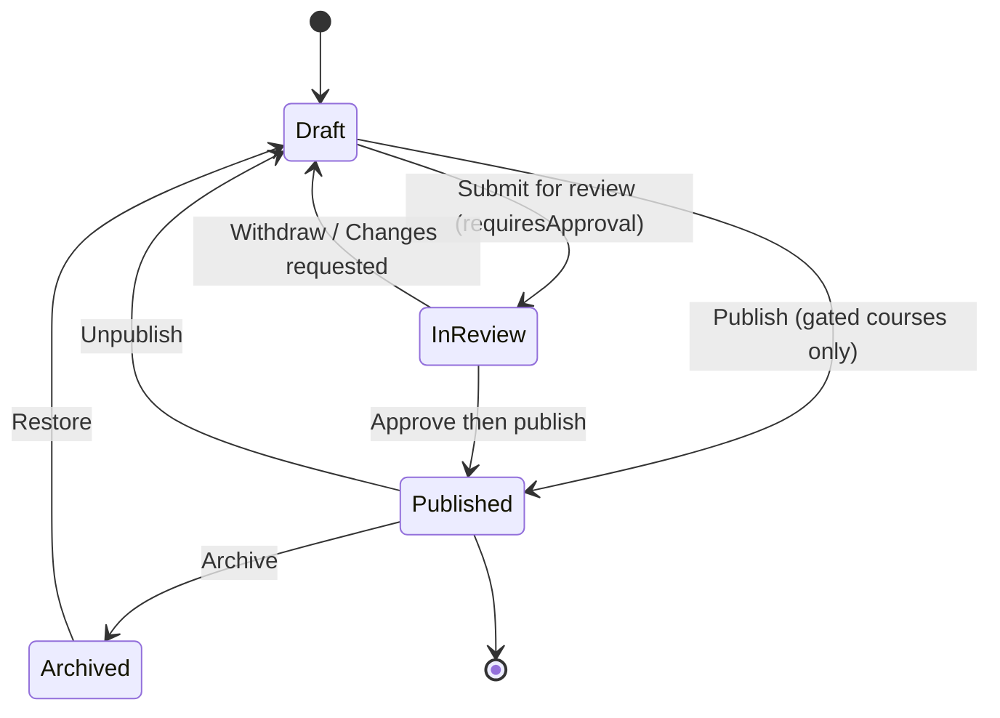

# Section 2: Course Workspace & Course Authoring

> **Abugida Academy — UX Design Specification** · Part 04 of 11 · [↑ Overview & Sitemap](00-Overview-and-Sitemap.md) · [← Dashboard](03-Dashboard.md) · [Content Library →](05-Content-Library.md)

## What changed in Part 04 (Revision 2)

Part 04 is the centre of the Revision 2 redesign. Everything in it now hangs off one surface: the **Course Workspace**.

- **New:** the workspace tabs [S-2.6](04-Courses.md#scr-2-6) Overview · [S-2.17](04-Courses.md#scr-2-17) Curriculum · [S-2.18](04-Courses.md#scr-2-18) Students · [S-2.19](04-Courses.md#scr-2-19) Analytics · [S-2.20](04-Courses.md#scr-2-20) Settings, plus [S-2.21](04-Courses.md#scr-2-21) Learner Preview, [S-2.22](04-Courses.md#scr-2-22) Publish Readiness & Course Review, and [S-2.23](04-Courses.md#scr-2-23) Assignment Builder.
- **Changed:** the [4-step wizard is retired](#retired-wizard-steps) ([S-2.3](04-Courses.md#retired-s-2-3)–[S-2.5](04-Courses.md#retired-s-2-5)) and [S-2.2](04-Courses.md#scr-2-2) becomes a single New Course dialog. [S-2.6](04-Courses.md#scr-2-6) is no longer a "Course Detail" tabbed screen — it is the workspace. [S-2.7](04-Courses.md#scr-2-7) becomes an in-pane editor with a route alias instead of its own page.
- **Unchanged:** the Markdown content model and Tiptap implementation ([Part 12](12-Course-Editor-Markdown-Lessons.md)), the review gate ([S-2.14](04-Courses.md#scr-2-14)), unlock rules ([S-2.15](04-Courses.md#scr-2-15)), and the generation surfaces ([S-2.11](04-Courses.md#scr-2-11)–[S-2.13](04-Courses.md#scr-2-13), [S-2.16](04-Courses.md#scr-2-16)) all keep their behaviour; they change only where they are entered from and where they deposit their output.

---

## The Course Workspace Model

This section is the shared vocabulary for every screen in Part 04. Screen definitions reference it rather than restating it.

### Workspace Anatomy

A course is edited in one **workspace**: a persistent shell plus exactly one active tab.

```text
┌──────────────────────────────────────────────────────────────────────────┐
│  Identity Header (sticky, 64px)                                         │
│  ‹ Courses / TOEFL Complete Course     🟠 Draft · v3   [Preview] [⋯]   │
│  Course title (inline-editable) · TOEFL · Advanced · Instructor           │
├──────────────────────────────────────────────────────────────────────────┤
│  Workspace Nav:  Overview · Curriculum · Students · Analytics · Settings  │
│  (role-filtered; counts shown for Students and Curriculum)               │
├──────────────────────────────────────────────────────────────────────────┤
│  Tab content — fills remaining height, scrolls independently             │
└──────────────────────────────────────────────────────────────────────────┘
```

| Region        | Rule                                                                                                                                                                                                                                                             |
| ------------- | ---------------------------------------------------------------------------------------------------------------------------------------------------------------------------------------------------------------------------------------------------------------- |
| Identity      | Always visible on every tab. Carries the title, the [status pill](11-Global-Standards.md#status-colour-mapping) and the lifecycle stepper, plus the lifecycle action button (`Submit for review` / `Publish` / `Unpublish` / `Restore`) and the `⋯` course menu. |
| Workspace Nav | Exactly five destinations. The active tab is mirrored in the URL so any tab is linkable, bookmarkable, and back-button safe.                                                                                                                                     |
| Tab content   | Owns its own scroll container. **No tab may navigate away from the workspace shell** — deep links open _within_ the shell.                                                                                                                                       |

### Curriculum Taxonomy

The curriculum is a two-level tree. Abugida's storage model is unchanged: a **section** is a `modules` row and an **item** is a `lessons` row. "Section" and "item" are the display labels; the data model keeps its existing names.

| Level   | Storage       | Purpose                                                                                                                             |
| ------- | ------------- | ----------------------------------------------------------------------------------------------------------------------------------- |
| Section | `modules` row | A chapter of the course. Owns a title, an optional description, an estimated duration, and a preview flag. Ordered by `sort_order`. |
| Item    | `lessons` row | The atomic unit a student completes, authors, or reviews. Ordered by `sort_order` within its section.                               |

An item's **kind** is derived from its `contentType`, so no new column is introduced:

| Kind           | `contentType` value    | Authored in                                         | What it is                                                                                           |
| -------------- | ---------------------- | --------------------------------------------------- | ---------------------------------------------------------------------------------------------------- |
| **Lesson**     | `video`, `pdf`, `link` | [S-2.7](04-Courses.md#scr-2-7) Lesson Editor        | Reading + media. A Markdown body, optional video/PDF, and an optional attached quiz.                 |
| **Quiz**       | `quiz`                 | [S-2.8](04-Courses.md#scr-2-8) Quiz Builder         | A graded set of questions. The item body is a short Markdown intro; the questions live in `quizzes`. |
| **Assignment** | `exercise`             | [S-2.23](04-Courses.md#scr-2-23) Assignment Builder | A submitted piece of work: brief, optional attachment, rubric, submission settings.                  |

**Kind is fixed at creation** and changing it prompts a confirmation that explains what is lost (an item promoted from Quiz to Lesson keeps its body but stops being a graded activity; demoting a Quiz to Lesson leaves the question set orphaned and requires an explicit choice). A single item may have **both** a rich body and an attached quiz — that combination is expressed as a Lesson item with an attached quiz, not as a separate kind.

### Course Lifecycle

`Draft → In Review → Published → Archived`, visualised by the [Lifecycle Stepper](11-Global-Standards.md#reusable-component-library) in the identity header.



| From        | To        | Who can                                          | Guard                                                                                                       |
| ----------- | --------- | ------------------------------------------------ | ----------------------------------------------------------------------------------------------------------- |
| _(created)_ | Draft     | Author                                           | Every course is created as a Draft.                                                                         |
| Draft       | In Review | Editor                                           | Course readiness ([S-2.22](04-Courses.md#scr-2-22)) passes. Only when `requiresApproval` is on.             |
| Draft       | Published | Editor (ungated) / Admin (gated)                 | All readiness checks pass. When `requiresApproval` is on, an Editor cannot self-approve.                    |
| In Review   | Draft     | Editor (withdraw) / Reviewer (changes requested) | Withdrawal keeps every edit. Requesting changes requires a comment.                                         |
| In Review   | Published | Reviewer (approve) or Admin                      | Reviewer decision plus every readiness check. Publishing increments `courses.version`.                      |
| Published   | Draft     | Admin                                            | Unpublish warns about enrolled students; they lose access immediately unless an access grace period is set. |
| Published   | Archived  | Admin                                            | Enrollment closes; the course leaves the catalog. Students keep earned certificates and progress.           |
| Archived    | Draft     | Admin                                            | Restore returns the course to Draft — never straight to Published.                                          |

### Routing Contract

| Route                                                        | Renders                                                                                           |
| ------------------------------------------------------------ | ------------------------------------------------------------------------------------------------- |
| `/_app/courses`                                              | [S-2.1](04-Courses.md#scr-2-1) Catalog                                                            |
| `/_app/courses/new`                                          | [S-2.2](04-Courses.md#scr-2-2) New Course dialog → creates a Draft and navigates to the workspace |
| `/_app/courses/$courseId?tab=overview`                       | [S-2.6](04-Courses.md#scr-2-6) Overview (default)                                                 |
| `/_app/courses/$courseId?tab=curriculum`                     | [S-2.17](04-Courses.md#scr-2-17) Curriculum with the item tree; no item selected                  |
| `/_app/courses/$courseId?tab=curriculum&item=<itemPublicId>` | Curriculum with that item's pane open and the item selected in the tree                           |
| `/_app/courses/$courseId?tab=students`                       | [S-2.18](04-Courses.md#scr-2-18)                                                                  |
| `/_app/courses/$courseId?tab=analytics`                      | [S-2.19](04-Courses.md#scr-2-19)                                                                  |
| `/_app/courses/$courseId?tab=settings`                       | [S-2.20](04-Courses.md#scr-2-20)                                                                  |
| `/_app/courses/$courseId/lessons/$lessonId`                  | **Alias** → redirects to `?tab=curriculum&item=$lessonId`. Same component, no second editor.      |

- `tab` defaults to `overview`; `item` is ignored outside the `curriculum` tab.
- The alias route exists so that search results, notifications, and the Content Library "Used in" list keep working. It must not host a second editor implementation.
- The workspace route allows `admin`, `editor`, `reviewer`, `viewer`. Authoring affordances inside it are permission-filtered, not route-filtered, so a Reviewer can open the same item the Editor sees and act on the review.

### Item Action Matrix

What each action does to the tree, the learner view, and analytics. Used by the sidebar `⋯` menu ([S-7.10](09-Shared-Components.md#scr-7-10)) and the item pane.

| Action    | Tree effect                                 | Learner view                                     | Analytics                                     | Reversible                 |
| --------- | ------------------------------------------- | ------------------------------------------------ | --------------------------------------------- | -------------------------- |
| Add       | New item appended to a section              | Hidden until the item is published               | Not counted                                   | Yes — delete               |
| Rename    | In-place title change                       | Unchanged                                        | Unchanged (identity follows the title)        | n/a                        |
| Duplicate | Copy inserted after the source              | Hidden until published                           | Counted separately — never merged with source | Yes — delete               |
| Move      | Reposition within or across sections        | Order changes for unpublished courses only       | Unchanged                                     | n/a                        |
| Archive   | Item leaves the active tree into `Archived` | Removed immediately, even from published courses | Excluded from progress and drop-off           | Yes — Restore              |
| Delete    | Soft-deleted (`deleted_at`), hidden         | Removed, and purged after the retention window   | Historical records retained for the audit log | Within 30 days, then purge |

### Save-State Contract

Every editing surface in Part 04 reports state with the shared [S-7.8](09-Shared-Components.md#scr-7-8) indicator and follows the [Part 11](11-Global-Standards.md#global-validation-and-feedback-patterns) autosave policy:

- **Structural changes** (add, rename, reorder, move, duplicate, archive, settings forms) save **immediately** on commit and roll back with an error toast on failure.
- **Content editing** (the [S-2.7](04-Courses.md#scr-2-7) item pane body, the [S-2.8](04-Courses.md#scr-2-8) quiz, the [S-2.23](04-Courses.md#scr-2-23) assignment, course settings text fields) autosaves on a **60s idle timer** and flushes on `Ctrl/⌘+S`.
- Switching items or tabs **flushes** a dirty buffer first. If the flush fails, navigation is blocked by a [S-7.1](09-Shared-Components.md#scr-7-1) dialog offering **Retry / Discard / Stay** — the buffer is never discarded silently.

---

<a id="scr-2-1"></a>

##### Screen Name: S-2.1 Course Catalog / Grid 🔄 CHANGED

- **Purpose:** The entry point to the course lifecycle: browse every course, see its lifecycle state and authoring health at a glance, and open a Course Workspace. No authoring happens on this screen.
- **User Role(s):** Admin, Editor, Reviewer, Viewer, Support
- **Wireframe Layout (Text-Based):**
  ```
  ┌──────────────────────────────────────────────────────────────────────────┐
  │ Header: "Courses"                                     [🔍 Search] [Filter]│
  │                                        [+ New Course ▾]                 │
  ├──────────────────────────────────────────────────────────────────────────┤
  │ Status pills (single-select):                                           │
  │ [All 24] [Draft 6] [In Review 2] [Published 15] [Archived 1]            │
  │ Type: [All ▾]  Sort: [Recently updated ▾]                               │
  ├──────────────────────────────────────────────────────────────────────────┤
  │ Results: "Showing 24 courses"                                           │
  │ +----------------------+ +----------------------+ +--------------------+ │
  │ | [Thumbnail 160px]    | | [Thumbnail 160px]    | | [Thumbnail 160px]  | │
  │ | 🟠 In Review         | | 🟣 Published         | | 🟠 Draft           | │
  │ | TOEFL Complete       | | IELTS Advanced       | | Grammar Basics    | │
  │ | 2-line description  | | 2-line description  | | 2-line description| │
  │ |─────────────────────| |─────────────────────| |────────────────────| │
  │ | 4 sections · 24 items| | 3 sections · 18 items| | ⚠ 2 items need    | │
  │ | 234 students · 82%   | | 189 students · 52%  | | content            | │
  │ | ✎ Ready to review   | | 🟣 Live             | | 🟠 Not started    | │
  │ | [Open workspace]    | | [Open workspace]    | | [Open workspace]  | │
  │ +----------------------+ +----------------------+ +--------------------+ │
  └──────────────────────────────────────────────────────────────────────────┘
  ```
- **Primary Actions:**
  1. Open a course's [Course Workspace](04-Courses.md#scr-2-6) — card click, or the **Open workspace** hover action.
  2. Filter by lifecycle status, type, instructor, or exam category; search by title and description.
  3. Sort by title, recently updated, student count, or creation date.
  4. Create a course: New ([S-2.2](04-Courses.md#scr-2-2)) · From template ([S-2.12](04-Courses.md#scr-2-12)) · AI ([S-2.11](04-Courses.md#scr-2-11)) · Bulk import ([S-2.13](04-Courses.md#scr-2-13)).
  5. Quick actions via card hover: Open workspace, Duplicate, Archive.
- **Data Displayed/Modified:** Reads `courses` joined with `course_stats` and aggregated `modules`/`lessons` counts. Read-only.
- **States:**
  - **Default (Populated):** Full grid of cards; the status pill reflects the [course lifecycle](04-Courses.md#course-lifecycle).
  - **In Review:** Indigo pill + "In review" line; a Reviewer's card shows the pending decision count.
  - **Empty State (No Courses):** [S-7.3](09-Shared-Components.md#scr-7-3) Empty State: "No courses yet. Create your first course!" with a prominent **New Course** CTA and a link to the [Content Library](05-Content-Library.md#scr-3-1).
  - **Loading:** 6–9 skeleton cards with 160px placeholder thumbnails.
  - **Filtered (No Results):** "No courses match your filters." + **Clear filters** — deliberately _not_ the [S-7.3](09-Shared-Components.md#scr-7-3) creation CTA, per [Part 11](11-Global-Standards.md#global-validation-and-feedback-patterns).
  - **Error:** "Unable to load courses. Retry?" with a Retry button.
  - **Authoring Health (new):** A card shows the single most useful next action for its state — `✎ Ready to review` (all items approved, awaiting publish), `⚠ N items need content` (items without a body, blocking publish), `🟠 Not started` (no items yet). The line is a link straight to the screen that resolves it.
  - **Selection Mode:** Checkboxes for Admin bulk actions (Publish, Archive, Delete) with a bulk confirmation.
  - **Hover State:** Card lifts; quick actions appear.
- **Validation & Feedback:**
  - **Delete Confirmation:** [S-7.1](09-Shared-Components.md#scr-7-1): "Delete 'TOEFL Complete'? This cannot be undone. 234 enrollments and 84 earned certificates are affected." Certificates block deletion until exported.
  - **Archive Success:** Toast "Course archived successfully." The card moves to the `Archived` filter.
  - **Publish Success:** Toast "Course published successfully." + deep link to the workspace Overview.
- **Navigation:**
  - Card click / **Open workspace** → [S-2.6](04-Courses.md#scr-2-6) Course Workspace · Overview
  - Authoring-health line → [S-2.17](04-Courses.md#scr-2-17) Curriculum (or [S-2.22](04-Courses.md#scr-2-22) Readiness)
  - **+ New Course ▾** → New: [S-2.2](04-Courses.md#scr-2-2) · Template: [S-2.12](04-Courses.md#scr-2-12) · AI: [S-2.11](04-Courses.md#scr-2-11) · Bulk import: [S-2.13](04-Courses.md#scr-2-13)
  - **Duplicate** → creates a Draft copy and opens its workspace Overview
  - Status pill on a card → filters the grid to that status
  - Avatar → [S-6.5](08-Settings.md#scr-6-5) My Profile, [S-6.1](08-Settings.md#scr-6-1) Settings, Logout

---

<a id="scr-2-2"></a>

##### Screen Name: S-2.2 New Course Dialog 🔄 CHANGED

- **Purpose:** Create a course in one step. The dialog captures only what is genuinely required to make a course exist; everything else is authored in the workspace that opens immediately afterwards. Replaces Step 1 of the retired 4-step wizard.
- **User Role(s):** Admin, Editor
- **Wireframe Layout (Text-Based):**
  ```
  ┌──────────────────────────────────────────────────────────────────────────┐
  │ Modal: "New Course"                                          [X] Close   │
  │ "You'll land in the course workspace. Nothing is visible to students    │
  │  until you publish."                                                    │
  ├──────────────────────────────────────────────────────────────────────────┤
  │ Course title *     [ Introduction to TOEFL                    ]         │
  │ Exam / category *  [ TOEFL ▾]                        Level [Advanced▾]  │
  │ Instructor *       [ Jane Smith ▾]  (defaults from [S-6.1])            │
  │ Thumbnail          [ ⬆ Drop image or browse ]  (160×90, PNG/JPG)        │
  │                                                                           │
  │ Start from:  (● Blank   ○ From template   ○ Generate with ✨ AI)         │
  │                                                                          │
  │                                              [Cancel]  [Create course]  │
  └──────────────────────────────────────────────────────────────────────────┘
  ```
- **Primary Actions:**
  1. Enter a title, exam/category, level, and instructor.
  2. Optionally attach a thumbnail.
  3. Optionally start from a template ([S-2.12](04-Courses.md#scr-2-12)) or an AI outline ([S-2.11](04-Courses.md#scr-2-11)) — both hand off from the workspace after creation, not from inside this dialog.
  4. Create the course and land in the workspace.
- **Data Displayed/Modified:** Creates a `courses` row with `status: 'draft'`, and an `audit_logs` entry.
- **States:**
  - **Default:** Blank, title focused, `Create course` disabled until the title is valid.
  - **Valid:** CTA enabled; helper text states "Created as a Draft".
  - **Template Selected:** A summary line shows the template's structure count; nothing is copied until after creation.
  - **AI Selected:** The dialog closes after creation and the [S-2.11](04-Courses.md#scr-2-11) generator opens scoped to the new draft.
  - **Submitting:** CTA spinner; the dialog is not dismissible while the course is being created, to avoid an orphan record.
  - **Creation Failed:** Inline error with Retry; no partial course is left behind.
  - **Unsaved Input on Close:** [S-7.1](09-Shared-Components.md#scr-7-1) only when a title has been typed.
- **Validation & Feedback:**
  - **Title:** required, 3–300 characters (schema bound), unique slug generated from the title with a de-duplicating suffix.
  - **Exam/category:** required — seeded from the workspace default in [S-6.1](08-Settings.md#scr-6-1).
  - **Instructor:** required; defaults to the signed-in user when they hold the Instructor assignment, otherwise to the workspace default.
  - **Thumbnail:** optional, 160×90, PNG/JPG/WebP, ≤ 2 MB. Uploading shows inline progress and does not block creation.
  - **Description:** _not_ collected here. It is edited in [S-2.20](04-Courses.md#scr-2-20) and is only required at publish time.
- **Navigation:**
  - **Create course** → [S-2.6](04-Courses.md#scr-2-6) Course Workspace · Overview, with a first-run hint pointing at [S-2.17](04-Courses.md#scr-2-17) Curriculum
  - **Cancel / X** → [S-2.1](04-Courses.md#scr-2-1) Catalog
  - Started from the header split button or the [S-7.5](09-Shared-Components.md#scr-7-5) Command Palette

---

## Retired Wizard Steps

<a id="retired-s-2-3"></a>

#### ⛔ RETIRED — S-2.3 Course Creation Wizard (Step 2: Curriculum)

- **Reason:** A linear wizard cannot hold an unbounded curriculum. Revision 1 already had to offer drag-and-drop inside a step, which made the step indistinguishable from a workspace. The capability moved to [S-2.17](04-Courses.md#scr-2-17) Course Workspace · Curriculum, which supports it without a modal.
- **Where each behaviour lives now:**

  | Wizard Step 2 behaviour                      | Location now                                                                                    |
  | -------------------------------------------- | ----------------------------------------------------------------------------------------------- |
  | Add module / lesson                          | Sidebar [+ Section ▾](09-Shared-Components.md#scr-7-9) / [+ Add item ▾](04-Courses.md#scr-2-17) |
  | Drag-and-drop reorder and cross-section move | [S-7.9](09-Shared-Components.md#scr-7-9) Curriculum Tree                                        |
  | Inline rename                                | [S-7.10](09-Shared-Components.md#scr-7-10) Item Actions Menu → Rename                           |
  | Edit a lesson's content                      | [S-2.7](04-Courses.md#scr-2-7) item pane, same screen as the tree                               |
  | Import from Library / bulk import            | [S-2.13](04-Courses.md#scr-2-13), opened from the Curriculum toolbar                            |
  | "At least 1 module with 1 lesson" rule       | [S-2.22](04-Courses.md#scr-2-22) publish readiness check `RC-3`                                 |

<a id="retired-s-2-4"></a>

#### ⛔ RETIRED — S-2.4 Course Creation Wizard (Step 3: Pricing)

- **Reason:** Pricing is course configuration, not a one-time gate. Keeping it in a wizard step forced authors to re-enter the wizard to change a price later.
- **Where each behaviour lives now:** the **Pricing & enrollment** section of [S-2.20](04-Courses.md#scr-2-20) Course Workspace · Settings — pricing model, price, billing interval, enrollment window, capacity, and payment gateway selection, all autosaved in place. Discount and coupon codes remain in [S-8.3](10-Marketing-and-Growth.md#scr-8-3); they are never defined per course here.

<a id="retired-s-2-5"></a>

#### ⛔ RETIRED — S-2.5 Course Creation Wizard (Step 4: Publish)

- **Reason:** Publication is a lifecycle transition that happens repeatedly, not a final wizard step. A course that was published months ago and is being updated needs the same review surface as a brand-new one.
- **Where each behaviour lives now:** [S-2.22](04-Courses.md#scr-2-22) Publish Readiness & Course Review — readiness checklist, release scheduling, notification preferences, and the publish/unpublish/archive actions. The review-summary block is preserved there, and the confirmation checkbox becomes a typed confirmation only for irreversible actions.

---

<a id="scr-2-6"></a>

##### Screen Name: S-2.6 Course Workspace — Overview 🔄 CHANGED

- **Purpose:** The persistent shell for everything about one course, and its landing tab. Gives an author or reviewer a single answer to "what state is this course in, what is blocking it, and what do I do next" before any editing begins. Replaces the Revision 1 "Course Detail / Curriculum Builder" screen.
- **User Role(s):** Admin, Editor, Reviewer, Viewer (Support: no course access)
- **Wireframe Layout (Text-Based):**
  ```
  ┌──────────────────────────────────────────────────────────────────────────┐
  │ ‹ Courses / TOEFL Complete Course                      🟠 Draft · v3    │
  │ TOEFL Complete Course  ·  TOEFL · Advanced · Jane Smith   [Preview] [⋯] │
  │ ●━━━━━━━○━━━━━━━━━━○━━━━━━━━━○        [ Submit for review ]  ← lifecycle  │
  │ ┌────────────────────────────────────────────────────────────────────┐   │
  │ │ ● Overview   ○ Curriculum (24)   ○ Students (234)  ○ Analytics  │   │
  │ │ ○ Settings                                                       │   │
  │ └────────────────────────────────────────────────────────────────────┘   │
  ├──────────────────────────────────────────────────────────────────────────┤
  │ Readiness banner:                                                        │
  │ ⚠ 3 items need content before this course can be published.              │
  │   [Review checklist] [Jump to first blocking item]                        │
  ├──────────────────────────────┬───────────────────────────────────────────┤
  │ Course health                │ Where students are                        │
  │ +-----------+ +-----------+   │ ┌───────────────────────────────────────┐ │
  │ | 68%       | | 3 / 4     |   │ │ ▓▓▓▓▓▓▓▓▓▓▓▓▓▓▓▓░░░  Section 1  94%│ │
  │ | Complete  | | Sections  |   │ │ ▓▓▓▓▓▓▓▓▓▓░░░░░░░░░░░░  Section 2  72%│ │
  │ | (16/24)   | | published |   │ │ ▓▓▓▓▓▓░░░░░░░░░░░░░░░░░  Section 3  45%│ │
  │ +-----------+ +-----------+   │ │ [Full analytics →]                     │ │
  │ | ⚠ 2 items | | 4.8 ★     |   │ └───────────────────────────────────────┘ │
  │ | need      | | 234 rating │   ├───────────────────────────────────────────┤
  │ | content   | | (18)      |   │ Recent activity                          │
  │ +-----------+ +-----------+   │ ✎ Jane edited "Skimming Basics"      2h  │
  │                                │ 🔁 Reordered Section 2               5h  │
  │ Publishing                    │ 📨 Submitted for review             1d  │
  │ Visibility: Draft (invisible)  ├───────────────────────────────────────────┤
  │ Enrollment window: —            │ Course                                  │
  │ [Review & publish →]           │ 4 sections · 24 items · 5 quizzes       │
  │                                │ 3h 40m estimated · Updated 2h ago       │
  │                                │ [Edit details] · [Duplicate] · [Archive]│
  └──────────────────────────────┴───────────────────────────────────────────┘
  ```
- **Primary Actions:**
  1. Move between the five workspace tabs.
  2. Edit the course title inline in the identity header (autosaves; `Enter` or blur commits, `Esc` reverts).
  3. Open the [S-2.21](04-Courses.md#scr-2-21) Learner Preview.
  4. Run the lifecycle action: Submit for review, Publish, Unpublish, or Restore.
  5. Act on the readiness banner: jump straight to the blocking item or to the full [S-2.22](04-Courses.md#scr-2-22) checklist.
  6. Duplicate, save as template, or archive from the `⋯` course menu.
  7. Read course-scoped health, activity, and headline metrics without leaving the tab.
- **Data Displayed/Modified:** Reads `courses`, `course_stats`, `course_stats_history`, `modules`, `lessons`, `enrollments`, `review_requests`, `audit_logs`. Title edits write `courses.title` (and regenerate `slug` only while the course is a Draft).
- **States:**
  - **Default (Draft):** Readiness banner visible; lifecycle CTA reads `Submit for review` when `requiresApproval` is on, otherwise `Publish`.
  - **In Review:** Identity header shows the indigo pill and "Submitted 2h ago by Jane"; the lifecycle CTA becomes `Withdraw`; the readiness banner is replaced by a review-progress block linking to [S-2.22](04-Courses.md#scr-2-22). Editing stays enabled.
  - **Published:** Green "Live since …" line; the CTA becomes `Unpublish`; the header shows a live learner link.
  - **Archived:** Whole workspace renders read-only behind a grey banner: "This course is archived. Restore it to make changes." Only `Restore` and `Duplicate` remain actionable.
  - **Reviewer role:** No authoring controls. The `⋯` menu is reduced to Preview and Review; the readiness block is replaced by a **Review** action opening the decision panel in [S-2.22](04-Courses.md#scr-2-22).
  - **Viewer role:** Read-only everywhere; every authoring control is hidden rather than disabled, per [Part 11](11-Global-Standards.md#global-validation-and-feedback-patterns).
  - **Title Editing:** Inline input replaces the heading; invalid input reverts with a toast; the workspace nav and tree stay mounted so layout does not shift.
  - **Nothing Published Yet:** "Where students are" shows an explanatory empty state: "No students yet — your course is invisible until you publish." with a link to [S-2.22](04-Courses.md#scr-2-22).
  - **Loading:** Skeleton for each card and chart region; the identity header renders as early as the course row resolves.
  - **Error:** "Unable to load this course. Retry?" with Retry; the shell chrome stays visible so navigation is not lost.
  - **Course Deleted Mid-Session (new):** A concurrent delete surfaces a blocking "This course was deleted by {user}" state with a link back to [S-2.1](04-Courses.md#scr-2-1).
- **Validation & Feedback:**
  - **Title inline edit:** 3–300 characters; `Enter` commits, `Esc` reverts, blur commits if valid. Uses [S-7.8](09-Shared-Components.md#scr-7-8) state reporting.
  - **Slug:** regenerated only while `status = 'draft'`; once published the slug is frozen and changing the title cannot break inbound links.
  - **Archive:** [S-7.1](09-Shared-Components.md#scr-7-1) confirmation naming the enrolled-student count.
  - **Unpublish:** typed confirmation is **not** required, but the dialog must state the student-visible consequence and offer a scheduled unpublish.
  - **Every action in the header is audit-logged** (`course.status_changed`, `course.title_changed`) and appears in [S-6.8](08-Settings.md#scr-6-8).
- **Navigation:**
  - Workspace nav → [S-2.6](#scr-2-6) Overview · [S-2.17](#scr-2-17) Curriculum · [S-2.18](#scr-2-18) Students · [S-2.19](#scr-2-19) Analytics · [S-2.20](#scr-2-20) Settings
  - **Preview** → [S-2.21](04-Courses.md#scr-2-21) Learner Preview
  - **Review checklist** / lifecycle CTA → [S-2.22](04-Courses.md#scr-2-22) Publish Readiness & Course Review
  - **Jump to first blocking item** → [S-2.17](04-Courses.md#scr-2-17) Curriculum with that item's pane open
  - **Full analytics** → [S-2.19](#scr-2-19) Analytics
  - **Edit details** → [S-2.20](#scr-2-20) Settings → Details
  - **Duplicate** → creates a Draft copy, opens its Overview
  - **Archive / Restore** → [S-7.1](09-Shared-Components.md#scr-7-1) Confirmation → Catalog
  - **⋯ → Save as template** → [S-2.12](04-Courses.md#scr-2-12)
  - **⋯ → Duplicate / Export syllabus / Delete** → [S-7.7](09-Shared-Components.md#scr-7-7) / [S-5.4](07-Analytics.md#scr-5-4) / [S-7.1](09-Shared-Components.md#scr-7-1)
  - Breadcrumb `Courses` → [S-2.1](04-Courses.md#scr-2-1)

---

<a id="scr-2-17"></a>

##### Screen Name: S-2.17 Course Workspace — Curriculum 🆕 NEW

- **Purpose:** The authoring heart of the platform. A **persistent curriculum sidebar** sits beside a **content pane** so an author can see the whole structure while editing any item inside it. Selection never navigates: clicking an item opens its editor in the pane, and the tree stays exactly where it was. This screen supports adding, renaming, reordering, moving, duplicating, archiving, and deleting both sections and items, and hosts the item editors ([S-2.7](#scr-2-7), [S-2.8](#scr-2-8), [S-2.23](#scr-2-23)).
- **User Role(s):** Admin, Editor (Reviewer and Viewer: read-only tree and pane; Reviewer additionally gets the decision panel)
- **Wireframe Layout (Text-Based):**
  ```
  ┌──────────────────────────────────────────────────────────────────────────────────┐
  │ ‹ Courses / TOEFL Complete Course / Curriculum          🟠 Draft · v3  [⋯]    │
  │ TOEFL Complete Course · TOEFL · Advanced      [＋Section] [⇪ Import] [Preview] │
  │ ●━━━━━━○━━━━━━━━━━○━━━━━━━━━○   [ Submit for review ]                          │
  │ ● Overview  ● Curriculum (24)  ○ Students (234) ○ Analytics  ○ Settings      │
  ├──────────────────────────────┬───────────────────────────────────────────────────┤
  │ CURRICULUM SIDEBAR (320px)   │ ITEM PANE                                         │
  │ ──────────────────────────── │ ───────────────────────────────────────────────── │
  │ [＋ Section ▾]  ⌕ Filter…  ⋮  │ Section 2 · Reading › Item 3 · Assignment          │
  │                             │ [✎ Essay draft — due 12 Sep]         [⋯] [Preview] │
  │ ▾ ⠿ S1 Foundations   3 · ⋯  │ ───────────────────────────────────────────────── │
  │    📄 What is TOEFL?   ✓ 12 ⋯│  [Overview] [Content] [Settings]  ← item sub-tabs  │
  │    🎥 Test format      ◐  9 ⋯│ ┌─────────────────────────────────────────────┐  │
  │    ✎ Reading assignment ⧗ 4 ⋯│ │ Overview                                     │  │
  │ ▾ ⠿ S2 Reading Skills 2 · ⋯ │ │  Type: Assignment   Status: Draft  ⧗ Due 12  │  │
  │    📄 Overview          ✓ 11 ⋯│ │  Brief: 120 words   Attachments: 1          │  │
  │    ✎ Essay draft       ⚠  0 ⋯│ │  Rubric: 3 criteria · Submissions: 0         │  │
  │ ▸ ⠿ S3 Listening       0 · ⋯ │ │  ⚠ Needs content before publishing          │  │
  │ ▸ ⠿ S4 Practice        5 · ⋯ │ └─────────────────────────────────────────────┘  │
  │                             │                                                   │
  │ Legend: 📄 lesson 🎥 video   │  (Content / Settings sub-tabs render the Tiptap   │
  │          ✎ assignment        │   editor, quiz builder, unlock rules, media,      │
  │          ✓ approved ◐ in     │   captions, tags — see S-2.7 / S-2.8 / S-2.23)   │
  │          review ⚠ needs      │                                                   │
  │          content  · archived │  ⌁ All changes saved 14:02      [Save now ⌘S]     │
  │ ──────────────────────────── │                                                   │
  │ ＋ Add item ▾ (Lesson/Quiz/  │                                                   │
  │   Assignment)                │                                                   │
  │ 🗄 Archived (3)   [+ Add]    │                                                   │
  └──────────────────────────────┴───────────────────────────────────────────────────┘
  ```
- **Primary Actions:**
  1. **Select** a section (shows the section summary + item count) or an item (opens the item pane). Selection is reflected in `?item=`.
  2. **Add** a section or an item (`＋ Section`, `＋ Add item ▾` choosing Lesson / Quiz / Assignment) inline in the sidebar.
  3. **Rename** inline (double-click or `F2`), or from the `⋯` menu.
  4. **Reorder and move** by drag-and-drop: sections among sections, items within a section, and items **across** sections. Keyboard equivalents for every gesture.
  5. **Duplicate** a section or an item — in place, after, or into another course ([S-7.7](09-Shared-Components.md#scr-7-7)).
  6. **Archive / Restore** an item or section, reversibly, via the Archived filter.
  7. **Delete** an item or section (soft delete, purge after the retention window).
  8. **Filter** the tree: All / Needs content / In review / Approved / Archived / by kind; plus a title search.
  9. **Collapse / expand** sections; state persists per user in `localStorage`.
  10. **Bulk select** items with a checkbox or `Shift`-click to archive, move, or reorder many at once.
  11. Open a **section settings** popover: description, estimated duration, free-preview toggle, section-level sequential ordering.
  12. Import from the [Content Library](05-Content-Library.md#scr-3-1) or run a bulk import ([S-2.13](#scr-2-13)) directly into this course.
- **Data Displayed/Modified:**
  - Reads `getCurriculum` → `CurriculumDTO` (sections with their items, per-item `reviewStatus`, `hasBody`, `hasQuiz`, `hasUnlockRules`, `studentCount`, plus section totals).
  - Writes through dedicated server functions, each atomic, each `rowVersion`-guarded, each audit-logged:

    | Function                                          | Purpose                                                                |
    | ------------------------------------------------- | ---------------------------------------------------------------------- |
    | `createCurriculumItem`                            | Create a section, or an item of kind lesson/quiz/assignment            |
    | `updateCurriculumItem`                            | Rename, retitle, re-type, and edit section metadata                    |
    | `moveCurriculumItem`                              | Reorder within a section or move across sections                       |
    | `saveCurriculumOrder`                             | Whole-tree write used by drag-and-drop, replacing the incremental path |
    | `duplicateCurriculumItem`                         | Copy a section or item, in place or cross-course                       |
    | `archiveCurriculumItem` / `restoreCurriculumItem` | Reversible hide/unhide                                                 |
    | `deleteCurriculumItem`                            | Soft delete with a 30-day purge                                        |

  - `moveCurriculumItem` and `saveCurriculumOrder` rewrite `sort_order` for the affected sections in one transaction and bump `rowVersion` on every touched row, so two authors cannot interleave a reorder into a corrupt order.
- **States:**
  - **Empty Course:** [S-7.3](09-Shared-Components.md#scr-7-3) Empty State in the sidebar: "No sections yet. A course needs at least one section with one item to be published." Primary CTA `＋ Create your first section`; secondary links: `Start from a template` ([S-2.12](#scr-2-12)), `✨ Generate an outline` ([S-2.11](#scr-2-11)), `Import` ([S-2.13](#scr-2-13)). The item pane shows a "select an item" illustration rather than an error.
  - **Section Selected:** The pane shows section summary, item count, total duration, completion %, section settings, and bulk actions for its items.
  - **No Item Selected:** The pane shows a neutral "Select an item to start editing" state with a keyboard hint (`↑`/`↓` to move through the tree).
  - **Drag Active:** The dragged row lifts with elevation; valid drop targets show an insertion line; invalid targets dim and are not droppable (e.g. dropping a section inside a section). A live-region announcement names the destination, e.g. "Moved Essay draft to position 2 of Reading Skills."
  - **Auto-Expanded on Drag:** Hovering a collapsed section for 600ms expands it, so cross-section drops are always possible.
  - **New Item Inline Form:** A row appears in place with a focused title input and a kind selector; `Enter` commits, `Esc` cancels. Creation is optimistic — the row appears immediately with a `saving` dot and is removed if the call fails.
  - **New Section:** Same pattern; the new section is expanded and focused.
  - **Renaming:** Single-line inline input inside the row. Duplicate titles inside one section are allowed and flagged with a caption "Another item in this section has this title" (not blocked — authors legitimately repeat titles across sections).
  - **Archived Items (new):** Hidden from the active tree; visible in the `🗄 Archived (n)` view with Restore and Delete. Archived items keep their content and history and do **not** count toward publish readiness or student progress.
  - **Conflict:** If another author changed the same subtree, the move reverts and a toast offers Reload. Never silently merge.
  - **Archived Course:** Tree renders greyed and non-interactive with the archived banner from [S-2.6](#scr-2-6).
  - **Reviewer / Viewer:** Drag handles, add buttons, and inline rename are not rendered. The tree remains fully navigable and the pane is read-only.
  - **Loading:** Sidebar skeleton of 4 section blocks; pane skeleton. **The shell must not blank** — the identity header and workspace nav stay visible so the user can switch tabs.
  - **Item Counts on Rows:** Each row shows the kind icon, its review state, and one contextual metric — students reached for published items, ⚠ "needs content" for empty ones, or nothing for untouched drafts. Metric choice is fixed per kind to keep the sidebar scannable.
  - **Search / Filter Active:** Matching rows are highlighted; non-matching sections collapse to a `⋯ n hidden` affordance rather than vanishing, so structure is never lost.
- **Validation & Feedback:**
  - **Section title:** required, 3–300 characters. **Item title:** required, 3–300 characters.
  - **First publishable structure:** at least one section containing at least one non-archived item — enforced as readiness check `RC-3` in [S-2.22](#scr-2-22), not as a creation-time block, so exploration is never punished.
  - **Order uniqueness:** `sort_order` stays contiguous per section; the server renormalises and returns the authoritative tree, and the client adopts it rather than assuming.
  - **Move across sections:** the item keeps its `courseId`; cross-section moves are re-validated for unlock rules ([S-2.15](#scr-2-15)) — a rule referencing an item that moved into a different section is flagged, not broken.
  - **Delete section:** [S-7.1](09-Shared-Components.md#scr-7-1) naming the item count and stating that students keep progress records.
  - **Delete item with an attached quiz:** the dialog states that the quiz copy is deleted with it, and offers Archive as the reversible alternative.
  - **Archive vs Delete:** Archive is offered first in the menu and is labelled "Hidden from students, reversible"; Delete is marked destructive and is never the default.
  - **Keyboard parity (mandatory):** every drag gesture has a menu equivalent — `Move up`, `Move down`, `Move to section ▸`. This is a WCAG requirement, not a fallback ([Part 11](11-Global-Standards.md#accessibility-specification)).
  - **Undo affordance:** destructive tree operations (delete, bulk archive) raise a toast with a 10s **Undo** action before the purge window closes.
- **Navigation:**
  - Item selection → item pane (S-2.7 / S-2.8 / S-2.23) in the same screen
  - `＋ Add item ▾ → Quiz` → creates and opens [S-2.8](#scr-2-8) in the pane
  - `⋯ → Unlock rules` → [S-2.15](#scr-2-15) slide-over, on top of the workspace
  - `⋯ → Duplicate…` → [S-7.7](09-Shared-Components.md#scr-7-7) Duplicate Item modal
  - `⋯ → Captions & transcript` (video items) → [S-3.6](05-Content-Library.md#scr-3-6)
  - `⋯ → ✨ AI Quiz` → [S-2.16](#scr-2-16)
  - `⋯ → View analytics` → [S-2.19](#scr-2-19) Analytics filtered to that item
  - `⋯ → Copy Markdown` → clipboard, using the raw body ([Part 12 § 9.1](12-Course-Editor-Markdown-Lessons.md#91-server-functions))
  - `＋ Section ▾ → From template` → [S-2.12](#scr-2-12)
  - `⇪ Import` → [S-2.13](#scr-2-13) Bulk Section & Item Import
  - `＋ Add item ▾ → From Content Library` → [S-3.1](05-Content-Library.md#scr-3-1) in picker mode, which attaches media to the new item and returns to it in the pane
  - **Preview** (header) → [S-2.21](#scr-2-21) Learner Preview
  - **Submit for review** (header) → [S-2.22](#scr-2-22)
  - "N hidden" → expands the filter rather than navigating away
  - **Open in new tab** (item `⋯`) → the alias route, which re-opens this same screen in a second tab

---

<a id="scr-2-18"></a>

##### Screen Name: S-2.18 Course Workspace — Students 🆕 NEW

- **Purpose:** The course-scoped roster: who is enrolled in **this** course, how far they are, and the enrollment actions that only make sense in this course's context. This is a **scoped instance of [S-4.1](06-Students.md#scr-4-1) Student Directory**, not a second table implementation — the same data component, the same selection model, the same bulk-action bar, with the course filter pinned.
- **User Role(s):** Admin, Editor, Support (Reviewer/Viewer: read-only)
- **Wireframe Layout (Text-Based):**
  ```
  ┌──────────────────────────────────────────────────────────────────────────┐
  │ ‹ Courses / TOEFL Complete Course / Students        🟠 Draft · v3  [⋯] │
  │ TOEFL Complete Course · TOEFL · Advanced                                 │
  │ ● Overview  ○ Curriculum  ● Students (234)  ○ Analytics  ○ Settings      │
  ├──────────────────────────────────────────────────────────────────────────┤
  │ +----------+ +----------+ +----------+ +----------+                    │
  │ | 234      | | 68%      | | 12       | | 3        |                    │
  │ | Enrolled | | Avg      | | Active   | | Requests |                    │
  │ |          | | progress | | 7d       | | pending  |                    │
  │ +----------+ +----------+ +----------+ +----------+                    │
  │ [🔍 Search] [Status ▾] [Progress ▾] [Export CSV]  [+ Enrol students]   │
  │ ┌──────────────────────────────────────────────────────────────────────┐ │
  │ │ ☑ │ Student      │ Progress │ Items done │ Last active │ At risk │ ⋯   │ │
  │ │ ☐ │ Alemayehu K. │ 82%      │ 16/24      │ 2d ago      │         │ ⋯   │ │
  │ │ ☐ │ Tigist M.    │ 65%      │ 14/24      │ 5d ago      │ ⚠       │ ⋯   │ │
  │ │ ☐ │ Daniel W.    │ 100%     │ 24/24      │ 1d ago      │ 🏆      │ ⋯   │ │
  │ └──────────────────────────────────────────────────────────────────────┘ │
  │ ☑ 2 selected → [Enrol in another course] [Add to cohort] [Export] [Unenrol]│
  └──────────────────────────────────────────────────────────────────────────┘
  ```
- **Primary Actions:**
  1. Search and filter the roster (status, progress band, at-risk, cohort).
  2. Enrol students into this course individually or in bulk; send enrolment invitations for accounts that do not exist yet.
  3. Unenrol (with confirmation), add to cohort, export the roster, and message selected students.
  4. Open a student in this course's context: [S-4.2](06-Students.md#scr-4-2) profile and [S-4.3](06-Students.md#scr-4-3) progress, both pre-scoped to this course.
  5. Open pending enrolment requests and the waitlist for this course ([S-4.6](06-Students.md#scr-4-6)).
- **Data Displayed/Modified:** Reads `enrollments`, `users`, `lesson_completions`, `quiz_attempts`, `enrollment_requests`, `waitlists` — all scoped by `courseId`. Writes `enrollments`, `enrollment_requests`; every write is audit-logged and mirrored in the global directory.
- **States:**
  - **Default:** Roster table with a pinned context chip: "Showing students enrolled in **TOEFL Complete Course**" + **View all students** → [S-4.1](06-Students.md#scr-4-1).
  - **Course Not Published (new):** Because the course is a Draft, the roster is empty by definition. The state says so explicitly: "Students can't be enrolled while this course is unpublished." with a single CTA **Publish the course** → [S-2.22](#scr-2-22) — and, for a scheduled or free-preview course, **Enrol as preview student** for internal QA.
  - **Enrolling:** Row-level spinner; failures isolate to the affected student and offer retry.
  - **At Capacity:** Enrolment actions are replaced by "Add to waitlist" and the header shows `234 / 234`.
  - **Bulk Selection:** The same selection bar as [S-4.1](06-Students.md#scr-4-1), with course-appropriate actions.
  - **Unenrol:** [S-7.1](09-Shared-Components.md#scr-7-1) confirmation naming the progress that will be retained.
  - **Empty (Published, No Enrolments):** "No students yet." with **Enrol students** and a link to [S-4.8](06-Students.md#scr-4-8) automated enrolment rules.
  - **Loading / Error:** Skeleton rows; "Unable to load students. Retry?"
- **Validation & Feedback:**
  - **Unenrol** is reversible for 24 hours (re-enrol restores progress).
  - **Bulk enrol** above 25 students requires [S-7.1](09-Shared-Components.md#scr-7-1) confirmation with the exact count.
  - **Enrolment into a paid course** warns when it grants paid access at no charge — same rule as [S-4.8](06-Students.md#scr-4-8).
  - **Support role** can view and message but not enrol or unenrol.
- **Navigation:**
  - Student row → [S-4.2](06-Students.md#scr-4-2) Student Profile (this course highlighted)
  - `⋯ → View progress` → [S-4.3](06-Students.md#scr-4-3) scoped to this course
  - `⋯ → Message` → [S-4.5](06-Students.md#scr-4-5) Messaging Center
  - **Enrol students** → student picker (reuses the [S-4.1](06-Students.md#scr-4-1) picker)
  - **Add to cohort** → [S-4.4](06-Students.md#scr-4-4) Cohort Management
  - **Requests (3)** → [S-4.6](06-Students.md#scr-4-6) filtered to this course
  - **Export CSV** → [S-5.4](07-Analytics.md#scr-5-4) Export Reports
  - **View all students** → [S-4.1](06-Students.md#scr-4-1) with the course filter applied
  - **Publish the course** → [S-2.22](#scr-2-22)

---

<a id="scr-2-19"></a>

##### Screen Name: S-2.19 Course Workspace — Analytics 🆕 NEW

- **Purpose:** Course-scoped performance, drop-off, and item engagement, plus the content decisions that follow from them. A **scoped instance of [S-5.1](07-Analytics.md#scr-5-1)** with the course filter locked and the drill-down narrowed to this course's curriculum.
- **User Role(s):** Admin, Editor, Viewer (Support: no course access)
- **Wireframe Layout (Text-Based):**
  ```
  ┌──────────────────────────────────────────────────────────────────────────┐
  │ ‹ Courses / TOEFL Complete Course / Analytics         🟠 Draft · v3  [⋯] │
  │ TOEFL Complete Course · TOEFL · Advanced            [Last 30 days ▾] [⇩] │
  │ ● Overview  ○ Curriculum  ○ Students  ● Analytics   ○ Settings           │
  ├──────────────────────────────────────────────────────────────────────────┤
  │ [Performance] [Drop-off] [Quizzes] [Items]                               │
  ├──────────────────────────────────────────────────────────────────────────┤
  │ +----------+ +----------+ +----------+ +----------+                    │
  │ | 234      | | 68%      | | 12.4 hrs | | 4.8 ★    |                    │
  │ | Students | | Complete | | Avg time | | Rating   |                    │
  │ +----------+ +----------+ +----------+ +----------+                    │
  │ ┌────────────────────────────┐ ┌────────────────────────────┐            │
  │ │ 📈 Completion over time    │ │ 📊 Activity by weekday     │            │
  │ └────────────────────────────┘ └────────────────────────────┘            │
  │ Items (all 24, sortable):                                                │
  │ ┌────────────────────────────────────────────────────────────────────┐  │
  │ │ Item                       │ Reached │ Completed │ Avg time │ ⋯   │  │
  │ │ S1 · What is TOEFL?         │ 231     │ 96%       │ 11m      │ ⋯   │  │
  │ │ S2 · Test format            ⚠ 228   │ 41%       │ 4m       │ ⋯   │  │
  │ └────────────────────────────────────────────────────────────────────┘  │
  │ 💡 Insights:                                                              │
  │ ⚠ "Test format" drops 55% of students → [Edit item] [Preview as student] │
  │ ⛔ "Essay draft" has 0 completions and is not published — [Open in tree]  │
  └──────────────────────────────────────────────────────────────────────────┘
  ```
- **Primary Actions:**
  1. Switch between **Performance** ([S-5.1](07-Analytics.md#scr-5-1)), **Drop-off** ([S-5.3](07-Analytics.md#scr-5-3)), **Quizzes** ([S-5.2](07-Analytics.md#scr-5-2)), and **Items** (per-item engagement).
  2. Change the date range; the course filter is fixed and shown as a non-removable chip.
  3. Sort items by any engagement column; filter to a section.
  4. Act on an insight: **Edit item** opens the item pane in the Curriculum tab; **Preview as student** opens [S-2.21](#scr-2-21) at that item.
  5. Export the scoped report ([S-5.4](07-Analytics.md#scr-5-4)).
- **Data Displayed/Modified:** Reads `course_stats`, `course_stats_history`, `lesson_progress`, `lesson_completions`, `quiz_attempts`, `enrollments`. Read-only.
- **States:**
  - **Default:** Summary cards, two charts, item table, insights.
  - **Items Tab (new):** One row per non-archived item, ordered as the curriculum is, with reach, completion, average time-on-item, and quiz average where applicable. Archived items are excluded but available behind a filter.
  - **Unpublished Course:** Cards and charts are replaced by a single explanatory panel: "Analytics appear once the course is published and students start learning." with **Preview as a student** → [S-2.21](#scr-2-21).
  - **No Data Yet:** "Not enough data yet — check back once more students progress." (per [Part 11](11-Global-Standards.md#global-validation-and-feedback-patterns) — distinct from the zero-result case, which offers **Clear filters**).
  - **Zero Results After Filter:** Lighter "No items match this filter" + **Clear filters**, never a CTA.
  - **Insight Severity:** High drop-off (>20 points step decline) or a published item with <40% completion raises an actionable insight with an inline edit affordance. Insights are derived, explainable, and never auto-applied.
  - **Chart Accessibility:** Every chart exposes the underlying table, per [Part 11](11-Global-Standards.md#accessibility-specification).
  - **Loading / Error:** Skeleton cards + skeleton charts; "Unable to load analytics. Retry?"
- **Validation & Feedback:**
  - Insights must state the evidence, not just the verdict: item name, metric, cohort size, and window.
  - Insights below a 5-student sample are suppressed as noise.
  - **Items with 0 students and no completions** are labelled "not published" rather than "0% completion" — the difference matters.
- **Navigation:**
  - Item row / **Edit item** → [S-2.17](#scr-2-17) Curriculum with that item's pane open
  - **Preview as student** → [S-2.21](#scr-2-21) at that item
  - Quiz row → [S-5.2](07-Analytics.md#scr-5-2) Quiz Analytics; **Revise** → [S-2.8](#scr-2-8) Quiz Builder
  - Section filter chip → clears to the whole course
  - **⇩ Export** → [S-5.4](07-Analytics.md#scr-5-4) pre-scoped to this course
  - Course chip is not removable; **View all courses** → [S-5.1](07-Analytics.md#scr-5-1) global

---

<a id="scr-2-20"></a>

##### Screen Name: S-2.20 Course Workspace — Settings 🆕 NEW

- **Purpose:** Every course-level configuration surface, in one tab. This is the home of what used to be spread across the wizard steps and the old Course Detail settings tab: details, pricing and enrollment, live sessions, completion and certificates, the approval gate, and the danger zone.
- **User Role(s):** Admin, Editor (pricing, details, sessions, completion) · Reviewer (approval gate read-only) · Viewer (read-only)
- **Wireframe Layout (Text-Based):**
  ```
  ┌──────────────────────────────────────────────────────────────────────────┐
  │ ‹ Courses / TOEFL Complete Course / Settings           🟠 Draft · v3  [⋯] │
  │ TOEFL Complete Course · TOEFL · Advanced          [Preview] [Submit…]    │
  │ ● Overview  ○ Curriculum  ○ Students  ○ Analytics  ● Settings           │
  ├──────────────────────────────────────────────────────────────────────────┤
  │ ┌ Sections (left rail, 220px) ┐ ┌ Details ─────────────────────────────┐ │
  │ │ ● Details                   │ │ Title [TOEFL Complete Course     ]  │ │
  │ │ ○ Pricing & enrollment      │ │ Slug [toefl-complete-course      ]  │ │
  │ │ ○ Curriculum defaults       │ │ Description [Markdown, 2-3 lines  ]  │ │
  │ │ ○ Live sessions             │ │ Exam [TOEFL ▾]  Level [Advanced ▾]  │ │
  │ │ ○ Completion & certificates │ │ Instructor [Jane Smith ▾]          │ │
  │ │ ○ Review & approval         │ │ Thumbnail [img] [Replace] [Remove]  │ │
  │ │ ○ Danger zone               │ │ Tags [TOEFL] [Intermediate] [+]    │ │
  │ │                             │ │ ⌁ Saved 14:02                      │ │
  │ └─────────────────────────────┘ └────────────────────────────────────┘ │
  │ ⚠ Changing the slug only affects the course while it is a Draft.         │
  └──────────────────────────────────────────────────────────────────────────┘
  ```
- **Sections:**

  | Section                       | Contents                                                                                                                                                                                                                                                                                   |
  | ----------------------------- | ------------------------------------------------------------------------------------------------------------------------------------------------------------------------------------------------------------------------------------------------------------------------------------------ |
  | **Details**                   | Title, slug, description (Markdown), exam/category, level, instructor, thumbnail, tags. Writes `courses`. The description is Markdown via the same editor component as the lesson body ([Part 12 § 6.1](12-Course-Editor-Markdown-Lessons.md#61-the-extension-list)).                      |
  | **Pricing & enrollment**      | Free / one-time / subscription, price and currency, billing interval, early-bird and bulk discounts, enrollment window, capacity, and the payment gateways enabled for this course. Replaces retired [S-2.4](#retired-s-2-4). Coupons stay in [S-8.3](10-Marketing-and-Growth.md#scr-8-3). |
  | **Curriculum defaults**       | New-item defaults for the course (default kind, default duration, auto-slug section titles), sequential ordering default, and the default behaviour for new items (**Draft** vs **Published** — published-by-default is forbidden when `requiresApproval` is on).                          |
  | **Live sessions**             | [S-2.9](#scr-2-9) for this course, inline. Shown only when `course_type` is `instructor_led` or `hybrid`.                                                                                                                                                                                  |
  | **Completion & certificates** | [S-2.10](#scr-2-10) completion rule, certificate template, signature, and auto-issue toggle.                                                                                                                                                                                               |
  | **Review & approval**         | The course-level approval gate (`requiresApproval`), which reviewers are submitted to, whether a course-level decision covers all items, and the auto-approve rule for minor edits. Relates to [S-2.14](#scr-2-14) and [S-2.22](#scr-2-22).                                                |
  | **Danger zone**               | Duplicate course, save as template, export syllabus, archive, restore, and delete — each with its own confirmation. Archive/restore/delete behaviour is defined by the [lifecycle](#course-lifecycle).                                                                                     |

- **Primary Actions:**
  1. Edit any section's fields; all text fields autosave on the 60s idle timer, structural toggles save immediately.
  2. Configure pricing, enrollment window, and capacity.
  3. Schedule, edit, or cancel live sessions.
  4. Define the completion rule and certificate.
  5. Toggle the course-level approval gate (Admin only).
  6. Duplicate, template, export, archive, restore, or delete the course.
- **Data Displayed/Modified:** Writes `courses`, `course_pricing`-equivalent columns on `courses` (`is_free`, `price_amount`, `pricing_model`, `enrollment_start_at`, `enrollment_end_at`, `capacity`), `course_discounts`, `payment_gateway_settings`, `live_sessions`, `session_attendance`, `completion_rules`, `certificate_templates`.
- **States:**
  - **Dirty Section:** [S-7.8](09-Shared-Components.md#scr-7-8) indicator per section, not per page — authors often work in one section at a time.
  - **Invalid Price:** Inline error; the field keeps the typed value; the readiness check turns red and links back to this section.
  - **Price Changed While Published:** Confirmation: "Students who already paid keep their access. New enrolments use the new price from now on." with an optional, dated price change recorded in the audit log.
  - **Unpublish Required (new):** Editing `title` (before publish), `course_type`, or the slug of a **published** course prompts an inline notice with **Unpublish to change** → [S-2.22](#scr-2-22). These fields change the public identity or the fulfilment model.
  - **Approval Gate On:** Banner: "Lessons in this course are reviewed before publishing." linking to [S-2.14](#scr-2-14).
  - **Archived Course:** Every section is read-only; only Restore and Duplicate remain available.
  - **Loading / Error:** Section skeleton; per-section retry so one failed section does not blank the tab.
  - **Danger Zone:** Visually separated, always last, never inside a collapsible that hides the delete action by default.
- **Validation & Feedback:**
  - **Price:** required unless free; > 0; currency is a 3-letter uppercase code.
  - **End date** must be after the start date; both are timezone-aware and stored in UTC.
  - **Capacity** must be ≥ 1; reaching it routes new enrolments to the waitlist ([S-4.6](06-Students.md#scr-4-6)).
  - **Description** is required at publish time (`RC-2`) but not at creation — 100–500 characters when publishing.
  - **Delete:** typed confirmation including the course slug, and blocked while issued certificates exist unless the user exports them first.
  - **Archive:** confirmation naming enrolled students and stating that the course leaves the catalog.
  - **Section switching with a dirty field** flushes the buffer first, exactly as item switching does in [S-2.17](#scr-2-17).
- **Navigation:**
  - Section rail → same tab, no navigation
  - **Live sessions** → [S-2.9](#scr-2-9) · **Completion & certificates** → [S-2.10](#scr-2-10)
  - **Review & approval** → [S-2.14](#scr-2-14) queue filtered to this course, and [S-2.22](#scr-2-22) for the decision
  - **Save as template** → [S-2.12](#scr-2-12)
  - **Archive / Restore / Delete** → [S-7.1](09-Shared-Components.md#scr-7-1) → [S-2.1](#scr-2-1) Catalog
  - **Preview** (header) → [S-2.21](#scr-2-21)
  - **Submit for review / Publish** (header) → [S-2.22](#scr-2-22)

---

<a id="scr-2-7"></a>

##### Screen Name: S-2.7 Lesson Editor (in-workspace pane) 🔄 CHANGED

- **Purpose:** Author one curriculum item of kind **Lesson**. In Revision 2 its primary host is the **content pane of [S-2.17](#scr-2-17)**, so the curriculum tree stays visible while the author writes. The standalone route is now an alias into this same pane — there is exactly one editor implementation. Supports the Markdown/Tiptap content model defined in [Part 12](12-Course-Editor-Markdown-Lessons.md), media attachment, an optional attached quiz, unlock rules, and captions.
- **User Role(s):** Admin, Editor (Reviewer: read-only + review decision; Viewer: read-only)
- **Wireframe Layout (Text-Based):**
  ```
  ┌─── ITEM PANE (inside the Curriculum tab) ─────────────────────────────────┐
  │ Section 2 · Reading › Item 1 · Lesson                       [⋯] [👁]    │
  │ ───────────────────────────────────────────────────────────────────────── │
  │ [Overview] [Content] [Settings]                                           │
  ├─────────────────────────────────────────────────────────────────────────┤
  │ Overview:                                                               │
  │   Type Lesson · Status Draft · Duration 30m · 0 students                 │
  │   ⚠ Needs content before publishing                          [Fix →]    │
  │   Media: 🎥 [Video URL …]  📄 [Library asset]  ▤ Attach media            │
  │   Captions: ✨ Auto-transcribe → [S-3.6]                                  │
  │   Quiz: ☑ "Reading check" → [Open Quiz Builder]                          │
  │   Rules: 🔒 Prerequisites → [S-2.15]   Tags: [TOEFL] [Reading] [+]       │
  ├─────────────────────────────────────────────────────────────────────────┤
  │ Content:   [Rich] [Split] [Preview]                                      │
  │ ┌─────────────────────────────────────────────────────────────────────┐ │
  │ │ B I ⌗ ⋯ H2 H3 ▤ ➤ │                                                │ │
  │ │ What is TOEFL?                                                     │ │
  │ │ The Test of English as a Foreign Language is a widely accepted…   │ │
  │ │ - [ ] Read the syllabus        |  A test score is valid for 2 yrs  │ │
  │ └─────────────────────────────────────────────────────────────────────┘ │
  │        412 words · 1m 20s read · 3 media · ⌁ All changes saved 14:02    │
  │                                        [Save now ⌘S]   [Preview item]  │
  └─────────────────────────────────────────────────────────────────────────┘
  ```
- **Primary Actions:**
  1. Edit the item title inline in the pane header and the Markdown body in the Tiptap canvas (Rich / Split / Preview modes).
  2. Attach media from the [Content Library](05-Content-Library.md#scr-3-1) or by URL; embed tables, task lists, code, and video embeds from the toolbar.
  3. Set duration, content type within the Lesson kind, tags, and availability.
  4. Attach, open, or detach a quiz ([S-2.8](#scr-2-8)).
  5. Configure prerequisites and lock behaviour ([S-2.15](#scr-2-15)).
  6. Generate or edit captions and transcript ([S-3.6](05-Content-Library.md#scr-3-6)).
  7. Draft a quiz from the content with AI ([S-2.16](#scr-2-16)).
  8. Preview just this item as a student ([S-2.21](#scr-2-21)).
  9. Submit the item for review, or act on reviewer feedback ([S-2.14](#scr-2-14)).
  10. Duplicate, move, archive, or delete the item ([S-7.10](09-Shared-Components.md#scr-7-10)).
- **Data Displayed/Modified:** Reads `getLessonForEdit`; writes `lessons` (title, `body` + `body_format`, `content_type`, `video_url`, `asset_id`, `duration_seconds`, `tags`), `lessons.review_status`, and `quizzes` for attach/detach.
- **States:**
  - **Default:** Item data loaded; the tree keeps its selection; the pane scrolls independently.
  - **In Review:** `editor.setEditable(false)`; every toolbar control is disabled **with an explanatory tooltip** (never a silent no-op, per [Part 11](11-Global-Standards.md#global-validation-and-feedback-patterns)); autosave suspended; the reviewer checklist is visible; `Re-submit for review` appears once changes are possible again.
  - **Changes Requested:** Reviewer comments render inline above the canvas, anchored to the item; a comment count badge appears on the sidebar row; editing resumes.
  - **Approved:** Read-only badge "Approved — ready to publish" until an Admin resets review.
  - **Legacy HTML Body:** The `courses.legacy-body-notice.tsx` banner explains that the body is still in HTML and is converted to Markdown on first save ([Part 12 § 5](12-Course-Editor-Markdown-Lessons.md#5-storage-model)).
  - **Needs Content:** The Overview sub-tab shows a prominent warning and the Publish button remains blocked by `RC-4`.
  - **Unsaved Buffer + Item Switch (new):** Switching items flushes first. On failure a [S-7.1](09-Shared-Components.md#scr-7-1) dialog offers **Retry / Discard / Stay**; the tree does not change selection until the author chooses.
  - **Row Conflict:** `This item was updated elsewhere` with **Reload**; no automatic Markdown merge, per [Part 12 § 8.2](12-Course-Editor-Markdown-Lessons.md#82-concurrency).
  - **Save Failed:** [S-7.8](09-Shared-Components.md#scr-7-8) error state plus a toast; the buffer is retained.
  - **Viewer / Reviewer:** Sub-tabs render read-only; the toolbar is replaced by a static formatting hint.
  - **Loading:** The pane shows a skeleton while the item loads, **the tree does not blank** — selection and scroll position survive.
  - **Item Archived While Open (new):** A banner replaces the editor: "This item was archived." with Restore / View archived.
- **Validation & Feedback:**
  - **Title:** required, 3–300 characters.
  - **Content:** required at publish time, minimum 50 characters of **prose** (measured by parsing to a doc and concatenating `textContent`, so Markdown punctuation does not count) — `RC-4` in [S-2.22](#scr-2-22).
  - **Video URL:** must be a valid YouTube/Vimeo URL, enforced at the boundary.
  - **Duration:** numeric > 0; derived from the media length when known, then editable.
  - **Markdown validity:** server-side construct audit with a machine-readable code, a human message, and a line number surfaced as a click-to-jump in the source pane ([Part 12 § 9.3](12-Course-Editor-Markdown-Lessons.md#93-server-side-validation)).
  - **Round-trip safety:** images, tables, and task lists are structurally supported by the registered extension set; the fixture corpus fails loudly if one is ever removed ([Part 12 § 10.2](12-Course-Editor-Markdown-Lessons.md#102-round-trip-invariants)).
- **Navigation:**
  - Item sub-tab **Content** → this pane's canvas; **Settings** → the [S-2.17](#scr-2-17) item settings region (media, prerequisites, tags, availability)
  - **Open Quiz Builder** → [S-2.8](#scr-2-8) in the same pane
  - **✨ AI Quiz** → [S-2.16](#scr-2-16)
  - **Captions & transcript** → [S-3.6](05-Content-Library.md#scr-3-6)
  - **🔒 Prerequisites** → [S-2.15](#scr-2-15) slide-over
  - **📤 Attach media** → [S-3.1](05-Content-Library.md#scr-3-1) in picker mode
  - **Preview item** / **👁** → [S-2.21](#scr-2-21) at this item
  - **Submit for review** → [S-2.14](#scr-2-14) queue; reviewer decision in [S-2.22](#scr-2-22)
  - **⋯ → Duplicate…** → [S-7.7](09-Shared-Components.md#scr-7-7) · **⋯ → Copy Markdown** → clipboard
  - **Save now / `⌘S`** → flush; status shown by [S-7.8](09-Shared-Components.md#scr-7-8)
  - Alias route `/courses/$courseId/lessons/$lessonId` → renders this pane inside the workspace

> **Implementation specification:** the content model, Tiptap extension list, storage format, and the HTML→Markdown migration are specified in [Part 12](12-Course-Editor-Markdown-Lessons.md). Revision 2 adds only the workspace-integration contract — pane hosting, per-item save state, preview reuse, and alias-route equivalence — in [Part 12 § 16](12-Course-Editor-Markdown-Lessons.md#16-revision-2--workspace-integration). The content model is unchanged.

---

<a id="scr-2-8"></a>

##### Screen Name: S-2.8 Quiz Builder 🔄 CHANGED

- **Purpose:** Author a graded or practice quiz, attached to a curriculum item of kind Quiz (or attached to a Lesson). Opened from the item pane, the sidebar `⋯` menu, or an AI draft.
- **User Role(s):** Admin, Editor
- **Wireframe Layout (Text-Based):**
  ```
  ┌─── ITEM PANE ── Quiz Builder ───────────────────────────────────────────┐
  │ Reading check · Section 2                    ⌁ All changes saved 14:02 │
  │ Passing 70% · Time limit 15m · Attempts 2 · Shuffle ✓                   │
  ├─────────────────────────────────────────────────────────────────────────┤
  │ Q1 of 5                                        [↻ Regenerate] [⋯] [🗑]   │
  │ Type (● Multiple choice ○ True/False ○ Short answer ○ Multi-select)      │
  │ Prompt: [What is the main idea of the passage?]                         │
  │  ● A. …   ○ B. …   ○ C. …   ○ D. …            [+ Add option]            │
  │ Points [10]   Explanation [shown after answering…]                      │
  │ ─────────────────────────────────────────────────────────────────────── │
  │ [+ Add question] [✨ AI Draft]      [Preview as student] [Save quiz]    │
  └─────────────────────────────────────────────────────────────────────────┘
  ```
- **Primary Actions:**
  1. Add, reorder, duplicate, and delete questions and options.
  2. Configure passing score, time limit, attempts, shuffling, and per-question points.
  3. Preview the quiz as a student sees it.
  4. **Attach to / detach from** a curriculum item, and choose where the item sits in the curriculum.
  5. Draft questions with AI ([S-2.16](#scr-2-16)) and review every one before saving.
- **Data Displayed/Modified:** Writes `quizzes`, `quiz_questions`, `quiz_options`, and the attaching item's `content_type`/`quiz_id` relation; reads `quiz_attempts` for the "first-attempt accuracy" hint beside each question.
- **States:**
  - **Default:** At least one blank question on creation; the item title is the quiz title until renamed.
  - **Validation Error:** "Every question needs a correct answer marked." blocks save and marks the offending question inline.
  - **Detached Quiz (new):** A quiz can exist before it is placed. The header shows "Not attached to a curriculum item" with **Attach…**; unattached quizzes are excluded from publish readiness and are visible only from the Library/Library picker, never as a curriculum row.
  - **Saving / Saved / Error:** [S-7.8](09-Shared-Components.md#scr-7-8).
  - **Locked by Review:** `in_review` items are read-only; the builder is disabled with an explanation and the review checklist is shown instead.
  - **Item Archived:** The quiz becomes read-only with an "Archived item" banner and a Restore action.
  - **AI Draft Received:** Questions arrive labeled ✨ and marked unreviewed; the builder must not attach an unreviewed AI question to a published item without an explicit confirmation.
- **Validation & Feedback:**
  - Multiple choice requires exactly one correct option; multi-select requires ≥ 1.
  - Passing score 1–100%; time limit 0–600 minutes; attempts 1–10.
  - A quiz attached to a **published** course is a live change: confirm explicitly, and record it in the audit log.
  - Deleting a quiz asks whether to keep the historical attempts; attempts are never deleted.
- **Navigation:**
  - **Save quiz** → returns to the item pane ([S-2.7](#scr-2-7) or [S-2.23](#scr-2-23)) with the quiz attached
  - **Preview as student** → [S-2.21](#scr-2-21) at this quiz
  - **✨ AI Draft** → [S-2.16](#scr-2-16); the reviewed draft returns here
  - Results roll into [S-5.2](07-Analytics.md#scr-5-2) Quiz Analytics and the **Quizzes** tab of [S-2.19](#scr-2-19)
  - **⋯ → Duplicate to another course** → [S-7.7](09-Shared-Components.md#scr-7-7)

---

<a id="scr-2-23"></a>

##### Screen Name: S-2.23 Assignment Builder 🆕 NEW

- **Purpose:** Author a curriculum item of kind **Assignment** — a piece of work a student submits. Revision 1 had an `exercise` content type in the schema but no authoring surface, which made "assignments" in the curriculum taxonomy unusable. This screen closes that gap and is the reason the taxonomy in the [Course Workspace Model](#curriculum-taxonomy) can offer three item kinds.
- **User Role(s):** Admin, Editor
- **Wireframe Layout (Text-Based):**
  ```
  ┌─── ITEM PANE ── Assignment ──────────────────────────────────────────────┐
  │ Essay draft — due 12 Sep                        ⌁ All changes saved     │
  │ [Overview] [Content] [Settings]                                         │
  ├─────────────────────────────────────────────────────────────────────────┤
  │ Overview                                                                │
  │   Type Assignment  Status Draft  Submissions 0  Avg score —            │
  │   Brief: "Write 300 words on the impact of skimming…"                 │
  │   Attachments: 📄 prompt.pdf (Content Library)        [+ Attach]        │
  │   Rubric: 3 criteria  [Edit rubric]                                    │
  │   Submission: ☑ Online text  ☐ File upload  ☐ External link            │
  │   Attempts: 1  Due: 2026-09-12 23:59 EAT  ☐ Late submissions accepted  │
  ├─────────────────────────────────────────────────────────────────────────┤
  │ Settings                                                                │
  │   Available: ☐ Free preview   Prerequisites: [🔒 Rules → S-2.15]         │
  │   Grade by: (● Points  ○ Rubric score  ○ Pass/fail)   Points: [20]      │
  │   Feedback: ☐ Release immediately  ☐ Release after due date            │
  │   Tags: [Writing] [+]                                                   │
  │                                          [Save]   [Preview as student] │
  └─────────────────────────────────────────────────────────────────────────┘
  ```
- **Primary Actions:**
  1. Write the assignment brief in the same Markdown/Tiptap canvas as [S-2.7](#scr-2-7).
  2. Attach reference material from the [Content Library](05-Content-Library.md#scr-3-1).
  3. Define a rubric (criteria, levels, weights) or a points value.
  4. Choose submission channels, attempts, due date, and late-submission policy.
  5. Choose grading mode and feedback release timing.
  6. Set prerequisites ([S-2.15](#scr-2-15)), free-preview availability, and tags.
  7. Preview the item as a student ([S-2.21](#scr-2-21)).
- **Data Displayed/Modified:** Writes `lessons` with `content_type: 'exercise'` and an assignment configuration object; the brief uses the same `body` + `body_format` contract as any other item. Rubrics and submissions are read for grading views in [S-4.3](06-Students.md#scr-4-3).
- **States:**
  - **Default:** A new assignment starts with a stub brief and no rubric; the Overview sub-tab flags "Needs content" until a brief and at least one submission channel exist.
  - **No Attachment:** Allowed; the attach slot shows the empty state and links to the [Content Library](05-Content-Library.md#scr-3-1).
  - **Due Date in the Past:** Allowed for an already-published assignment; the warning explains the effect on new submissions only.
  - **Grading Mode Changed:** Switching to rubric grading requires at least one criterion; switching to points requires a value > 0.
  - **Grading Actions (Admin only, published items):** Review submissions, score, release feedback, and export. Grading is a student-facing-adjacent capability and is permission-filtered per [Part 11](11-Global-Standards.md#roles--permissions-matrix).
  - **Archived / In Review / Approved:** Same lock semantics as [S-2.7](#scr-2-7) — one shared implementation of the review gate.
- **Validation & Feedback:**
  - **Brief:** required at publish time, ≥ 50 characters of prose (`RC-4`).
  - **Due date:** must be in the future when first set on an unpublished item.
  - **Rubric:** at least one criterion; criterion weights must total 100% for weighted rubrics.
  - **Attempts:** 1–10; unlimited only with an explicit acknowledgement.
  - Deleting an assignment with submissions requires **Archive** instead, or an explicit confirmation that submissions are discarded.
- **Navigation:**
  - **Attach** → [S-3.1](05-Content-Library.md#scr-3-1) picker
  - **🔒 Rules** → [S-2.15](#scr-2-15)
  - **Preview as student** → [S-2.21](#scr-2-21) at this item
  - **Edit rubric / grade submissions** → rubric editor; submissions list (may live behind this pane in a future revision — out of scope here)
  - Item `⋯` menu → [S-7.10](09-Shared-Components.md#scr-7-10) (duplicate, move, archive, delete)
  - **Save** → [S-7.8](09-Shared-Components.md#scr-7-8) status

---

<a id="scr-2-21"></a>

##### Screen Name: S-2.21 Learner Preview 🆕 NEW

- **Purpose:** See the course exactly as a student will, before it is published and without a deployed student app. Replaces the Revision 1 "Preview" button that only opened an external course page, which could not show draft content at all.
- **User Role(s):** Admin, Editor, Reviewer, Viewer
- **Wireframe Layout (Text-Based):**
  ```
  ┌──────────────────────────────────────────────────────────────────────────┐
  │ Preview — TOEFL Complete Course     [Desktop|Tablet|Mobile] [👤 Preview as ▾]│
  │ [‹ Back to workspace]  ⓘ Draft preview — students see nothing yet        │
  ├──────────────────────────────────────────────────────────────────────────┤
  │ ┌──────────────────────────────────────────────────────────────────┐   │
  │ │ ┌──────────────────────────────────────────────────────────────┐ │   │
  │ │ │ TOEFL Complete Course                       234 students · 68% │ │   │
  │ │ │ ─────────────────────────────────────────────────────────────  │ │   │
  │ │ │ S1 Foundations                              ▸ 3 items  (94%)   │ │   │
  │ │ │   📄 What is TOEFL?                          ✓ complete       │ │   │
  │ │ │   🎥 Test format                             41% · 4m        │ │   │
  │ │ │   ✎ Essay draft                              🔒 Complete      │ │   │
  │ │ │     "Complete 'What is TOEFL?' to unlock"                    │ │   │
  │ │ │ S2 Reading Skills                           ▸ 2 items  (72%)  │ │   │
  │ │ └──────────────────────────────────────────────────────────────┘ │   │
  │ └──────────────────────────────────────────────────────────────────┘   │
  │ ◀  Previous item        Previewing as: student #47 (68% progress)  ▶  Next │
  └──────────────────────────────────────────────────────────────────────────┘
  ```
- **Primary Actions:**
  1. Switch device width (desktop / tablet / mobile) using the [preview frame](11-Global-Standards.md#reusable-component-library).
  2. Choose a **preview identity** that determines what unlocks and what is visible:
  - **New student** — nothing unlocked, nothing complete.
  - **Existing student (N)** — pick any enrolled student to reproduce a real progress state.
  - **Reviewer** — annotation mode: click any element to leave a comment that is attached to the review submission.
  - **Locked-only / completed-only** — filter the tree to the part of the course relevant to the current task.

3. Navigate items forward and back exactly as a learner would, including lock behaviour.
4. Jump from a lock or a missing item to the **item editor** in the Curriculum tab ("Fix this in the editor" appears in reviewer/preview identity).
5. Open a specific item at a specific scroll position from Analytics or Drop-off ("see what a student sees here").
6. Copy a preview link to a colleague (a signed, expiring URL — preview never bypasses authentication).

- **Data Displayed/Modified:** Reads `courses`, `modules`, `lessons`, `quizzes`, `lesson_unlock_rules`, `enrollments`, `lesson_completions`. Preview is strictly read-only; every write attempted from a preview control is blocked server-side, not merely hidden.
- **States:**
  - **Draft Watermark (new):** A "Draft preview" ribbon and a subtle diagonal watermark label the frame. Draft content is unmistakably not live, which is the failure mode the old external-preview link had.
  - **Unpublished Item:** Renders as a student would see it **if** it were published, and is badged "unpublished" in preview-only chrome.
  - **Locked Item:** Renders the exact lock message from [S-2.15](#scr-2-15) and the unmet requirement count.
  - **Missing Media:** A visible "media unavailable" placeholder with the asset id, not a broken player — this is a publishing blocker surfaced early.
  - **Empty Course:** "There is nothing to preview yet — add a section and an item."
  - **Broken Link / Invalid Markdown (new):** A red inline marker with the reason. Every preview problem is a shortcut to the editor screen that fixes it.
  - **Responsive Frames:** The frame is a fixed-width container, not a resize of the page, so the preview never reflows the workspace behind it.
  - **Print / Export:** "Print learner view" produces a PDF of the whole course for offline review — useful for external reviewers and for accessibility audits.
  - **Preview Expired:** Signed link returns a clear "This preview link has expired" screen.
- **Validation & Feedback:**
  - Preview never mutates data; a write attempt is a server-side 403 and is surfaced as a toast if it is ever triggered.
  - **Publishing blockers are surfaced here too**, as a checklist summary, linking to [S-2.22](#scr-2-22).
  - Preview identity selection persists per user so "New student" is not chosen by accident for a whole review session.
  - **Accessibility:** the frame is a labelled region; keyboard navigation inside the preview is real (not a screenshot), and focus does not leak into the workspace behind it.
- **Navigation:**
  - Opened from the workspace header **Preview** on any tab, from an item pane **Preview item**, from [S-2.19](#scr-2-19) **Preview as student**, from [S-5.3](07-Analytics.md#scr-5-3) funnel steps, and from [S-2.14](#scr-2-14) when a reviewer opens a submission
  - **‹ Back to workspace** → returns to the same tab and, if it came from an item, with the same item selected
  - **Fix this in the editor** → [S-2.17](#scr-2-17) Curriculum with that item's pane open
  - **Publish checklist** → [S-2.22](#scr-2-22)
  - **▸ item** → the same preview at that item (history is preserved so Back returns here)

---

<a id="scr-2-22"></a>

##### Screen Name: S-2.22 Publish Readiness & Course Review 🆕 NEW

- **Purpose:** The dedicated publishing and review workflow. Answers "can this ship, who signs it off, and what happens to students when it does" in one place. Supersedes the retired wizard publish step ([S-2.5](#retired-s-2-5)) and carries the course-level half of the review queue ([S-2.14](#scr-2-14)).
- **User Role(s):** Admin (full) · Editor (submit, publish when ungated) · Reviewer (decide) · Viewer (read-only checklist)
- **Wireframe Layout (Text-Based):**
  ```
  ┌──────────────────────────────────────────────────────────────────────────┐
  │ Publish Readiness — TOEFL Complete Course            🟠 Draft · v3     │
  │ ┌───────────────────────────────┐ ┌─────────────────────────────────────┐ │
  │ │ CHECKLIST                     │ │ LIFECYCLE                           │ │
  │ │ ✅ RC-1 Title & thumbnail     │ │  ●━━━━━○━━━━━━━━━━○━━━━━━━━○        │ │
  │ │ ✅ RC-2 Description 100–500   │ │  Draft  In review  Published  Arch. │ │
  │ │ ❌ RC-3 ≥1 section, ≥1 item   │ │                                      │ │
  │ │ ❌ RC-4 3 items have no       │ │ RELEASE                             │ │
  │ │      content      [Fix →]     │ │  (● Immediately  ○ Schedule date)   │ │
  │ │ ❌ RC-5 1 video URL invalid   │ │ │ 2026-09-15 09:00 EAT               │ │
  │ │      [Fix →]                 │ │  ☐ Notify enrolled students         │ │
  │ │ ✅ RC-6 Pricing configured    │ │  ☐ Announce to subscribers          │ │
  │ │ ⚠ RC-7 Completion rule set   │ │                                      │ │
  │ │ ⛔ RC-8 Review: 2 items await │ │  [ Submit for review ]              │ │
  │ │      approval  [Queue →]     │ │  (blocked until RC-1..RC-7 pass)    │ │
  │ └───────────────────────────────┘ └─────────────────────────────────────┘ │
  │ [Preview as student]      4 of 8 checks pass — 4 remaining                │
  └──────────────────────────────────────────────────────────────────────────┘
  ```
- <a id="readiness-checks"></a>

**Readiness Checks**

| ID   | Check                                                                                       | Blocked on | Fix location                                                            |
| ---- | ------------------------------------------------------------------------------------------- | ---------- | ----------------------------------------------------------------------- |
| RC-1 | Title ≥ 3 characters, exam/category and instructor set, thumbnail present                   | Publish    | [S-2.20](#scr-2-20) Details                                             |
| RC-2 | Description present, 100–500 characters                                                     | Publish    | [S-2.20](#scr-2-20) Details                                             |
| RC-3 | At least one section with at least one non-archived item                                    | Publish    | [S-2.17](#scr-2-17) Curriculum                                          |
| RC-4 | Every item in the published set has a title and ≥ 50 characters of prose                    | Publish    | item pane ([S-2.7](#scr-2-7) / [S-2.8](#scr-2-8) / [S-2.23](#scr-2-23)) |
| RC-5 | All media URLs valid; no missing library assets; captions present for video items           | Publish    | item **Overview** sub-tab                                               |
| RC-6 | Pricing consistent (free, or price > 0 with currency), at least one payment gateway enabled | Publish    | [S-2.20](#scr-2-20) Pricing                                             |
| RC-7 | Completion rule chosen; certificate configured when the rule awards one                     | Publish    | [S-2.20](#scr-2-20) Completion                                          |
| RC-8 | When `requiresApproval` is on: all items approved, or the course-level review approved      | Publish    | [S-2.14](#scr-2-14) queue                                               |

Every check renders with **Fix** — a deep link into the exact field, on the exact tab, with the offending field focused. A checklist the author cannot act on is a report, not a gate.

- **Primary Actions:**
  1. Work the checklist and jump to any failing check.
  2. Choose immediate or scheduled publication, and the notification set.
  3. **Submit for review** (when `requiresApproval`) with a submission note.
  4. **Withdraw** a pending submission.
  5. As a Reviewer/Admin: **Approve**, **Request changes**, or **Reject** the course, with a required comment for the last two.
  6. **Publish now** or **Schedule**; **Unpublish** with a scheduled option; **Archive** from here or in [S-2.20](#scr-2-20) Danger zone.
  7. Preview as a student before committing ([S-2.21](#scr-2-21)).
- **Data Displayed/Modified:**
  - Reads `getPublishReadiness(coursePublicId)` → the eight checks with `{ id, passed, blocking, targets[] }`, plus `courses.status`, `review_requests` (course-scoped), and per-item `review_status`.
  - Writes `courses.status`, `courses.published_at`, `courses.scheduled_publish_at`, `courses.review_requested_at`, `courses.review_decided_at`, `review_requests` (`entity_type: 'course'`), and fires `course.published` / `course.unpublished` outbox events and the `course.status_changed` audit entry.

  | Function                          | Purpose                                                             |
  | --------------------------------- | ------------------------------------------------------------------- |
  | `getPublishReadiness`             | Evaluate RC-1…RC-8 server-side; never trust a client-computed state |
  | `submitCourseForReview`           | Draft → In Review, creating a course-scoped review request          |
  | `withdrawCourseReview`            | In Review → Draft, closing the open request as withdrawn            |
  | `decideCourseReview`              | Reviewer decision with comment                                      |
  | `publishCourse`                   | Draft/In Review → Published (now or scheduled); re-evaluates checks |
  | `unpublishCourse`                 | Published → Draft, immediately or at a future time                  |
  | `archiveCourse` / `restoreCourse` | Lifecycle edges                                                     |

- **States:**
  - **All Checks Pass:** The lifecycle CTA becomes available; a summary line states exactly what will happen on publish ("18 items, 3 quizzes, 234 students will keep access").
  - **Blocking Failures:** CTA disabled with the reason inline — "2 blocking checks remaining" — never a disabled button with no explanation.
  - **Requires Approval, Not Submitted:** Primary CTA is `Submit for review`; `Publish` is not offered to an Editor.
  - **Requires Approval, Submitted:** Status "In review since 2h ago · Jane Smith"; `Withdraw` available; checklist stays visible and read-only.
  - **Changes Requested:** The reviewer's comment is pinned above the checklist; the affected checks are highlighted; the author edits and re-submits.
  - **Approved, Not Yet Published:** "Approved by Alex Johnson · ready to publish" with `Publish now` and `Schedule`.
  - **Scheduled:** "Scheduled for 2026-09-15 09:00 EAT" with Edit / Cancel schedule. The course stays a Draft until the job runs.
  - **Publishing:** Full-width progress; the screen is not dismissible while the transaction runs.
  - **Publish Failure:** Every check is re-evaluated and re-rendered; the failure is stated in the author's terms ("3 items lost their content since the check ran").
  - **Published Course:** This screen becomes the change-control surface — "Publish an update" (increments `version`, notifies), `Unpublish`, `Archive`.
  - **Archived:** Read-only history of the last publication.
  - **Viewer:** Checklist visible read-only; all actions hidden.
  - **Loading / Error:** Skeleton for both columns; "Unable to evaluate readiness. Retry?" — the screen must never guess a state.
- **Validation & Feedback:**
  - **Publish is re-validated server-side** at the moment of publishing; the client checklist is a convenience, not the gate.
  - **Scheduled publish** is timezone-explicit and shown in the workspace timezone with the raw UTC value in a tooltip.
  - **Unpublish** confirmation states the student-visible effect, offers a scheduled unpublish, and offers "keep existing students enrolled" (the default) versus full access removal.
  - **Changes requested / rejected** require a non-empty comment; it is delivered to the author via [S-1.4](03-Dashboard.md#scr-1-4) and email.
  - **Every transition** writes an audit entry with actor, from-state, to-state, and the readiness snapshot.
  - **AI-generated courses** are labelled ✨ and are never publishable while any item carries the `needs content` flag from [S-2.11](#scr-2-11).
- **Navigation:**
  - Opened from the workspace header lifecycle CTA, the Overview readiness banner ([S-2.6](#scr-2-6)), the curriculum toolbar (**Submit for review**), the [S-2.14](#scr-2-14) queue (**Review course**), and notifications in [S-1.4](03-Dashboard.md#scr-1-4)
  - **Fix →** → the owning screen and field
  - **Queue →** → [S-2.14](#scr-2-14) filtered to this course
  - **Preview as student** → [S-2.21](#scr-2-21)
  - **Publish / Archive** → back to [S-2.6](#scr-2-6) Overview, which then shows the new state
  - **Withdraw / Request changes** → [S-2.6](#scr-2-6) Overview banner

---

<a id="scr-2-9"></a>

##### Screen Name: S-2.9 Live Session Scheduler 🔄 CHANGED

- **Purpose:** Schedule and configure live sessions for `instructor_led` and `hybrid` courses. Relocated from the old Course Detail tab into [S-2.20](#scr-2-20) → _Live sessions_; the capability is unchanged.
- **User Role(s):** Admin, Editor
- **Wireframe Layout (Text-Based):**
  ```
  ┌─── Settings ▸ Live sessions ─────────────────────────────────────────────┐
  │ Live sessions — IELTS Advanced                        [+ Schedule]      │
  │ Upcoming                                                                  │
  │ | Session           | Date/Time          | Host | Attendees | Actions   |  │
  │ | Speaking Practice 3| Sep 12, 6:00 PM EAT| Jane | 18 / 24   | Edit ⋯   |  │
  │ | Reading Clinic     | Sep 14, 4:00 PM EAT| Alex | 22 / 24   | Edit ⋯   |  │
  │ History (collapsed): 6 past sessions                                     │
  │ Provider (● Zoom ○ Google Meet ○ Custom URL)                             │
  │ ☐ Auto-record and attach to the linked item                              │
  │ Reminders: [☑ 24h before] [☑ 1h before]                                  │
  └─────────────────────────────────────────────────────────────────────────┘
  ```
- **Primary Actions:**
  1. Schedule, edit, or cancel a live session; link it to a curriculum item.
  2. Choose a conferencing provider and generate the join link.
  3. Enable auto-recording and attach the recording to an item when it is ready.
  4. Set reminder emails.
- **Data Displayed/Modified:** Writes `live_sessions`, `session_attendance`; reads `enrollments` for the attendee count.
- **States:**
  - **Default:** Upcoming list chronologically; past sessions collapsed under History.
  - **Not Applicable:** For `self_paced` courses the section is hidden entirely rather than shown disabled.
  - **Host Conflict:** Warns when a session overlaps another for the same host and offers the nearest free slot.
  - **Cancelling:** [S-7.1](09-Shared-Components.md#scr-7-1) with an option to notify attendees.
  - **Recording Ready:** Banner "Recording ready — attach to an item?" with a target picker.
  - **Archived Course:** Read-only.
- **Validation & Feedback:**
  - Start must be in the future; end must be after start.
  - Attendance is recorded from the provider webhook, not from self-reporting.
- **Navigation:**
  - **Attach to item** → [S-2.17](#scr-2-17) Curriculum with the target item's pane open
  - Attendee count → [S-2.18](#scr-2-18) Workspace · Students filtered to enrolled
  - Back → [S-2.20](#scr-2-20) Settings · Details

---

<a id="scr-2-10"></a>

##### Screen Name: S-2.10 Certificates & Completion Rules 🔄 CHANGED

- **Purpose:** Define what counts as complete for the course and design the certificate awarded on completion. Relocated into [S-2.20](#scr-2-20) → _Completion & certificates_; behaviour is unchanged, and it is now readiness check `RC-7`.
- **User Role(s):** Admin, Editor
- **Wireframe Layout (Text-Based):**
  ```
  ┌─── Settings ▸ Completion & certificates ─────────────────────────────────┐
  │ Completion rule                                                         │
  │ (● 100% of published items   ○ Minimum 80% + final quiz pass)            │
  │   Items counted: [☑ Lessons] [☑ Quizzes] [☑ Assignments]               │
  │   ☐ Exclude free-preview items                                          │
  │ Certificate                                                             │
  │ ┌────────────────────────────┐  Template: [Standard ▾]                 │
  │ │  [Certificate preview]      │  Fields: Name · Course · Date · ID     │
  │ │   Certificate of Completion│  Signature: [upload PNG]                │
  │ └────────────────────────────┘  ☐ Issue automatically on completion    │
  │ [Save rules]        [Preview certificate]  [Export issued (84)]         │
  └─────────────────────────────────────────────────────────────────────────┘
  ```
- **Primary Actions:**
  1. Choose the completion rule and which item kinds count toward it.
  2. Configure the certificate template, fields, and signature.
  3. Toggle automatic issuance.
  4. Export the list of issued certificates (required before a course can be deleted).
- **Data Displayed/Modified:** Writes `completion_rules`, `certificate_templates`; reads `issued_certificates`.
- **States:**
  - **Default:** 100%-of-items rule pre-selected.
  - **Rule Change on a Published Course:** Confirmation stating that students who already earned a certificate keep it and that partial completers are re-evaluated.
  - **Preview:** Renders a sample certificate with placeholder data.
  - **Uncounted Kinds Warning:** If a kind is excluded, a caption states the consequence ("assignments will not block completion").
  - **Archived Course:** Read-only.
- **Validation & Feedback:**
  - At least one item kind must count.
  - A threshold rule requires a percentage and, if referenced, a final quiz that exists.
- **Navigation:**
  - **Save rules** → [S-2.20](#scr-2-20) Settings
  - Issued certificates appear on the student's [S-4.3](06-Students.md#scr-4-3) Progress Dashboard
  - Readiness link `RC-7` → this section

---

<a id="scr-2-11"></a>

##### Screen Name: S-2.11 AI Course Generator 🔄 CHANGED

- **Purpose:** Generate a complete course draft — outline, sections, items, descriptions, and quiz seeds — from one prompt. Unchanged in behaviour. In Revision 2 the accepted draft is deposited **directly into the Curriculum tab** of a new draft course, where it is edited in place, rather than into a "Course Detail" tab.
- **User Role(s):** Admin, Editor
- **Wireframe Layout (Text-Based):**
  ```
  ┌─── MODAL (over the Catalog) ────────────────────────────────────────────┐
  │ ✨ AI Course Generator                                        [X]       │
  │ Prompt [ Create a 12-week TOEFL preparation course for intermediate…  ]│
  │ Audience [Adult ▾] Level [Intermediate ▾] Language [English ▾]         │
  │ Scale [~8 sections ▾] [~3 items each]  ☑ Include quiz seeds             │
  │                                              [✨ Generate outline]     │
  │ ── Review the draft ─────────────────────────────────────────────────── │
  │ ☑ S1 Foundations                                     [↻] [✏️] [⤢]     │
  │   ☑ What is TOEFL?  (video + reading, ~20m)              [↻] [✏️]      │
  │   ☑ Reading check (quiz seed)                            [↻] [✏️]      │
  │ ☑ S2 Reading Skills …                                              …  │
  │ ✨ AI draft — every item is editable in the workspace before publishing.│
  │ [↻ Regenerate all] [Deselect all]              [Cancel] [Create course] │
  └──────────────────────────────────────────────────────────────────────────┘
  ```
- **Primary Actions:**
  1. Write a prompt and set audience, level, scale, and language.
  2. Generate the outline and watch it stream in section by section.
  3. Edit any generated title inline, regenerate a single section, or expand a section with more items.
  4. Deselect items, then create the course from what is accepted.
- **Data Displayed/Modified:** Writes `ai_generation_jobs`; on accept writes a Draft course plus its sections and items through the same curriculum server functions the workspace uses, each item tagged `source: ai` and flagged **needs content**.
- **States:**
  - **Default:** Generate disabled until the prompt is ≥ 10 characters.
  - **Generating:** Skeleton outline streams in; Cancel aborts and discards the partial draft.
  - **Generated:** Editable tree with per-item checkboxes, all selected by default; each generated item shows its planned kind and duration.
  - **Partial Failure:** "Section 3 couldn't be generated." with a per-section Retry; accepted sections are kept.
  - **Usage Notice:** Remaining AI credits for the billing cycle below 20%, linking to [S-6.6](08-Settings.md#scr-6-6).
  - **Accepted:** Toast "Course created as a draft." → navigates to [S-2.17](#scr-2-17) **Curriculum** with the generated tree loaded and ready to edit in place.
- **Validation & Feedback:**
  - Prompt 10–2,000 characters.
  - Generated items with empty bodies are flagged ⚠️ **needs content** and block publish via `RC-4` until filled.
  - AI output is always ✨-labelled and never applied without an explicit **Create course** confirmation.
  - Generated section and item titles follow the same 3–300 character rules as manual ones, so renames behave identically.
- **Navigation:**
  - Opened from [S-2.1](#scr-2-1) ("+ New Course ▾ → Generate with ✨ AI"), the [S-7.5](09-Shared-Components.md#scr-7-5) Command Palette, and the empty Curriculum state in [S-2.17](#scr-2-17)
  - **Create course** → [S-2.17](#scr-2-17) Curriculum with the generated tree
  - **X** → [S-7.1](09-Shared-Components.md#scr-7-1) if a generation is running or a draft is unaccepted

---

<a id="scr-2-12"></a>

##### Screen Name: S-2.12 Template Library _(retained)_

- **Purpose:** Browse, preview, and import pre-built course templates — **12-Week TOEFL Prep**, **2-Day Workshop** — then customise the imported copy. Unchanged; "Use" now lands in the Curriculum tab.
- **User Role(s):** Admin, Editor
- **Wireframe Layout (Text-Based):**
  ```
  ┌─── Settings ▸ / MODAL ───────────────────────────────────────────────────┐
  │ Template Library                                [🔍 Search] [Category ▾] │
  │ [All] [Exam Prep] [Corporate Training] [Language] [Onboarding] [Workshop]│
  │ +----------------+ +----------------+ +----------------+ +------------+ │
  │ │ 📚 12-Week     │ │ 📚 2-Day      │ │ 📚 IELTS Crash│ │ …          │ │
  │ │ TOEFL Prep     │ │ Workshop      │ │ Course        │ │            │ │
  │ │ 12 sections    │ │ 1 section     │ │ 6 sections    │ │            │ │
  │ │ 48 items       │ │ 8 sessions    │ │ 24 items      │ │            │ │
  │ │ 6 quizzes      │ │ Handouts+form │ │ 5 quizzes     │ │            │ │
  │ │ [Preview][Use] │ │ [Preview][Use] │ │ [Preview][Use]│ │            │ │
  │ +----------------+ +----------------+ +----------------+ +------------+ │
  │ (workspace library of courses saved as templates)                      │
  └────────────────────────────────────────────────────────────────────────┘
  ```
- **Primary Actions:**
  1. Search and filter templates by category.
  2. Preview a template's full structure (sections, items, sample quizzes) read-only.
  3. **Use** a template — creates a Draft course pre-filled with that curriculum, ready to customise.
  4. Save a course as a workspace template from the workspace `⋯` menu.
- **Data Displayed/Modified:** Reads `course_templates`; on import writes a Draft course with sections, items, and sample quizzes tagged `source: template` through the standard curriculum functions.
- **States:**
  - **Default:** Featured templates first; categories filter the gallery.
  - **Preview:** Full-screen read-only curriculum viewer with "Use this template".
  - **Importing:** Progress overlay: "Copying 12 sections and 48 items…".
  - **Success:** Toast "Template imported." → [S-2.17](#scr-2-17) Curriculum with the structure ready to edit.
  - **Empty:** [S-7.3](09-Shared-Components.md#scr-7-3) "No templates in this category yet."
- **Navigation:**
  - Opened from [S-2.1](#scr-2-1) ("+ New Course ▾ → From template"), the [S-7.5](09-Shared-Components.md#scr-7-5) Command Palette, the [S-0.2](01-Authentication-and-Onboarding.md#scr-0-2) onboarding checklist, and the Curriculum empty state in [S-2.17](#scr-2-17)
  - **Use** → [S-2.17](#scr-2-17) Curriculum (draft pre-filled)
  - **Save as template** → this screen, from the workspace `⋯` menu

---

<a id="scr-2-13"></a>

##### Screen Name: S-2.13 Bulk Section & Item Import 🔄 CHANGED

- **Purpose:** Upload a spreadsheet (CSV/XLSX) or structured document (Markdown/Docx) to create many sections and items at once, with column mapping, row-level validation, and a reversible run report. Renamed from "Bulk Module & Lesson Import" to match the section/item vocabulary.
- **User Role(s):** Admin, Editor
- **Wireframe Layout (Text-Based):**
  ```
  ┌─── WIZARD (over the Curriculum tab) ─────────────────────────────────────┐
  │ ⛶ Bulk Import Sections & Items                            [X] Close    │
  │ Target: TOEFL Complete Course ▸ Section: [S2 Reading Skills ▾] [new]   │
  │ ① Upload   ② Map columns   ③ Validate & preview                          │
  │ [📤 Drop .csv / .xlsx / .md / .docx here]      [Download sample CSV]   │
  │ | Source column  | Maps to          | Sample (row 1)                   |  │
  │ | Module Name    | Section          | Reading Skills                  │  │
  │ | Lesson Title   | Item title *     | Skimming Basics                 │  │
  │ | Kind           | Kind             | lesson                          │  │
  │ | Content        | Item content     | Skimming is reading…            │  │
  │ 112 rows → 8 sections · 104 items · ⚠ 3 rows skipped                   │
  │ [Import 104 items]                        [Download template]          │
  └────────────────────────────────────────────────────────────────────────┘
  ```
- **Primary Actions:**
  1. Choose the target course and, optionally, a target section.
  2. Upload a file; auto-map proposes column-to-field pairs; adjust any mapping.
  3. Validate and review per-row errors and warnings before importing.
  4. Import, then download the run report and undo the whole import within 30 minutes.
- **Data Displayed/Modified:** Writes `import_jobs` (file, mapping, row stats, undo window); on success writes sections/items tagged `source: import` via the standard curriculum functions, so the resulting tree is indistinguishable from a hand-built one.
- **States:**
  - **Uploading:** Progress bar; file ≤ 20 MB.
  - **Mapping:** Auto-map applied; unmapped columns listed as "Ignored".
  - **Validation Errors:** Rows with blocking issues are excluded and listed; the import proceeds with valid rows only after confirmation.
  - **Importing:** Progress with per-section counts; closing the wizard does not cancel the job.
  - **Success:** "8 sections and 104 items created." → the Curriculum tree with the new structure in place, and a 30-minute **Undo import** banner.
  - **Undo:** [S-7.1](09-Shared-Components.md#scr-7-1) Confirmation → removes only objects created by this import.
  - **Archived Course:** Import is blocked with an explanation and a **Restore course** action.
- **Validation & Feedback:**
  - Item title required per row; duplicate titles within a section get " (2)" suffixes.
  - Video URLs must be valid YouTube/Vimeo links; invalid rows are flagged, not blocked.
  - Content ≤ 50,000 characters per row.
  - Imported bodies are normalised through the Markdown pipeline ([Part 12 § 10.1](12-Course-Editor-Markdown-Lessons.md#101-normalization)) so an imported document round-trips like a hand-authored one.
- **Navigation:**
  - Opened from [S-2.1](#scr-2-1) ("+ New Course ▾ → Bulk import") and the Curriculum toolbar `⇪ Import` in [S-2.17](#scr-2-17)
  - **Import** → [S-2.17](#scr-2-17) Curriculum with the imported structure

---

<a id="scr-2-14"></a>

##### Screen Name: S-2.14 Review & Approval Queue 🔄 CHANGED

- **Purpose:** The publication gate. **Revision 2 extends the queue from lessons only to both entities** — individual curriculum items and whole courses — so a reviewer has one place to clear everything that is waiting on them. Lesson behaviour is unchanged; the course-level decision is new and is specified with the publish flow in [S-2.22](#scr-2-22).
- **User Role(s):** Admin, Reviewer (Editors submit; Viewers read-only)
- **Wireframe Layout (Text-Based):**
  ```
  ┌──────────────────────────────────────────────────────────────────────────┐
  │ Approval Queue            [Filter ▾] [My queue]     [Search…] [⚙]     │
  │ Tabs: [Pending (7)] [Changes requested (2)] [Approved] [Rejected]       │
  │ ☐ Kind: [All ▾]  Course: [All ▾]   Submitted: [Any ▾]                  │
  ├──────────────────────────────────────────────────────────────────────────┤
  │ | Kind  | Title                | Course            | Author | Age | ⋯   │ │
  │ | ▣Course| TOEFL Complete v4   | —                 | Jane   | 2h  |Review│ │
  │ | ▤Item  | Listening Drill 2   | IELTS Advanced    | Alex   | 4h  |Review│ │
  │ | ▤Item  | Skimming Basics     | TOEFL Complete    | Jane   | 1d  │Review│ │
  ├──────────────────────────────────────────────────────────────────────────┤
  │ Review panel (over the queue, or full-screen for courses):              │
  │ ┌─────────────────────────────────────────────────────────────────────┐ │
  │ │ 👁 Preview exactly as the student will see it                       │ │
  │ │ Item mode:  S-2.21 preview · Course mode:  checklist + syllabus    │ │
  │ │ Checklist: ☑ Media resolves ☑ Links work ☑ Quiz answers keyed     │ │
  │ │            ☑ Captions present ☑ Unlock rules make sense           │ │
  │ │ Comment * [Explain what should change…]                           │ │
  │ │ [✓ Approve] [⟲ Request changes] [✕ Reject]                        │ │
  │ └─────────────────────────────────────────────────────────────────────┘ │
  └──────────────────────────────────────────────────────────────────────────┘
  ```
- **Primary Actions:**
  1. Filter the queue by kind (item / course), course, author, and age.
  2. Open a submission: items open the [S-2.21](#scr-2-21) learner preview; courses open the full [S-2.22](#scr-2-22) review experience with the readiness checklist and syllabus preview.
  3. **Approve**, **Request changes** (comment required), or **Reject** (comment required).
  4. For courses: additionally **Publish on approval** (default on) or leave the course approved-but-unpublished for a separate publish decision.
  5. Toggle per-course approval gating ([S-2.20](#scr-2-20) → _Review & approval_), and switch between "my queue" and "all".
  6. Bulk-approve when several submissions are trivially correct (never bulk reject).
- **Data Displayed/Modified:** Reads and writes `review_requests` and the mirrored `lessons.review_status` / `courses.status`. `review_requests.lesson_id` becomes **nullable** and gains `entity_type` (`'item' | 'course'`), so one queue, one badge count, one audit trail serves both.
- **States:**
  - **Empty (Pending):** "Nothing is waiting for review. 🎉"
  - **Item Submission:** Preview is student-accurate; the checklist is item-scoped; the author is the item's `instructorId`.
  - **Course Submission:** The panel shows the course's readiness checks `RC-1…RC-8`, a syllabus preview, and a per-section summary of item review states. "Approve" optionally publishes.
  - **Reviewer Decision:** Decision buttons are disabled until the preview has been opened; Approve/Request changes/Reject with an empty comment box require confirmation via [S-7.1](09-Shared-Components.md#scr-7-1).
  - **Changes Requested:** The item returns to the author in a comment state with one-click re-submit; the course returns to Draft with the comment pinned in [S-2.22](#scr-2-22).
  - **Approved:** The author sees "Approved — ready to publish" in the item pane; the course shows "Approved by {reviewer}".
  - **Stale Submission (new):** If the author edited the item after submitting, the row shows "Edited 10m after submission — re-review before approving." and the preview defaults to the current version.
  - **Notification:** Submission and decisions notify the counterpart via [S-1.4](03-Dashboard.md#scr-1-4) and email.
  - **Reviewer's Own Work:** A reviewer cannot approve their own submission; the row shows "Yours — awaiting another reviewer" and offers **Reassign**.
  - **Loading / Error:** Skeleton rows; per-row retry on failure.
- **Validation & Feedback:**
  - A decision always records actor, timestamp, comment, and the reviewed version.
  - Approving an item does not publish it to students unless the course is live; the wording in the confirm says which it is.
  - Course approval re-evaluates `RC-1…RC-8` at decision time; a course whose items lost content while in review cannot be approved until the checks pass.
  - Every decision is audit-logged and appears in [S-6.8](08-Settings.md#scr-6-8).
- **Navigation:**
  - Reached from the Courses nav badge in [S-A.1](02-Global-Navigation.md#scr-a-1) (pending items **+** courses), the workspace header, and notifications in [S-1.4](03-Dashboard.md#scr-1-4)
  - **[Review] (item)** → [S-2.21](#scr-2-21) preview; the item pane in [S-2.17](#scr-2-17) opens read-only with the decision panel
  - **[Review] (course)** → [S-2.22](#scr-2-22) Publish Readiness & Course Review in review mode
  - Item title → [S-2.7](#scr-2-7) item pane, read-only for a Reviewer
  - **⚙** → per-course approval toggle, also available in [S-2.20](#scr-2-20)

---

<a id="scr-2-15"></a>

##### Screen Name: S-2.15 Prerequisites & Unlock Rules 🔄 CHANGED

- **Purpose:** Make items sequential or conditionally locked. Opened from the curriculum sidebar's `⋯` menu or the item pane; unchanged in behaviour, with a new **section-level** default.
- **User Role(s):** Admin, Editor
- **Wireframe Layout (Text-Based):**
  ```
  ┌─── SLIDE-OVER (over the Curriculum tab) ────────────────────────────────┐
  │ Unlock rules — Essay draft (S2 · Reading Skills)                 [X]    │
  │ ☑ Require items before this one:                                        │
  │   ☑ 📄 Overview                    Must: [View ▾]                      │
  │   ☑ ✎ Reading check                Must: [Score ≥ 70% ▾]              │
  │   [+ Add requirement from any item in this course]                     │
  │ Lock behaviour:  ● Hidden until met   ○ Visible but locked 🔒           │
  │ Lock message (auto, editable): "Complete the previous items to unlock." │
  │ 🔎 Student preview: "2 of 3 requirements met"   [Preview as student →]  │
  │ ⚠️ Circular dependency: none detected                                  │
  │ [Save rules]                                                            │
  └─────────────────────────────────────────────────────────────────────────┘
  ```
- **Primary Actions:**
  1. Toggle prerequisite mode per item and add requirements from any item or quiz in the same course.
  2. Choose the completion condition per requirement: Viewed, Completed, or Quiz score ≥ threshold.
  3. Choose lock behaviour and edit the student-facing lock message.
  4. Apply a **section-level "complete in order" default** to every item in a section, from the section `⋯` menu.
  5. Preview the exact student-facing lock state.
- **Data Displayed/Modified:** Writes `lesson_unlock_rules`; student access checks read them at item-open time.
- **States:**
  - **No Rules:** Toggle off — the item is freely accessible (the default).
  - **Circular Dependency:** A rule chain that loops back on itself is blocked, with the offending cycle highlighted in the tree.
  - **Quiz Unavailable:** A requirement referencing a deleted quiz is flagged and must be re-pointed before save.
  - **Item Moved Sections (new):** After a cross-section move, a requirement that now points backwards in the curriculum is flagged: "This item is required by an earlier item — students may never reach it."
  - **Archived Requirement:** An archived requirement is treated as **met** for existing students and flagged for review rather than silently locking content.
  - **Saved:** Toast "Unlock rules saved."; the sidebar row shows 🔒.
  - **Reviewer / Viewer:** The sheet is read-only.
- **Validation & Feedback:**
  - At least one requirement when the toggle is on; quiz thresholds 1–100%.
  - Changing rules never re-locks an item a student has already unlocked.
  - Sequential defaults are applied prospectively only; existing completions are untouched.
- **Navigation:**
  - Opened from the sidebar item `⋯` → **Unlock rules** in [S-2.17](#scr-2-17), from the item pane, and from the section `⋯` → **Complete in order**
  - **Preview as student** → [S-2.21](#scr-2-21) at this item
  - **X / Save** → returns to the Curriculum tab; the tree keeps its selection

---

<a id="scr-2-16"></a>

##### Screen Name: S-2.16 AI Quiz Generator _(retained)_

- **Purpose:** Draft a quiz from an item's content with one click. The AI drafts; the author reviews, edits, and saves into the [S-2.8](#scr-2-8) Quiz Builder. Nothing enters a live quiz unreviewed. Unchanged; the additional entry point in Revision 2 is the sidebar `⋯` menu.
- **User Role(s):** Admin, Editor
- **Wireframe Layout (Text-Based):**
  ```
  ┌─── MODAL ────────────────────────────────────────────────────────────────┐
  │ ✨ AI Quiz Generator — from item content                      [X] Close  │
  │ Source item: [Essay draft · S2 Reading Skills ▾]  (pre-filled)         │
  │ Questions [5 ▾]  Types ☑ MC ☑ T/F ☐ Short    Difficulty [Mixed ▾]      │
  │                                          [✨ Generate quiz]             │
  │ Q1. What is the main idea of skimming?              [↻] [✏️] [🗑]      │
  │    ● A. Reading quickly for gist   ○ B. …   ○ C. …   ○ D. …            │
  │    Explanation: Skimming targets the general idea…                     │
  │ ⚠️ AI can make mistakes — verify each answer key before saving.        │
  │ [↻ Regenerate question]              [Discard] [Open in Quiz Builder]  │
  └─────────────────────────────────────────────────────────────────────────┘
  ```
- **Primary Actions:**
  1. Pick the source item (pre-filled when opened from one), question count, types, and difficulty.
  2. Generate the draft and review every question — edit inline, regenerate one, or delete it.
  3. Send the reviewed draft into the Quiz Builder for scoring and attachment.
- **Data Displayed/Modified:** Writes `ai_generation_jobs`; on accept, writes `quizzes`/`quiz_questions`/`quiz_options` in **Draft** via [S-2.8](#scr-2-8).
- **States:**
  - **No Source Content:** "This item needs at least 200 words of content to generate a quiz." with a link to the item pane — now an in-pane link rather than a page navigation.
  - **Generating:** Shimmer for N questions; Cancel aborts cleanly.
  - **Generated:** Editable question cards; per-question Regenerate leaves the rest untouched.
  - **Partial Failure:** Regenerate failed questions individually; accepted ones persist.
  - **Accepted:** Hands off to [S-2.8](#scr-2-8) in the same pane with the draft loaded.
- **Validation & Feedback:**
  - Every generated question must keep exactly one marked correct answer before it can be saved.
  - Drafts are labelled "✨ AI-drafted, reviewed by {author}" for the audit trail ([S-6.8](08-Settings.md#scr-6-8)).
- **Navigation:**
  - Opened from the item pane ("✨ AI Quiz"), the [S-2.8](#scr-2-8) Quiz Builder ("✨ AI Draft"), and the sidebar item `⋯` menu
  - **Open in Quiz Builder** → [S-2.8](#scr-2-8) in the same pane
