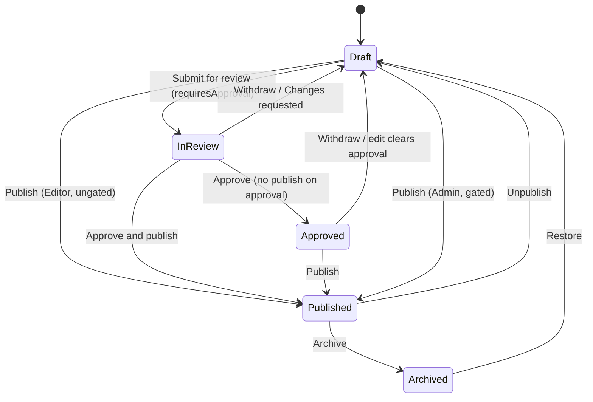

# Section 2: Course Workspace & Course Authoring

> **Abugida Academy — UX Design Specification** · Part 04 of 11 · [↑ Overview & Sitemap](00-Overview-and-Sitemap.md) · [← Dashboard](03-Dashboard.md) · [Media →](05-Media.md)

## What changed in Part 04 (Revision 3)

- **The lifecycle gains a fifth state.** `Draft → In Review → Approved → Published → Archived`, with `courses.approved_at` and a course-level **Approved** status. The Approval Status Stepper, the [state diagram](#course-lifecycle), the S-2.1 status filters, and the S-2.22 state list all carry it.
- **Items have their own visibility.** `lessons.visibility: draft | published | scheduled`, a **Publish item / Unpublish item** action, and a per-item `Unpublished` pill. _"The published set"_ is now defined, so `RC-3`/`RC-4` stop pointing at an undefined term.
- **`RC-4` is split per kind** — `RC-4a` lesson, `RC-4b` quiz, `RC-4c` assignment — because a flat "≥ 50 characters of prose" made a quiz and a video-only lesson unpublishable.
- **Permission rendering is one rule, three cases.** Out of capability → **absent**; capable but blocked by state → **disabled with a reason**; locked surface → **replaced by an explanation**. Support reaches the workspace and sees the **Students tab only**; `assignment.grade` is Admin **and** Editor.
- **Save semantics are explicit.** A new [Save Semantics](#save-semantics) table, and the explicit save buttons are renamed **`Flush now`** — disabled with `aria-describedby` "No unsaved changes" when the buffer is clean.
- **Ten screens now ship `Resilience` blocks** (403/404/offline/reconnected/session-expired/conflict/partial-failure/server-error) and five ship `Instrumentation & acceptance`, per [Part 11](11-Global-Standards.md#resilience-states).
- **Conflict is no longer a dead end.** Reload is replaced by a two-column Markdown diff with **Keep mine (default) / Take theirs / Compare**.
- **Delivery, not "and email".** In-app always, Telegram by default, email optional and disabled-with-reason, plus a delivery-failure state.
- **Analytics metrics are defined** — a Metric Definitions table with window, timezone, inclusion rule, an `n < 5` suppression rule, and a `?atab=` URL param.
- **New coverage:** version history with restore-as-a-new-draft, a 30-day **Recently deleted** view, Ge'ez 2-syllable n-gram search, course `content_language` + per-item **Translations**, a **Field Lock** table, bulk-publish readiness pre-evaluation, and a shared "Name this course" pre-step for AI/template creation.

## What changed in Part 04 (Revision 2)

Part 04 is the centre of the Revision 2 redesign. Everything in it now hangs off one surface: the **Course Workspace**.

- **New:** the workspace tabs [S-2.6](04-Courses.md#scr-2-6) Overview · [S-2.17](04-Courses.md#scr-2-17) Curriculum · [S-2.18](04-Courses.md#scr-2-18) Students · [S-2.19](04-Courses.md#scr-2-19) Analytics · [S-2.20](04-Courses.md#scr-2-20) Settings, plus [S-2.21](04-Courses.md#scr-2-21) Learner Preview, [S-2.22](04-Courses.md#scr-2-22) Publish Readiness & Course Review, and [S-2.23](04-Courses.md#scr-2-23) Assignment Builder.
- **Changed:** the [4-step wizard is retired](#retired-wizard-steps) ([S-2.3](04-Courses.md#retired-s-2-3)–[S-2.5](04-Courses.md#retired-s-2-5)) and [S-2.2](04-Courses.md#scr-2-2) becomes a single New Course dialog. [S-2.6](04-Courses.md#scr-2-6) is no longer a "Course Detail" tabbed screen — it is the workspace. [S-2.7](04-Courses.md#scr-2-7) becomes an in-pane editor with a route alias instead of its own page.
- **Unchanged:** the Markdown content model and Tiptap implementation ([Part 12](12-Course-Editor-Markdown-Lessons.md)), the review gate ([S-2.14](04-Courses.md#scr-2-14)), unlock rules ([S-2.15](04-Courses.md#scr-2-15)), and the generation surfaces ([S-2.11](04-Courses.md#scr-2-11)–[S-2.13](04-Courses.md#scr-2-13), [S-2.16](04-Courses.md#scr-2-16)) all keep their behaviour; they change only where they are entered from and where they deposit their output.

---

## The Course Workspace Model

This section is the shared vocabulary for every screen in Part 04. Screen definitions reference it rather than restating it.

> **Text direction.** `dir="ltr"` is the document default. Ge'ez is left-to-right and no RTL work is planned. No Ethiopic text anywhere in Part 04 uses letter-spacing or a fixed-px line clamp; see [Localization & Formatting](11-Global-Standards.md#localization--formatting).

> **Permission rendering — the three cases, not interchangeable** ([Part 11](11-Global-Standards.md#global-validation-and-feedback-patterns)):
>
> 1. **Out of capability** → the control is **absent entirely** (Support, Viewer, Reviewer never see authoring controls).
> 2. **Capable but blocked by current state** (review lock, archived course, first item, single-section course, seat capacity) → **disabled with a reason**, in a tooltip _and_ in `aria-describedby`. Never a silent no-op.
> 3. **Whole surface locked** → replaced with an explanation of what locked it and how to unlock it.
>
> "Read-only" is case 3, and only when the _entire_ surface is locked. A mixed screen does not collapse to read-only: it drops case-1 controls and keeps case-2 controls visible but disabled-with-a-reason.

### Workspace Anatomy

A course is edited in one **workspace**: a persistent shell plus exactly one active tab.

```text
┌──────────────────────────────────────────────────────────────────────────┐
│  Identity Header (sticky, 64px)                                         │
│  ‹ Courses / TOEFL Complete Course     ● Draft · v3   [Preview] [⋯]   │
│  Course title (inline-editable) · TOEFL · Advanced · Instructor           │
├──────────────────────────────────────────────────────────────────────────┤
│  Workspace Nav:  Overview · Curriculum · Students · Analytics · Settings  │
│  (role-filtered; counts shown for Students and Curriculum)               │
├──────────────────────────────────────────────────────────────────────────┤
│  Tab content — fills remaining height, scrolls independently             │
└──────────────────────────────────────────────────────────────────────────┘
```

| Region        | Rule                                                                                                                                                                                                                                                             |
| ------------- | ---------------------------------------------------------------------------------------------------------------------------------------------------------------------------------------------------------------------------------------------------------------- |
| Identity      | Always visible on every tab. Carries the title, the [status pill](11-Global-Standards.md#status-colour-mapping) and the lifecycle stepper, plus the lifecycle action button (`Submit for review` / `Publish` / `Unpublish` / `Restore`) and the `⋯` course menu. |
| Workspace Nav | Exactly five destinations. The active tab is mirrored in the URL so any tab is linkable, bookmarkable, and back-button safe.                                                                                                                                     |
| Tab content   | Owns its own scroll container. **No tab may navigate away from the workspace shell** — deep links open _within_ the shell.                                                                                                                                       |

### Curriculum Taxonomy

The curriculum is a two-level tree. Abugida's storage model is unchanged: a **section** is a `modules` row and an **item** is a `lessons` row. "Section" and "item" are the display labels; the data model keeps its existing names.

| Level   | Storage       | Purpose                                                                                                                             |
| ------- | ------------- | ----------------------------------------------------------------------------------------------------------------------------------- |
| Section | `modules` row | A chapter of the course. Owns a title, an optional description, an estimated duration, and a preview flag. Ordered by `sort_order`. |
| Item    | `lessons` row | The atomic unit a student completes, authors, or reviews. Ordered by `sort_order` within its section.                               |

An item's **kind** is derived from its `contentType`, so no new column is introduced:

| Kind           | `contentType` value    | Authored in                                         | What it is                                                                                           |
| -------------- | ---------------------- | --------------------------------------------------- | ---------------------------------------------------------------------------------------------------- |
| **Lesson**     | `video`, `pdf`, `link` | [S-2.7](04-Courses.md#scr-2-7) Lesson Editor        | Reading + media. A Markdown body, optional video/PDF, and an optional attached quiz.                 |
| **Quiz**       | `quiz`                 | [S-2.8](04-Courses.md#scr-2-8) Quiz Builder         | A graded set of questions. The item body is a short Markdown intro; the questions live in `quizzes`. |
| **Assignment** | `exercise`             | [S-2.23](04-Courses.md#scr-2-23) Assignment Builder | A submitted piece of work: brief, optional attachment, rubric, submission settings.                  |

**Kind is fixed at creation** and changing it prompts a confirmation that explains what is lost (an item promoted from Quiz to Lesson keeps its body but stops being a graded activity; demoting a Quiz to Lesson leaves the question set orphaned and requires an explicit choice). A single item may have **both** a rich body and an attached quiz — that combination is expressed as a Lesson item with an attached quiz, not as a separate kind.

#### Item visibility

`lessons.visibility: 'draft' | 'published' | 'scheduled'` is a **per-item** field, independent of the course lifecycle. It is what lets a live course grow one item at a time without publishing the whole draft, and it is the field `RC-3`/`RC-4` and completion rules read.

| Value       | Student view                                                                                | Counts toward completion | Readiness                                  |
| ----------- | ------------------------------------------------------------------------------------------- | ------------------------ | ------------------------------------------ |
| `draft`     | Hidden. A `◌ Unpublished` pill sits on the tree row and the pane header.                    | No                       | Yes — must pass `RC-4x` before it can move |
| `scheduled` | Hidden until `scheduled_publish_at` (per-item, nullable). Badge reads `◌ Scheduled {date}`. | No                       | Yes — as `draft`                           |
| `published` | Visible in the learner view, subject to unlock rules.                                       | Yes                      | Out of the published set                   |

> **"The published set" (used by `RC-3`, `RC-4`, and the completion rule)** is: items of the course where `visibility = 'published'` and `archived_at IS NULL` and `deleted_at IS NULL`. It is a **subset of the curriculum**, not a synonym for it. Unpublishing an item removes it from the published set immediately; students already holding a completion for it keep that completion, and the course's `published_items` count drops.

### Course Lifecycle

`Draft → In Review → Approved → Published → Archived`, visualised by the [Lifecycle Stepper](11-Global-Standards.md#reusable-component-library) in the identity header.

**Approved is a course-level status**, not only a per-item review state: `courses.approved_at` is set by an approval decision and is cleared on withdrawal, on any subsequent edit, and on unpublish. It is what lets a reviewed course sit _between_ review and publication — the state [S-2.22](04-Courses.md#scr-2-22) already required and Revision 2 had no way to represent.

> **Derived Approved pill.** A course with an open approved review request and status `draft` shows the `In review` pill with an **"Approved, awaiting publish"** secondary line. The catalog's **Approved** filter matches exactly `review_requests.entity_type = 'course' AND decision = 'approved' AND courses.status = 'draft'`.



| From        | To        | Who can                                          | Guard                                                                                                                  |
| ----------- | --------- | ------------------------------------------------ | ---------------------------------------------------------------------------------------------------------------------- |
| _(created)_ | Draft     | Author                                           | Every course is created as a Draft.                                                                                    |
| Draft       | In Review | Editor                                           | Course readiness ([S-2.22](04-Courses.md#scr-2-22)) passes. Only when `requiresApproval` is on.                        |
| Draft       | Published | Editor (ungated) / Admin (gated)                 | All readiness checks pass. When `requiresApproval` is on, an Editor cannot self-approve.                               |
| In Review   | Draft     | Editor (withdraw) / Reviewer (changes requested) | Withdrawal keeps every edit. Requesting changes requires a comment.                                                    |
| In Review   | Approved  | Reviewer                                         | Reviewer decision, comment optional, preview opened. Sets `approved_at`.                                               |
| Approved    | Draft     | Editor                                           | Any edit clears `approved_at`; the course returns to Draft.                                                            |
| In Review   | Published | Reviewer (approve) or Admin                      | Reviewer decision **with** _publish on approval_, plus every readiness check. Publishing increments `courses.version`. |
| Approved    | Published | Editor / Admin                                   | Every readiness check re-evaluated. Publishing increments `courses.version`.                                           |
| Published   | Draft     | Admin                                            | Unpublish keeps enrolled students' access for the grace period; new enrolment stops immediately.                       |
| Published   | Archived  | Admin                                            | Enrollment closes; the course leaves the catalog. Students keep earned certificates and progress.                      |
| Archived    | Draft     | Admin                                            | Restore returns the course to Draft — never straight to Published.                                                     |

**Published is not terminal.** It has two exits — **Unpublish** and **Archive** — so the diagram has no `Published --> [*]` edge. An archived course that is deleted does terminate, and that is a hard delete behind the [S-7.1](09-Shared-Components.md#scr-7-1) confirmation.

### Routing Contract

| Route                                                                               | Renders                                                                                           |
| ----------------------------------------------------------------------------------- | ------------------------------------------------------------------------------------------------- |
| `/_app/courses`                                                                     | [S-2.1](04-Courses.md#scr-2-1) Catalog                                                            |
| `/_app/courses/new`                                                                 | [S-2.2](04-Courses.md#scr-2-2) New Course dialog → creates a Draft and navigates to the workspace |
| `/_app/courses/$courseId?tab=overview`                                              | [S-2.6](04-Courses.md#scr-2-6) Overview (default)                                                 |
| `/_app/courses/$courseId?tab=curriculum`                                            | [S-2.17](04-Courses.md#scr-2-17) Curriculum with the item tree; no item selected                  |
| `/_app/courses/$courseId?tab=curriculum&item=<itemPublicId>`                        | Curriculum with that item's pane open and the item selected in the tree                           |
| `/_app/courses/$courseId?tab=students`                                              | [S-2.18](04-Courses.md#scr-2-18)                                                                  |
| `/_app/courses/$courseId?tab=analytics`                                             | [S-2.19](04-Courses.md#scr-2-19)                                                                  |
| `/_app/courses/$courseId?tab=analytics&atab=<performance\|dropoff\|quizzes\|items>` | The named analytics sub-tab; `performance` is the default and an unknown value falls back to it   |
| `/_app/courses/$courseId?tab=settings`                                              | [S-2.20](04-Courses.md#scr-2-20)                                                                  |
| `/_app/courses/$courseId?lessons/$lessonId`                                         | **Alias** → redirects to `?tab=curriculum&item=$lessonId`. Same component, no second editor.      |

- `tab` defaults to `overview`; `item` is ignored outside the `curriculum` tab; `atab` is ignored outside the `analytics` tab.
- The alias route exists so that search results, notifications, and the Media "Used in" list keep working. It must not host a second editor implementation.
- The workspace route allows `admin`, `editor`, `reviewer`, `viewer`, and `support`. Authoring affordances inside it are permission-filtered, not route-filtered, so a Reviewer can open the same item the Editor sees and act on the review. **Support is a special case:** their workspace nav renders the **Students tab only** — Overview, Curriculum, Analytics, and Settings are absent entirely (case 1 of the three-case rule above), per the [Support grant in Part 11](11-Global-Standards.md#roles--permissions-matrix). The route is the same; the destinations are not.

### Item Action Matrix

What each action does to the tree, the learner view, and analytics. Used by the sidebar `⋯` menu ([S-7.10](09-Shared-Components.md#scr-7-10)) and the item pane.

| Action         | Tree effect                                           | Learner view                                                                             | Analytics                                         | Reversible                 |
| -------------- | ----------------------------------------------------- | ---------------------------------------------------------------------------------------- | ------------------------------------------------- | -------------------------- |
| Add            | New item appended to a section, `visibility='draft'`  | Hidden until the item is published                                                       | Not counted                                       | Yes — delete               |
| Rename         | In-place title change                                 | Unchanged                                                                                | Unchanged (identity follows the title)            | n/a                        |
| Publish item   | `visibility: draft → published`; pill clears          | Item enters the learner view and the published set                                       | Begins counting toward reach and completion       | Yes — Unpublish item       |
| Unpublish item | `visibility: published → draft`; `◌ Unpublished` pill | Item leaves the published set immediately; students keep progress already recorded on it | Excluded from the published set; history retained | Yes — Publish item         |
| Duplicate      | Copy inserted after the source, `visibility='draft'`  | Hidden until published                                                                   | Counted separately — never merged with source     | Yes — delete               |
| Move           | Reposition within or across sections                  | Order changes immediately in a published course                                          | Unchanged                                         | n/a                        |
| Archive        | Item leaves the active tree into `Archived`           | Removed immediately, even from published courses                                         | Excluded from progress and drop-off               | Yes — Restore              |
| Delete         | Soft-deleted (`deleted_at`), hidden                   | Removed, and purged after the retention window                                           | Historical records retained for the audit log     | Within 30 days, then purge |

**What Duplicate copies, and what it never copies.** Duplication is a structure copy, not a data copy.

| Copied                                                     | Never copied                                                       |
| ---------------------------------------------------------- | ------------------------------------------------------------------ |
| Sections, items, item bodies, attached quizzes and rubrics | Enrolments                                                         |
| Unlock / prerequisite rules                                | Progress, `lesson_completions`, item-position progress             |
| Course settings, pricing, discounts                        | Quiz attempts and grades, assignment submissions                   |
| Completion rules and certificate config                    | Issued certificates, waitlist, enrolment requests                  |
| The `source: template` flag                                | Analytics / `course_stats` history, review requests                |
|                                                            | AI provenance tags (`source: ai`) — the copy is **not** AI-drafted |

A duplicate always lands as `status: 'draft'` with every item `visibility: 'draft'`, never inherits `published_at`, and never carries a `requiresApproval` bypass.

#### Item actions menu order

The single `⋯` menu ([S-7.10](09-Shared-Components.md#scr-7-10)) opens in exactly this order on an item row and on the pane header. **Every reversible action sits above the destructive zone**; the destructive zone is always last and always separated by a rule.

| #   | Entry                                   | Availability                                                                                                          |
| --- | --------------------------------------- | --------------------------------------------------------------------------------------------------------------------- |
| 1   | **Publish item** / **Unpublish item**   | Items only. Absent for sections. `visibility` toggle; disabled-with-reason in a Review, Approved, or Archived course. |
| 2   | Rename                                  |                                                                                                                       |
| 3   | Duplicate…                              | Opens [S-7.7](09-Shared-Components.md#scr-7-7)                                                                        |
| 4   | Move up · Move down · Move to section ▸ | Keyboard parity for drag                                                                                              |
| 5   | Unlock rules                            | → [S-2.15](04-Courses.md#scr-2-15)                                                                                    |
| 6   | Captions & transcript                   | Video items only                                                                                                      |
| 7   | ✨ AI Quiz                              |                                                                                                                       |
| 8   | Translations                            | → the item pane's **Translations** sub-tab                                                                            |
| 9   | View analytics · Copy Markdown          |                                                                                                                       |
| --- | **— destructive zone —**                |                                                                                                                       |
| 10  | **Archive** (reversible)                | Offered first, labelled "Hidden from students, reversible"                                                            |
| 11  | **Delete…**                             | Marked destructive; never the default                                                                                 |

Sections use the same menu minus 1, 6, and 8. `Publish item` is **not** available while the course is In Review, because the [Field Lock table](#field-lock-table) makes `visibility` absent in that state.

### Field Lock Table

The single source of truth for what is editable in which course state. Every screen's prose about editability must agree with this table; where a screen and this table disagree, this table wins.

| Field                                                                      | Draft                                        | In Review                                                 | Approved                                                        | Published                                                           | Archived   |
| -------------------------------------------------------------------------- | -------------------------------------------- | --------------------------------------------------------- | --------------------------------------------------------------- | ------------------------------------------------------------------- | ---------- |
| **Course** title                                                           | editable                                     | editable                                                  | **locked-with-reason** "Approved — editing clears the approval" | editable-with-confirm                                               | read-only  |
| **Course** slug                                                            | editable                                     | **locked-with-reason** "Slugs are frozen while in review" | locked-with-reason                                              | read-only (frozen at first publish)                                 | read-only  |
| **Course** description, exam, level, tags, thumbnail                       | editable                                     | editable                                                  | editable                                                        | editable                                                            | read-only  |
| **Course** content language                                                | editable                                     | editable                                                  | editable                                                        | editable-with-confirm                                               | read-only  |
| **Course** pricing                                                         | editable                                     | editable                                                  | editable                                                        | editable-with-confirm "Students who already paid keep their access" | read-only  |
| **Course** `requiresApproval`                                              | Admin only                                   | Admin only                                                | Admin only                                                      | Admin only                                                          | read-only  |
| **Section** title, description, duration, preview flag                     | editable                                     | editable                                                  | editable                                                        | editable                                                            | read-only  |
| **Item** title                                                             | editable                                     | **locked-with-reason** "In review — withdraw to edit"     | **locked-with-reason** "Approved — editing clears the approval" | editable-with-confirm                                               | read-only  |
| **Item** body, media, captions                                             | editable                                     | locked-with-reason (same)                                 | locked-with-reason (same)                                       | editable-with-confirm "This changes a live lesson"                  | read-only  |
| **Item** unlock rules                                                      | editable                                     | locked-with-reason (same)                                 | locked-with-reason (same)                                       | editable-with-confirm                                               | read-only  |
| **Item** `visibility`                                                      | editable                                     | **absent** — the lifecycle owns it                        | editable                                                        | editable-with-confirm                                               | read-only  |
| **Lifecycle transition** (`Publish` / `Unpublish` / `Archive` / `Restore`) | per the [lifecycle table](#course-lifecycle) | —                                                         | —                                                               | Admin only                                                          | Admin only |

- _Locked-with-reason_ renders the control **disabled**, with the reason in a tooltip **and** in `aria-describedby`. Never a silent no-op, never a hidden field.
- _Editable-with-confirm_ is an editable field behind a [S-7.1](09-Shared-Components.md#scr-7-1) confirmation that states the student-visible effect.
- _Absent_ means the control does not render for that state at all.
- **Reordering and moving items in a published course** applies immediately and reorders the live course on the next student page load. Enrolled students are notified **only when the move changes a prerequisite chain** — a plain reorder is silent; a move that alters what unlocks what sends an in-app + Telegram notice naming the affected items. This is the single rule S-2.6, S-2.17, and S-2.20 all restate.

### Save-State Contract

Every editing surface in Part 04 reports state with the shared [S-7.8](09-Shared-Components.md#scr-7-8) indicator and follows the [Part 11](11-Global-Standards.md#global-validation-and-feedback-patterns) autosave policy:

- **Structural changes** (add, rename, reorder, move, duplicate, archive, publish/unpublish item, settings toggles) save **immediately** on commit and roll back with an error toast on failure.
- **Content editing** (the [S-2.7](04-Courses.md#scr-2-7) item pane body, the [S-2.8](04-Courses.md#scr-2-8) quiz, the [S-2.23](04-Courses.md#scr-2-23) assignment, course settings text fields) autosaves on a **60s idle timer** and flushes on `Ctrl/⌘+S`.
- Switching items, tabs, or settings sections **flushes** a dirty buffer first. If the flush fails, navigation is blocked by a [S-7.1](09-Shared-Components.md#scr-7-1) dialog offering **Retry / Discard / Stay** — the buffer is never discarded silently.

#### Save Semantics

The 60s idle timer and an explicit button are **not** two competing save systems. The button exists only to force a flush early; the timer remains the automatic path.

| Surface                                                                                    | Trigger                                                      | Explicit control                           | Behaviour when clean                                  | Dirty-exit behaviour                                                                             |
| ------------------------------------------------------------------------------------------ | ------------------------------------------------------------ | ------------------------------------------ | ----------------------------------------------------- | ------------------------------------------------------------------------------------------------ |
| Item editor body ([S-2.7](#scr-2-7), [S-2.8](#scr-2-8), [S-2.23](#scr-2-23))               | 60s idle · `Ctrl/⌘+S` · blur · item/tab switch               | **`Flush now`** (`⌘S`)                     | Disabled, `aria-describedby` **"No unsaved changes"** | `beforeunload` guard; item switch flushes, and on failure blocks with **Retry / Discard / Stay** |
| Course Settings text fields ([S-2.20](#scr-2-20))                                          | 60s idle per section                                         | **`Flush now`**                            | Disabled, "No unsaved changes"                        | Section switch flushes; `beforeunload` guard                                                     |
| Quiz Builder ([S-2.8](#scr-2-8))                                                           | 60s idle                                                     | **`Flush now`**                            | Disabled, "No unsaved changes"                        | Same as the item editor                                                                          |
| Completion & certificates ([S-2.10](#scr-2-10))                                            | Immediate on toggle; 60s idle while a field is open          | **`Flush now`**                            | Disabled, "No unsaved changes"                        | Section switch flushes                                                                           |
| Unlock rules ([S-2.15](#scr-2-15))                                                         | Immediate on toggle; 60s idle while editing the lock message | **`Flush now`**                            | Disabled, "No unsaved changes"                        | Closing the sheet flushes; on failure the sheet stays open with the buffer intact                |
| Curriculum tree structure (rename, reorder, move, publish/unpublish item, archive, delete) | Immediate on commit                                          | none                                       | n/a — there is no buffer                              | Optimistic UI; failure rolls back with an error toast and **Undo** where reversible              |
| New Course dialog ([S-2.2](#scr-2-2))                                                      | Immediate on submit                                          | **Create course** (an action, not a flush) | Disabled until the required fields are valid          | Closing with a typed title asks [S-7.1](09-Shared-Components.md#scr-7-1) before discarding       |

- A flush that fails leaves the buffer intact and moves [S-7.8](09-Shared-Components.md#scr-7-8) to `error`; **the word "Saved" never appears before the server confirms.**
- The explicit control is always `Flush now`, never "Save", so it is unambiguous that autosave is already running. Short, structural flows name the action itself instead.

---

<a id="scr-2-1"></a>

##### Screen Name: S-2.1 Course Catalog / Grid 🔄 CHANGED

- **Purpose:** The entry point to the course lifecycle: browse every course, see its lifecycle state and authoring health at a glance, and open a Course Workspace. No authoring happens on this screen.
- **User Role(s):** Admin, Editor, Reviewer, Viewer, Support
- **Wireframe Layout (Text-Based):**
  ```
  ┌──────────────────────────────────────────────────────────────────────────┐
  │ Header: "Courses"                                     [🔍 Search] [Filter]│
  │                                        [+ New Course ▾]                 │
  ├──────────────────────────────────────────────────────────────────────────┤
  │ Status pills (single-select):                                           │
  │ [All 24] [Draft 6] [In Review 2] [Approved 1] [Scheduled 1]             │
  │ [Published 15] [Archived 1]                                             │
  │ Type: [All ▾]  Sort: [Recently updated ▾]                               │
  ├──────────────────────────────────────────────────────────────────────────┤
  │ Results: "Showing 24 courses"                                           │
  │ +----------------------+ +----------------------+ +--------------------+ │
  │ | [Thumbnail 160px]    | | [Thumbnail 160px]    | | [Thumbnail 160px]  | │
  │ | ● In Review          | | ● Published          | | ● Draft              | │
  │ | TOEFL Complete       | | IELTS Advanced       | | Grammar Basics    | │
  │ | description wraps,   | | description wraps,   | | description wraps  | │
  │ | never clamped        | | never clamped        | | never clamped     | │
  │ |─────────────────────| |─────────────────────| |────────────────────| │
  │ | 4 sections · 24 items| | 3 sections · 18 items| | ⚠ 3 items need    | │
  │ | 234 students · 82%   | | 189 students · 52%  | | content            | │
  │ | ✔ Ready to publish   | | ● Live               | | ○ Not started        | │
  │ | [Open workspace]    | | [Open workspace]    | | [Open workspace]  | │
  │ +----------------------+ +----------------------+ +--------------------+ │
  └──────────────────────────────────────────────────────────────────────────┘
  ```
- **Primary Actions:**
  1. Open a course's [Course Workspace](04-Courses.md#scr-2-6) — card click, or the **Open workspace** hover action.
  2. Filter by lifecycle status, type, instructor, or exam category; search by title and description.
  3. Sort by title, recently updated, student count, or creation date.
  4. Create a course: New ([S-2.2](04-Courses.md#scr-2-2)) · From template ([S-2.12](04-Courses.md#scr-2-12)) · AI ([S-2.11](04-Courses.md#scr-2-11)) · Bulk import ([S-2.13](04-Courses.md#scr-2-13)).
  5. Quick actions via card hover: Open workspace, Duplicate, Archive.
- **Data Displayed/Modified:** Reads `courses` joined with `course_stats` and aggregated `modules`/`lessons` counts. Read-only.
- **States:**
  - **Default (Populated):** Full grid of cards; the status pill reflects the [course lifecycle](04-Courses.md#course-lifecycle). Every pill is the [fill/text/tint triple](11-Global-Standards.md#status-colour-mapping) with a label and an icon — never colour alone.
  - **Status pills and filters:** `All · Draft · In Review · Approved · Scheduled · Published · Archived`. **Approved** matches `review_requests.entity_type='course' AND decision='approved' AND courses.status='draft'`; **Scheduled** matches any course with a future `scheduled_publish_at`.
  - **In Review:** Indigo pill + "In review" line; a Reviewer's card shows the pending decision count. The derived-Approved case adds a secondary line _"Approved, awaiting publish."_
  - **Empty State (No Courses):** [S-7.3](09-Shared-Components.md#scr-7-3) Empty State: "No courses yet. Create your first course!" with a prominent **New Course** CTA and a link to the [Media](05-Media.md#scr-3-1).
  - **Loading:** 6–9 skeleton cards with 160px placeholder thumbnails.
  - **Filtered (No Results):** "No courses match your filters." + **Clear filters** — deliberately _not_ the [S-7.3](09-Shared-Components.md#scr-7-3) creation CTA, per [Part 11](11-Global-Standards.md#global-validation-and-feedback-patterns).
  - **Error:** "Unable to load courses. Retry?" with a Retry button and a request ID.
  - **Authoring Health:** A card shows the single most useful next action for its state, and the line is a link straight to the screen that resolves it. **Every count below is read from one source** — the server-side authoring-health projection that also backs `RC-3`/`RC-4` in [S-2.22](#scr-2-22) — so the catalog can never disagree with the readiness checklist.

    | Variant                          | Condition                                                       |
    | -------------------------------- | --------------------------------------------------------------- |
    | `○ Not started`                  | No items exist                                                  |
    | `⚠ N items need content`         | ≥ 1 item in the published set fails `RC-4a` / `RC-4b` / `RC-4c` |
    | `N items awaiting review`        | ≥ 1 item with `review_status = 'in_review'`                     |
    | `↻ Changes requested on M items` | ≥ 1 item with `review_status = 'changes_requested'`             |
    | `✎ Ready to review`              | All items approved, course not yet submitted                    |
    | `✔ Ready to publish` (ungated)   | Every `RC-1…RC-8` passes and the course needs no approval       |
    | `📅 Scheduled for {date}`        | Future `scheduled_publish_at`                                   |

  - **Selection Mode:** Checkboxes for Admin bulk actions (Publish, Archive, Delete) with a bulk confirmation. Support and Viewer see no checkboxes at all — the capability is absent, not disabled.
  - **Hover State:** Card lifts; quick actions appear.
- **Validation & Feedback:**
  - **Delete Confirmation:** [S-7.1](09-Shared-Components.md#scr-7-1): "Delete 'TOEFL Complete'? This cannot be undone. 234 enrollments and 84 earned certificates are affected." Certificates block deletion until exported.
  - **Archive Success:** Toast "Course archived successfully." The card moves to the `Archived` filter.
  - **Publish Success:** Toast "Course published successfully." + deep link to the workspace Overview.
  - **Bulk Publish pre-evaluates readiness.** Bulk Publish calls `getPublishReadiness` for **every selected course** before it commits anything. Courses with blocking failures are **excluded** and listed in the confirmation as _"Cannot publish: {name} — {failing RC ids}"_, with a **Fix** deep link each. The remaining courses publish, and the result toast reports both counts: _"3 published · 1 couldn't publish (2 failing checks)."_ Bulk Publish never publishes a course it did not verify.
- **Resilience:**
  - **403:** "You don't have access to this workspace." naming the course, with a request ID and **Ask an Admin for access**. Support never sees this screen's authoring affordances at all.
  - **404:** "This course was deleted, or you followed an old link." + **Back to Courses** + request ID.
  - **Offline:** A persistent banner, not a toast. The grid renders read-only from cache with _"You're offline — showing the last loaded catalog."_ Filters and sort still work locally.
  - **Reconnected:** Queued writes flush in order; a queued archive whose `rowVersion` went stale resolves to a conflict prompt, never a silent overwrite.
  - **Session expired:** The 2-minute warning modal names the unsaved-work surfaces (none on this screen, stated explicitly); on return the user lands on the same filter and page.
  - **Conflict / partial failure:** Bulk Publish and Archive report per-course results — _"47 archived · 3 failed — Retry failures"_ — never one success/failure toast for a mixed batch.
  - **Server error:** "We couldn't load your courses — nothing you did was lost." with Retry and a request ID.
- **Instrumentation & acceptance:**
  - **Events:** `course_catalog_viewed` `{filter, sort, page, resultCount}` · `course_filter_changed` `{statusFilter, resultCount}` · `course_workspace_opened` `{courseId, entryPoint}` · `course_bulk_publish_requested` `{selectedCount, excludedCount}` · `course_bulk_publish_completed` `{publishedCount, failedCount, failingRcIds[]}`. IDs and counts only — no titles, no PII.
  - **Acceptance:**
    1. A card's authoring-health line reports the same item counts as the `RC-3` / `RC-4` failures on [S-2.22](#scr-2-22) for the same course.
    2. The **Approved** filter returns exactly the courses with an approved course review request and `status = 'draft'`.
    3. Bulk Publish never publishes a course with a blocking `RC` failure, and the confirmation names each excluded course with a Fix link.
    4. The bulk-publish result toast reports published and failed counts separately, with a **Retry failures** action.
    5. Every status pill carries a text label and an icon and is legible in grayscale.
  - **Budgets:** 25-row pages; server-side sort past 100 rows; first paint < 1.5 s; filter re-query < 400 ms; no layout shift when 9 cards paint.
- **Navigation:**
  - Card click / **Open workspace** → [S-2.6](04-Courses.md#scr-2-6) Course Workspace · Overview
  - Authoring-health line → [S-2.17](04-Courses.md#scr-2-17) Curriculum (or [S-2.22](04-Courses.md#scr-2-22) Readiness)
  - **+ New Course ▾** → New: [S-2.2](04-Courses.md#scr-2-2) · Template: [S-2.12](04-Courses.md#scr-2-12) · AI: [S-2.11](04-Courses.md#scr-2-11) · Bulk import: [S-2.13](04-Courses.md#scr-2-13)
  - **Duplicate** → creates a Draft copy and opens its workspace Overview
  - Status pill on a card → filters the grid to that status
  - Avatar → [S-6.5](08-Settings.md#scr-6-5) My Profile, [S-6.1](08-Settings.md#scr-6-1) Settings, Logout

---

<a id="scr-2-2"></a>

##### Screen Name: S-2.2 New Course Dialog 🔄 CHANGED

- **Purpose:** Create a course in one step. The dialog captures only what is genuinely required to make a course exist; everything else is authored in the workspace that opens immediately afterwards. Replaces Step 1 of the retired 4-step wizard.
- **User Role(s):** Admin, Editor
- **Wireframe Layout (Text-Based):**
  ```
  ┌──────────────────────────────────────────────────────────────────────────┐
  │ Modal: "New Course"                                          [X] Close   │
  │ "You'll land in the course workspace. Nothing is visible to students    │
  │  until you publish."                                                    │
  ├──────────────────────────────────────────────────────────────────────────┤
  │ Course title *     [ Introduction to TOEFL                    ]         │
  │ Exam / category *  [ TOEFL ▾]                        Level [Advanced▾]  │
  │ Instructor *       [ Jane Smith ▾]  (defaults from [S-6.1])            │
  │ Thumbnail          [ ⬆ Drop image or browse ]  (160×90, PNG/JPG)        │
  │                                                                           │
  │ Start from:  (● Blank   ○ From template   ○ Generate with ✨ AI)         │
  │                                                                          │
  │                                              [Cancel]  [Create course]  │
  └──────────────────────────────────────────────────────────────────────────┘
  ```
- **Primary Actions:**
  1. Enter a title, exam/category, level, and instructor.
  2. Optionally attach a thumbnail.
  3. Optionally start from a template ([S-2.12](04-Courses.md#scr-2-12)) or an AI outline ([S-2.11](04-Courses.md#scr-2-11)) — both hand off from the workspace after creation, not from inside this dialog.
  4. Create the course and land in the workspace.
- **Data Displayed/Modified:** Creates a `courses` row with `status: 'draft'`, and an `audit_logs` entry.
- **States:**
  - **Default:** Blank, title focused, `Create course` disabled until the title is valid.
  - **Valid:** CTA enabled; helper text states "Created as a Draft".
  - **Template Selected:** A summary line shows the template's structure count; nothing is copied until after creation.
  - **AI Selected:** The dialog closes after creation and the [S-2.11](04-Courses.md#scr-2-11) generator opens scoped to the new draft.
  - **Submitting:** CTA spinner; the dialog is not dismissible while the course is being created, to avoid an orphan record.
  - **Creation Failed:** Inline error with Retry; no partial course is left behind.
  - **Unsaved Input on Close:** [S-7.1](09-Shared-Components.md#scr-7-1) only when a title has been typed.
- **Validation & Feedback:**
  - **Title:** required, 3–300 characters (schema bound), unique slug generated from the title with a de-duplicating suffix.
  - **Exam/category:** required — seeded from the workspace default in [S-6.1](08-Settings.md#scr-6-1).
  - **Instructor:** required; defaults to the signed-in user when they hold the Instructor assignment, otherwise to the workspace default.
  - **Thumbnail:** optional, 160×90, PNG/JPG/WebP, ≤ 2 MB. Uploading shows inline progress and does not block creation.
  - **Description:** _not_ collected here. It is edited in [S-2.20](04-Courses.md#scr-2-20) and is only required at publish time.
- **Resilience:**
  - **403:** "You don't have access to create courses in this workspace." with a request ID and **Ask an Admin for access**. Reviewer, Viewer, and Support never reach this dialog — **+ New Course** is absent for them, not disabled.
  - **404:** The dialog is only reachable from a route, so an invalid `?from=` returns to [S-2.1](#scr-2-1) with the dialog closed and a request ID.
  - **Offline:** The dialog opens read-only with a persistent banner: _"You're offline — creating a course is paused."_ Typed values are kept in the local draft mirror so nothing typed is lost.
  - **Reconnected:** The dialog re-enables and the typed values are still present; nothing is auto-submitted.
  - **Session expired:** On return the dialog reopens with the typed title restored from the local draft mirror and the create action available.
  - **Conflict / partial failure:** Not applicable — creation is a single atomic insert. A slug collision re-suffixes silently and reports the chosen slug in the success toast.
  - **Server error:** "We couldn't create your course — nothing was saved." with Retry and a request ID.
- **Navigation:**
  - **Create course** → [S-2.6](04-Courses.md#scr-2-6) Course Workspace · Overview, with a first-run hint pointing at [S-2.17](04-Courses.md#scr-2-17) Curriculum
  - **Cancel / X** → [S-2.1](04-Courses.md#scr-2-1) Catalog
  - Started from the header split button or the [S-7.5](09-Shared-Components.md#scr-7-5) Command Palette

---

## Retired Wizard Steps

<a id="retired-s-2-3"></a>

#### ⛔ RETIRED — S-2.3 Course Creation Wizard (Step 2: Curriculum)

- **Reason:** A linear wizard cannot hold an unbounded curriculum. Revision 1 already had to offer drag-and-drop inside a step, which made the step indistinguishable from a workspace. The capability moved to [S-2.17](04-Courses.md#scr-2-17) Course Workspace · Curriculum, which supports it without a modal.
- **Where each behaviour lives now:**

  | Wizard Step 2 behaviour                      | Location now                                                                                    |
  | -------------------------------------------- | ----------------------------------------------------------------------------------------------- |
  | Add module / lesson                          | Sidebar [+ Section ▾](09-Shared-Components.md#scr-7-9) / [+ Add item ▾](04-Courses.md#scr-2-17) |
  | Drag-and-drop reorder and cross-section move | [S-7.9](09-Shared-Components.md#scr-7-9) Curriculum Tree                                        |
  | Inline rename                                | [S-7.10](09-Shared-Components.md#scr-7-10) Item Actions Menu → Rename                           |
  | Edit a lesson's content                      | [S-2.7](04-Courses.md#scr-2-7) item pane, same screen as the tree                               |
  | Import from Media / bulk import              | [S-2.13](04-Courses.md#scr-2-13), opened from the Curriculum toolbar                            |
  | "At least 1 module with 1 lesson" rule       | [S-2.22](04-Courses.md#scr-2-22) publish readiness check `RC-3`                                 |

<a id="retired-s-2-4"></a>

#### ⛔ RETIRED — S-2.4 Course Creation Wizard (Step 3: Pricing)

- **Reason:** Pricing is course configuration, not a one-time gate. Keeping it in a wizard step forced authors to re-enter the wizard to change a price later.
- **Where each behaviour lives now:** the **Pricing & enrollment** section of [S-2.20](04-Courses.md#scr-2-20) Course Workspace · Settings — pricing model, price, billing interval, enrollment window, capacity, and payment gateway selection, all autosaved in place. Discount and coupon codes remain in [S-8.3](10-Marketing-and-Growth.md#scr-8-3); they are never defined per course here.

<a id="retired-s-2-5"></a>

#### ⛔ RETIRED — S-2.5 Course Creation Wizard (Step 4: Publish)

- **Reason:** Publication is a lifecycle transition that happens repeatedly, not a final wizard step. A course that was published months ago and is being updated needs the same review surface as a brand-new one.
- **Where each behaviour lives now:** [S-2.22](04-Courses.md#scr-2-22) Publish Readiness & Course Review — readiness checklist, release scheduling, notification preferences, and the publish/unpublish/archive actions. The review-summary block is preserved there, and the confirmation checkbox becomes a typed confirmation only for irreversible actions.

---

<a id="scr-2-6"></a>

##### Screen Name: S-2.6 Course Workspace — Overview 🔄 CHANGED

- **Purpose:** The persistent shell for everything about one course, and its landing tab. Gives an author or reviewer a single answer to "what state is this course in, what is blocking it, and what do I do next" before any editing begins. Replaces the Revision 1 "Course Detail / Curriculum Builder" screen.
- **User Role(s):** Admin, Editor, Reviewer, Viewer. **Support: the route resolves, the nav shows the Students tab only** — Overview, Curriculum, Analytics, and Settings are absent.
- **Wireframe Layout (Text-Based):**
  ```
  ┌──────────────────────────────────────────────────────────────────────────┐
  │ ‹ Courses / TOEFL Complete Course                      ● Draft · v3    │
  │ TOEFL Complete Course  ·  TOEFL · Advanced · Jane Smith   [Preview] [⋯] │
  │ ●━━━○━━━○━━○━━━○        [ Submit for review ]  ← 5-node lifecycle       │
  │ ┌────────────────────────────────────────────────────────────────────┐   │
  │ │ ● Overview   ○ Curriculum (24)   ○ Students (234)  ○ Analytics  │   │
  │ │ ○ Settings                                                       │   │
  │ └────────────────────────────────────────────────────────────────────┘   │
  ├──────────────────────────────────────────────────────────────────────────┤
  │ Readiness banner:                                                        │
  │ ⚠ 3 items need content before this course can be published.              │
  │   [Review checklist] [Jump to first blocking item]                        │
  ├──────────────────────────────┬───────────────────────────────────────────┤
  │ Course health                │ Where students are                        │
  │ +-----------+ +-----------+   │ ┌───────────────────────────────────────┐ │
  │ | 68%       | | 3 / 4     |   │ │ ▓▓▓▓▓▓▓▓▓▓▓▓▓▓▓▓░░░  Section 1  94%│ │
  │ | Complete  | | Sections  |   │ │ ▓▓▓▓▓▓▓▓▓▓░░░░░░░░░░░░  Section 2  72%│ │
  │ | (16/24)   | | published |   │ │ ▓▓▓▓▓▓░░░░░░░░░░░░░░░░░  Section 3  45%│ │
  │ +-----------+ +-----------+   │ │ [Full analytics →]                     │ │
  │ | ⚠ 3 items | | 4.8 ★     |   │ └───────────────────────────────────────┘ │
  │ | need      | | 234 rating │   ├───────────────────────────────────────────┤
  │ | content   | | (18)      |   │ Recent activity                          │
  │ +-----------+ +-----------+   │ ✎ Jane edited "Skimming Basics"      2h  │
  │                                │ 🔁 Reordered Section 2               5h  │
  │ Publishing                    │ 📨 Submitted for review             1d  │
  │ Status: Unlisted               ├───────────────────────────────────────────┤
  │ 234 keep access · enrolment off│ Course                                    │
  │                                │ 3h 40m estimated · Updated 2h ago       │
  │                                │ [Edit details] · [Duplicate] · [Archive]│
  └──────────────────────────────┴───────────────────────────────────────────┘
  ```
- **Primary Actions:**
  1. Move between the five workspace tabs (Support: one tab).
  2. Edit the course title inline in the identity header (autosaves; `Enter` or blur commits, `Esc` reverts).
  3. Open the [S-2.21](04-Courses.md#scr-2-21) Learner Preview.
  4. Run the lifecycle action: Submit for review, Publish, Unpublish, or Restore.
  5. Act on the readiness banner: jump straight to the blocking item or to the full [S-2.22](04-Courses.md#scr-2-22) checklist.
  6. Duplicate, save as template, or archive from the `⋯` course menu.
  7. Read course-scoped health, activity, and headline metrics without leaving the tab.
- **Data Displayed/Modified:** Reads `courses`, `course_stats`, `course_stats_history`, `modules`, `lessons`, `enrollments`, `review_requests`, `audit_logs`. Title edits write `courses.title` (and regenerate `slug` only while the course is a Draft).
- **The "N items need content" count** quoted on the readiness banner, on the Course health card, and as the `RC-4a` failure in [S-2.22](#scr-2-22) is **the same number from the same source** — the `RC-4a` failing-item count returned by `getPublishReadiness`. The three places that display it are not three separate calculations, so they cannot disagree. Revision 2 quoted 3, 2, and 3 for the same course; all three now read 3 because there is only one value.
- **States:**
  - **Default (Draft):** Readiness banner visible; lifecycle CTA reads `Submit for review` when `requiresApproval` is on, otherwise `Publish`.
  - **In Review:** Identity header shows the indigo pill and "Submitted 2h ago by Jane"; the lifecycle CTA becomes `Withdraw`; the readiness banner is replaced by a review-progress block linking to [S-2.22](04-Courses.md#scr-2-22). Editing stays enabled.
  - **Published:** Green "Live since …" line; the CTA becomes `Unpublish`; the header shows a live learner link.
  - **Approved:** Green "Approved by Alex Johnson · ready to publish" line; the stepper's fourth node fills; the CTA reads `Publish`. Item and course-title edits are **disabled with the reason** _"Approved — editing clears the approval"_ in a tooltip and in `aria-describedby`, per the [Field Lock table](#field-lock-table).
  - **Scheduled:** "Scheduled for 2026-09-15 09:00 EAT" with Edit / Cancel; the course stays a Draft until the job runs.
  - **Archived:** Whole workspace renders read-only behind a grey banner: "This course is archived. Restore it to make changes." Only `Restore` and `Duplicate` remain actionable.
  - **Reviewer role (out of capability → absent):** Authoring controls are **absent** — the `⋯` menu is reduced to Preview and Review, the inline title editor does not render, and the readiness block is replaced by a **Review** action opening the decision panel in [S-2.22](04-Courses.md#scr-2-22). Case 1 of the three-case rule, not a disabled edit field.
  - **Viewer role (out of capability → absent):** the same treatment; no authoring control renders at all.
  - **Blocked by state, not by role:** while the course is In Review or Approved, a Reviewer _could_ edit an item body but must not, so the editor is **case 2** — present, `aria-disabled`, with the reason _"In review — withdraw to edit"_ / _"Approved — editing clears the approval"_ in a tooltip and in `aria-describedby`. It is never collapsed into a read-only pane.
  - **Title Editing:** Inline input replaces the heading; invalid input reverts with a toast; the workspace nav and tree stay mounted so layout does not shift.
  - **Nothing Published Yet:** "Where students are" shows an explanatory empty state: "No students yet — your course is invisible until you publish." with a link to [S-2.22](04-Courses.md#scr-2-22).
  - **Loading:** Skeleton for each card and chart region; the identity header renders as early as the course row resolves.
  - **Error:** "Unable to load this course. Retry?" with Retry and a request ID; the shell chrome stays visible so navigation is not lost.
  - **Course Deleted Mid-Session:** A concurrent delete surfaces a blocking "This course was deleted by {user}" state with a link back to [S-2.1](04-Courses.md#scr-2-1).
- **Validation & Feedback:**
  - **Title inline edit:** 3–300 characters measured in **grapheme clusters**; `Enter` commits, `Esc` reverts, blur commits if valid. Uses [S-7.8](09-Shared-Components.md#scr-7-8) state reporting. The heading is **not** single-line-clamped — a 300-character Amharic title wraps to ~3 lines and the header row grows rather than clipping.
  - **Slug:** regenerated only while `status = 'draft'`; once published the slug is frozen and changing the title cannot break inbound links. See the [Field Lock table](#field-lock-table).
  - **Archive:** [S-7.1](09-Shared-Components.md#scr-7-1) confirmation naming the enrolled-student count.
  - **Unpublish:** typed confirmation is **not** required, but the dialog must state the student-visible consequence and offer a scheduled unpublish.
  - **Reordering in a published course:** the live order updates immediately; enrolled students are notified **only when a prerequisite chain changed**.
  - **Every action in the header is audit-logged** (`course.status_changed`, `course.title_changed`) and appears in [S-6.8](08-Settings.md#scr-6-8).
- **Resilience:**
  - **403:** "You don't have access to {course}." with a request ID and **Ask an Admin for access**. For Support, whose nav shows only Students, the absent tabs are case 1 and never produce a 403.
  - **404:** "This course was deleted, or you followed an old link." + **Back to Courses** + request ID.
  - **Offline:** Persistent banner; the tab renders read-only from cache with _"3 changes waiting to sync."_ A pending title edit is queued and shown as queued in the save indicator.
  - **Reconnected:** Queued writes flush in order; a stale `rowVersion` on the title resolves to the conflict diff, never a silent overwrite.
  - **Session expired:** The 2-minute modal names the dirty surfaces (here, the identity-header title input). On expiry the buffer is preserved and the user returns to the same tab.
  - **Conflict:** `rowVersion` mismatch on the title → "Changed by {actor} {N} minutes ago." with **Review changes / Keep mine / Take theirs**. Never Reload-only.
  - **Server error:** "We couldn't load this course — your work is safe." with Retry and a request ID.
- **Instrumentation & acceptance:**
  - **Events:** `workspace_opened` `{courseId, tab, role}` · `workspace_tab_changed` `{courseId, from, to}` · `course_title_inline_edited` `{courseId, lengthBucket}` · `readiness_banner_acted_on` `{courseId, action, failingCount}` · `lifecycle_cta_clicked` `{courseId, fromState, toState}`. IDs and counts only.
  - **Acceptance:**
    1. The stepper renders five nodes and the fourth is filled and labelled for a course in the Approved state.
    2. The readiness banner's item count is identical to the `RC-4` failure count in [S-2.22](#scr-2-22) for the same course.
    3. A Reviewer sees no inline title editor and no `⋯` authoring entries.
    4. A 300-character Amharic title expands the header to ~3 lines, is fully readable, and uses no `-webkit-line-clamp`.
    5. Switching tabs with a dirty title buffer flushes first, and a failed flush blocks navigation.
  - **Budgets:** Shell chrome paints < 800 ms; tab switch < 300 ms; title commit round-trip < 500 ms; no layout shift when the identity header grows.
- **Navigation:**
  - Workspace nav → [S-2.6](#scr-2-6) Overview · [S-2.17](#scr-2-17) Curriculum · [S-2.18](#scr-2-18) Students · [S-2.19](#scr-2-19) Analytics · [S-2.20](#scr-2-20) Settings
  - **Preview** → [S-2.21](04-Courses.md#scr-2-21) Learner Preview
  - **Review checklist** / lifecycle CTA → [S-2.22](04-Courses.md#scr-2-22) Publish Readiness & Course Review
  - **Jump to first blocking item** → [S-2.17](04-Courses.md#scr-2-17) Curriculum with that item's pane open
  - **Full analytics** → [S-2.19](#scr-2-19) Analytics
  - **Edit details** → [S-2.20](#scr-2-20) Settings → Details
  - **Duplicate** → creates a Draft copy, opens its Overview
  - **Archive / Restore** → [S-7.1](09-Shared-Components.md#scr-7-1) Confirmation → Catalog
  - **⋯ → Save as template** → [S-2.12](04-Courses.md#scr-2-12)
  - **⋯ → Duplicate / Export syllabus / Delete** → [S-7.7](09-Shared-Components.md#scr-7-7) / [S-5.4](07-Analytics.md#scr-5-4) / [S-7.1](09-Shared-Components.md#scr-7-1)
  - Breadcrumb `Courses` → [S-2.1](04-Courses.md#scr-2-1)

---

<a id="scr-2-17"></a>

##### Screen Name: S-2.17 Course Workspace — Curriculum 🆕 NEW

- **Purpose:** The authoring heart of the platform. A **persistent curriculum sidebar** sits beside a **content pane** so an author can see the whole structure while editing any item inside it. Selection never navigates: clicking an item opens its editor in the pane, and the tree stays exactly where it was. This screen supports adding, renaming, reordering, moving, duplicating, archiving, and deleting both sections and items, and hosts the item editors ([S-2.7](#scr-2-7), [S-2.8](#scr-2-8), [S-2.23](#scr-2-23)).
- **User Role(s):** Admin, Editor (Reviewer and Viewer: read-only tree and pane; Reviewer additionally gets the decision panel)
- **Wireframe Layout (Text-Based):**
  ```
  ┌──────────────────────────────────────────────────────────────────────────────────┐
  │ ‹ Courses / TOEFL Complete Course / Curriculum          ● Draft · v3  [⋯]    │
  │ TOEFL Complete Course · TOEFL · Advanced      [＋Section] [⇪ Import] [Preview] │
  │ ●━━━○━━━○━━○━━━○   [ Submit for review ]                                  │
  │ ● Overview  ● Curriculum (24)  ○ Students (234) ○ Analytics  ○ Settings      │
  ├──────────────────────────────┬───────────────────────────────────────────────────┤
  │ CURRICULUM SIDEBAR (320px)   │ ITEM PANE                                         │
  │ ──────────────────────────── │ ───────────────────────────────────────────────── │
  │ [＋ Section ▾]  ⌕ Filter…  ⋮  │ Section 2 · Reading › Item 3 · Assignment          │
  │                             │ [✎ Essay draft — due 12 Sep]         [⋯] [Preview] │
  │ ▾ ⠿ S1 Foundations   3 · ⋯  │ ───────────────────────────────────────────────── │
  │    📄 What is TOEFL?   ✓ 12 ⋯│  [Overview] [Content] [Settings]  ← item sub-tabs  │
  │    🎥 Test format  ◐ 9 ◌unp ⋯│ ┌─────────────────────────────────────────────┐  │
  │    ✎ Reading assignment ⧗ 4 ⋯│ │ Overview                                     │  │
  │ ▾ ⠿ S2 Reading Skills 2 · ⋯ │ │  Type: Assignment   Status: Draft  ⧗ Due 12  │  │
  │    📄 Overview          ✓ 11 ⋯│ │  Brief: 120 words   Attachments: 1          │  │
  │    ✎ Essay draft       ⚠  0 ⋯│ │  Rubric: 3 criteria · Submissions: 0         │  │
  │ ▸ ⠿ S3 Listening       0 · ⋯ │ │  ⚠ Needs content before publishing          │  │
  │ ▸ ⠿ S4 Practice        5 · ⋯ │ └─────────────────────────────────────────────┘  │
  │                             │                                                   │
  │ Legend: 📄 lesson 🎥 video   │  (Content / Settings sub-tabs render the Tiptap   │
  │          ✎ assignment        │   editor, quiz builder, unlock rules, media,      │
  │          ✓ approved ◐ in     │   captions, tags — see S-2.7 / S-2.8 / S-2.23)   │
  │          review ⚠ needs      │                                                   │
  │          content ◌unp  ·archi│  ⌁ All changes saved 14:02     [Flush now ⌘S]     │
  │ ──────────────────────────── │                                                   │
  │ ＋ Add item ▾ (Lesson/Quiz/  │                                                   │
  │   Assignment)                │                                                   │
  │ 🗄 Archived (3)  🗑 Recently deleted (2)                          │
  └──────────────────────────────┴───────────────────────────────────────────────────┘
  ```
- **Primary Actions:**
  1. **Select** a section (shows the section summary + item count) or an item (opens the item pane). Selection is reflected in `?item=`.
  2. **Add** a section or an item (`＋ Section`, `＋ Add item ▾` choosing Lesson / Quiz / Assignment) inline in the sidebar.
  3. **Rename** inline (double-click or `F2`), or from the `⋯` menu.
  4. **Reorder and move** by drag-and-drop: sections among sections, items within a section, and items **across** sections. Keyboard equivalents for every gesture.
  5. **Duplicate** a section or an item — in place, after, or into another course ([S-7.7](09-Shared-Components.md#scr-7-7)).
  6. **Archive / Restore** an item or section, reversibly, via the Archived filter.
  7. **Delete** an item or section (soft delete, purge after 30 days), or restore / permanently delete it from the **Recently deleted** view.
  8. **Publish / Unpublish an item** from the row `⋯` menu or the pane header, changing only that item's `visibility` — never the course.
  9. **Filter** the tree: All / Needs content / In review / Approved / Unpublished / Archived / by kind; plus a title search.
  10. **Collapse / expand** sections; state persists per user in `localStorage`.
  11. **Bulk select** items with a checkbox or `Shift`-click to archive, move, or reorder many at once.
  12. Open a **section settings** popover: description, estimated duration, free-preview toggle, section-level sequential ordering.
  13. Import from the [Media](05-Media.md#scr-3-1) or run a bulk import ([S-2.13](#scr-2-13)) directly into this course.
- **Data Displayed/Modified:**
  - Reads `getCurriculum` → `CurriculumDTO` (sections with their items, per-item `reviewStatus`, `hasBody`, `hasQuiz`, `hasUnlockRules`, `studentCount`, plus section totals).
  - Writes through dedicated server functions, each atomic, each `rowVersion`-guarded, each audit-logged:

    | Function                                          | Purpose                                                                |
    | ------------------------------------------------- | ---------------------------------------------------------------------- |
    | `createCurriculumItem`                            | Create a section, or an item of kind lesson/quiz/assignment            |
    | `updateCurriculumItem`                            | Rename, retitle, re-type, and edit section metadata                    |
    | `moveCurriculumItem`                              | Reorder within a section or move across sections                       |
    | `saveCurriculumOrder`                             | Whole-tree write used by drag-and-drop, replacing the incremental path |
    | `duplicateCurriculumItem`                         | Copy a section or item, in place or cross-course                       |
    | `archiveCurriculumItem` / `restoreCurriculumItem` | Reversible hide/unhide                                                 |
    | `setItemVisibility`                               | `draft ⇄ published ⇄ scheduled` for one item                           |
    | `restoreDeletedItem` / `purgeDeletedItem`         | Undo a soft delete, or delete permanently inside the 30-day window     |
    | `deleteCurriculumItem`                            | Soft delete with a 30-day purge                                        |

  - `moveCurriculumItem` and `saveCurriculumOrder` rewrite `sort_order` for the affected sections in one transaction and bump `rowVersion` on every touched row, so two authors cannot interleave a reorder into a corrupt order.
  - **Reordering or moving an item in a published course takes effect immediately** in the learner view. Enrolled students are notified **only when the move changes a prerequisite chain** — a plain reorder is silent, a move that alters what unlocks what sends an in-app + Telegram notice naming the affected items. See the [Field Lock table](#field-lock-table).
  - `getCurriculum` returns each item's `visibility` and a purge countdown for soft-deleted items, so the sidebar can render both the `◌ Unpublished` pill and the `purges in N days` line without a second fetch.
- **States:**
  - **Empty Course:** [S-7.3](09-Shared-Components.md#scr-7-3) Empty State in the sidebar: "No sections yet. A course needs at least one section with one item to be published." Primary CTA `＋ Create your first section`; secondary links: `Start from a template` ([S-2.12](#scr-2-12)), `✨ Generate an outline` ([S-2.11](#scr-2-11)), `Import` ([S-2.13](#scr-2-13)). The item pane shows a "select an item" illustration rather than an error.
  - **Section Selected:** The pane shows section summary, item count, total duration, completion %, section settings, and bulk actions for its items.
  - **No Item Selected:** The pane shows a neutral "Select an item to start editing" state with a keyboard hint (`↑`/`↓` to move through the tree).
  - **Drag Active:** The dragged row lifts with elevation; valid drop targets show an insertion line; invalid targets dim and are not droppable (e.g. dropping a section inside a section). A live-region announcement names the destination, e.g. "Moved Essay draft to position 2 of Reading Skills."
  - **Auto-Expanded on Drag:** Hovering a collapsed section for 600ms expands it, so cross-section drops are always possible.
  - **New Item Inline Form:** A row appears in place with a focused title input and a kind selector; `Enter` commits, `Esc` cancels. Creation is optimistic — the row appears immediately with a `saving` dot and is removed if the call fails.
  - **New Section:** Same pattern; the new section is expanded and focused.
  - **Renaming:** An inline input inside the row, **at least 60% of the 320px sidebar width** (≈ 200px minimum), which **expands to the full sidebar width as the author types** and **wraps to as many lines as the title needs** — a 300-character Amharic title grows the row to ~3 lines. There is no `-webkit-line-clamp` and no single-line ellipsis on a title; the full value is the accessible name. Duplicate titles inside one section are allowed and flagged with a caption "Another item in this section has this title" (not blocked — authors legitimately repeat titles across sections).
  - **Item visibility pill:** Every row and every pane header carries one `◌ Unpublished` / `📅 Scheduled {date}` / (nothing when published) pill from the [status mapping](11-Global-Standards.md#status-colour-mapping), paired with an icon so it survives grayscale.
  - **Archived Items:** Hidden from the active tree; visible in the `🗄 Archived (n)` view with Restore and Delete. Archived items keep their content and history and do **not** count toward publish readiness or student progress.
  - **Recently Deleted (new):** A `🗑 Recently deleted (n)` view sits **beside** `Archived` in the sidebar footer and is reachable from the tree filters. It lists soft-deleted items with kind, deleting actor, and a live countdown — _"purges in 27 days"_ — plus **Restore** and **Delete permanently**. `Delete permanently` requires a typed confirmation of the item title and states the purge is immediate and irreversible. The 10s toast **Undo** is a convenience, not the only route: an item deleted more than 10 seconds ago is still reachable here for the full 30 days.
  - **Conflict:** If another author changed the same subtree, the optimistic move reverts and a conflict panel opens with a **two-column Markdown diff** — _Yours_ on the left, _Theirs_ on the right, changed lines highlighted. Actions: **Keep mine (default) / Take theirs / Compare**. `Take theirs` is the renamed Reload, and it is **never the only option**; there is no Reload-only path anywhere in Part 04. Nothing is silently merged.
  - **Archived Course:** The tree renders greyed with the archived banner from [S-2.6](#scr-2-6). Controls that a capable Admin would otherwise use are **disabled with the reason** _"Archived — restore the course to make changes"_ in a tooltip and `aria-describedby`, rather than disappearing, so the state is legible.
  - **Reviewer / Viewer (out of capability → absent):** Drag handles, add buttons, checkboxes, and inline rename are **not rendered at all**; the tree stays fully navigable and the pane renders read-only. This is case 1 of the three-case rule.
  - **In Review / Approved course (blocked by state → disabled with a reason):** the same author _would_ be capable of moving and renaming, so those controls render **disabled** with _"In review — withdraw to edit"_ / _"Approved — editing clears the approval"_ in a tooltip and `aria-describedby`. They are not hidden.
  - **Loading:** Sidebar skeleton of 4 section blocks; pane skeleton. **The shell must not blank** — the identity header and workspace nav stay visible so the user can switch tabs.
  - **Item Counts on Rows:** Each row shows the kind icon, its review state, its visibility pill, and one contextual metric — students reached for published items, ⚠ "needs content" for empty ones, or nothing for untouched drafts. Metric choice is fixed per kind to keep the sidebar scannable.
  - **Search / Filter Active:** Matching rows are highlighted; non-matching sections collapse to a `⋯ n hidden` affordance rather than vanishing, so structure is never lost. **Ge'ez search tokenizes as 2-syllable n-grams** per [Part 11](11-Global-Standards.md#localization--formatting), so `እንግሊዝ` matches `እንግሊዝኛ`; the matching syllable groups are highlighted inside the row, not just the whole row.
- **Bulk Selection:** Defined, never implicit.
  - **Scope is always stated.** Selecting via the header checkbox selects **everything currently in view** — the label reads _"Select all 24 in this course"_ when unfiltered, and _"Select all 104 matching the filter"_ when a filter is active. The confirm dialog for any bulk destructive action restates the exact number.
  - **The header checkbox is tri-state:** unchecked → `aria-checked="false"`; partially selected → `aria-checked="mixed"` and a horizontal rule; fully selected → checked.
  - **A 50-item cap applies to bulk archive and bulk delete.** Selecting more than 50 offers _"Select all 104 matching the filter"_ as the escape, which selects the whole filtered set in one server-side call rather than by paging selections.
  - **Bulk move / reorder targets are deterministic**, never "wherever it looks right": items move into the target section **in the order they appear in the tree**, inserted at the end of the target section, and the server renormalises `sort_order` and returns the authoritative order, which the client adopts.
  - **Results are reported per outcome, not as one toast:** _"47 archived · 3 failed — Retry failures"_, where **Retry failures** resubmits only the failed subset.
- **Validation & Feedback:**
  - **Section title:** required, 3–300 characters. **Item title:** required, 3–300 characters — **counted in grapheme clusters**, so an Amharic title of 300 characters is 300 characters regardless of how many code points its syllabary uses.
  - **First publishable structure:** at least one section containing at least one non-archived item in the [published set](#item-visibility) — enforced as readiness check `RC-3` in [S-2.22](#scr-2-22), not as a creation-time block, so exploration is never punished.
  - **Order uniqueness:** `sort_order` stays contiguous per section; the server renormalises and returns the authoritative tree, and the client adopts it rather than assuming.
  - **Move across sections:** the item keeps its `courseId`; cross-section moves are re-validated for unlock rules ([S-2.15](#scr-2-15)) — a rule referencing an item that moved into a different section is flagged, not broken.
  - **Delete section:** [S-7.1](09-Shared-Components.md#scr-7-1) naming the item count and stating that students keep progress records.
  - **Delete item with an attached quiz:** the dialog states that the quiz copy is deleted with it, and offers Archive as the reversible alternative.
  - **Archive vs Delete:** Archive is offered first in the menu and is labelled "Hidden from students, reversible"; Delete is marked destructive and is never the default.
  - **Keyboard parity (mandatory):** every drag gesture has a menu equivalent — `Move up`, `Move down`, `Move to section ▸`. This is a WCAG requirement, not a fallback ([Part 11](11-Global-Standards.md#accessibility-specification)).
  - **Undo affordance:** destructive tree operations (delete, bulk archive) raise a toast with a 10s **Undo** action. Undo is a shortcut, never the only way back — the **Recently deleted** view holds every soft-deleted item for 30 days.
- **Resilience:**
  - **403:** "You don't have access to {course}." with a request ID and **Ask an Admin for access**. A Reviewer is not in this state — the tree renders for them.
  - **404:** "This course was deleted, or you followed an old link." + **Back to Courses** + request ID. A deleted _item_ deep-linked through `?item=` lands on the tree with "That item was deleted" and a **Recently deleted** link.
  - **Offline:** A persistent banner, not a toast. The tree renders read-only from cache; structural writes queue and the banner reads _"3 changes waiting to sync."_ Filter, search, and selection still work locally.
  - **Reconnected:** Queued writes flush in order; a queued move whose `rowVersion` went stale resolves to the conflict diff, never a silent overwrite.
  - **Session expired:** The 2-minute modal lists the surfaces with unsaved work — here, the open item pane. On expiry the buffer and the IndexedDB draft mirror are preserved and the user returns to the same item.
  - **Conflict:** `rowVersion` mismatch → "Changed by {actor} {N} minutes ago." with the two-column diff and **Review changes / Keep mine / Take theirs**. Never Reload-only.
  - **Partial failure:** a bulk operation reports _"47 archived · 3 failed — Retry failures"_ with the failed rows named.
  - **Server error:** "We couldn't load this curriculum — nothing you changed was lost." with Retry and a request ID; the previously loaded tree stays on screen behind it.
- **Instrumentation & acceptance:**
  - **Events:** `curriculum_tree_loaded` `{courseId, sectionCount, itemCount, durationMs}` · `curriculum_item_selected` `{courseId, itemId, kind}` · `curriculum_item_moved` `{courseId, itemId, fromSection, toSection, method: drag|keyboard|menu}` · `curriculum_item_visibility_set` `{courseId, itemId, from, to}` · `curriculum_bulk_action` `{action, selectedCount, targetCount, successCount, failureCount}` · `curriculum_conflict_resolved` `{strategy: keepMine|takeTheirs, surface}`. IDs and counts only — no item titles.
  - **Acceptance:**
    1. Every drag gesture has a working menu and keyboard equivalent, and the applied order equals the order the server returns.
    2. A bulk move inserts selected items into the target section in tree order and renumbers `sort_order` contiguously.
    3. The header checkbox exposes `aria-checked="mixed"` when a subset is selected, and the select-all label states the exact scope.
    4. An item deleted more than 10 seconds ago is restorable from `🗑 Recently deleted`, and each row shows a purge countdown.
    5. A `rowVersion` conflict opens the diff with **Keep mine** preselected; no path offers Reload alone.
  - **Budgets:** 200 items interactive in < 500 ms; a keyboard move applies in < 200 ms; the tree does not re-fetch on selection; the item pane keeps its scroll position across a rename.
- **Navigation:**
  - Item selection → item pane (S-2.7 / S-2.8 / S-2.23) in the same screen
  - `＋ Add item ▾ → Quiz` → creates and opens [S-2.8](#scr-2-8) in the pane
  - `⋯ → Unlock rules` → [S-2.15](#scr-2-15) slide-over, on top of the workspace
  - `⋯ → Duplicate…` → [S-7.7](09-Shared-Components.md#scr-7-7) Duplicate Item modal
  - `⋯ → Captions & transcript` (video items) → [S-3.6](05-Media.md#scr-3-6)
  - `⋯ → ✨ AI Quiz` → [S-2.16](#scr-2-16)
  - `⋯ → View analytics` → [S-2.19](#scr-2-19) Analytics filtered to that item
  - `⋯ → Copy Markdown` → clipboard, using the raw body ([Part 12 § 9.1](12-Course-Editor-Markdown-Lessons.md#91-server-functions))
  - `＋ Section ▾ → From template` → [S-2.12](#scr-2-12)
  - `⇪ Import` → [S-2.13](#scr-2-13) Bulk Section & Item Import
  - `＋ Add item ▾ → From Media` → [S-3.1](05-Media.md#scr-3-1) in picker mode, which attaches media to the new item and returns to it in the pane
  - **Preview** (header) → [S-2.21](#scr-2-21) Learner Preview
  - **Submit for review** (header) → [S-2.22](#scr-2-22)
  - "N hidden" → expands the filter rather than navigating away
  - `🗄 Archived (n)` / `🗑 Recently deleted (n)` → a filter view in the same sidebar; **Restore** and **Delete permanently** act on the selected row without leaving the workspace
  - `⋯ → Publish item / Unpublish item` → `setItemVisibility`; the row pill flips to `◌ Unpublished` and the item leaves the [published set](#item-visibility)
  - `⋯ → Translations` → the item pane's **Translations** sub-tab
  - **Open in new tab** (item `⋯`) → the alias route, which re-opens this same screen in a second tab

---

<a id="scr-2-18"></a>

##### Screen Name: S-2.18 Course Workspace — Students 🆕 NEW

- **Purpose:** The course-scoped roster: who is enrolled in **this** course, how far they are, and the enrollment actions that only make sense in this course's context. This is a **scoped instance of [S-4.1](06-Students.md#scr-4-1) Student Directory**, not a second table implementation — the same data component, the same selection model, the same bulk-action bar, with the course filter pinned.
- **User Role(s):** Admin, Editor, Support (Reviewer/Viewer: read-only)
- **Wireframe Layout (Text-Based):**
  ```
  ┌──────────────────────────────────────────────────────────────────────────┐
  │ ‹ Courses / TOEFL Complete Course / Students        ● Draft · v3  [⋯] │
  │ TOEFL Complete Course · TOEFL · Advanced                                 │
  │ ● Overview  ○ Curriculum  ● Students (234)  ○ Analytics  ○ Settings      │
  ├──────────────────────────────────────────────────────────────────────────┤
  │ +----------+ +----------+ +----------+ +----------+                    │
  │ | 234      | | 68%      | | 12       | | 3        |                    │
  │ | Enrolled | | Avg      | | Active   | | Requests |                    │
  │ |          | | progress | | 7d       | | pending  |                    │
  │ +----------+ +----------+ +----------+ +----------+                    │
  │ [🔍 Search] [Status ▾] [Progress ▾] [Export CSV]  [+ Enrol students]   │
  │ ┌──────────────────────────────────────────────────────────────────────┐ │
  │ │ ☑ │ Student      │ Progress │ Items done │ Last active │ At risk │ ⋯   │ │
  │ │ ☐ │ Alemayehu K. │ 82%      │ 16/24      │ 2d ago      │         │ ⋯   │ │
  │ │ ☐ │ Tigist M.    │ 65%      │ 14/24      │ 5d ago      │ ⚠       │ ⋯   │ │
  │ │ ☐ │ Daniel W.    │ 100%     │ 24/24      │ 1d ago      │ 🏆      │ ⋯   │ │
  │ └──────────────────────────────────────────────────────────────────────┘ │
  │ ☑ 2 selected → [Enrol in another course] [Add to cohort] [Export] [Unenrol]│
  └──────────────────────────────────────────────────────────────────────────┘
  ```
- **Primary Actions:**
  1. Search and filter the roster (status, progress band, at-risk, cohort).
  2. Enrol students into this course individually or in bulk; send enrolment invitations for accounts that do not exist yet.
  3. Unenrol (with confirmation), add to cohort, export the roster, and message selected students.
  4. Open a student in this course's context: [S-4.2](06-Students.md#scr-4-2) profile and [S-4.3](06-Students.md#scr-4-3) progress, both pre-scoped to this course.
  5. Open pending enrolment requests and the waitlist for this course ([S-4.6](06-Students.md#scr-4-6)).
- **Data Displayed/Modified:** Reads `enrollments`, `users`, `lesson_completions`, `quiz_attempts`, `enrollment_requests`, `waitlists` — all scoped by `courseId`. Writes `enrollments`, `enrollment_requests`; every write is audit-logged and mirrored in the global directory.
- **States:**
  - **Default:** Roster table with a pinned context chip: "Showing students enrolled in **TOEFL Complete Course**" + **View all students** → [S-4.1](06-Students.md#scr-4-1).
  - **Course Not Published:** _"This course is unpublished. N enrolled students keep access and their progress; new enrolment is disabled."_ With **View [S-2.22](#scr-2-22) publish status** as the only CTA, plus, for a free-preview or scheduled course, **Enrol as preview student** for internal QA. Existing students keep their completions, their certificates, and their 14-day **access grace period** counted from the moment of unpublish; after the grace period expires, course content locks and progress is retained but not extendable. **Unpublish never revokes an earned certificate.**
  - **Enrolling:** Row-level spinner; failures isolate to the affected student and offer retry.
  - **At Capacity:** Enrolment actions are replaced by "Add to waitlist" and the header shows `234 / 234`.
  - **Bulk Selection:** The same selection bar as [S-4.1](06-Students.md#scr-4-1), with course-appropriate actions.
  - **Unenrol:** [S-7.1](09-Shared-Components.md#scr-7-1) confirmation naming the progress that will be retained.
  - **Empty (Published, No Enrolments):** "No students yet." with **Enrol students** and a link to [S-4.8](06-Students.md#scr-4-8) automated enrolment rules.
  - **Loading / Error:** Skeleton rows; "Unable to load students. Retry?"
- **Validation & Feedback:**
  - **Unenrol** is reversible for 24 hours (re-enrol restores progress).
  - **Bulk enrol** above 25 students requires [S-7.1](09-Shared-Components.md#scr-7-1) confirmation with the exact count.
  - **Enrolment into a paid course** warns when it grants paid access at no charge — same rule as [S-4.8](06-Students.md#scr-4-8).
  - **Support role** can view and message but not enrol or unenrol — the Enrol and Unenrol controls are **absent** for them, not disabled.
  - **Notification delivery:** enrolment invitations, unenrolment notices, and session reminders follow [Notification Delivery](11-Global-Standards.md#notification-delivery) — in-app always, Telegram by default, email only where a verified address exists and **disabled-with-reason** otherwise. A recipient with no verified address sees _"Alemayehu K. has no email on file — sent in-app and via Telegram."_ A channel that fails after send reports a **delivery-failure** state on the bulk bar: _"3 of 24 not reached on Telegram — Retry delivery"_, and never blocks the enrolment itself.
- **Resilience:**
  - **403:** "You don't have access to the roster for {course}." with a request ID and **Ask an Admin for access**. Support **is** granted this tab, so they never see it; a Viewer with only course-read does.
  - **404:** "This course was deleted, or you followed an old link." + **Back to Courses** + request ID.
  - **Offline:** Persistent banner; the table renders read-only from cache with the last-known row count and _"You're offline — roster actions are paused."_
  - **Reconnected:** The table re-fetches; any enrolment queued while offline is submitted first and the affected rows show a `syncing` dot until confirmed.
  - **Session expired:** The 2-minute modal names the surfaces with unsaved work (none here — a table has no buffer), and the user returns to the same filter, sort, and page.
  - **Conflict:** a concurrent unenrol by another Admin resolves to "Changed by {actor} {N} minutes ago." with **Review changes / Keep mine / Take theirs** on the affected rows.
  - **Partial failure:** bulk enrol reports _"21 enrolled · 3 failed — Retry failures"_; a partial-fee case flags only the affected student.
  - **Server error:** "We couldn't load the roster — nothing was changed." with Retry and a request ID.
- **Instrumentation & acceptance:**
  - **Events:** `course_roster_viewed` `{courseId, filterCount, pageSize}` · `roster_student_opened` `{courseId, studentId}` · `bulk_enrol_requested` `{courseId, count, channel: inapp|telegram|email}` · `bulk_enrol_completed` `{successCount, failureCount, undeliveredCount}` · `unenrol_performed` `{courseId, studentId, reversibleForHours}`.
  - **Acceptance:**
    1. For an unpublished course the tab states the real access position and never claims the roster is empty when it is not.
    2. A Support user sees no Enrol or Unenrol control anywhere on the screen.
    3. Bulk enrol sends in-app to every recipient, Telegram to every linked handle, and email only to verified addresses — with the count of recipients who have no email stated.
    4. A delivery failure is reported separately from an enrolment failure.
    5. Unenrol offers a 24-hour re-enrol that restores progress.
  - **Budgets:** roster first paint < 1.5 s; row interaction < 100 ms; CSV export of 1,000 rows < 5 s; no layout shift when the selection bar appears.
- **Navigation:**
  - Student row → [S-4.2](06-Students.md#scr-4-2) Student Profile (this course highlighted)
  - `⋯ → View progress` → [S-4.3](06-Students.md#scr-4-3) scoped to this course
  - `⋯ → Message` → [S-4.5](06-Students.md#scr-4-5) Messaging Center
  - **Enrol students** → student picker (reuses the [S-4.1](06-Students.md#scr-4-1) picker)
  - **Add to cohort** → [S-4.4](06-Students.md#scr-4-4) Cohort Management
  - **Requests (3)** → [S-4.6](06-Students.md#scr-4-6) filtered to this course
  - **Export CSV** → [S-5.4](07-Analytics.md#scr-5-4) Export Reports
  - **View all students** → [S-4.1](06-Students.md#scr-4-1) with the course filter applied
  - **View publish status** → [S-2.22](#scr-2-22)

---

<a id="scr-2-19"></a>

##### Screen Name: S-2.19 Course Workspace — Analytics 🆕 NEW

- **Purpose:** Course-scoped performance, drop-off, and item engagement, plus the content decisions that follow from them. A **scoped instance of [S-5.1](07-Analytics.md#scr-5-1)** with the course filter locked and the drill-down narrowed to this course's curriculum.
- **User Role(s):** Admin, Editor, Viewer (Support: no course access)
- **Wireframe Layout (Text-Based):**
  ```
  ┌──────────────────────────────────────────────────────────────────────────┐
  │ ‹ Courses / TOEFL Complete Course / Analytics         ● Draft · v3  [⋯] │
  │ TOEFL Complete Course · TOEFL · Advanced     [Last 30 days ▾] [⇩] [⋯]    │
  │ ● Overview  ○ Curriculum  ○ Students  ● Analytics   ○ Settings           │
  ├──────────────────────────────────────────────────────────────────────────┤
  │ [Performance] [Drop-off] [Quizzes] [Items]   ?atab=performance          │
  ├──────────────────────────────────────────────────────────────────────────┤
  │ +----------+ +----------+ +----------+ +----------+                    │
  │ | 234      | | 68%      | | 12.4 hrs | | 4.8 ★    |                    │
  │ | Students | | Complete | | Avg time | | Rating   |                    │
  │ | enrolled | | 16/24    | | per item | | n=18     |                    │
  │ +----------+ +----------+ +----------+ +----------+                    │
  │ ┌────────────────────────────┐ ┌────────────────────────────┐            │
  │ │ 📈 Completion over time    │ │ 📊 Activity by weekday     │            │
  │ └────────────────────────────┘ └────────────────────────────┘            │
  │ Items (all 24, sortable):                                                │
  │ ┌────────────────────────────────────────────────────────────────────┐  │
  │ │ Item                       │ Reached │ Completed │ Avg time │ ⋯   │  │
  │ │ S1 · What is TOEFL?         │ 231     │ 96%       │ 11m      │ ⋯   │  │
  │ │ S2 · Test format            ⚠ 228   │ 41%       │ 4m       │ ⋯   │  │
  │ └────────────────────────────────────────────────────────────────────┘  │
  │ 💡 Insights:                                                              │
  │ ⚠ "Test format" drops 55% of students → [Edit item] [Preview as student] │
  │ ⛔ "Essay draft" has 0 completions and is not published — [Open in tree]  │
  └──────────────────────────────────────────────────────────────────────────┘
  ```
- **Primary Actions:**
  1. Switch between **Performance** ([S-5.1](07-Analytics.md#scr-5-1)), **Drop-off** ([S-5.3](07-Analytics.md#scr-5-3)), **Quizzes** ([S-5.2](07-Analytics.md#scr-5-2)), and **Items** (per-item engagement). The active sub-tab is mirrored in the URL as `?atab=performance|dropoff|quizzes|items`, so a view is linkable and the back button works.
  2. Change the date range; the course filter is fixed and shown as a non-removable chip.
  3. Sort items by any engagement column; filter to a section.
  4. Act on an insight: **Edit item** opens the item pane in the Curriculum tab; **Preview as student** opens [S-2.21](#scr-2-21) at that item.
  5. Export the scoped report ([S-5.4](07-Analytics.md#scr-5-4)).
- **Data Displayed/Modified:** Reads `course_stats`, `course_stats_history`, `lesson_progress`, `lesson_completions`, `quiz_attempts`, `enrollments`. Read-only.
- **Date range and comparison:** The range picker offers **Today · Last 7 days · Last 30 days · Last 90 days · This year · Custom**, resolved as a **half-open interval `[start, end)` in `Africa/Addis_Ababa`**, inclusive of today. `Last 30 days` therefore means the current day plus the 29 preceding days, ending at the next local midnight — not "30 × 24 hours ago". Every range shows its resolved boundaries as a caption under the control: _"12 Aug – 10 Sep 2026 EAT"_. Each metric carries a **comparison** against the immediately preceding window of the same length, rendered as a delta with an up/down icon and a percentage, and as **"vs previous 30 days"** in the card's accessible name. A range shorter than 7 days is allowed but labelled **"Short window — treat deltas as noise."**
- **Metric Definitions:** Every number on this screen is defined here and nowhere else. A metric with no definition does not ship.

  | Metric         | Numerator                                                                                                             | Denominator                                                    | Window        | Timezone | Inclusion rule                                                                                       |
  | -------------- | --------------------------------------------------------------------------------------------------------------------- | -------------------------------------------------------------- | ------------- | -------- | ---------------------------------------------------------------------------------------------------- |
  | **Students**   | distinct `enrollments.student_id`                                                                                     | —                                                              | Range         | EAT      | Enrollment `created_at` in range; cancelled/unenrolled rows excluded                                 |
  | **Active 7d**  | distinct students with ≥ 1 `lesson_completions` row, or a session-join, or a quiz attempt, in the 7 days ending today | Enrolled students as of today                                  | 7d            | EAT      | Any of the three activity events counts; a bare page view does not                                   |
  | **Complete %** | distinct students with ≥ 1 completion on ≥ 80% of the published set                                                   | Students enrolled on the course's `published_at`               | Lifetime      | EAT      | Denominator freezes at the enrollment cohort on publish date; `Add cohort` recomputes it explicitly  |
  | **Avg time**   | Σ (per-student time-on-item, summed across the published set)                                                         | Students with ≥ 1 completion in the published set              | Range         | EAT      | Per-student time capped at 4 h per item per day; ids with no activity are excluded, not counted as 0 |
  | **Reached**    | distinct students who opened the item at or past its unlock point                                                     | Students who reached the item's preceding item (or 100% of S1) | Range         | EAT      | Locked items still count as reached once the learner is at that position                             |
  | **Completed**  | distinct students with a completion row on that item                                                                  | **Reached** on that item                                       | Range         | EAT      | Excludes `unpublished` and archived items entirely                                                   |
  | **At risk**    | enrolled students whose last activity is > 7 days old and who are < 50% complete                                      | Students enrolled ≥ 14 days ago                                | Point-in-time | EAT      | Excludes students who have already completed the course or hold an approved extension                |
  | **Rating**     | Σ star ratings                                                                                                        | distinct raters                                                | Lifetime      | EAT      | `n` is always displayed next to the average; below `n=5` the card is suppressed, not averaged        |
  - **Sample-size rule:** every insight and every rate displays its `n`. **Any insight or card whose `n < 5` is suppressed entirely** — never rendered as `0%` and never rendered at all, which is how it differs from a genuine zero.
  - **"0 completions" vs "not published":** an item with `Reached > 0` and `Completed = 0` is labelled **"0 completions"**; an item with `Reached = 0` because it is `draft`/`unpublished` is labelled **"not published"** and is excluded from every average.

- **States:**
  - **Default:** Summary cards, two charts, item table, insights.
  - **Items Tab:** One row per item in the curriculum, ordered as the tree is, with reach, completion, average time-on-item, and quiz average where applicable. Archived and unpublished items are excluded from every metric but are reachable behind the `All items` filter, labelled _not published_.
  - **Unpublished Course:** Cards and charts are replaced by a single explanatory panel: "Analytics appear once the course is published and students start learning." with **Preview as a student** → [S-2.21](#scr-2-21). This is the state for a genuinely never-published course; a course that was published and then unpublished keeps its history and shows it normally.
  - **No Data Yet:** "Not enough data yet — check back once more students progress." (per [Part 11](11-Global-Standards.md#global-validation-and-feedback-patterns) — distinct from the zero-result case, which offers **Clear filters**).
  - **Zero Results After Filter:** Lighter "No items match this filter" + **Clear filters**, never a CTA.
  - **Deep Link with an Unknown `atab`:** falls back to `performance` and rewrites the URL, rather than rendering an empty tab.
  - **Insight Severity:** High drop-off (>20 points step decline) or a published item with <40% completion raises an actionable insight with an inline edit affordance. Insights are derived, explainable, and never auto-applied, and each states its evidence: item, metric, cohort size, window, and the comparison period.
  - **Sample too small:** a card or insight below `n=5` is not rendered; the row that would have carried it shows a _"Not enough students to report"_ caption in the data table so the omission is explained.
  - **Chart Accessibility:** Every chart exposes the underlying table on demand, per [Part 11](11-Global-Standards.md#accessibility-specification). Maximum 6 series then "Other"; pie only for ≤ 4 slices.
  - **Loading / Error:** Skeleton cards + skeleton charts; "We couldn't load analytics — nothing was changed." with Retry and a request ID.
- **Validation & Feedback:**
  - Insights must state the evidence, not just the verdict: item name, metric, cohort size, and window.
  - Insights below a 5-student sample are suppressed as noise, and a card with `n < 5` is not rendered at all.
  - **Items with 0 students and no completions** are labelled "not published" rather than "0% completion" — the difference matters.
- **Resilience:**
  - **403:** "You don't have access to analytics for {course}." with a request ID and **Ask an Admin for access**. Support is absent from this tab entirely — they see only Students.
  - **404:** "This course was deleted, or you followed an old link." + **Back to Courses** + request ID.
  - **Offline:** Persistent banner; the screen renders read-only from the last cached aggregation with the range labelled _"as of {timestamp}"_. Filters, sorting, and sub-tab switching still work.
  - **Reconnected:** The tab re-aggregates and the `as of` timestamp updates; a partial re-fetch shows a per-card `stale` marker rather than mixing old and new numbers silently.
  - **Session expired:** The 2-minute modal names the dirty surfaces (none — this screen is read-only, stated explicitly); the user returns to the same `?atab=` and range.
  - **Conflict:** not applicable — the screen writes nothing. A stale cache is shown with its `as of` time rather than resolved as a conflict.
  - **Partial failure:** if one of the four sub-tabs fails, it renders its own retry while the other three stay live — the tab never blanks as a unit.
  - **Server error:** "We couldn't load analytics — your work is safe." with Retry and a request ID.
- **Instrumentation & acceptance:**
  - **Events:** `course_analytics_viewed` `{courseId, atab, rangePreset, rangeStart, rangeEnd}` · `analytics_range_changed` `{courseId, from, to, preset}` · `analytics_item_sorted` `{courseId, column, direction}` · `insight_acted_on` `{insightId, action, sampleSize}` · `analytics_exported` `{courseId, atab, format, rowCount}`. No student names, no authored content.
  - **Acceptance:**
    1. `Last 30 days` resolves to a half-open interval in `Africa/Addis_Ababa` whose caption shows the exact first and last date.
    2. Each metric card shows its comparison window in text, not only as a coloured arrow.
    3. A card or insight with `n < 5` is not rendered, and its table row explains why.
    4. An item with `Reached = 0` because it is unpublished is labelled _not published_ and excluded from averages.
    5. Switching sub-tabs updates `?atab=`; an invalid value falls back to `performance` and rewrites the URL.
  - **Budgets:** LCP < 2.5 s; sub-tab switch < 300 ms; the accessible data table renders on demand, not on load; an item of 500 rows renders in < 1 s.
- **Navigation:**
  - Item row / **Edit item** → [S-2.17](#scr-2-17) Curriculum with that item's pane open
  - **Preview as student** → [S-2.21](#scr-2-21) at that item
  - Quiz row → [S-5.2](07-Analytics.md#scr-5-2) Quiz Analytics; **Revise** → [S-2.8](#scr-2-8) Quiz Builder
  - Section filter chip → clears to the whole course
  - **⇩ Export** → [S-5.4](07-Analytics.md#scr-5-4) pre-scoped to this course
  - Course chip is not removable; **View all courses** → [S-5.1](07-Analytics.md#scr-5-1) global

---

<a id="scr-2-20"></a>

##### Screen Name: S-2.20 Course Workspace — Settings 🆕 NEW

- **Purpose:** Every course-level configuration surface, in one tab. This is the home of what used to be spread across the wizard steps and the old Course Detail settings tab: details, pricing and enrollment, live sessions, completion and certificates, the approval gate, and the danger zone.
- **User Role(s):** Admin, Editor (pricing, details, sessions, completion) · Reviewer (approval gate read-only) · Viewer (read-only). Support: this tab is **absent** from their nav.
- **Wireframe Layout (Text-Based):**
  ```
  ┌──────────────────────────────────────────────────────────────────────────┐
  │ ‹ Courses / TOEFL Complete Course / Settings           ● Draft · v3  [⋯] │
  │ TOEFL Complete Course · TOEFL · Advanced          [Preview] [Submit…]    │
  │ ● Overview  ○ Curriculum  ○ Students  ○ Analytics  ● Settings           │
  ├──────────────────────────────────────────────────────────────────────────┤
  │ ┌ Sections (left rail, 220px) ┐ ┌ Details ─────────────────────────────┐ │
  │ │ ● Details                   │ │ Title [TOEFL Complete Course     ]  │ │
  │ │ ○ Pricing & enrollment      │ │ Slug [toefl-complete-course      ]  │ │
  │ │ ○ Curriculum defaults       │ │ Description [Markdown, 2-3 lines  ]  │ │
  │ │ ○ Live sessions             │ │ Exam [TOEFL ▾]  Level [Advanced ▾]  │ │
  │ │ ○ Completion & certificates │ │ Instructor [Jane Smith ▾]          │ │
  │ │ ○ Danger zone               │ │ Content lang [English ▾]         │ │
  │ │ ○ Review & approval         │ │ Thumbnail [img] [Replace] [Remove]  │ │
  │ │ ○ Danger zone               │ │ Tags [TOEFL] [Intermediate] [+]    │ │
  │ │                             │ │ ⌁ Saved 14:02                      │ │
  │ └─────────────────────────────┘ └────────────────────────────────────┘ │
  │ ⚠ Changing the slug only affects the course while it is a Draft.         │
  └──────────────────────────────────────────────────────────────────────────┘
  ```
- **Sections:**

  | Section                       | Contents                                                                                                                                                                                                                                                                                                                                                                                                                                                                                    |
  | ----------------------------- | ------------------------------------------------------------------------------------------------------------------------------------------------------------------------------------------------------------------------------------------------------------------------------------------------------------------------------------------------------------------------------------------------------------------------------------------------------------------------------------------- |
  | **Details**                   | Title, slug, description (Markdown), exam/category, level, instructor, thumbnail, tags, and **content language**. Writes `courses`. The description is Markdown via the same editor component as the lesson body ([Part 12 § 6.1](12-Course-Editor-Markdown-Lessons.md#61-the-extension-list)).                                                                                                                                                                                             |
  | **Content language**          | `courses.content_language` — the default language for this course's authored content, `en` \| `am` \| `ti` \| `gez`. Set here, **overridable per item**. Drives the `:lang()`-derived line-height class (1.6 for `am`/`ti`/`gez`), the default `lang` attribute on new content, and the **Translations** sub-tab's variant list. Changing it does **not** rewrite existing items; it changes the default for the next item created and the order in which untranslated variants are listed. |
  | **Pricing & enrollment**      | Free / one-time / subscription, price and currency, billing interval, early-bird and bulk discounts, enrollment window, capacity, and the payment gateways enabled for this course. Replaces retired [S-2.4](#retired-s-2-4). Coupons stay in [S-8.3](10-Marketing-and-Growth.md#scr-8-3).                                                                                                                                                                                                  |
  | **Curriculum defaults**       | New-item defaults for the course (default kind, default duration, auto-slug section titles), sequential ordering default, and the default behaviour for new items (**Draft** vs **Published** — published-by-default is forbidden when `requiresApproval` is on).                                                                                                                                                                                                                           |
  | **Live sessions**             | [S-2.9](#scr-2-9) for this course, inline. Shown only when `course_type` is `instructor_led` or `hybrid`.                                                                                                                                                                                                                                                                                                                                                                                   |
  | **Completion & certificates** | [S-2.10](#scr-2-10) completion rule, certificate template, signature, and auto-issue toggle.                                                                                                                                                                                                                                                                                                                                                                                                |
  | **Review & approval**         | The course-level approval gate (`requiresApproval`), which reviewers are submitted to, whether a course-level decision covers all items, and the auto-approve rule for minor edits. Relates to [S-2.14](#scr-2-14) and [S-2.22](#scr-2-22).                                                                                                                                                                                                                                                 |
  | **Danger zone**               | Duplicate course, save as template, export syllabus, archive, restore, and delete — each with its own confirmation. Archive/restore/delete behaviour is defined by the [lifecycle](#course-lifecycle).                                                                                                                                                                                                                                                                                      |

- **Primary Actions:**
  1. Edit any section's fields; all text fields autosave on the 60s idle timer with a **`Flush now`** control, structural toggles save immediately.
  2. Configure pricing, enrollment window, and capacity.
  3. Schedule, edit, or cancel live sessions.
  4. Define the completion rule and certificate.
  5. Toggle the course-level approval gate (Admin only).
  6. Set the course **content language** and open the **Translations** sub-tab for any item.
  7. Duplicate, template, export, archive, restore, or delete the course.
- **Data Displayed/Modified:** Writes `courses` (including `content_language`), `course_pricing`-equivalent columns on `courses` (`is_free`, `price_amount`, `pricing_model`, `enrollment_start_at`, `enrollment_end_at`, `capacity`), `course_discounts`, `payment_gateway_settings`, `live_sessions`, `session_attendance`, `completion_rules`, `certificate_templates`, and `lessons.language` / `lesson_variants` from the Translations sub-tab.
- **States:**
  - **Dirty Section:** [S-7.8](09-Shared-Components.md#scr-7-8) indicator per section, not per page — authors often work in one section at a time.
  - **Invalid Price:** Inline error; the field keeps the typed value; the readiness check turns red and links back to this section.
  - **Price Changed While Published:** Confirmation: "Students who already paid keep their access. New enrolments use the new price from now on." with an optional, dated price change recorded in the audit log.
  - **Unpublish Required:** Editing `title` (before publish), `course_type`, or the slug of a **published** course prompts an inline notice with **Unpublish to change** → [S-2.22](#scr-2-22). These fields change the public identity or the fulfilment model. This is the same [Field Lock table](#field-lock-table) row as S-2.6 states; neither screen may say otherwise.
  - **Approval Gate On:** Banner: "Lessons in this course are reviewed before publishing." linking to [S-2.14](#scr-2-14).
  - **In Review / Approved Course:** capable-but-blocked, so the fields render **disabled with a reason** — _"In review — withdraw to edit"_ / _"Approved — editing clears the approval"_ — in a tooltip and in `aria-describedby`, per the [Field Lock table](#field-lock-table). They are not removed.
  - **Archived Course (case 3):** the whole tab is replaced by the archived banner from [S-2.6](#scr-2-6) plus **Restore** and **Duplicate**. This is the one place "read-only" is correct, because the _entire surface_ is locked.
  - **Reviewer / Viewer (out of capability → absent):** sections they may not configure do not appear in the left rail; the Reviewer's only entry is **Review & approval**, read-only.
  - **Loading / Error:** Section skeleton; per-section retry so one failed section does not blank the tab.
  - **Danger Zone:** Visually separated, always last, never inside a collapsible that hides the delete action by default.
- **Validation & Feedback:**
  - **Price:** required unless free; > 0; currency is a 3-letter uppercase code, always displayed with the amount (`ETB 1,240.00`) per [Localization & Formatting](11-Global-Standards.md#localization--formatting).
  - **End date** must be after the start date; both are timezone-aware, shown in `Africa/Addis_Ababa` with the UTC offset in a tooltip, and stored in UTC.
  - **Capacity** must be ≥ 1; reaching it routes new enrolments to the waitlist ([S-4.6](06-Students.md#scr-4-6)) and the control is disabled-with-reason at capacity, not absent.
  - **Description** is required at publish time (`RC-2`) but not at creation — 100–500 characters, measured in grapheme clusters, when publishing.
  - **Content language** is required and must be one of `en | am | ti | gez`; a missing per-item `lang` is an **advisory** readiness check, never a save error.
  - **Delete:** typed confirmation including the course slug, and blocked while issued certificates exist unless the user exports them first.
  - **Archive:** confirmation naming enrolled students and stating that the course leaves the catalog.
  - **Section switching with a dirty field** flushes the buffer first, exactly as item switching does in [S-2.17](#scr-2-17); `beforeunload` is guarded while any section is dirty.
  - **Reordering or moving an item in a published course** applies immediately and notifies enrolled students only when a prerequisite chain changed.
- **Resilience:**
  - **403:** "You don't have access to settings for {course}." with a request ID and **Ask an Admin for access**. Support is absent from this tab, so they never see it.
  - **404:** "This course was deleted, or you followed an old link." + **Back to Courses** + request ID.
  - **Offline:** Persistent banner; sections render read-only from cache and each dirty section's `Flush now` becomes **"Queued — will sync"**. Toggles that would have been structural become disabled-with-reason rather than silently dropped.
  - **Reconnected:** Queued writes flush per section, in the order they were made; a stale `rowVersion` resolves to the conflict diff, never a silent overwrite.
  - **Session expired:** The 2-minute modal **names each dirty section by name** — "Details and Pricing have unsaved changes" — because this screen deliberately has seven independent buffers. On expiry each buffer is preserved and the user returns to the same section.
  - **Conflict:** "Changed by {actor} {N} minutes ago." with **Review changes / Keep mine / Take theirs**, per field. Never Reload-only.
  - **Partial failure:** "Saved 8 of 9 fields. Discount limit was rejected — see below." The rest of the section stays saved and the rejected field keeps the typed value.
  - **Server error:** "We couldn't load these settings — nothing was changed." with Retry and a request ID; other sections stay usable.
- **Navigation:**
  - Section rail → same tab, no navigation
  - **Live sessions** → [S-2.9](#scr-2-9) · **Completion & certificates** → [S-2.10](#scr-2-10)
  - **Review & approval** → [S-2.14](#scr-2-14) queue filtered to this course, and [S-2.22](#scr-2-22) for the decision
  - **Save as template** → [S-2.12](#scr-2-12)
  - **Archive / Restore / Delete** → [S-7.1](09-Shared-Components.md#scr-7-1) → [S-2.1](#scr-2-1) Catalog
  - **Preview** (header) → [S-2.21](#scr-2-21)
  - **Submit for review / Publish** (header) → [S-2.22](#scr-2-22)

---

<a id="scr-2-7"></a>

##### Screen Name: S-2.7 Lesson Editor (in-workspace pane) 🔄 CHANGED

- **Purpose:** Author one curriculum item of kind **Lesson**. In Revision 2 its primary host is the **content pane of [S-2.17](#scr-2-17)**, so the curriculum tree stays visible while the author writes. The standalone route is now an alias into this same pane — there is exactly one editor implementation. Supports the Markdown/Tiptap content model defined in [Part 12](12-Course-Editor-Markdown-Lessons.md), media attachment, an optional attached quiz, unlock rules, and captions.
- **User Role(s):** Admin, Editor (Reviewer: read-only + review decision; Viewer: read-only)
- **Wireframe Layout (Text-Based):**
  ```
  ┌─── ITEM PANE (inside the Curriculum tab) ─────────────────────────────────┐
  │ Section 2 · Reading › Item 1 · Lesson                       [⋯] [👁]    │
  │ ───────────────────────────────────────────────────────────────────────── │
  │ [Overview] [Content] [Settings]                                           │
  ├─────────────────────────────────────────────────────────────────────────┤
  │ Overview:                                                               │
  │   Type Lesson · Status Draft · Duration 30m · 0 students                 │
  │   ⚠ Needs content before publishing                          [Fix →]    │
  │   Media: 🎥 [Video URL …]  📄 [Media asset]  ▤ Attach media            │
  │   Captions: ✨ Auto-transcribe → [S-3.6]                                  │
  │   Quiz: ☑ "Reading check" → [Open Quiz Builder]                          │
  │   Rules: 🔒 Prerequisites → [S-2.15]   Tags: [TOEFL] [Reading] [+]       │
  ├─────────────────────────────────────────────────────────────────────────┤
  │ Content:   [Rich] [Split] [Preview]                                      │
  │ ┌─────────────────────────────────────────────────────────────────────┐ │
  │ │ B I ⌗ ⋯ H2 H3 ▤ ➤ │                                                │ │
  │ │ What is TOEFL?                                                     │ │
  │ │ The Test of English as a Foreign Language is a widely accepted…   │ │
  │ │ - [ ] Read the syllabus        |  A test score is valid for 2 yrs  │ │
  │ └─────────────────────────────────────────────────────────────────────┘ │
  │        412 words · 1m 20s read · 3 media · ⌁ All changes saved 14:02    │
  │                                      [Flush now ⌘S]    [Preview item]  │
  └─────────────────────────────────────────────────────────────────────────┘
  ```
- **Primary Actions:**
  1. Edit the item title inline in the pane header and the Markdown body in the Tiptap canvas (Rich / Split / Preview modes).
  2. Attach media from the [Media](05-Media.md#scr-3-1) or by URL; embed tables, task lists, code, and video embeds from the toolbar.
  3. Set duration, content type within the Lesson kind, tags, and availability.
  4. Attach, open, or detach a quiz ([S-2.8](#scr-2-8)).
  5. Configure prerequisites and lock behaviour ([S-2.15](#scr-2-15)).
  6. Generate or edit captions and transcript ([S-3.6](05-Media.md#scr-3-6)).
  7. Draft a quiz from the content with AI ([S-2.16](#scr-2-16)).
  8. Preview just this item as a student ([S-2.21](#scr-2-21)).
  9. Submit the item for review, or act on reviewer feedback ([S-2.14](#scr-2-14)).
  10. Duplicate, move, **publish / unpublish the item**, archive, or delete the item ([S-7.10](09-Shared-Components.md#scr-7-10)).
  11. Set the item's **language** and manage its **Translations** from the pane's sub-tabs.
- **Data Displayed/Modified:** Reads `getLessonForEdit`; writes `lessons` (title, `body` + `body_format`, `content_type`, `video_url`, `asset_id`, `duration_seconds`, `tags`, `language`, `visibility`), `lessons.review_status`, `lesson_variants` for translations, and `quizzes` for attach/detach.
- **Local draft mirror (IndexedDB):** the item body is mirrored to IndexedDB so a crash, a closed tab, or an expired session never loses typed work. This is the mechanism behind every session-expiry and reload guarantee below.

  | Property          | Value                                                                                                                                                                                                                                                |
  | ----------------- | ---------------------------------------------------------------------------------------------------------------------------------------------------------------------------------------------------------------------------------------------------- |
  | Store / key       | `draft:item:<itemPublicId>:<rowVersion>` — the `rowVersion` in the key means a stale draft can never silently overwrite a newer server row                                                                                                           |
  | Write cadence     | **1000 ms debounce** after the last keystroke, independent of the 60s server autosave                                                                                                                                                                |
  | Payload           | `{ body, title, updatedAt, rowVersion }` — no media bytes, no student data                                                                                                                                                                           |
  | Cleared on        | A **confirmed** server save only. A failed save leaves the mirror intact, because the work is not yet safe.                                                                                                                                          |
  | Restored on mount | On opening an item, a mirror whose `rowVersion` is **at least the server's** raises a restore prompt: _"You have unsaved changes to this lesson from {timestamp}. Restore them? / Discard them."_ The prompt is never silent and never auto-applied. |
  | `beforeunload`    | While the buffer is dirty or a flush is in flight, `beforeunload` returns a confirmation: _"You have unsaved changes to 'What is TOEFL?'."_ — the 60s autosave is not a reason to skip this.                                                         |

  **Which mirror is restorable.** The two comparisons resolve differently, and conflating them would either lose work or overwrite a newer row:

  | Mirror `rowVersion` vs server | Result                                                                                                                      |
  | ----------------------------- | --------------------------------------------------------------------------------------------------------------------------- |
  | **≥ the server's**            | The draft is at least as new as the row — **restore prompt**, Restore or Discard                                            |
  | **< the server's**            | Based on an older row; applying it would lose the server's changes — **Conflict** (two-column diff), never a silent restore |
  | **equal**                     | Redundant with a fresh save — discarded silently rather than prompting the author about a decision with no consequence      |

  Mirroring and the 60s autosave are independent: the mirror is the recovery path for a closed tab or a dead device, and the prompt is the cheap warning. Both are governed in detail by [Part 12 § 8.1.1](12-Course-Editor-Markdown-Lessons.md#811-draft-mirroring-and-the-unload-guard), which implements this table.

- **States:**
  - **No content yet:** the canvas is empty with a single CTA, **Start writing** (or **✨ Draft with AI** as the named `multi-action` variant). A first-time item states the failure of `RC-4a` in the pane, not only in readiness.
  - **Default:** Item data loaded; the tree keeps its selection; the pane scrolls independently.
  - **In Review / Approved (blocked by state → disabled with a reason):** the author is capable of editing but the review lock forbids it, so the canvas stays present with `editor.setEditable(false)` and **every** toolbar control renders **disabled** with _"In review — withdraw to edit"_ / _"Approved — editing clears the approval"_ in a tooltip **and** in `aria-describedby`, per the [Field Lock table](#field-lock-table). Autosave is suspended; the reviewer checklist is visible; `Re-submit for review` appears once changes are possible again. It is never collapsed into a read-only pane.
  - **Changes Requested:** Reviewer comments render inline above the canvas, anchored to the item; a comment count badge appears on the sidebar row; editing resumes.
  - **Approved:** Green "Approved — ready to publish" badge until an Admin resets review.
  - **Unpublished Item:** A `◌ Unpublished` pill in the pane header, with **Publish item** in the `⋯` menu. The content is still fully editable — unpublished is not a lock.
  - **Legacy HTML Body:** The `courses.legacy-body-notice.tsx` banner explains that the body is still in HTML and is converted to Markdown on first save ([Part 12 § 5](12-Course-Editor-Markdown-Lessons.md#5-storage-model)).
  - **Needs Content:** The Overview sub-tab shows a prominent warning and the Publish button remains blocked by `RC-4a`.
  - **Unsaved Buffer + Item Switch:** Switching items flushes first. On failure a [S-7.1](09-Shared-Components.md#scr-7-1) dialog offers **Retry / Discard / Stay**; the tree does not change selection until the author chooses, and **Discard** is never the default.
  - **Row Conflict:** a `rowVersion` mismatch opens a **two-column Markdown diff** — _Yours_ on the left, _Theirs_ on the right, changed lines highlighted and both sides collapsible to a context window. Actions: **Keep mine (default) / Take theirs / Compare** (opens the two bodies side by side in a full-width overlay). _Take theirs_ is the renamed Reload and is **never the only option**. There is no automatic Markdown merge, per [Part 12 § 8.2](12-Course-Editor-Markdown-Lessons.md#82-concurrency).
  - **Save Failed:** [S-7.8](09-Shared-Components.md#scr-7-8) error state plus a toast in the pattern _"We couldn't save your changes — they're still here."_; the buffer **and the IndexedDB mirror** are both retained.
  - **Viewer / Reviewer (out of capability → absent):** the inline title editor, the `⋯` authoring entries, and the media controls do not render at all. The formatting toolbar is replaced by a static hint. This is case 1.
  - **Archived Item (case 3):** the editor is replaced by a banner — "This item was archived." — with **Restore** and **View archived**, because the entire surface is locked.
  - **Loading:** The pane shows a skeleton while the item loads, **the tree does not blank** — selection and scroll position survive.
- **Validation & Feedback:**
  - **Title:** required, 3–300 characters, measured in **grapheme clusters**. It is **not** clamped: a 300-character Amharic title wraps to ~3 lines and the pane keeps its scroll.
  - **Content:** required at publish time, minimum 50 characters of **prose OR a resolvable media asset** — `RC-4a` in [S-2.22](#scr-2-22). Prose length is measured by parsing to a doc and concatenating `textContent`, so Markdown punctuation does not count.
  - **Video URL:** must be a valid YouTube/Vimeo URL, enforced at the boundary.
  - **Duration:** numeric > 0; derived from the media length when known, then editable.
  - **Language:** a per-item `language` overrides the course `content_language` for this item; a missing `lang` on a text run is an **advisory** check, never a save error ([Part 11](11-Global-Standards.md#localization--formatting)).
  - **Markdown validity:** server-side construct audit with a machine-readable code, a human message, and a line number surfaced as a click-to-jump in the source pane ([Part 12 § 9.3](12-Course-Editor-Markdown-Lessons.md#93-server-side-validation)).
  - **Round-trip safety:** images, tables, and task lists are structurally supported by the registered extension set; the fixture corpus fails loudly if one is ever removed ([Part 12 § 10.2](12-Course-Editor-Markdown-Lessons.md#102-round-trip-invariants)).
- **Translations (sub-tab):** a fourth item sub-tab alongside Overview / Content / Settings.
  - Each item has a **base variant** in `courses.content_language` and zero or more **translation variants** (e.g. an `am` variant of an `en` lesson). A variant is a full body, not a string-diff: `lesson_variants { lessonId, language, body, body_format, title, updatedAt, updatedBy }`.
  - A **language switcher** sits at the top of the sub-tab: `[ English ▾ ]` listing every variant plus `+ Add translation`. Switching variants keeps the same item selected in the tree and never navigates.
  - An **untranslated flag** marks a language the course declares but has no variant for: the switcher shows `አማርኛ — not translated`, and the item pane header carries a `⚠ 1 language untranslated` pill linking straight here. It is a **hint, not a block**.
  - **`RC-4` exemption:** `RC-4a`/`RC-4b`/`RC-4c` apply to the **base variant only**. A translation variant may be published with content that fails the prose minimum; it is reported as an **advisory**, never a blocking check. Translating a lesson therefore cannot un-publish a course.
  - **Search follows the base variant's language.** Catalog, tree, and global search tokenize Ge'ez as **2-syllable n-grams** per [Part 11](11-Global-Standards.md#localization--formatting), so `እንግሊዝ` matches `እንግሊዝኛ`; the matching syllable groups are highlighted in the card title and in the tree row, not just the whole string.
- **Resilience:**
  - **403:** "You don't have access to {course}." with a request ID and **Ask an Admin for access**. A Reviewer is not in this state — they get the disabled-with-a-reason canvas instead.
  - **404:** "This item was deleted, or you followed an old link." + **Back to Courses** + request ID. An archived item deep-linked through `?item=` opens read-only with its banner rather than 404-ing.
  - **Offline:** Persistent banner; the canvas stays **editable** and the IndexedDB mirror keeps taking writes every 1000 ms, so offline authoring is safe. The banner reads _"You're offline — 4 changes will sync when you reconnect."_ `Flush now` reads **"Queued — will sync"** rather than erroring.
  - **Reconnected:** the mirror flushes through the autosave path in write order; a queued write whose `rowVersion` went stale resolves to the **Conflict** diff, never a silent overwrite.
  - **Session expired:** the 2-minute warning modal names this item by title. On expiry the buffer and the IndexedDB mirror are preserved; on return the user lands on the same item and gets the restore prompt, so no typed character is lost.
  - **Conflict:** see **Row Conflict** above — a two-column diff with **Keep mine (default) / Take theirs / Compare**. Never Reload-only.
  - **Partial failure:** a `Flush now` that saves the body but rejects an attached media reference reports _"Saved the text; 1 media attachment was rejected — see below"_ and keeps the rejected reference visible rather than dropping it.
  - **Server error:** "We couldn't load this lesson — your draft is safe." with Retry and a request ID. If the IndexedDB mirror has content, the pane offers the restore prompt alongside the Retry.
- **Instrumentation & acceptance:**
  - **Events:** `item_editor_opened` `{itemId, kind, host: pane|aliasRoute, restoredDraft: bool}` · `item_body_flushed` `{itemId, trigger: idle|manual|blur|unload, durationMs, ok}` · `item_draft_mirrored` `{itemId}` · `item_conflict_shown` `{itemId, strategy}` · `item_publish_toggled` `{itemId, from, to}` · `translation_variant_opened` `{itemId, language}`.
  - **Acceptance:**
    1. A 1000 ms debounced mirror write lands in IndexedDB under `draft:item:<id>:<rowVersion>` and survives a hard reload.
    2. The mirror is cleared **only** after a confirmed server save; a failed save leaves both the buffer and the mirror intact.
    3. `beforeunload` warns while the buffer is dirty.
    4. A `rowVersion` conflict opens the two-column diff with **Keep mine** preselected; no path offers Reload alone.
    5. A 300-character Amharic title wraps to ~3 lines with no `-webkit-line-clamp` anywhere, and the pane retains scroll.
  - **Budgets:** a 200k-character lesson hydrates in < 1.5 s; Rich→Source sync ≤ 50 ms at 50k; INP < 200 ms; the mirror write never blocks the keystroke.
- **Navigation:**
  - Item sub-tab **Content** → this pane's canvas; **Settings** → the [S-2.17](#scr-2-17) item settings region (media, prerequisites, tags, availability)
  - **Open Quiz Builder** → [S-2.8](#scr-2-8) in the same pane
  - **✨ AI Quiz** → [S-2.16](#scr-2-16)
  - **Captions & transcript** → [S-3.6](05-Media.md#scr-3-6)
  - **🔒 Prerequisites** → [S-2.15](#scr-2-15) slide-over
  - **📤 Attach media** → [S-3.1](05-Media.md#scr-3-1) in picker mode
  - **Preview item** / **👁** → [S-2.21](#scr-2-21) at this item
  - **Submit for review** → [S-2.14](#scr-2-14) queue; reviewer decision in [S-2.22](#scr-2-22)
  - **⋯ → Duplicate…** → [S-7.7](09-Shared-Components.md#scr-7-7) · **⋯ → Copy Markdown** → clipboard · **⋯ → Publish item / Unpublish item**
  - **Flush now / `⌘S`** → force a flush; disabled with `aria-describedby` **"No unsaved changes"** when the buffer is clean; status shown by [S-7.8](09-Shared-Components.md#scr-7-8)
  - **Translations** sub-tab → the variant list and language switcher for this item
  - Alias route `/courses/$courseId/lessons/$lessonId` → renders this pane inside the workspace

> **Implementation specification:** the content model, Tiptap extension list, storage format, and the HTML→Markdown migration are specified in [Part 12](12-Course-Editor-Markdown-Lessons.md). Revision 2 adds only the workspace-integration contract — pane hosting, per-item save state, preview reuse, and alias-route equivalence — in [Part 12 § 16](12-Course-Editor-Markdown-Lessons.md#16-revision-2--workspace-integration). The content model is unchanged.

---

<a id="scr-2-8"></a>

##### Screen Name: S-2.8 Quiz Builder 🔄 CHANGED

- **Purpose:** Author a graded or practice quiz, attached to a curriculum item of kind Quiz (or attached to a Lesson). Opened from the item pane, the sidebar `⋯` menu, or an AI draft.
- **User Role(s):** Admin, Editor
- **Wireframe Layout (Text-Based):**
  ```
  ┌─── ITEM PANE ── Quiz Builder ───────────────────────────────────────────┐
  │ Reading check · Section 2                    ⌁ All changes saved 14:02 │
  │ Passing 70% · Time limit 15m · Attempts 2 · Shuffle ✓                   │
  ├─────────────────────────────────────────────────────────────────────────┤
  │ Q1 of 5                                        [↻ Regenerate] [⋯] [🗑]   │
  │ Type (● Multiple choice ○ True/False ○ Short answer ○ Multi-select)      │
  │ Prompt: [What is the main idea of the passage?]                         │
  │  ● A. …   ○ B. …   ○ C. …   ○ D. …            [+ Add option]            │
  │ Points [10]   Explanation [shown after answering…]                      │
  │ ─────────────────────────────────────────────────────────────────────── │
  │ [+ Add question] [✨ AI Draft]      [Preview as student] [Flush now]    │
  └─────────────────────────────────────────────────────────────────────────┘
  ```
- **Primary Actions:**
  1. Add, reorder, duplicate, and delete questions and options.
  2. Configure passing score, time limit, attempts, shuffling, and per-question points.
  3. Preview the quiz as a student sees it.
  4. **Attach to / detach from** a curriculum item, and choose where the item sits in the curriculum.
  5. Draft questions with AI ([S-2.16](#scr-2-16)) and review every one before saving.
- **Data Displayed/Modified:** Writes `quizzes`, `quiz_questions`, `quiz_options`, and the attaching item's `content_type`/`quiz_id` relation; reads `quiz_attempts` for the "first-attempt accuracy" hint beside each question.
- **States:**
  - **Loading:** skeleton for the question list; the pane header and the tree keep their selection.
  - **No questions yet:** the question list is empty with a single CTA, **Add question** (or **✨ Generate with AI** as the named `multi-action` variant, because both are credible starting paths). A quiz with no questions fails `RC-4b` and the failure is stated in the pane, not only in readiness.
  - **Default:** At least one blank question on creation; the item title is the quiz title until renamed.
  - **Validation Error:** "Every question needs a correct answer marked." blocks save and marks the offending question inline.
  - **Detached Quiz:** A quiz can exist before it is placed. The header shows "Not attached to a curriculum item" with **Attach…**; unattached quizzes are excluded from publish readiness and are visible only from the Media module and its picker, never as a curriculum row.
  - **Saving / Saved / Error:** [S-7.8](09-Shared-Components.md#scr-7-8). The explicit control is **`Flush now`**, disabled with `aria-describedby` "No unsaved changes" when the buffer is clean.
  - **Locked by Review (blocked by state → disabled with a reason):** the builder renders with every control **disabled**, the reason _"In review — withdraw to edit"_ / _"Approved — editing clears the approval"_ in a tooltip and in `aria-describedby`, and the review checklist shown alongside. It is not replaced by a read-only summary.
  - **Archived Item (case 3):** the whole surface is replaced by an "Archived item" banner and a **Restore** action.
  - **AI Draft Received:** Questions arrive labeled ✨ and marked unreviewed; the builder must not attach an unreviewed AI question to a published item without an explicit confirmation.
- **Validation & Feedback:**
  - Multiple choice requires exactly one correct option; multi-select requires ≥ 1.
  - Passing score 1–100%; time limit 0–600 minutes; attempts 1–10.
  - **Publishability** is `RC-4b`: a quiz needs **≥ 1 question, each with a keyed correct answer**. The item body is an optional short Markdown intro and is never the reason a quiz fails readiness.
  - A quiz attached to a **published** course is a live change: confirm explicitly, and record it in the audit log.
  - Deleting a quiz asks whether to keep the historical attempts; attempts are never deleted.
- **Resilience:**
  - **Forbidden / locked:** a Reviewer or Viewer opening a quiz in a locked course sees the editor replaced by the explanation, not a disabled toolbar.
  - **Offline:** edits keep buffering; the `rowVersion` they were based on is held, so a reconnect resolves to Conflict rather than overwriting.
  - **Conflict:** a question edited in two tabs shows the two versions side by side with **Keep mine / Take theirs**.
  - **Server error:** _"We couldn't save this quiz — your questions are still here."_ with Retry and a request ID.
- **Navigation:**
  - **Flush now** → forces a flush of the dirty buffer, then returns to the item pane ([S-2.7](#scr-2-7) or [S-2.23](#scr-2-23)) with the quiz attached
  - **Preview as student** → [S-2.21](#scr-2-21) at this quiz
  - **✨ AI Draft** → [S-2.16](#scr-2-16); the reviewed draft returns here
  - Results roll into [S-5.2](07-Analytics.md#scr-5-2) Quiz Analytics and the **Quizzes** tab of [S-2.19](#scr-2-19)
  - **⋯ → Duplicate to another course** → [S-7.7](09-Shared-Components.md#scr-7-7)

---

<a id="scr-2-23"></a>

##### Screen Name: S-2.23 Assignment Builder 🆕 NEW

- **Purpose:** Author a curriculum item of kind **Assignment** — a piece of work a student submits. Revision 1 had an `exercise` content type in the schema but no authoring surface, which made "assignments" in the curriculum taxonomy unusable. This screen closes that gap and is the reason the taxonomy in the [Course Workspace Model](#curriculum-taxonomy) can offer three item kinds.
- **User Role(s):** Admin, Editor
- **Wireframe Layout (Text-Based):**
  ```
  ┌─── ITEM PANE ── Assignment ──────────────────────────────────────────────┐
  │ Essay draft — due 12 Sep                        ⌁ All changes saved     │
  │ [Overview] [Content] [Settings]                                         │
  ├─────────────────────────────────────────────────────────────────────────┤
  │ Overview                                                                │
  │   Type Assignment  Status Draft  Submissions 0  Avg score —            │
  │   Brief: "Write 300 words on the impact of skimming…"                 │
  │   Attachments: 📄 prompt.pdf (Media)        [+ Attach]        │
  │   Rubric: 3 criteria  [Edit rubric]                                    │
  │   Submission: ☑ Online text  ☐ File upload  ☐ External link            │
  │   Attempts: 1  Due: 2026-09-12 23:59 EAT  ☐ Late submissions accepted  │
  ├─────────────────────────────────────────────────────────────────────────┤
  │ Settings                                                                │
  │   Available: ☐ Free preview   Prerequisites: [🔒 Rules → S-2.15]         │
  │   Grade by: (● Points  ○ Rubric score  ○ Pass/fail)   Points: [20]      │
  │   Feedback: ☐ Release immediately  ☐ Release after due date            │
  │   Tags: [Writing] [+]                                                   │
  │                                        [Flush now]  [Preview as student] │
  └─────────────────────────────────────────────────────────────────────────┘
  ```
- **Primary Actions:**
  1. Write the assignment brief in the same Markdown/Tiptap canvas as [S-2.7](#scr-2-7).
  2. Attach reference material from the [Media](05-Media.md#scr-3-1).
  3. Define a rubric (criteria, levels, weights) or a points value.
  4. Choose submission channels, attempts, due date, and late-submission policy.
  5. Choose grading mode and feedback release timing.
  6. Set prerequisites ([S-2.15](#scr-2-15)), free-preview availability, and tags.
  7. Preview the item as a student ([S-2.21](#scr-2-21)).
- **Data Displayed/Modified:** Writes `lessons` with `content_type: 'exercise'` and an assignment configuration object; the brief uses the same `body` + `body_format` contract as any other item. Rubrics and submissions are read for grading views in [S-4.3](06-Students.md#scr-4-3).
- **States:**
  - **Loading:** skeleton for the brief and rubric; the submission-channel list resolves separately so a slow settings read does not block the author from writing the brief.
  - **Default:** A new assignment starts with a stub brief and no rubric; the Overview sub-tab flags "Needs content" until a brief and at least one submission channel exist.
  - **No Attachment:** Allowed; the attach slot shows the empty state and links to the [Media](05-Media.md#scr-3-1).
  - **Due Date in the Past:** Allowed for an already-published assignment; the warning explains the effect on new submissions only.
  - **Grading Mode Changed:** Switching to rubric grading requires at least one criterion; switching to points requires a value > 0.
  - **Grading Actions (Admin and Editor, published items):** review submissions, score, release feedback, and export. This is the `assignment.grade` capability, granted to **Admin and Editor** per [Part 11](11-Global-Standards.md#course-lifecycle-capabilities) — it is not Admin-only. For Reviewer, Viewer, and Support the grading controls are **absent entirely** (case 1), not disabled.
  - **Grading Actions While Archived / In Review / Approved (blocked by state → disabled with a reason):** an Admin or Editor still sees the grading controls, disabled, with _"Archived — restore the course to grade"_ / _"In review — withdraw to grade"_ in a tooltip and `aria-describedby`. Archived is not a read-only collapse here, because grading is one region of a larger surface.
  - **Archived / In Review / Approved:** the authoring lock semantics are the single implementation shared with [S-2.7](#scr-2-7), per the [Field Lock table](#field-lock-table).
- **Validation & Feedback:**
  - **Brief:** required at publish time — **`RC-4c`: ≥ 50 characters of prose _and_ ≥ 1 submission channel.** A brief alone is not enough, because a student with no way to submit the work cannot complete it.
  - **Due date:** must be in the future when first set on an unpublished item.
  - **Rubric:** at least one criterion; criterion weights must total 100% for weighted rubrics.
  - **Attempts:** 1–10; unlimited only with an explicit acknowledgement.
  - Deleting an assignment with submissions requires **Archive** instead, or an explicit confirmation that submissions are discarded.
- **Resilience:**
  - **Forbidden / locked:** grading is absent without `assignment.grade`; a Reviewer sees the submission list without the score field.
  - **Offline:** the rubric and brief keep buffering; the submission channel is unaffected because uploads queue independently.
  - **Conflict:** two graders scoring the same submission shows **Keep mine / Take theirs** and records which rubric version each used.
  - **Partial failure:** a bulk release of feedback saves the released rows and names the failed ones.
- **Navigation:**
  - **Attach** → [S-3.1](05-Media.md#scr-3-1) picker
  - **🔒 Rules** → [S-2.15](#scr-2-15)
  - **Preview as student** → [S-2.21](#scr-2-21) at this item
  - **Edit rubric / grade submissions** → rubric editor; submissions list (may live behind this pane in a future revision — out of scope here)
  - Item `⋯` menu → [S-7.10](09-Shared-Components.md#scr-7-10) (publish/unpublish, duplicate, move, archive, delete)
  - **Flush now** → forces a flush of the dirty buffer; disabled with `aria-describedby` "No unsaved changes" when clean; status shown by [S-7.8](09-Shared-Components.md#scr-7-8)

---

<a id="scr-2-21"></a>

##### Screen Name: S-2.21 Learner Preview 🆕 NEW

- **Purpose:** See the course exactly as a student will, before it is published and without a deployed student app. Replaces the Revision 1 "Preview" button that only opened an external course page, which could not show draft content at all.
- **User Role(s):** Admin, Editor, Reviewer, Viewer
- **Wireframe Layout (Text-Based):**
  ```
  ┌──────────────────────────────────────────────────────────────────────────┐
  │ Preview — TOEFL Complete Course     [Desktop|Tablet|Mobile] [👤 Preview as ▾]│
  │ [‹ Back to workspace]  ⓘ Draft preview — students see nothing yet        │
  ├──────────────────────────────────────────────────────────────────────────┤
  │ ┌──────────────────────────────────────────────────────────────────┐   │
  │ │ ┌──────────────────────────────────────────────────────────────┐ │   │
  │ │ │ TOEFL Complete Course                       234 students · 68% │ │   │
  │ │ │ ─────────────────────────────────────────────────────────────  │ │   │
  │ │ │ S1 Foundations                              ▸ 3 items  (94%)   │ │   │
  │ │ │   📄 What is TOEFL?                          ✓ complete       │ │   │
  │ │ │   🎥 Test format                             41% · 4m        │ │   │
  │ │ │   ✎ Essay draft                              🔒 Complete      │ │   │
  │ │ │     "Complete 'What is TOEFL?' to unlock"                    │ │   │
  │ │ │ S2 Reading Skills                           ▸ 2 items  (72%)  │ │   │
  │ │ └──────────────────────────────────────────────────────────────┘ │   │
  │ └──────────────────────────────────────────────────────────────────┘   │
  │ ◀  Previous item        Previewing as: student #47 (68% progress)  ▶  Next │
  └──────────────────────────────────────────────────────────────────────────┘
  ```
- **Primary Actions:**
  1. Switch device width (desktop / tablet / mobile) using the [preview frame](11-Global-Standards.md#reusable-component-library).
  2. Choose a **preview identity** that determines what unlocks and what is visible:
  - **New student** — nothing unlocked, nothing complete.
  - **Existing student (N)** — pick any enrolled student to reproduce a real progress state.
  - **Reviewer** — annotation mode: click any element to leave a comment that is attached to the review submission.
  - **Locked-only / completed-only** — filter the tree to the part of the course relevant to the current task.

3. Navigate items forward and back exactly as a learner would, including lock behaviour.
4. Jump from a lock or a missing item to the **item editor** in the Curriculum tab ("Fix this in the editor" appears in reviewer/preview identity).
5. Open a specific item at a specific scroll position from Analytics or Drop-off ("see what a student sees here").
6. Copy a preview link to a colleague (a signed, expiring URL — preview never bypasses authentication).

- **Data Displayed/Modified:** Reads `courses`, `modules`, `lessons`, `quizzes`, `lesson_unlock_rules`, `enrollments`, `lesson_completions`. Preview is strictly read-only; every write attempted from a preview control is blocked server-side, not merely hidden.
- **States:**
  - **Loading:** the Preview Frame renders its chrome immediately and a skeleton inside it, so the frame never resizes when the render arrives.
  - **Draft Watermark (new):** A "Draft preview" ribbon and a subtle diagonal watermark label the frame. Draft content is unmistakably not live, which is the failure mode the old external-preview link had.
  - **Unpublished Item:** renders as a student would see it **if** it were published, badged `◌ Unpublished` in preview-only chrome. An item with `visibility = 'draft'` is previewable — that is the point of the frame — but it is never counted in the [published set](#item-visibility), never in completion, and never in analytics.
  - **Scheduled Item:** badged `📅 Scheduled — publishes 15 Sep` with the same treatment.
  - **Translation Variant Missing:** if the preview identity is a student whose language has no variant, the frame shows the base variant with a preview-only note _"No አማርኛ version yet."_ — visible to the author, never to a student.
  - **Locked Item:** Renders the exact lock message from [S-2.15](#scr-2-15) and the unmet requirement count.
  - **Missing Media:** A visible "media unavailable" placeholder with the asset id, not a broken player — this is a publishing blocker surfaced early.
  - **Empty Course:** "There is nothing to preview yet — add a section and an item."
  - **Broken Link / Invalid Markdown (new):** A red inline marker with the reason. Every preview problem is a shortcut to the editor screen that fixes it.
  - **Responsive Frames:** The frame is a fixed-width container, not a resize of the page, so the preview never reflows the workspace behind it.
  - **Print / Export:** "Print learner view" produces a PDF of the whole course for offline review — useful for external reviewers and for accessibility audits.
  - **Preview Expired:** Signed link returns a clear "This preview link has expired" screen.
- **Validation & Feedback:**
  - Preview never mutates data; a write attempt is a server-side 403 and is surfaced as a toast if it is ever triggered.
  - **Publishing blockers are surfaced here too**, as a checklist summary, linking to [S-2.22](#scr-2-22).
  - Preview identity selection persists per user so "New student" is not chosen by accident for a whole review session.
  - **Accessibility:** the frame is a labelled region; keyboard navigation inside the preview is real (not a screenshot), and focus does not leak into the workspace behind it.
  - **Copying a preview link** follows [Notification Delivery](11-Global-Standards.md#notification-delivery): the link is posted in-app, and where the recipient has a linked Telegram handle the author can also send it there. **Email is disabled-with-reason** for anyone without a verified address, and the copy is stated as _"1 recipient — 1 in-app · 1 Telegram · 0 email (1 has no verified email)."_ A send that fails on a channel reports a **delivery-failure** state with **Retry**, and never blocks the copy itself.
- **Resilience:**
  - **403:** a preview identity the user may not impersonate is refused with _"You can't preview this course."_ and a request ID.
  - **404:** a preview of a deleted item shows the learner's 404 view, not an editor error.
  - **Offline:** a preview already loaded keeps rendering from cache with a banner; a preview not yet loaded is not fetched.
  - **Server error:** _"The preview couldn't be built. Your course is unchanged."_ with Retry.
- **Navigation:**
  - Opened from the workspace header **Preview** on any tab, from an item pane **Preview item**, from [S-2.19](#scr-2-19) **Preview as student**, from [S-5.3](07-Analytics.md#scr-5-3) funnel steps, and from [S-2.14](#scr-2-14) when a reviewer opens a submission
  - **‹ Back to workspace** → returns to the same tab and, if it came from an item, with the same item selected
  - **Fix this in the editor** → [S-2.17](#scr-2-17) Curriculum with that item's pane open
  - **Publish checklist** → [S-2.22](#scr-2-22)
  - **▸ item** → the same preview at that item (history is preserved so Back returns here)

---

<a id="scr-2-22"></a>

##### Screen Name: S-2.22 Publish Readiness & Course Review 🆕 NEW

- **Purpose:** The dedicated publishing and review workflow. Answers "can this ship, who signs it off, and what happens to students when it does" in one place. Supersedes the retired wizard publish step ([S-2.5](#retired-s-2-5)) and carries the course-level half of the review queue ([S-2.14](#scr-2-14)).
- **User Role(s):** Admin (full) · Editor (submit, publish when ungated) · Reviewer (decide) · Viewer (read-only checklist)
- **Wireframe Layout (Text-Based):**
  ```
  ┌──────────────────────────────────────────────────────────────────────────┐
  │ Publish Readiness — TOEFL Complete Course            ● Draft · v3     │
  │ ┌───────────────────────────────┐ ┌─────────────────────────────────────┐ │
  │ │ CHECKLIST                     │ │ LIFECYCLE  5 nodes                 │ │
  │ │ ✅ RC-1 Title & thumbnail     │ │  ●━━○━━○━━○━━○                    │ │
  │ │ ✅ RC-2 Description 100–500   │ │  Draft In review Approved Pub. Arch.│ │
  │ │ ❌ RC-3 ≥1 section, ≥1 item   │ │                                      │ │
  │ │ ❌ RC-4a 3 lessons have no    │ │ RELEASE                             │ │
  │ │      content      [Fix →]     │ │  (● Immediately  ○ Schedule date)   │ │
  │ │ ❌ RC-5 1 video URL invalid   │ │ │ 2026-09-15 09:00 EAT               │ │
  │ │      [Fix →]                 │ │  ☐ Notify enrolled students         │ │
  │ │ ✅ RC-6 Pricing configured    │ │  ☐ Announce to subscribers          │ │
  │ │ ⚠ RC-7 Completion rule set   │ │                                      │ │
  │ │ ⛔ RC-8 Review: 2 items await │ │  [ Submit for review ]              │ │
  │ │      approval  [Queue →]     │ │  (blocked until RC-1..RC-7 pass)    │ │
  │ └───────────────────────────────┘ └─────────────────────────────────────┘ │
  │ [Preview as student]  [Version history ▾]  4 of 8 checks pass — 4 remain  │
  └──────────────────────────────────────────────────────────────────────────┘
  ```

<a id="readiness-checks"></a>

#### Readiness Checks

| ID    | Check                                                                                                                                                                                               | Blocked on | Fix location                   |
| ----- | --------------------------------------------------------------------------------------------------------------------------------------------------------------------------------------------------- | ---------- | ------------------------------ |
| RC-1  | Title ≥ 3 characters (grapheme clusters), exam/category and instructor set, thumbnail present                                                                                                       | Publish    | [S-2.20](#scr-2-20) Details    |
| RC-2  | Description present, 100–500 characters                                                                                                                                                             | Publish    | [S-2.20](#scr-2-20) Details    |
| RC-3  | At least one section containing at least one item in the [published set](#item-visibility)                                                                                                          | Publish    | [S-2.17](#scr-2-17) Curriculum |
| RC-4a | **Every Lesson in the published set** has a title and **either ≥ 50 characters of prose _or_ a resolvable media asset** (a media asset, a valid video/PDF URL, or an embed)                         | Publish    | item pane — [S-2.7](#scr-2-7)  |
| RC-4b | **Every Quiz in the published set** has **≥ 1 question, and every question has a keyed correct answer**. The item body is an optional short Markdown intro and is **never** the reason a quiz fails | Publish    | [S-2.8](#scr-2-8)              |
| RC-4c | **Every Assignment in the published set** has a brief of **≥ 50 characters of prose** _and_ **≥ 1 enabled submission channel**                                                                      | Publish    | [S-2.23](#scr-2-23)            |
| RC-5  | All media URLs valid; no missing media assets; captions present for video items                                                                                                                     | Publish    | item **Overview** sub-tab      |
| RC-6  | Pricing consistent (free, or price > 0 with currency), at least one payment gateway enabled                                                                                                         | Publish    | [S-2.20](#scr-2-20) Pricing    |
| RC-7  | Completion rule chosen; certificate configured when the rule awards one                                                                                                                             | Publish    | [S-2.20](#scr-2-20) Completion |
| RC-8  | When `requiresApproval` is on: all items approved, or the course-level review approved                                                                                                              | Publish    | [S-2.14](#scr-2-14) queue      |

`RC-4` is a **family of three checks**, one per item kind, so a quiz is never failed for lacking 50 characters of prose and a video-only lesson is never failed for lacking a body. Anything that references "RC-4" without a suffix means the family: a course passes `RC-4` when `RC-4a`, `RC-4b`, and `RC-4c` all pass. The family is evaluated only over the [published set](#item-visibility) — an unpublished item is neither checked nor blocking, and publishing it later re-runs its own check.

**Exemptions from RC-4, all advisory and never blocking:** untranslated **translation variants** (only the base variant is checked — see [S-2.7](#scr-2-7) Translations); free-preview items; and items excluded from the completion rule by [S-2.10](#scr-2-10).

Every check renders with **Fix** — a deep link into the exact field, on the exact tab, with the offending field focused. A checklist the author cannot act on is a report, not a gate.

- **Primary Actions:**
  1. Work the checklist and jump to any failing check.
  2. Choose immediate or scheduled publication, and the notification set.
  3. **Submit for review** (when `requiresApproval`) with a submission note.
  4. **Withdraw** a pending submission.
  5. As a Reviewer/Admin: **Approve**, **Request changes**, or **Reject** the course, with a required comment for the last two.
  6. **Publish now** or **Schedule**; **Unpublish** with a scheduled option; **Archive** from here or in [S-2.20](#scr-2-20) Danger zone.
  7. Open the **Version history** panel and **Restore as a new draft version**.
  8. Preview as a student before committing ([S-2.21](#scr-2-21)).
- **Version History:** a slide-over panel opened from the header, listing every version of this course.

  | Column                 | Content                                                                                                                       |
  | ---------------------- | ----------------------------------------------------------------------------------------------------------------------------- |
  | **Version**            | `v1`, `v2`, `v3`… monotonic and never reused. The current unpublished version is marked `current`.                            |
  | **Actor**              | Who created the version.                                                                                                      |
  | **Timestamp**          | Absolute ISO-8601 with offset — never relative time, per [Part 11](11-Global-Standards.md#localization--formatting).          |
  | **Readiness snapshot** | The `RC-1…RC-8` pass/fail state **as it was at that version**, so a reviewer can see what that version would have shipped as. |
  | **Item deltas**        | `+2 −0 ~1` against the previous version: added, removed, and modified items.                                                  |
  - Selecting a version opens a **read-only line diff** of that version against its predecessor: added lines green, removed red, both sides collapsible to a context window. It is a viewer, never an editor — history is not editable in place.
  - **Restore as a new draft version** takes any version's content and writes it forward as **`v(n+1)`** on the current draft. It **never deletes or rewrites history**; the confirmation says so plainly: _"Restoring v2 will create v5. v3 and v4 are kept."_
  - **A stale submission cannot be approved.** If the course changed after the review request was submitted, **Approve** is disabled with the reason **"Re-review the current version"** and a **Re-submit for review** action that opens a fresh request. A reviewer never approves a version different from the one on screen, and a decision always records **the version it decided on** — never the current one, which may have moved on.

- **Data Displayed/Modified:**
  - Reads `getPublishReadiness(coursePublicId)` → the eight checks with `{ id, passed, blocking, targets[] }`, plus `courses.status`, `review_requests` (course-scoped), and per-item `review_status`.
  - Writes `courses.status`, `courses.version`, `courses.approved_at`, `courses.published_at`, `courses.scheduled_publish_at`, `courses.review_requested_at`, `courses.review_decided_at`, `review_requests` (`entity_type: 'course'`), `course_versions`, and fires `course.published` / `course.unpublished` outbox events and the `course.status_changed` audit entry.

  | Function                                      | Purpose                                                                                                    |
  | --------------------------------------------- | ---------------------------------------------------------------------------------------------------------- |
  | `getPublishReadiness`                         | Evaluate RC-1…RC-8 server-side; never trust a client-computed state                                        |
  | `submitCourseForReview`                       | Draft → In Review, creating a course-scoped review request                                                 |
  | `withdrawCourseReview`                        | In Review → Draft, closing the open request as withdrawn                                                   |
  | `decideCourseReview`                          | Reviewer decision with comment; records the **version decided on** and refuses a stale version             |
  | `publishCourse`                               | Draft/Approved/In Review → Published (now or scheduled); re-evaluates checks, increments `courses.version` |
  | `unpublishCourse`                             | Published → Draft, immediately or at a future time; clears `approved_at`                                   |
  | `archiveCourse` / `restoreCourse`             | Lifecycle edges                                                                                            |
  | `getCourseVersions` / `restoreVersionAsDraft` | Versions with readiness snapshots and item deltas; a restore writes a **new** version, never a deletion    |

- **States:**
  - **All Checks Pass:** The lifecycle CTA becomes available; a summary line states exactly what will happen on publish ("18 items, 3 quizzes, 234 students will keep access").
  - **Blocking Failures:** CTA disabled with the reason inline — "2 blocking checks remaining" — never a disabled button with no explanation.
  - **Requires Approval, Not Submitted:** Primary CTA is `Submit for review`; `Publish` is not offered to an Editor.
  - **Requires Approval, Submitted:** Status "In review since 2h ago · Jane Smith"; `Withdraw` available; checklist stays visible and read-only.
  - **Changes Requested:** The reviewer's comment is pinned above the checklist; the affected checks are highlighted; the author edits and re-submits.
  - **Approved, Not Yet Published:** the fifth lifecycle state. "Approved by Alex Johnson · 2h ago · ready to publish" with `Publish now` and `Schedule`. The course remains `draft`, which is exactly what the [S-2.1](#scr-2-1) **Approved** filter matches.
  - **Stale Submission:** the author edited after submitting — **Approve** is disabled with **"Re-review the current version"**, and the panel lists what changed since the submitted version.
  - **Scheduled:** "Scheduled for 2026-09-15 09:00 EAT" with Edit / Cancel schedule. The course stays a Draft until the job runs and carries a `📅 Scheduled` badge in the catalog and the workspace header.
  - **Publishing:** full-width progress showing the step it is on. The transaction is **server-side and idempotent**, so the UI is released after a **60-second soft timeout**: the screen becomes dismissible and reads **"Publishing in background — we'll notify you when it's live."** The user may leave, switch tabs, or start something else; the outcome arrives as an in-app + Telegram notification and the status pill flips when the job resolves. A publish is never abandoned behind a modal the user cannot escape.
  - **Publish Failure:** Every check is re-evaluated and re-rendered; the failure is stated in the author's terms ("3 items lost their content since the check ran").
  - **Published Course:** This screen becomes the change-control surface — "Publish an update" (increments `version`, notifies), `Unpublish`, `Archive`.
  - **Archived:** Read-only history of the last publication.
  - **Viewer (out of capability → absent):** the checklist is visible read-only and every action control is **absent**, not disabled.
  - **Loading / Error:** Skeleton for both columns; "We couldn't evaluate readiness — nothing was changed." with Retry and a request ID — the screen must never guess a state.
- **Validation & Feedback:**
  - **Publish is re-validated server-side** at the moment of publishing; the client checklist is a convenience, not the gate.
  - **Scheduled publish** is timezone-explicit and shown in the workspace timezone with the raw UTC value in a tooltip.
  - **Unpublish:** the confirmation states the student-visible effect and offers a scheduled unpublish. **Unpublish returns the course to Draft and disables new enrolment immediately; the 234 already-enrolled students keep access to the content and their progress for a 14-day access grace period**, after which the content locks while progress, completions, and earned certificates are retained permanently. **Unpublish never revokes an earned certificate.** Full access removal is a separate, non-default choice: _"Remove access for all 234 enrolled students now"_, behind a typed confirmation naming the count.
  - **Notification delivery** follows [Notification Delivery](11-Global-Standards.md#notification-delivery) and never assumes an email address. The publish result, the review decision, and the scheduled-publish reminder go **in-app** always and **Telegram** by default; **email** only where a verified address exists, with the control **disabled with the reason** _"No verified email on this account"_ where it does not. A channel failure is reported as **its own** state, never as a failed publish: _"Published, but 12 of 234 couldn't be reached on Telegram — Retry delivery."_
  - **Changes requested / rejected** require a non-empty comment; it is delivered to the author in-app and via Telegram.
  - **Every transition** writes an audit entry with actor, from-state, to-state, the **version**, and the readiness snapshot.
  - **AI-generated courses** are labelled ✨ and are never publishable while any item carries the `needs content` flag from [S-2.11](#scr-2-11).
- **Resilience:**
  - **403:** "You don't have access to publish {course}." with a request ID and **Ask an Admin for access**. A Viewer does not see this — their actions are absent, so no 403 is produced.
  - **404:** "This course was deleted, or you followed an old link." + **Back to Courses** + request ID.
  - **Offline:** Persistent banner; the checklist renders read-only from the last evaluation, stamped _"evaluated 3 minutes ago"_, and every transition control is disabled-with-reason _"You're offline — publishing is paused"_ rather than failing on click.
  - **Reconnected:** readiness is **re-evaluated on reconnect** and never trusted from the offline cache; any verdict change streams into the list with a live-region announcement, so an author learns a check flipped while they were away.
  - **Session expired:** the 2-minute modal names any unsaved surface (the submission note, the schedule form); on return the same course and checklist are shown.
  - **Conflict:** a concurrent decision or publish by another Admin → "Changed by {actor} {N} minutes ago." with **Review changes / Keep mine / Take theirs** over the readiness snapshot. Never Reload-only. Two admins cannot both publish: the second receives the conflict, not a duplicate version.
  - **Partial failure:** in a bulk publish, excluded courses are listed with their failing RC ids and a **Fix** link each, and the toast reports both counts.
  - **Server error:** "We couldn't evaluate readiness — your work is safe." with Retry and a request ID. A publish that fails server-side is retried by the job, not by the user clicking again.
- **Instrumentation & acceptance:**
  - **Events:** `publish_readiness_viewed` `{courseId, status, version, passCount, blockCount}` · `readiness_check_fixed` `{courseId, rcId}` · `course_submitted_for_review` `{courseId, version}` · `review_decided` `{courseId, decision, versionDecidedOn, staleRejected, durationHours}` · `course_published` `{courseId, version, scheduled, itemCount, durationMs}` · `course_unpublished` `{courseId, enrolledCount, graceDays}` · `version_restored` `{courseId, fromVersion, toVersion}`. No titles, no comments, no PII.
  - **Acceptance:**
    1. `RC-4a` passes for a video-only lesson with a resolvable asset and no prose; `RC-4b` passes for a quiz whose body is one sentence; `RC-4c` fails an assignment that has a brief but no submission channel.
    2. Only items in the published set are evaluated by `RC-3` and the `RC-4` family.
    3. An untranslated translation variant is advisory-only and never blocks publish.
    4. **Approve** is disabled with "Re-review the current version" when the course changed after submission, and a decision records the version it decided on.
    5. **Restore as a new draft version** creates `v(n+1)` and leaves every prior version intact and listed.
    6. Publish releases the UI after 60s with the "Publishing in background" state, and the outcome arrives in-app and via Telegram.
  - **Budgets:** readiness evaluated server-side in < 1 s; a re-check streams each verdict change rather than re-rendering the panel; the version panel opens in < 300 ms with 50 versions loaded.
- **Navigation:**
  - Opened from the workspace header lifecycle CTA, the Overview readiness banner ([S-2.6](#scr-2-6)), the curriculum toolbar (**Submit for review**), the [S-2.14](#scr-2-14) queue (**Review course**), and notifications in [S-1.4](03-Dashboard.md#scr-1-4)
  - **Fix →** → the owning screen and field
  - **Queue →** → [S-2.14](#scr-2-14) filtered to this course
  - **Preview as student** → [S-2.21](#scr-2-21)
  - **Publish / Archive** → back to [S-2.6](#scr-2-6) Overview, which then shows the new state
  - **Withdraw / Request changes** → [S-2.6](#scr-2-6) Overview banner

---

<a id="scr-2-9"></a>

##### Screen Name: S-2.9 Live Session Scheduler 🔄 CHANGED

- **Purpose:** Schedule and configure live sessions for `instructor_led` and `hybrid` courses. Relocated from the old Course Detail tab into [S-2.20](#scr-2-20) → _Live sessions_; the capability is unchanged.
- **User Role(s):** Admin, Editor
- **Wireframe Layout (Text-Based):**
  ```
  ┌─── Settings ▸ Live sessions ─────────────────────────────────────────────┐
  │ Live sessions — IELTS Advanced                        [+ Schedule]      │
  │ Upcoming                                                                  │
  │ | Session           | Date/Time          | Host | Attendees | Actions   |  │
  │ | Speaking Practice 3| Sep 12, 6:00 PM EAT| Jane | 18 / 24   | Edit ⋯   |  │
  │ | Reading Clinic     | Sep 14, 4:00 PM EAT| Alex | 22 / 24   | Edit ⋯   |  │
  │ History (collapsed): 6 past sessions                                     │
  │ Provider (● Zoom ○ Google Meet ○ Custom URL)                             │
  │ ☑ Auto-record and attach to the linked item  ⓘ Recording is on —        │
  │   attendees are told when they join. Turn off                            │
  │ Reminders: [☑ 24h before] [☑ 1h before]                                  │
  └─────────────────────────────────────────────────────────────────────────┘
  ```
- **Primary Actions:**
  1. Schedule, edit, or cancel a live session; link it to a curriculum item.
  2. Choose a conferencing provider and generate the join link.
  3. Enable auto-recording and attach the recording to an item when it is ready.
  4. Set reminders, delivered in-app and via Telegram by default (see [Notification Delivery](11-Global-Standards.md#notification-delivery)).
- **Data Displayed/Modified:** Writes `live_sessions`, `session_attendance`; reads `enrollments` for the attendee count.
- **States:**
  - **Default:** Upcoming list chronologically; past sessions collapsed under History.
  - **Not Applicable:** For `self_paced` courses the section is hidden entirely rather than shown disabled.
  - **Provider Not Connected (new):** no Zoom / Google Meet credential is configured for the workspace. The provider radio group renders with a single disabled option and an inline **"Connect {provider}"** action → [S-6.3](08-Settings.md#scr-6-3) Integrations. Choosing **Custom URL** is _not_ blocked — it is the escape, and it is offered as a real, usable option rather than a consolation.
  - **Meeting Creation Failed (new):** the provider authenticated but the meeting could not be created. The session is kept as a **draft row** rather than lost, with an inline error _"We couldn't create the meeting — your session details are saved."_ and three actions: **Retry**, **Paste a custom join URL**, and **Save without a meeting link**. The paste field validates as a URL and stores it as `join_url_override`; the session then behaves normally, and the screen states plainly that attendance tracking and recording are unavailable for an overridden URL.
  - **Attendance Unavailable (new):** the provider has not returned attendance (no webhook yet, or the provider does not support it). The **Attendees** column shows `—` with **"Mark attendance manually"**, which opens a roster of enrolled students with per-student Present / Late / Absent toggles. Manual marks are labelled as such wherever the count is shown, and are never silently merged with provider data: the column header states its source.
  - **No-Show / Mark Attended (new):** from the attendee count or a past session's `⋯`, **Mark attended** opens the same manual list pre-ticking the students who joined. Unchecking someone who actually attended requires a reason, because it changes a learner's record.
  - **Reschedule (new):** changing the start time on an existing session re-checks host conflicts, and the dialog states who is being notified and on which channels before confirming. A reschedule **inside 1 hour** of the original start additionally warns that the original link may already have been shared.
  - **Cancelled (new):** cancelling keeps the session row in History, struck through and badged `Cancelled`, with the reason and the actor. Attendees are notified through [Notification Delivery](11-Global-Standards.md#notification-delivery); the session's notification panel records the per-channel outcome, and a channel failure is its own state — _"Cancelled and notified in-app + Telegram; 4 of 24 have no verified email."_
  - **Host Conflict:** Warns when a session overlaps another for the same host and offers the nearest free slot.
  - **Recording Consent Notice (new):** auto-record is **on by default** for a session, which means the provider records enrolled students without an explicit per-session opt-in. A notice is shown on the scheduling form and again on the session detail: **"Recording is on. Attendees are told when they join. Turn off"**, with the recorded artefact linked to the session and visible to the host. Where a workspace has a recording-consent policy set, auto-record defaults to **off** instead and the toggle reads **disabled-with-reason** naming the policy.
  - **Recording Ready:** Banner "Recording ready — attach to an item?" with a target picker.
  - **Archived Course:** Read-only behind the [S-2.6](#scr-2-6) banner; scheduling controls are disabled-with-reason _"Archived — restore the course to schedule sessions"_.
- **Validation & Feedback:**
  - Start must be in the future; end must be after start. Both display in `Africa/Addis_Ababa` with the UTC offset in a tooltip.
  - Attendance is recorded from the provider webhook, not from self-reporting; manual marks are an explicit, labelled fallback and are stored with `source: 'manual'`.
  - The join URL is required before a session can be marked **Ready**; a session without one is `Draft` and does not appear to students.
  - Session reminders follow [Notification Delivery](11-Global-Standards.md#notification-delivery) — in-app always, Telegram by default, email disabled-with-reason for anyone without a verified address. The scheduling form shows the resulting breakdown before confirming: _"24 enrolled — 24 in-app · 21 Telegram · 9 email (15 have no verified email)."_
  - A reminder that fails to deliver reports a **delivery-failure** line under the session, with **Retry delivery**, and never blocks the session itself.
- **Resilience:**
  - **403 / 404:** an unconfigured or removed provider routes to [S-6.3](08-Settings.md#scr-6-3) rather than a dead control.
  - **Offline:** sessions already scheduled are unaffected; creating or editing one is blocked with _"You're offline — this needs a connection."_
  - **Conflict:** two people rescheduling the same session shows **Keep mine / Take theirs**, and the enrolled students are notified exactly once.
  - **Server error:** a failed meeting creation keeps the draft session and offers **Retry** or a custom join URL.
- **Navigation:**
  - **Attach to item** → [S-2.17](#scr-2-17) Curriculum with the target item's pane open
  - Attendee count → [S-2.18](#scr-2-18) Workspace · Students filtered to enrolled
  - Back → [S-2.20](#scr-2-20) Settings · Details

---

<a id="scr-2-10"></a>

##### Screen Name: S-2.10 Certificates & Completion Rules 🔄 CHANGED

- **Purpose:** Define what counts as complete for the course and design the certificate awarded on completion. Relocated into [S-2.20](#scr-2-20) → _Completion & certificates_; behaviour is unchanged, and it is now readiness check `RC-7`.
- **User Role(s):** Admin, Editor
- **Wireframe Layout (Text-Based):**
  ```
  ┌─── Settings ▸ Completion & certificates ─────────────────────────────────┐
  │ Completion rule                                                         │
  │ (● 100% of published items   ○ Minimum 80% + final quiz pass)            │
  │   Items counted: [☑ Lessons] [☑ Quizzes] [☑ Assignments]               │
  │   ☐ Exclude free-preview items                                          │
  │ Certificate                                                             │
  │ ┌────────────────────────────┐  Template: [Standard ▾]                 │
  │ │  [Certificate preview]      │  Fields: Name · Course · Date · ID     │
  │ │   Certificate of Completion│  Signature: [upload PNG]                │
  │ └────────────────────────────┘  ☐ Issue automatically on completion    │
  │ [Flush now]       [Preview certificate]  [Export issued (84)]         │
  └─────────────────────────────────────────────────────────────────────────┘
  ```
- **Primary Actions:**
  1. Choose the completion rule and which item kinds count toward it.
  2. Configure the certificate template, fields, and signature.
  3. Toggle automatic issuance.
  4. Export the list of issued certificates (required before a course can be deleted).
- **Data Displayed/Modified:** Writes `completion_rules`, `certificate_templates`; reads `issued_certificates`.
- **States:**
  - **Loading:** skeleton rows for issued certificates; the completion rule keeps its last-rendered state so the form stays usable.
  - **Empty:** "No certificates issued yet. A certificate is issued when a student meets the completion rule below." with **Configure completion** as the single CTA, since the rule is what produces them. **Zero-result:** "No certificates match this filter." with **Clear filters**.
  - **Default:** 100%-of-items rule pre-selected.
  - **Rule Change on a Published Course:** Confirmation stating that students who already earned a certificate keep it and that partial completers are re-evaluated.
  - **Preview:** Renders a sample certificate with placeholder data.
  - **Uncounted Kinds Warning:** If a kind is excluded, a caption states the consequence ("assignments will not block completion").
  - **Archived Course:** Read-only.
- **Validation & Feedback:**
  - At least one item kind must count.
  - A threshold rule requires a percentage and, if referenced, a final quiz that exists.
- **Resilience:**
  - **403:** issued certificates are read-only for everyone; only the completion rule is editable, and only with `course.edit_details`.
  - **Offline:** rule edits buffer; already-issued certificates are never re-rendered or revoked offline.
  - **Conflict:** a rule edited in two places shows **Keep mine / Take theirs**, and states that students already issued under the previous rule keep it.
  - **Partial failure:** a bulk re-issue reports _"312 re-issued · 4 failed — Retry failures."_
- **Navigation:**
  - **Flush now** → forces a flush of any dirty field, disabled with `aria-describedby` "No unsaved changes" when clean, then returns to [S-2.20](#scr-2-20) Settings
  - Issued certificates appear on the student's [S-4.3](06-Students.md#scr-4-3) Progress Dashboard
  - Readiness link `RC-7` → this section

---

<a id="scr-2-11"></a>

##### Screen Name: S-2.11 AI Course Generator 🔄 CHANGED

- **Purpose:** Generate a complete course draft — outline, sections, items, descriptions, and quiz seeds — from one prompt. Unchanged in behaviour. In Revision 2 the accepted draft is deposited **directly into the Curriculum tab** of a new draft course, where it is edited in place, rather than into a "Course Detail" tab. In Revision 3 the generator no longer creates an unnamed course: it collects the same three fields [S-2.2](#scr-2-2) collects, through the shared **Name this course** pre-step.
- **User Role(s):** Admin, Editor
- **Name this course (shared pre-step):** the first step of this modal and of [S-2.12](#scr-2-12). It exists because `RC-1` requires a title, an exam/category, and an instructor — a course created with none of them is undiagnosable and cannot be identified in a confirmation.

  ```text
  ┌─── STEP 1 · "Name this course" (shared with S-2.12) ────────────────────┐
  │ 1 Name this course ─────── 2 Generate ─────── 3 Review                 │
  │ Course title *     [ TOEFL Complete Course   ]  (prefilled from prompt)│
  │ Exam / category *  [ TOEFL ▾]        Level [Advanced ▾]                │
  │ Instructor *       [ Jane Smith ▾]                                     │
  │                                          [Cancel]  [Continue →]       │
  └────────────────────────────────────────────────────────────────────────┘
  ```

  - The **same three [S-2.2](#scr-2-2) rules** block Continue: title 3–300 characters in grapheme clusters, exam/category required, instructor required. The messages, the disabled-until-valid behaviour, and the slug de-duplication are the same implementation, not a copy that can drift.
  - **Level and Instructor are prefilled from the generator's own metadata** — the prompt's stated level, and the instructor the outline names. Both stay editable. With no signal, both fall back to the **[S-6.1](08-Settings.md#scr-6-1) workspace default**, and the field shows a _"workspace default"_ hint so the author knows where the value came from.
  - The title is prefilled from the prompt's first line and remains editable — a generated title is a suggestion, not a decision.
  - **No course row is written until Continue.** Cancelling at step 1 has created nothing, which is why this is a pre-step and not a post-hoc rename.

- **Wireframe Layout (Text-Based):**
  ```
  ┌─── MODAL (over the Catalog) ────────────────────────────────────────────┐
  │ ✨ AI Course Generator — step 2 of 3 · Generate              [X]       │
  │ Prompt [ Create a 12-week TOEFL preparation course for intermediate…  ]│
  │ Audience [Adult ▾] Level [Intermediate ▾] Language [English ▾]         │
  │ ⌁ Title, exam, level, instructor set in step 1 — [Change]            │
  │ Scale [~8 sections ▾] [~3 items each]  ☑ Include quiz seeds             │
  │                                              [✨ Generate outline]     │
  │ ── Review the draft ─────────────────────────────────────────────────── │
  │ ☑ S1 Foundations                                     [↻] [✏️] [⤢]     │
  │   ☑ What is TOEFL?  (video + reading, ~20m)              [↻] [✏️]      │
  │   ☑ Reading check (quiz seed)                            [↻] [✏️]      │
  │ ☑ S2 Reading Skills …                                              …  │
  │ ✨ AI draft — every item is editable in the workspace before publishing.│
  │ [↻ Regenerate all] [Deselect all]              [Cancel] [Create course] │
  └──────────────────────────────────────────────────────────────────────────┘
  ```
- **Primary Actions:**
  1. Write a prompt and set audience, level, scale, and language.
  2. Generate the outline and watch it stream in section by section.
  3. Edit any generated title inline, regenerate a single section, or expand a section with more items.
  4. Deselect items, then create the course from what is accepted.
- **Data Displayed/Modified:** Writes `ai_generation_jobs`; on accept writes a Draft course — created in step 1 with `status: 'draft'` and the step-1 title, exam, level, and instructor — plus its sections and items through the same curriculum server functions the workspace uses, each item tagged `source: ai` and flagged **needs content**. The generator's `Language` control writes `courses.content_language`.
- **States:**
  - **Default:** Generate disabled until the prompt is ≥ 10 characters.
  - **Generating:** Skeleton outline streams in; Cancel aborts and discards the partial draft.
  - **Generated:** Editable tree with per-item checkboxes, all selected by default; each generated item shows its planned kind and duration.
  - **Partial Failure:** "Section 3 couldn't be generated." with a per-section Retry; accepted sections are kept.
  - **Usage Notice:** Remaining AI credits for the billing cycle below 20%, linking to [S-6.6](08-Settings.md#scr-6-6).
  - **Accepted:** Toast "Course created as a draft." → navigates to [S-2.17](#scr-2-17) **Curriculum** with the generated tree loaded and ready to edit in place.
- **Validation & Feedback:**
  - Prompt 10–2,000 characters.
  - Generated items with empty bodies are flagged ⚠️ **needs content** and block publish via `RC-4` until filled.
  - AI output is always ✨-labelled and never applied without an explicit **Create course** confirmation.
  - Generated section and item titles follow the same 3–300 character rules as manual ones, so renames behave identically.
- **Resilience:**
  - **403:** generation is absent without `course.create`; the screen is not reachable at all.
  - **Offline:** generation is unavailable and the prompt is preserved, so the author loses nothing by losing connectivity mid-run.
  - **Cancelled:** cancelling a stream leaves any already-received draft in the editable state, labelled ✨, never auto-accepted.
  - **Server error:** _"Generation failed — nothing was created. Try again."_ with Retry and a request ID. A partial tree is never committed.
- **Navigation:**
  - Opened from [S-2.1](#scr-2-1) ("+ New Course ▾ → Generate with ✨ AI"), the [S-7.5](09-Shared-Components.md#scr-7-5) Command Palette, and the empty Curriculum state in [S-2.17](#scr-2-17)
  - **Continue →** (step 1) → step 2, the generator. **Change** returns to step 1 with the values intact.
  - **Create course** → [S-2.17](#scr-2-17) Curriculum with the generated tree
  - **X** → [S-7.1](09-Shared-Components.md#scr-7-1) if a generation is running or a draft is unaccepted

---

<a id="scr-2-12"></a>

##### Screen Name: S-2.12 Template Library _(retained)_

- **Purpose:** Browse, preview, and import pre-built course templates — **12-Week TOEFL Prep**, **2-Day Workshop** — then customise the imported copy. Unchanged; "Use" now lands in the Curriculum tab, and in Revision 3 "Use" goes through the same shared **Name this course** pre-step as [S-2.11](#scr-2-11).
- **User Role(s):** Admin, Editor
- **Name this course (shared pre-step):** identical to the [S-2.11](#scr-2-11) pre-step and blocked by the same three [S-2.2](#scr-2-2) rules — title 3–300 characters in grapheme clusters, exam/category, instructor. The title is prefilled as _"Copy of {template name}"_ and stays editable; **Level and Instructor are prefilled from the template's own metadata**, falling back to the [S-6.1](08-Settings.md#scr-6-1) workspace default with a _"workspace default"_ hint. Nothing is written until Continue, so cancelling creates no course.
- **Wireframe Layout (Text-Based):**
  ```
  ┌─── Settings ▸ / MODAL ───────────────────────────────────────────────────┐
  │ Template Library                                [🔍 Search] [Category ▾] │
  │ [All] [Exam Prep] [Corporate Training] [Language] [Onboarding] [Workshop]│
  │ +----------------+ +----------------+ +----------------+ +------------+ │
  │ │ 📚 12-Week     │ │ 📚 2-Day      │ │ 📚 IELTS Crash│ │ …          │ │
  │ │ TOEFL Prep     │ │ Workshop      │ │ Course        │ │            │ │
  │ │ 12 sections    │ │ 1 section     │ │ 6 sections    │ │            │ │
  │ │ 48 items       │ │ 8 sessions    │ │ 24 items      │ │            │ │
  │ │ 6 quizzes      │ │ Handouts+form │ │ 5 quizzes     │ │            │ │
  │ │ [Preview][Use] │ │ [Preview][Use] │ │ [Preview][Use]│ │            │ │
  │ +----------------+ +----------------+ +----------------+ +------------+ │
  │ (workspace library of courses saved as templates)                      │
  └────────────────────────────────────────────────────────────────────────┘
  ```
- **Primary Actions:**
  1. Search and filter templates by category.
  2. Preview a template's full structure (sections, items, sample quizzes) read-only.
  3. **Use** a template — a Draft course pre-filled with that curriculum, named through the shared pre-step and ready to customise.
  4. Save a course as a workspace template from the workspace `⋯` menu.
- **Data Displayed/Modified:** Reads `course_templates`; on import writes a Draft course with sections, items, and sample quizzes tagged `source: template` through the standard curriculum functions.
- **States:**
  - **Loading:** skeleton cards; browsing stays interactive.
  - **Empty:** only reachable when a workspace has published no templates — the gallery is the default view, so the empty copy reads "No published templates in this workspace. Start from the gallery."
  - **Default:** Featured templates first; categories filter the gallery.
  - **Preview:** Full-screen read-only curriculum viewer with "Use this template".
  - **Importing:** Progress overlay: "Copying 12 sections and 48 items…".
  - **Success:** Toast "Template imported." → [S-2.17](#scr-2-17) Curriculum with the structure ready to edit.
  - **Empty:** [S-7.3](09-Shared-Components.md#scr-7-3) "No templates in this category yet."
- **Resilience:**
  - **403:** applying a template is absent without `course.create`; browsing is available to all authoring roles.
  - **Offline:** the Media module renders from cache; applying a template is blocked with _"You're offline — this needs a connection."_
  - **Not found:** a retired template shows _"This template is no longer available."_ with a link to the template gallery.
  - **Server error:** _"The template couldn't be applied — your course is unchanged."_ with Retry.
- **Navigation:**
  - Opened from [S-2.1](#scr-2-1) ("+ New Course ▾ → From template"), the [S-7.5](09-Shared-Components.md#scr-7-5) Command Palette, the [S-0.2](01-Authentication-and-Onboarding.md#scr-0-2) onboarding checklist, and the Curriculum empty state in [S-2.17](#scr-2-17)
  - **Use** → the shared **Name this course** pre-step, then [S-2.17](#scr-2-17) Curriculum (draft pre-filled)
  - **Save as template** → this screen, from the workspace `⋯` menu

---

<a id="scr-2-13"></a>

##### Screen Name: S-2.13 Bulk Section & Item Import 🔄 CHANGED

- **Purpose:** Upload a spreadsheet (CSV/XLSX) or structured document (Markdown/Docx) to create many sections and items at once, with column mapping, row-level validation, and a reversible run report. Renamed from "Bulk Module & Lesson Import" to match the section/item vocabulary.
- **User Role(s):** Admin, Editor
- **Wireframe Layout (Text-Based):**
  ```
  ┌─── WIZARD (over the Curriculum tab) ─────────────────────────────────────┐
  │ ⛶ Bulk Import Sections & Items                            [X] Close    │
  │ Target: TOEFL Complete Course ▸ Section: [S2 Reading Skills ▾] [new]   │
  │ ① Upload   ② Map columns   ③ Validate & preview                          │
  │ [📤 Drop .csv / .xlsx / .md / .docx here]      [Download sample CSV]   │
  │ | Source column  | Maps to          | Sample (row 1)                   |  │
  │ | Module Name    | Section          | Reading Skills                  │  │
  │ | Lesson Title   | Item title *     | Skimming Basics                 │  │
  │ | Kind           | Kind             | lesson                          │  │
  │ | Content        | Item content     | Skimming is reading…            │  │
  │ 112 rows → 8 sections · 104 items · ⚠ 3 rows skipped                   │
  │ [Import 104 items]                        [Download template]          │
  └────────────────────────────────────────────────────────────────────────┘
  ```
- **Primary Actions:**
  1. Choose the target course and, optionally, a target section.
  2. Upload a file; auto-map proposes column-to-field pairs; adjust any mapping.
  3. Validate and review per-row errors and warnings before importing.
  4. Import, then download the run report and undo the whole import within 30 minutes.
- **Data Displayed/Modified:** Writes `import_jobs` (file, mapping, row stats, undo window); on success writes sections/items tagged `source: import` via the standard curriculum functions, so the resulting tree is indistinguishable from a hand-built one.
- **States:**
  - **Empty:** the drop zone is the surface, so "empty" is the default state — the wizard opens on the drop target with a supported-format list and a sample file link.
  - **Uploading:** Progress bar; file ≤ 20 MB.
  - **Mapping:** Auto-map applied; unmapped columns listed as "Ignored".
  - **Validation Errors:** Rows with blocking issues are excluded and listed; the import proceeds with valid rows only after confirmation.
  - **Importing:** Progress with per-section counts; closing the wizard does not cancel the job.
  - **Success:** "8 sections and 104 items created." → the Curriculum tree with the new structure in place, and a 30-minute **Undo import** banner.
  - **Undo:** [S-7.1](09-Shared-Components.md#scr-7-1) Confirmation → removes only objects created by this import.
  - **Archived Course:** Import is blocked with an explanation and a **Restore course** action — blocked _by state_, so the reason is stated and the control is disabled-with-reason rather than the file picker refusing the drop silently.
- **Validation & Feedback:**
  - Item title required per row; duplicate titles within a section get " (2)" suffixes.
  - Video URLs must be valid YouTube/Vimeo links; invalid rows are flagged, not blocked.
  - Content ≤ 50,000 characters per row, counted in grapheme clusters.
  - Imported bodies are normalised through the Markdown pipeline ([Part 12 § 10.1](12-Course-Editor-Markdown-Lessons.md#101-normalization)) so an imported document round-trips like a hand-authored one.
- **Resilience:**
  - **403:** "You don't have access to import into {course}." with a request ID and **Ask an Admin for access**.
  - **404:** An unknown `courseId` or `moduleId` in the target selector returns to the Curriculum tab with a request ID rather than importing into nothing.
  - **Offline:** The wizard opens read-only with a persistent banner — _"You're offline — upload and import are paused."_ Mapped columns and prior step state stay visible.
  - **Reconnected:** the wizard re-enables with the uploaded file and mapping intact; nothing re-uploads without the author asking.
  - **Session expired:** a long import survives — the job is server-side, so on return the wizard shows the job's real status rather than restarting.
  - **Conflict:** the wizard reports a concurrent curriculum change — _"Section order changed while this wizard was open"_ — with **Review changes / Keep mine / Take theirs** on the target positions, before the import commits. Never Reload-only.
  - **Partial failure:** the run report is the primary output — _"8 sections and 104 items created · 3 rows skipped"_ with every skipped row named and its reason, downloadable as CSV.
  - **Server error:** "We couldn't read that file — try a different export." with Retry and a request ID; the mapping is preserved.
- **Navigation:**
  - Opened from [S-2.1](#scr-2-1) ("+ New Course ▾ → Bulk import") and the Curriculum toolbar `⇪ Import` in [S-2.17](#scr-2-17)
  - **Import** → [S-2.17](#scr-2-17) Curriculum with the imported structure

---

<a id="scr-2-14"></a>

##### Screen Name: S-2.14 Review & Approval Queue 🔄 CHANGED

- **Purpose:** The publication gate. **Revision 2 extends the queue from lessons only to both entities** — individual curriculum items and whole courses — so a reviewer has one place to clear everything that is waiting on them. Lesson behaviour is unchanged; the course-level decision is new and is specified with the publish flow in [S-2.22](#scr-2-22).
- **User Role(s):** Admin, Reviewer (Editors submit; Viewers read-only)
- **Wireframe Layout (Text-Based):**
  ```
  ┌──────────────────────────────────────────────────────────────────────────┐
  │ Approval Queue            [Filter ▾] [My queue]     [Search…] [⚙]     │
  │ Tabs: [Pending (7)] [Changes requested (2)] [Approved] [Rejected]       │
  │ ☐ Kind: [All ▾]  Course: [All ▾]   Submitted: [Any ▾]                  │
  ├──────────────────────────────────────────────────────────────────────────┤
  │ | Kind  | Title                | Course            | Author | Age | ⋯   │ │
  │ | ▣Course| TOEFL Complete v4   | —                 | Jane   | 2h  |Review│ │
  │ | ▤Item  | Listening Drill 2   | IELTS Advanced    | Alex   | 4h  |Review│ │
  │ | ▤Item  | Skimming Basics     | TOEFL Complete    | Jane   | 1d  │Review│ │
  ├──────────────────────────────────────────────────────────────────────────┤
  │ Review panel (over the queue, or full-screen for courses):              │
  │ ┌─────────────────────────────────────────────────────────────────────┐ │
  │ │ 👁 Preview exactly as the student will see it                       │ │
  │ │ Item mode:  S-2.21 preview · Course mode:  checklist + syllabus    │ │
  │ │ Checklist: ☑ Media resolves ☑ Links work ☑ Quiz answers keyed     │ │
  │ │            ☑ Captions present ☑ Unlock rules make sense           │ │
  │ │ Comment * [Explain what should change…]                           │ │
  │ │ [✓ Approve] [⟲ Request changes] [✕ Reject]                        │ │
  │ └─────────────────────────────────────────────────────────────────────┘ │
  └──────────────────────────────────────────────────────────────────────────┘
  ```
- **Primary Actions:**
  1. Filter the queue by kind (item / course), course, author, and age.
  2. Open a submission: items open the [S-2.21](#scr-2-21) learner preview; courses open the full [S-2.22](#scr-2-22) review experience with the readiness checklist and syllabus preview.
  3. **Approve**, **Request changes** (comment required), or **Reject** (comment required).
  4. For courses: additionally **Publish on approval** (default on) or leave the course approved-but-unpublished for a separate publish decision.
  5. Toggle per-course approval gating ([S-2.20](#scr-2-20) → _Review & approval_), and switch between "my queue" and "all".
  6. Bulk-approve when several submissions are trivially correct (never bulk reject).
- **Data Displayed/Modified:** Reads and writes `review_requests` and the mirrored `lessons.review_status` / `courses.status`. `review_requests.lesson_id` becomes **nullable** and gains `entity_type` (`'item' | 'course'`), so one queue, one badge count, one audit trail serves both.
- **States:**
  - **Empty (Pending):** "Nothing is waiting for review. 🎉"
  - **Item Submission:** Preview is student-accurate; the checklist is item-scoped; the author is the item's `instructorId`.
  - **Course Submission:** The panel shows the course's readiness checks `RC-1…RC-8`, a syllabus preview, and a per-section summary of item review states. "Approve" optionally publishes.
  - **Reviewer Decision:** Decision buttons are disabled until the preview has been opened; Approve/Request changes/Reject with an empty comment box require confirmation via [S-7.1](09-Shared-Components.md#scr-7-1).
  - **Changes Requested:** The item returns to the author in a comment state with one-click re-submit; the course returns to Draft with the comment pinned in [S-2.22](#scr-2-22).
  - **Approved:** The author sees "Approved — ready to publish" in the item pane; the course shows "Approved by {reviewer}".
  - **Stale Submission:** if the author edited the item — or the **course** — after submitting, the row shows _"Edited 10m after submission — re-review before approving."_ and the preview is pinned to **the submitted version**, with a **Compare** toggle that reveals what has changed since. **Approve is disabled with the reason "Re-review the current version"** and a **Re-submit for review** action; a decision always records the **version it decided on**, never the current one. Revision 2's "the preview defaults to the current version" is the bug this fixes — a reviewer must approve what they were shown.
  - **Notification:** submissions and decisions notify the counterpart in-app and via Telegram by default, with email only where a verified address exists and **disabled-with-reason** otherwise. A delivery failure is reported separately: _"Decision sent in-app + Telegram · Alex has no verified email."_
  - **Reviewer's Own Work:** A reviewer cannot approve their own submission; the row shows "Yours — awaiting another reviewer" and offers **Reassign**.
  - **Loading / Error:** Skeleton rows; per-row retry on failure.
- **Validation & Feedback:**
  - A decision always records actor, timestamp, comment, and **the version that was reviewed and approved** — not the current version, which may have moved on.
  - Approving an item does not publish it to students unless the course is live; the wording in the confirm says which it is.
  - Course approval re-evaluates `RC-1…RC-8` at decision time; a course whose items lost content while in review cannot be approved until the checks pass.
  - Every decision is audit-logged and appears in [S-6.8](08-Settings.md#scr-6-8).
- **Resilience:**
  - **403:** without `course.review` the queue is absent, and a Reviewer sees only submissions assigned to them.
  - **Offline:** the queue renders from cache read-only; decisions are blocked rather than queued, because a decision cannot be reversed.
  - **Conflict:** a submission decided in another session shows the decision already taken, with **View what changed** — the decision is never silently re-applied.
  - **Server error:** _"We couldn't record your decision. The submission is untouched — try again."_ with a request ID.
- **Navigation:**
  - Reached from the Courses nav badge in [S-A.1](02-Global-Navigation.md#scr-a-1) (pending items **+** courses), the workspace header, and notifications in [S-1.4](03-Dashboard.md#scr-1-4)
  - **[Review] (item)** → [S-2.21](#scr-2-21) preview; the item pane in [S-2.17](#scr-2-17) opens read-only with the decision panel
  - **[Review] (course)** → [S-2.22](#scr-2-22) Publish Readiness & Course Review in review mode
  - Item title → [S-2.7](#scr-2-7) item pane, read-only for a Reviewer
  - **⚙** → per-course approval toggle, also available in [S-2.20](#scr-2-20)

---

<a id="scr-2-15"></a>

##### Screen Name: S-2.15 Prerequisites & Unlock Rules 🔄 CHANGED

- **Purpose:** Make items sequential or conditionally locked. Opened from the curriculum sidebar's `⋯` menu or the item pane; unchanged in behaviour, with a new **section-level** default.
- **User Role(s):** Admin, Editor
- **Wireframe Layout (Text-Based):**
  ```
  ┌─── SLIDE-OVER (over the Curriculum tab) ────────────────────────────────┐
  │ Unlock rules — Essay draft (S2 · Reading Skills)                 [X]    │
  │ ☑ Require items before this one:                                        │
  │   ☑ 📄 Overview                    Must: [View ▾]                      │
  │   ☑ ✎ Reading check                Must: [Score ≥ 70% ▾]              │
  │   [+ Add requirement from any item in this course]                     │
  │ Lock behaviour:  ● Hidden until met   ○ Visible but locked 🔒           │
  │ Lock message (auto, editable): "Complete the previous items to unlock." │
  │ 🔎 Student preview: "2 of 3 requirements met"   [Preview as student →]  │
  │ ⚠️ Circular dependency: none detected                                  │
  │ [Flush now] (disabled — "No unsaved changes")                           │
  └─────────────────────────────────────────────────────────────────────────┘
  ```
- **Primary Actions:**
  1. Toggle prerequisite mode per item and add requirements from any item or quiz in the same course.
  2. Choose the completion condition per requirement: Viewed, Completed, or Quiz score ≥ threshold.
  3. Choose lock behaviour and edit the student-facing lock message.
  4. Apply a **section-level "complete in order" default** to every item in a section, from the section `⋯` menu.
  5. Preview the exact student-facing lock state.
- **Data Displayed/Modified:** Writes `lesson_unlock_rules`; student access checks read them at item-open time.
- **States:**
  - **Loading:** skeleton list while the prerequisite graph resolves; the section tree keeps its selection.
  - **Empty:** "No unlock rules. Items are in order by default." with **Add rule** as the single CTA, and the copy states the default so the user knows nothing is broken.
  - **No Rules:** Toggle off — the item is freely accessible (the default).
  - **Circular Dependency:** A rule chain that loops back on itself is blocked, with the offending cycle highlighted in the tree.
  - **Quiz Unavailable:** A requirement referencing a deleted quiz is flagged and must be re-pointed before save.
  - **Item Moved Sections (new):** After a cross-section move, a requirement that now points backwards in the curriculum is flagged: "This item is required by an earlier item — students may never reach it."
  - **Archived Requirement:** An archived requirement is treated as **met** for existing students and flagged for review rather than silently locking content.
  - **Saved:** Toast "Unlock rules saved."; the sidebar row shows 🔒.
  - **Reviewer / Viewer:** The sheet is read-only.
- **Validation & Feedback:**
  - At least one requirement when the toggle is on; quiz thresholds 1–100%.
  - Changing rules never re-locks an item a student has already unlocked.
  - Sequential defaults are applied prospectively only; existing completions are untouched.
- **Resilience:**
  - **403:** the rule editor is absent without `course.manage_curriculum`.
  - **Offline:** rule edits buffer on the 60s timer; unlocking is a server-side evaluation, so no student is affected by a stale local rule.
  - **Conflict:** concurrent rule edits show **Keep mine / Take theirs**, and state which rule version students are currently evaluated against.
  - **Partial failure:** a rule applied to a batch reports _"4 sections updated · 1 failed — Retry."_ with the failed section named.
- **Navigation:**
  - Opened from the sidebar item `⋯` → **Unlock rules** in [S-2.17](#scr-2-17), from the item pane, and from the section `⋯` → **Complete in order**
  - **Preview as student** → [S-2.21](#scr-2-21) at this item
  - **X / Flush now** → returns to the Curriculum tab; the tree keeps its selection

---

<a id="scr-2-16"></a>

##### Screen Name: S-2.16 AI Quiz Generator _(retained)_

- **Purpose:** Draft a quiz from an item's content with one click. The AI drafts; the author reviews, edits, and saves into the [S-2.8](#scr-2-8) Quiz Builder. Nothing enters a live quiz unreviewed. Unchanged; the additional entry point in Revision 2 is the sidebar `⋯` menu.
- **User Role(s):** Admin, Editor
- **Wireframe Layout (Text-Based):**
  ```
  ┌─── MODAL ────────────────────────────────────────────────────────────────┐
  │ ✨ AI Quiz Generator — from item content                      [X] Close  │
  │ Source item: [Essay draft · S2 Reading Skills ▾]  (pre-filled)         │
  │ Questions [5 ▾]  Types ☑ MC ☑ T/F ☐ Short    Difficulty [Mixed ▾]      │
  │                                          [✨ Generate quiz]             │
  │ Q1. What is the main idea of skimming?              [↻] [✏️] [🗑]      │
  │    ● A. Reading quickly for gist   ○ B. …   ○ C. …   ○ D. …            │
  │    Explanation: Skimming targets the general idea…                     │
  │ ⚠️ AI can make mistakes — verify each answer key before saving.        │
  │ [↻ Regenerate question]              [Discard] [Open in Quiz Builder]  │
  └─────────────────────────────────────────────────────────────────────────┘
  ```
- **Primary Actions:**
  1. Pick the source item (pre-filled when opened from one), question count, types, and difficulty.
  2. Generate the draft and review every question — edit inline, regenerate one, or delete it.
  3. Send the reviewed draft into the Quiz Builder for scoring and attachment.
- **Data Displayed/Modified:** Writes `ai_generation_jobs`; on accept, writes `quizzes`/`quiz_questions`/`quiz_options` in **Draft** via [S-2.8](#scr-2-8).
- **States:**
  - **Loading:** the generation panel shows progress with a cancel; the target quiz stays visible read-only.
  - **No questions yet:** reachable only for a quiz with zero questions; states it and links to **Add question** as the manual path.
  - **No Source Content:** "This item needs at least 200 words of content to generate a quiz." with a link to the item pane — now an in-pane link rather than a page navigation.
  - **Generating:** Shimmer for N questions; Cancel aborts cleanly.
  - **Generated:** Editable question cards; per-question Regenerate leaves the rest untouched.
  - **Partial Failure:** Regenerate failed questions individually; accepted ones persist.
  - **Accepted:** Hands off to [S-2.8](#scr-2-8) in the same pane with the draft loaded.
- **Validation & Feedback:**
  - Every generated question must keep exactly one marked correct answer before it can be saved.
  - Drafts are labelled "✨ AI-drafted, reviewed by {author}" for the audit trail ([S-6.8](08-Settings.md#scr-6-8)).
- **Resilience:**
  - **403:** generation is absent without `course.manage_curriculum`.
  - **Offline:** generation is unavailable and the prompt is preserved.
  - **Cancelled:** cancelling a stream leaves any received questions in the editable draft, labelled ✨, never auto-accepted.
  - **Server error:** _"Generation failed — no questions were added. Try again."_ with Retry; the existing quiz is untouched.
- **Navigation:**
  - Opened from the item pane ("✨ AI Quiz"), the [S-2.8](#scr-2-8) Quiz Builder ("✨ AI Draft"), and the sidebar item `⋯` menu
  - **Open in Quiz Builder** → [S-2.8](#scr-2-8) in the same pane
