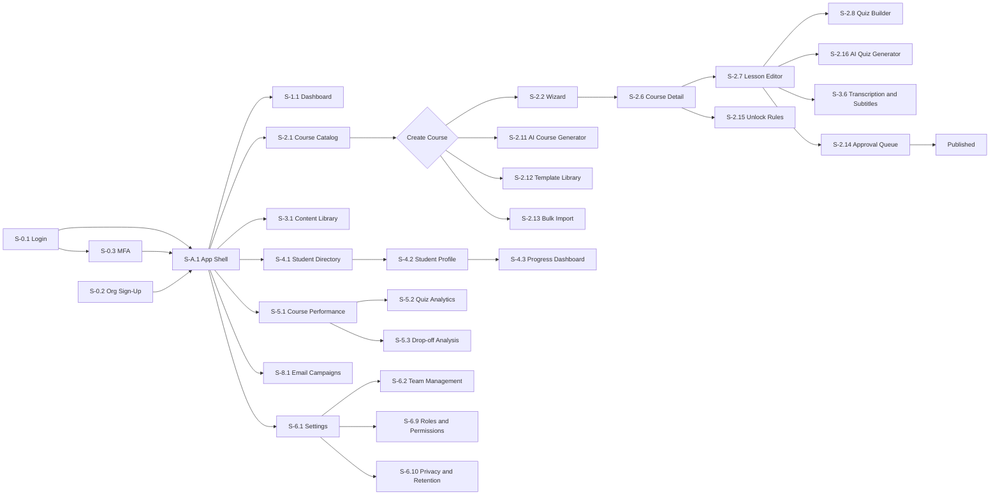

# Global Standards & Design System

> **Abugida Academy — UX Design Specification** · Part 11 of 11 · [↑ Overview & Sitemap](00-Overview-and-Sitemap.md) · [← Marketing & Growth](10-Marketing-and-Growth.md)

## Cross-Cutting UX Considerations

### Reusable Component Library

1.  **Sidebar Navigation ([S-A.1](02-Global-Navigation.md#scr-a-1)):** Fixed left navigation with icons, labels, active state, and collapse toggle.
2.  **Course Card:** Reusable card for course grid with thumbnail, title, description, status pill, and metadata footer.
3.  **Status Pill:** Color-coded status indicator (Published: purple, Draft: orange, Archived: gray, Live: green).
4.  **Module/Lesson List:** Drag-and-drop sortable list with inline editing, expand/collapse, and action buttons.
5.  **Data Table:** Reusable table with sorting, filtering, pagination, and bulk selection.
6.  **Skeleton Loader:** Shimmer effect for loading states across all list/dashboard views.
7.  **Confirmation Dialog ([S-7.1](09-Shared-Components.md#scr-7-1)):** Reusable modal for destructive actions.
8.  **Toast Notifications ([S-7.2](09-Shared-Components.md#scr-7-2)):** Non-blocking feedback with auto-dismiss.
9.  **Empty State Component ([S-7.3](09-Shared-Components.md#scr-7-3)):** Standardized empty states for all modules.
10. **Breadcrumb:** Hierarchical navigation showing current location.
11. **Multi-Step Wizard:** Progress indicator + step navigation for course creation.
12. **Drop Zone:** Drag-and-drop file upload area with progress indicator.
13. **Notification Bell ([S-1.4](03-Dashboard.md#scr-1-4)):** Header icon with unread-count badge and dropdown preview.
14. **Command Palette ([S-7.5](09-Shared-Components.md#scr-7-5)):** ⌘K/Ctrl+K launcher available globally.
15. **File Preview Modal ([S-3.5](05-Content-Library.md#scr-3-5)):** Reusable overlay for video/PDF/image preview.
16. **Permission Matrix Table ([S-6.9](08-Settings.md#scr-6-9)):** Reusable grid of module × capability toggles, also used for custom-role creation.
17. **Rule Builder:** Visual WHEN / AND / THEN builder used in [S-4.8](06-Students.md#scr-4-8) enrollment rules and [S-6.10](08-Settings.md#scr-6-10) retention policies, always paired with a dry-run preview.
18. **AI Prompt Panel ([S-2.11](04-Courses.md#scr-2-11), [S-2.16](04-Courses.md#scr-2-16)):** Prompt input, parameters, streaming output, per-item regenerate, and explicit accept/discard — AI content is always editable and labeled ✨.
19. **Approval Status Stepper ([S-2.14](04-Courses.md#scr-2-14)):** Draft → In Review → Changes Requested → Approved → Published, shown on lesson rows and in the Lesson Editor.
20. **Badge Card ([S-4.7](06-Students.md#scr-4-7)):** Icon, name, trigger, and status pill; renders in management grids and on student profiles.

### Global Validation and Feedback Patterns

- **Real-time Validation:** All forms validate inline with immediate feedback.
- **Auto-save:** Course content autosaves every 60 seconds (draft mode).
- **Unsaved Changes:** Warning dialog on navigation with unsaved changes.
- **Loading States:** Skeleton loaders for all data fetching operations.
- **Success/Error Toasts:** Non-blocking feedback for all user actions.
- **Bulk Actions:** Select mode for table rows with batch operations.
- **Keyboard Shortcuts:** Standard shortcuts (Ctrl+S to save, Ctrl+Z to undo, Ctrl/⌘+K for the [Command Palette](09-Shared-Components.md#scr-7-5)).
- **Dark Mode Support:** UI adapts to system dark/light mode (future).
- **Empty vs. Zero-Result States:** A module with genuinely no records ever created uses [S-7.3](09-Shared-Components.md#scr-7-3) Empty State with a creation CTA; a module with records that a filter/search has excluded uses a lighter "No matches — adjust filters" message with a "Clear filters" action instead of a CTA.
- **AI-Assistance Pattern:** AI output (course drafts, quiz questions, transcripts) always streams into an editable draft state, is labeled ✨, and requires explicit human acceptance before it affects students; per-item regenerate and cancel are available throughout.
- **Optimistic UI:** Low-risk actions (mark as read, reorder, approve) update instantly and roll back with an error toast on failure.
- **Permission-Aware UI:** Actions outside the user's role are hidden entirely ([S-A.1](02-Global-Navigation.md#scr-a-1)); read-only contexts show disabled controls with an explanatory tooltip rather than silent no-ops.

---

## Roles & Permissions Matrix

Every screen's **User Role(s)** field in this document refers back to this matrix. Fine-grained, per-workspace customization of these defaults is available in [S-6.9](08-Settings.md#scr-6-9) Roles & Permissions.

| Module                                                                                                                                            | Admin      | Editor                            | Reviewer                                               | Viewer     | Support                            |
| ------------------------------------------------------------------------------------------------------------------------------------------------- | ---------- | --------------------------------- | ------------------------------------------------------ | ---------- | ---------------------------------- |
| Dashboard & Analytics ([Sec. 1](03-Dashboard.md#section-1-dashboard), [Sec. 5](07-Analytics.md#section-5-analytics--reporting))                   | Full       | Full (Revenue: view only)         | View only                                              | View only  | No revenue access                  |
| Courses ([Sec. 2](04-Courses.md#section-2-course-management-primary-focus))                                                                       | Full       | Create / Edit / Submit for review | Review — approve, request changes, reject (no editing) | View only  | No access                          |
| Content Library ([Sec. 3](05-Content-Library.md#section-3-content-library))                                                                       | Full       | Full                              | View only                                              | View only  | No access                          |
| Students & Cohorts ([Sec. 4](06-Students.md#section-4-student--enrollment-management))                                                            | Full       | Create / Edit                     | View only                                              | View only  | View + Message                     |
| Badges & Enrollment Automation ([S-4.7](06-Students.md#scr-4-7), [S-4.8](06-Students.md#scr-4-8))                                                 | Full       | Full                              | View only                                              | View only  | View only                          |
| Marketing & Growth ([Sec. 8](10-Marketing-and-Growth.md#section-8-marketing--growth))                                                             | Full       | Full (Payout runs: Admin)         | View only                                              | View only  | View only (no send, no financials) |
| Settings — General/Branding/Integrations ([S-6.1](08-Settings.md#scr-6-1), [S-6.3](08-Settings.md#scr-6-3), [S-6.4](08-Settings.md#scr-6-4))      | Full       | No access                         | No access                                              | No access  | No access                          |
| Team, Roles, Security, Billing, API, Privacy ([S-6.2](08-Settings.md#scr-6-2), [S-6.6](08-Settings.md#scr-6-6)–[S-6.10](08-Settings.md#scr-6-10)) | Full       | No access                         | No access                                              | No access  | No access                          |
| My Profile ([S-6.5](08-Settings.md#scr-6-5))                                                                                                      | Own record | Own record                        | Own record                                             | Own record | Own record                         |

**Notes:**

- Roles are workspace-scoped: a user can hold different roles in different workspaces if they belong to more than one.
- "No access" hides the corresponding sidebar item entirely rather than showing a disabled state, per [S-A.1](02-Global-Navigation.md#scr-a-1).
- Custom roles created in [S-6.9](08-Settings.md#scr-6-9) inherit this table as their starting defaults.
- The **Reviewer** role is granted in [S-6.2](08-Settings.md#scr-6-2) Team Management and exists to separate authoring from approval: a Reviewer can approve or reject lessons ([S-2.14](04-Courses.md#scr-2-14)) but cannot author or edit course content.
- Approval gating is configured per course; when enabled, publication is blocked for lessons without an Approved state, regardless of role.

---

## Design System / Tokens

### Design Principles

1. **Clarity over density:** Every screen answers "what do I do next?" within five seconds; secondary metadata is visually muted.
2. **Progressive disclosure:** Advanced controls (unlock rules, workflow settings, API config) live behind explicit affordances, not on the main canvas.
3. **Consistent interaction grammar:** One meaning per color, one pattern per interaction (destructive = red + confirmation; AI-assisted = ✨ + editable draft; money = right-aligned, tabular numerals).
4. **Human-in-the-loop by default:** AI-generated content is always labeled, always editable, and never applied or published silently.

### Color Palette

| Token                  | Hex       | Usage                                                 |
| ---------------------- | --------- | ----------------------------------------------------- |
| `--color-primary`      | `#8b5cf6` | Primary actions, active nav state, links              |
| `--color-primary-dark` | `#6d28d9` | Hover/pressed states, gradients                       |
| `--color-ai-accent`    | `#a855f7` | ✨ AI-assisted surfaces and generated-content markers |
| `--color-bg`           | `#f8fafc` | App background                                        |
| `--color-surface`      | `#ffffff` | Cards, modals, tables                                 |
| `--color-success`      | `#22c55e` | Published/Active/success toasts                       |
| `--color-warning`      | `#f97316` | Draft/warning toasts, at-risk flags                   |
| `--color-danger`       | `#ef4444` | Destructive actions, error toasts                     |
| `--color-info`         | `#3b82f6` | Informational toasts, neutral highlights              |
| `--color-neutral-500`  | `#64748b` | Secondary text, muted metadata                        |
| `--color-archived`     | `#94a3b8` | Archived status, disabled states                      |
| `--color-badge-gold`   | `#f59e0b` | Gamification badges (tier: gold)                      |
| `--color-badge-silver` | `#94a3b8` | Gamification badges (tier: silver)                    |

Status colors are never used alone: every status pill pairs color with a label and icon (e.g. 🟣 Published, 🟠 Draft) so state survives color-vision differences and grayscale printing.

### Typography

| Style   | Font Size  | Weight | Usage                                |
| ------- | ---------- | ------ | ------------------------------------ |
| Display | 28px / 1.2 | 700    | Page titles ("Dashboard", "Courses") |
| Heading | 20px / 1.3 | 600    | Card/section headers, modal titles   |
| Body    | 14px / 1.5 | 400    | Table cells, form labels, body copy  |
| Caption | 12px / 1.4 | 400    | Metadata, timestamps, helper text    |

- Font family: **Inter** (system-ui fallback); tabular numerals (`font-variant-numeric: tabular-nums`) in all metrics, money, and table columns.
- Line lengths in prose-heavy surfaces (lesson preview, email preview) cap at ~75 characters for readability.

### Spacing & Layout

- Base spacing unit: **4px**; component padding in multiples of 8px (8/16/24/32).
- Sidebar width: 240px expanded / 64px collapsed. Header height: 64px.
- Grid gutters: 24px on desktop, 16px on tablet, 12px on mobile.
- Page canvas: 24px outer padding; content blocks separated by 24px, related controls by 8px (proximity = relatedness).

### Radius, Elevation & Layering

- Corner radius: 8px for cards/inputs/buttons, 12px for modals, full-round for pills and avatars.
- Elevation: modals and dropdowns use a 3-step shadow scale (subtle / medium / prominent) instead of borders; cards use surface color + 1px hairline border (no shadow) to keep dense tables calm.
- Z-index scale: content 0 · sticky headers 10 · slide-overs 100 · modals 200 · toasts 300 · command palette 400.

### Motion

- Durations: 120ms (hovers, presses), 200ms (dropdowns, tooltips), 300ms (modals, slide-overs) with `ease-out` entrances and `ease-in` exits.
- Skeleton shimmer and drag-lift animations respect `prefers-reduced-motion` (cross-fade instead of movement).
- Motion never blocks input: all transitions are interruptible.

### Iconography & Focus States

- Icons: single outline family on a 20px grid, 1.5px stroke, always paired with a text label or `aria-label` when used alone.
- Focus ring: 2px `--color-primary` outline with 2px offset on all interactive elements; visible on every surface (light and dark).
- Interactive targets meet a minimum 40×40px hit area on touch devices.

---

## Responsive Breakpoints

| Breakpoint | Width       | Layout Behavior                                                                                                                                                         |
| ---------- | ----------- | ----------------------------------------------------------------------------------------------------------------------------------------------------------------------- |
| Mobile     | < 640px     | Sidebar becomes a slide-out drawer ([S-A.1](02-Global-Navigation.md#scr-a-1)); stat cards and course grid collapse to a single column; tables convert to stacked cards. |
| Tablet     | 640–1024px  | Sidebar collapses to icon-only by default; course grid shows 2 columns; charts stack vertically.                                                                        |
| Desktop    | 1024–1440px | Full sidebar; 3-column course grid; 2-column chart rows as shown in wireframes.                                                                                         |
| Wide       | > 1440px    | Content area gains a max-width (1440px) and centers, rather than stretching charts edge-to-edge.                                                                        |

---

## Accessibility Specification

- **Standard:** Target WCAG 2.2 Level AA across all screens.
- **Keyboard Navigation:** Every interactive element (nav items, table rows, modal controls, drag handles) is reachable and operable via Tab/Shift+Tab and Enter/Space; drag-and-drop lists (e.g. [S-2.6](04-Courses.md#scr-2-6) curriculum builder) expose an equivalent "Move Up / Move Down" keyboard action.
- **Focus Management:** Opening a modal or slide-out (e.g. [S-2.7](04-Courses.md#scr-2-7), [S-7.1](09-Shared-Components.md#scr-7-1)) traps and moves focus to the first field; closing returns focus to the triggering control. The multi-step AI generators ([S-2.11](04-Courses.md#scr-2-11), [S-2.16](04-Courses.md#scr-2-16)) announce generation progress and completion via `aria-live="polite"` regions.
- **Color Contrast:** All text/background pairs meet a minimum 4.5:1 contrast ratio; status is never conveyed by color alone — pills and badges always pair color with a label or icon (e.g. 🟣 Published, 🟠 Draft).
- **Screen Reader Support:** Charts ([S-1.1](03-Dashboard.md#scr-1-1), [S-5.1](07-Analytics.md#scr-5-1), etc.) expose an underlying data table as an accessible alternative; icons without visible text carry `aria-label`s; live-region announcements cover async results (imports finished, campaigns sent, rules dry-run counts).
- **Media Accessibility:** Every video lesson offers editable captions/transcript ([S-3.6](05-Content-Library.md#scr-3-6)); captions are on by default and audio-only states are never the sole channel for instructions.
- **Target Sizes:** Interactive targets meet a minimum 40×40px hit area on touch devices; adjacent targets keep ≥ 8px separation.
- **Motion:** Skeleton shimmer and drag-lift animations respect `prefers-reduced-motion`; no essential information is conveyed through animation alone.
- **Forms:** Every input has a programmatically associated label; validation errors are announced via `aria-live` regions, not color alone; error messages state both what is wrong and how to fix it.

---

## Navigation Flow Diagram

_(Rendered as an interactive diagram where the viewer supports Mermaid; otherwise read as a plain-text flow — arrows indicate the primary "happy path" navigation between screens, not every possible link.)_
