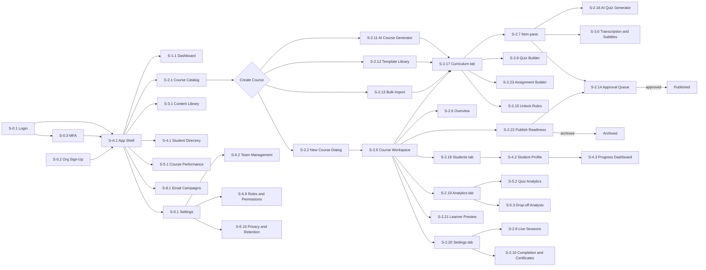

# Global Standards & Design System

> **Abugida Academy — UX Design Specification** · Part 11 of 11 · [↑ Overview & Sitemap](00-Overview-and-Sitemap.md) · [← Marketing & Growth](10-Marketing-and-Growth.md)

## What changed in Part 11 (Revision 2)

- The reusable component library gains the seven components the [Course Workspace](04-Courses.md#the-course-workspace-model) needs (items 22–28 below).
- **Status colours are now defined once**, in a single mapping table covering the course lifecycle, curriculum item review states, and the save-state indicator. Revision 1 described the Published pill as purple in one place and green in another; the mapping table resolves the ambiguity.
- Autosave is specified as a **per-surface** contract, and a new rule requires a dirty buffer to be **flushed before any item, tab, section, or route change**.
- The roles matrix gains the course-lifecycle capabilities introduced by the [Draft → In Review → Published → Archived](04-Courses.md#course-lifecycle) workflow.
- Accessibility gains tree semantics and drag-keyboard parity requirements for the curriculum tree.
- The navigation flow diagram is redrawn around the workspace.

## Cross-Cutting UX Considerations

### Reusable Component Library

1.  **Sidebar Navigation ([S-A.1](02-Global-Navigation.md#scr-a-1)):** Fixed left navigation with icons, labels, active state, and collapse toggle.
2.  **Course Card:** Reusable card for course grid with thumbnail, title, description, status pill, authoring-health line, and metadata footer.
3.  **Status Pill:** Color-coded status indicator. **Colour mapping is defined once** in [Status Colour Mapping](#status-colour-mapping) — never chosen locally.
4.  **Section/Item List:** Legacy description of the two-level sortable list. Superseded by the full [S-7.9](09-Shared-Components.md#scr-7-9) Curriculum Tree in Revision 2.
5.  **Data Table:** Reusable table with sorting, filtering, pagination, and bulk selection.
6.  **Skeleton Loader:** Shimmer effect for loading states across all list/dashboard views.
7.  **Confirmation Dialog ([S-7.1](09-Shared-Components.md#scr-7-1)):** Reusable modal for destructive actions, offering the reversible alternative first.
8.  **Toast Notifications ([S-7.2](09-Shared-Components.md#scr-7-2)):** Non-blocking feedback with auto-dismiss, plus a timed Undo for reversible destructive actions.
9.  **Empty State Component ([S-7.3](09-Shared-Components.md#scr-7-3)):** Standardized empty states for all modules, with a multi-action variant for the curriculum.
10. **Breadcrumb:** Hierarchical navigation showing current location, workspace-aware (`Courses / <course> / <tab>`).
11. **Multi-Step Wizard:** Progress indicator + step navigation. **Retired from the course creation flow** in Revision 2; still used by [S-2.13](04-Courses.md#scr-2-13) Bulk Import and any genuinely finite flow.
12. **Drop Zone:** Drag-and-drop file upload area with progress indicator.
13. **Notification Bell ([S-1.4](03-Dashboard.md#scr-1-4)):** Header icon with unread-count badge and dropdown preview.
14. **Command Palette ([S-7.5](09-Shared-Components.md#scr-7-5)):** ⌘K/Ctrl+K launcher available globally, with course-contextual actions.
15. **File Preview Modal ([S-3.5](05-Content-Library.md#scr-3-5)):** Reusable overlay for video/PDF/image preview.
16. **Permission Matrix Table ([S-6.9](08-Settings.md#scr-6-9)):** Reusable grid of module × capability toggles, also used for custom-role creation.
17. **Rule Builder:** Visual WHEN / AND / THEN builder used in [S-4.8](06-Students.md#scr-4-8) enrollment rules and [S-6.10](08-Settings.md#scr-6-10) retention policies, always paired with a dry-run preview.
18. **AI Prompt Panel ([S-2.11](04-Courses.md#scr-2-11), [S-2.16](04-Courses.md#scr-2-16)):** Prompt input, parameters, streaming output, per-item regenerate, and explicit accept/discard — AI content is always editable and labeled ✨.
19. **Approval Status Stepper ([S-2.14](04-Courses.md#scr-2-14)):** Draft → In Review → Changes Requested → Approved → Published, shown on curriculum rows and in the item pane.
20. **Badge Card ([S-4.7](06-Students.md#scr-4-7)):** Icon, name, trigger, and status pill; renders in management grids and on student profiles.
21. **Rich-Text Authoring Surface ([S-2.7](04-Courses.md#scr-2-7)):** The item editor's content canvas, specified in detail in [Part 12](12-Course-Editor-Markdown-Lessons.md) — rich / split / preview view modes, grouped toolbar, and idle-timer autosave.
22. **Workspace Shell ([S-2.6](04-Courses.md#scr-2-6)) 🆕:** The sticky identity header (title, status pill, lifecycle stepper, lifecycle CTA, `⋯` menu) above a five-destination tab nav with a fixed content region. The shell is a layout, not a page: nothing inside it may navigate away from it.
23. **Lifecycle Stepper 🆕:** `Draft → In Review → Published → Archived` in the workspace identity header. Each reachable step is clickable, labelled, and never colour-only. Defined with the lifecycle in [Part 04](04-Courses.md#course-lifecycle).
24. **Save-State Indicator ([S-7.8](09-Shared-Components.md#scr-7-8)) 🆕:** One component and one state machine for every editing surface — idle, dirty, saving, saved, error, conflict, suspended, offline.
25. **Curriculum Tree ([S-7.9](09-Shared-Components.md#scr-7-9)) 🆕:** The persistent two-level sidebar with `tree` semantics, drag-and-drop plus keyboard-move parity, inline add/rename, filters, and an archived view.
26. **Item Actions Menu ([S-7.10](09-Shared-Components.md#scr-7-10)) 🆕:** The single `⋯` menu for every curriculum row and pane header, with archive ordered before delete and a separated destructive zone.
27. **Publish Readiness Checklist ([S-7.11](09-Shared-Components.md#scr-7-11)) 🆕:** Server-evaluated check list with blocking/advisory grouping and a **Fix** deep link into the field that resolves each failure.
28. **Preview Frame 🆕:** Fixed-width device frame (desktop / tablet / mobile) used by [S-2.21](04-Courses.md#scr-2-21) so a preview never reflows the workspace behind it. A labelled region, not a resized page.

### Global Validation and Feedback Patterns

- **Real-time Validation:** All forms validate inline with immediate feedback.
- **Auto-save (per-surface):** autosave is a contract of the surface, not a global timer. **Content editing** (item body, quiz, course settings text) autosaves **60 seconds after the last edit** — an idle timer, not a wall-clock interval — and flushes on `Ctrl/⌘+S`. **Structural changes** (add, rename, reorder, move, duplicate, archive, delete, toggles) commit **immediately** with optimistic UI and roll back with an error toast. See [Part 12 § 8](12-Course-Editor-Markdown-Lessons.md#8-persistence--state) for the item editor specifically.
- **Save-state:** every editing surface reports state through the [S-7.8](09-Shared-Components.md#scr-7-8) indicator and obeys its behaviour contract. No surface may invent its own "Saving…" string, and the word "Saved" may only appear after the server confirms.
- **Unsaved Changes:** Warning dialog on navigation with unsaved changes. **Context switching flushes first:** changing curriculum item, workspace tab, settings section, or route triggers a save; if that save fails, navigation is blocked with **Retry / Discard / Stay**. A dirty buffer is never discarded silently.
- **Loading States:** Skeleton loaders for all data fetching operations. In a persistent layout a skeleton replaces **only the loading region** — the workspace shell, the tree's selection, and the surrounding navigation stay mounted, so the user is never thrown back to a blank screen.
- **Success/Error Toasts:** Non-blocking feedback for all user actions; errors offer a Retry action and a timed Undo where the action was reversible.
- **Bulk Actions:** Select mode for tables and for the curriculum tree, with batch operations.
- **Keyboard Shortcuts:** Standard shortcuts (`Ctrl+S` save, `Ctrl+Z` undo, `Ctrl/⌘+K` for the [Command Palette](09-Shared-Components.md#scr-7-5)). `Ctrl/⌘+K` must reach the palette from inside the item editor.
- **Dark Mode Support:** UI adapts to system dark/light mode (future).
- **Empty vs. Zero-Result States:** A module with genuinely no records ever created uses the [S-7.3](09-Shared-Components.md#scr-7-3) Empty State with creation actions; a module with records that a filter/search has excluded uses a lighter "No matches — adjust filters" message with a **Clear filters** action instead of a CTA.
- **AI-Assistance Pattern:** AI output (course drafts, quiz questions, transcripts) always streams into an editable draft state, is labeled ✨, and requires explicit human acceptance before it affects students; per-item regenerate and cancel are available throughout.
- **Optimistic UI:** Low-risk actions (mark as read, reorder, approve, archive) update instantly and roll back with an error toast on failure. **The server response is authoritative for order** — after a reorder the client adopts the returned ordering rather than assuming its own.
- **Permission-Aware UI:** Actions outside the user's role are hidden entirely ([S-A.1](02-Global-Navigation.md#scr-a-1)); read-only contexts show disabled controls with an explanatory tooltip rather than silent no-ops. A control that cannot act because of the current state (first item, single-section course, locked for review) states the reason in its tooltip.
- **Gate-with-a-Way-Out:** any blocking readiness check must offer a **Fix** action that reaches the exact field. A blocker the author cannot act on is a report, not a gate.
- **Reversible before irreversible:** destructive actions offer their reversible counterpart first. Archive precedes Delete in menus, in confirmation dialogs, and in archived-item views.

### Status Colour Mapping

Defined once here; components reference it rather than choosing locally. **Status is never conveyed by colour alone** — every pill and badge pairs the colour with a label and an icon.

| Meaning                                       | Token                           | Icon | Label shown             |
| --------------------------------------------- | ------------------------------- | ---- | ----------------------- |
| Published / live / success                    | `--color-success` `#22c55e`     | ✔    | Published               |
| Draft / needs attention / warning             | `--color-warning` `#f97316`     | ●    | Draft, Needs content    |
| In review / pending decision / informational  | `--color-info` `#3b82f6`        | ◐    | In review               |
| Archived / disabled / inactive                | `--color-archived` `#94a3b8`    | 🗄    | Archived                |
| Destructive / error / delete                  | `--color-danger` `#ef4444`      | ✕    | Delete, Save failed     |
| Approved (item review)                        | `--color-success` `#22c55e`     | ✔    | Approved                |
| Changes requested (item review)               | `--color-warning` `#f97316`     | ↻    | Changes requested       |
| Unpublished content inside a published course | `--color-archived` `#94a3b8`    | ◌    | Unpublished             |
| Locked by unlock rules                        | `--color-neutral-500` `#64748b` | 🔒   | Locked                  |
| AI-generated                                  | `--color-ai-accent` `#a855f7`   | ✨   | AI-drafted              |
| Primary action / active nav                   | `--color-primary` `#8b5cf6`     | —    | — (actions, not status) |

> **Resolved ambiguity:** Revision 1 described the Published pill as purple while `--color-success` is green. This table is authoritative: **Published is green (`--color-success`)**; purple is reserved for primary actions and active navigation, never for a status.

---

## Roles & Permissions Matrix

Every screen's **User Role(s)** field in this document refers back to this matrix. Fine-grained, per-workspace customization of these defaults is available in [S-6.9](08-Settings.md#scr-6-9) Roles & Permissions.

| Module                                                                                                                                            | Admin      | Editor                            | Reviewer                                               | Viewer     | Support                            |
| ------------------------------------------------------------------------------------------------------------------------------------------------- | ---------- | --------------------------------- | ------------------------------------------------------ | ---------- | ---------------------------------- |
| Dashboard & Analytics ([Sec. 1](03-Dashboard.md#section-1-dashboard), [Sec. 5](07-Analytics.md#section-5-analytics--reporting))                   | Full       | Full (Revenue: view only)         | View only                                              | View only  | No revenue access                  |
| Courses ([Sec. 2](04-Courses.md#section-2-course-workspace--course-authoring))                                                                    | Full       | Create / Edit / Submit for review | Review — approve, request changes, reject (no editing) | View only  | No access                          |
| Content Library ([Sec. 3](05-Content-Library.md#section-3-content-library))                                                                       | Full       | Full                              | View only                                              | View only  | No access                          |
| Students & Cohorts ([Sec. 4](06-Students.md#section-4-student--enrollment-management))                                                            | Full       | Create / Edit                     | View only                                              | View only  | View + Message                     |
| Badges & Enrollment Automation ([S-4.7](06-Students.md#scr-4-7), [S-4.8](06-Students.md#scr-4-8))                                                 | Full       | Full                              | View only                                              | View only  | View only                          |
| Marketing & Growth ([Sec. 8](10-Marketing-and-Growth.md#section-8-marketing--growth))                                                             | Full       | Full (Payout runs: Admin)         | View only                                              | View only  | View only (no send, no financials) |
| Settings — General/Branding/Integrations ([S-6.1](08-Settings.md#scr-6-1), [S-6.3](08-Settings.md#scr-6-3), [S-6.4](08-Settings.md#scr-6-4))      | Full       | No access                         | No access                                              | No access  | No access                          |
| Team, Roles, Security, Billing, API, Privacy ([S-6.2](08-Settings.md#scr-6-2), [S-6.6](08-Settings.md#scr-6-6)–[S-6.10](08-Settings.md#scr-6-10)) | Full       | No access                         | No access                                              | No access  | No access                          |
| My Profile ([S-6.5](08-Settings.md#scr-6-5))                                                                                                      | Own record | Own record                        | Own record                                             | Own record | Own record                         |

**Notes:**

- Roles are workspace-scoped: a user can hold different roles in different workspaces if they belong to more than one.
- "No access" hides the corresponding sidebar item entirely rather than showing a disabled state, per [S-A.1](02-Global-Navigation.md#scr-a-1).
- Custom roles created in [S-6.9](08-Settings.md#scr-6-9) inherit this table as their starting defaults.
- The **Reviewer** role is granted in [S-6.2](08-Settings.md#scr-6-2) Team Management and exists to separate authoring from approval: a Reviewer can approve or reject curriculum items **and whole courses** ([S-2.14](04-Courses.md#scr-2-14), [S-2.22](04-Courses.md#scr-2-22)) but cannot author or edit course content.
- Approval gating is configured per course; when enabled, publication is blocked for items without an Approved state, regardless of role.

### Course Lifecycle Capabilities 🆕

The course lifecycle ([S-2.22](04-Courses.md#scr-2-22)) introduces capabilities finer-grained than the module rows above. They are toggled individually in [S-6.9](08-Settings.md#scr-6-9) and are why a course's _approval gate_ and _publish permission_ are separate concerns.

| Capability                      | Admin | Editor                          | Reviewer              | Viewer | Notes                                                                           |
| ------------------------------- | ----- | ------------------------------- | --------------------- | ------ | ------------------------------------------------------------------------------- |
| `course.create`                 | ✔     | ✔                               | ✖                     | ✖      |                                                                                 |
| `course.edit_details`           | ✔     | ✔                               | ✖                     | ✖      | Title, description, tags, thumbnail; the slug is editable only while Draft      |
| `course.edit_pricing`           | ✔     | ✔                               | ✖                     | ✖      | Changing price on a live course also requires `course.publish`                  |
| `course.manage_curriculum`      | ✔     | ✔                               | ✖                     | ✖      | Add / rename / reorder / move / duplicate / archive / delete sections and items |
| `course.archive_item`           | ✔     | ✔                               | ✖                     | ✖      | Reversible hide of a single section or item                                     |
| `course.submit_review`          | ✔     | ✔                               | ✖                     | ✖      | Draft → In Review                                                               |
| `course.review`                 | ✔     | ✖ on own work                   | ✔                     | ✖      | A user can never approve a submission they authored                             |
| `course.publish`                | ✔     | Only when the course is ungated | With `course.publish` | ✖      | When `requiresApproval` is on, an Editor cannot self-publish                    |
| `course.unpublish`              | ✔     | ✖                               | ✖                     | ✖      | Admin-only; it removes student access                                           |
| `course.archive` / `restore`    | ✔     | ✖                               | ✖                     | ✖      | Admin-only                                                                      |
| `course.delete`                 | ✔     | ✖                               | ✖                     | ✖      | Admin-only; blocked while issued certificates exist                             |
| `course.duplicate` / `template` | ✔     | ✔                               | ✖                     | ✖      |                                                                                 |
| `assignment.grade`              | ✔     | ✔                               | ✖                     | ✖      | Scoring submissions and releasing feedback                                      |

**Self-approval guard:** a user can never approve a submission they authored. Where a workspace has a single reviewer who authored the change, the queue row reads **"Yours — awaiting another reviewer"** with a Reassign action, rather than failing silently.

---

## Design System / Tokens

### Design Principles

1. **Clarity over density:** Every screen answers "what do I do next?" within five seconds; secondary metadata is visually muted.
2. **Progressive disclosure:** Advanced controls (unlock rules, workflow settings, API config) live behind explicit affordances, not on the main canvas.
3. **Consistent interaction grammar:** One meaning per color, one pattern per interaction (destructive = red + confirmation; AI-assisted = ✨ + editable draft; money = right-aligned, tabular numerals).
4. **Human-in-the-loop by default:** AI-generated content is always labeled, always editable, and never applied or published silently.
5. **Structure and content, side by side (new):** in the Curriculum tab the author never has to choose between seeing the course structure and editing an item. The tree persists beside the pane; a screen that forces that choice is a screen the author will navigate away from.
6. **Reversible before irreversible (new):** anything that can be undone is offered before anything that cannot — in menus, in confirmation dialogs, and in empty states.
7. **A blocker must be actionable (new):** every blocking check, error, and empty state offers the next concrete step. Contacting support is never the only affordance on a problem the user can fix themselves.

### Color Palette

| Token                  | Hex       | Usage                                                 |
| ---------------------- | --------- | ----------------------------------------------------- |
| `--color-primary`      | `#8b5cf6` | Primary actions, active nav state, links              |
| `--color-primary-dark` | `#6d28d9` | Hover/pressed states, gradients                       |
| `--color-ai-accent`    | `#a855f7` | ✨ AI-assisted surfaces and generated-content markers |
| `--color-bg`           | `#f8fafc` | App background                                        |
| `--color-surface`      | `#ffffff` | Cards, modals, tables                                 |
| `--color-success`      | `#22c55e` | Published/Active/success toasts                       |
| `--color-warning`      | `#f97316` | Draft/warning toasts, at-risk flags                   |
| `--color-danger`       | `#ef4444` | Destructive actions, error toasts                     |
| `--color-info`         | `#3b82f6` | Informational toasts, neutral highlights              |
| `--color-neutral-500`  | `#64748b` | Secondary text, muted metadata                        |
| `--color-archived`     | `#94a3b8` | Archived status, disabled states                      |
| `--color-badge-gold`   | `#f59e0b` | Gamification badges (tier: gold)                      |
| `--color-badge-silver` | `#94a3b8` | Gamification badges (tier: silver)                    |

Status colors are never used alone: every status pill pairs color with a label and icon (see [Status Colour Mapping](#status-colour-mapping)) so state survives color-vision differences and grayscale printing.

### Typography

| Style   | Font Size  | Weight | Usage                                |
| ------- | ---------- | ------ | ------------------------------------ |
| Display | 28px / 1.2 | 700    | Page titles ("Dashboard", "Courses") |
| Heading | 20px / 1.3 | 600    | Card/section headers, modal titles   |
| Body    | 14px / 1.5 | 400    | Table cells, form labels, body copy  |
| Caption | 12px / 1.4 | 400    | Metadata, timestamps, helper text    |

- Font family: **Inter** (system-ui fallback); tabular numerals (`font-variant-numeric: tabular-nums`) in all metrics, money, and table columns.
- Line lengths in prose-heavy surfaces (lesson preview, email preview) cap at ~75 characters for readability.

### Spacing & Layout

- Base spacing unit: **4px**; component padding in multiples of 8px (8/16/24/32).
- Sidebar width: 240px expanded / 64px collapsed. Header height: 64px.
- **Curriculum sidebar: 320px**, resizable between 240px and 480px, and collapsible to 0 so the item pane can use the full width on smaller screens. Its width is a user preference, not a screen-specific value.
- **Workspace identity header: 64px** (title row) + **56px** (workspace nav row) = 120px of persistent chrome; both are sticky and never scroll away.
- Grid gutters: 24px on desktop, 16px on tablet, 12px on mobile.
- Page canvas: 24px outer padding; content blocks separated by 24px, related controls by 8px (proximity = relatedness).

### Radius, Elevation & Layering

- Corner radius: 8px for cards/inputs/buttons, 12px for modals, full-round for pills and avatars.
- Elevation: modals and dropdowns use a 3-step shadow scale (subtle / medium / prominent) instead of borders; cards use surface color + 1px hairline border (no shadow) to keep dense tables calm.
- Z-index scale: content 0 · sticky headers 10 · slide-overs 100 · modals 200 · toasts 300 · command palette 400.

### Motion

- Durations: 120ms (hovers, presses), 200ms (dropdowns, tooltips), 300ms (modals, slide-overs) with `ease-out` entrances and `ease-in` exits.
- Skeleton shimmer and drag-lift animations respect `prefers-reduced-motion` (cross-fade instead of movement).
- Motion never blocks input: all transitions are interruptible.

### Iconography & Focus States

- Icons: single outline family on a 20px grid, 1.5px stroke, always paired with a text label or `aria-label` when used alone.
- Focus ring: 2px `--color-primary` outline with 2px offset on all interactive elements; visible on every surface (light and dark).
- Interactive targets meet a minimum 40×40px hit area on touch devices.

---

## Responsive Breakpoints

| Breakpoint | Width       | Layout Behavior                                                                                                                                                                                                                                               |
| ---------- | ----------- | ------------------------------------------------------------------------------------------------------------------------------------------------------------------------------------------------------------------------------------------------------------- |
| Mobile     | < 640px     | Sidebar becomes a slide-out drawer ([S-A.1](02-Global-Navigation.md#scr-a-1)); stat cards and course grid collapse to a single column; tables convert to stacked cards. The workspace nav becomes a horizontally scrollable tab strip.                        |
| Tablet     | 640–1024px  | Sidebar collapses to icon-only by default; course grid shows 2 columns; charts stack vertically. The curriculum sidebar collapses to an overlay, opened by a **Curriculum** button in the workspace header — the tree is never squeezed below a usable width. |
| Desktop    | 1024–1440px | Full sidebar; 3-column course grid; 2-column chart rows. Curriculum sidebar at its 320px default beside the item pane.                                                                                                                                        |
| Wide       | > 1440px    | Content area gains a max-width (1440px) and centers, rather than stretching charts edge-to-edge. The curriculum sidebar may be widened by the user; the item pane still caps at 75 characters of prose.                                                       |

---

## Accessibility Specification

- **Standard:** Target WCAG 2.2 Level AA across all screens.
- **Keyboard Navigation:** Every interactive element (nav items, table rows, modal controls, drag handles) is reachable and operable via Tab/Shift+Tab and Enter/Space.
- **Tree Semantics (new):** the curriculum tree ([S-7.9](09-Shared-Components.md#scr-7-9)) is a single Tab stop using `role="tree"` / `role="treeitem"` with `aria-level`, `aria-expanded`, and `aria-selected`. `↑`/`↓` move between visible rows, `→`/`←` expand and collapse, `Home`/`End` jump to the ends, and type-ahead jumps by title. Selecting a row moves focus to the item pane; returning to the tree restores the previously selected row.
- **Drag-and-Drop Parity (new):** **drag is never the only way to reorder.** Every drag gesture in the curriculum has a menu equivalent — _Move up_, _Move down_, _Move to section_ ([S-7.10](09-Shared-Components.md#scr-7-10)) — and a keyboard drag mode (`Space` to pick up, arrows to move, `Space` to drop, `Esc` to cancel) with a live region announcing every position change. This applies equally to the tree and to quiz question reordering in [S-2.8](04-Courses.md#scr-2-8).
- **Focus Management:** Opening a modal or slide-over (e.g. [S-2.7](04-Courses.md#scr-2-7), [S-7.1](09-Shared-Components.md#scr-7-1)) traps and moves focus to the first field; closing returns focus to the triggering control. The multi-step AI generators ([S-2.11](04-Courses.md#scr-2-11), [S-2.16](04-Courses.md#scr-2-16)) announce generation progress and completion via `aria-live="polite"` regions. **A `Fix` deep link from the [S-7.11](09-Shared-Components.md#scr-7-11) checklist moves focus to the offending field**, not merely to the screen containing it.
- **Save-State Announcements:** the [S-7.8](09-Shared-Components.md#scr-7-8) indicator is a live region: `polite` for saving/saved, `assertive` for error and conflict only.
- **Color Contrast:** All text/background pairs meet a minimum 4.5:1 contrast ratio; status is never conveyed by color alone — pills and badges always pair color with a label or icon (see [Status Colour Mapping](#status-colour-mapping)).
- **Screen Reader Support:** Charts ([S-1.1](03-Dashboard.md#scr-1-1), [S-5.1](07-Analytics.md#scr-5-1), etc.) expose an underlying data table as an accessible alternative; icons without visible text carry `aria-label`s; live-region announcements cover async results (imports finished, campaigns sent, rules dry-run counts, reorders, readiness re-checks).
- **Media Accessibility:** Every video lesson offers editable captions/transcript ([S-3.6](05-Content-Library.md#scr-3-6)); captions are on by default and audio-only states are never the sole channel for instructions. `RC-5` blocks publishing a video item without captions.
- **Target Sizes:** Interactive targets meet a minimum 40×40px hit area on touch devices; adjacent targets keep ≥ 8px separation. Drag handles and row `⋯` menus are at least 32px with a 40px hit area, because a dense tree is where 24px targets quietly break touch use.
- **Motion:** Skeleton shimmer and drag-lift animations respect `prefers-reduced-motion`; no essential information is conveyed through animation alone.
- **Forms:** Every input has a programmatically associated label; validation errors are announced via `aria-live` regions, not color alone; error messages state both what is wrong and how to fix it.

---

## Navigation Flow Diagram

```mermaid
flowchart LR
    Login[S-0.1 Login] --> MFA[S-0.3 MFA]
    Login --> Shell[S-A.1 App Shell]
    MFA --> Shell
    SignUp[S-0.2 Org Sign-Up] --> Shell
    Shell --> Dash[S-1.1 Dashboard]
    Shell --> Courses[S-2.1 Course Catalog]
    Shell --> Library[S-3.1 Content Library]
    Shell --> Students[S-4.1 Student Directory]
    Shell --> Analytics[S-5.1 Course Performance]
    Shell --> Marketing[S-8.1 Email Campaigns]
    Shell --> Settings[S-6.1 Settings]
    Courses --> CreateMenu{Create Course}
    CreateMenu --> NewCourse[S-2.2 New Course Dialog]
    CreateMenu --> AICourse[S-2.11 AI Course Generator]
    CreateMenu --> Templates[S-2.12 Template Library]
    CreateMenu --> Bulk[S-2.13 Bulk Import]
    NewCourse --> WS[S-2.6 Course Workspace]
    AICourse --> Curric[S-2.17 Curriculum tab]
    Templates --> Curric
    Bulk --> Curric
    WS --> Overview[S-2.6 Overview]
    WS --> Curric
    WS --> WStudents[S-2.18 Students tab]
    WS --> WAnalytics[S-2.19 Analytics tab]
    WS --> WSettings[S-2.20 Settings tab]
    Curric --> Item[S-2.7 Item pane]
    Curric --> Quiz[S-2.8 Quiz Builder]
    Curric --> Assign[S-2.23 Assignment Builder]
    Item --> AIQuiz[S-2.16 AI Quiz Generator]
    Item --> Transcribe[S-3.6 Transcription and Subtitles]
    Curric --> Rules[S-2.15 Unlock Rules]
    WS --> Preview[S-2.21 Learner Preview]
    WS --> Publish[S-2.22 Publish Readiness]
    Item --> Submit[S-2.14 Approval Queue]
    Publish --> Submit
    Submit -->|approved| Live[Published]
    Publish -->|archived| Archived[Archived]
    WStudents --> Profile[S-4.2 Student Profile]
    Profile --> Progress[S-4.3 Progress Dashboard]
    WAnalytics --> QuizA[S-5.2 Quiz Analytics]
    WAnalytics --> DropOff[S-5.3 Drop-off Analysis]
    WSettings --> Sessions[S-2.9 Live Sessions]
    WSettings --> Certs[S-2.10 Completion and Certificates]
    Settings --> Team[S-6.2 Team Management]
    Settings --> Roles[S-6.9 Roles and Permissions]
    Settings --> Privacy[S-6.10 Privacy and Retention]
```

_(Rendered as an interactive diagram where the viewer supports Mermaid; otherwise read as a plain-text flow — arrows indicate the primary "happy path" navigation between screens, not every possible link.)_
