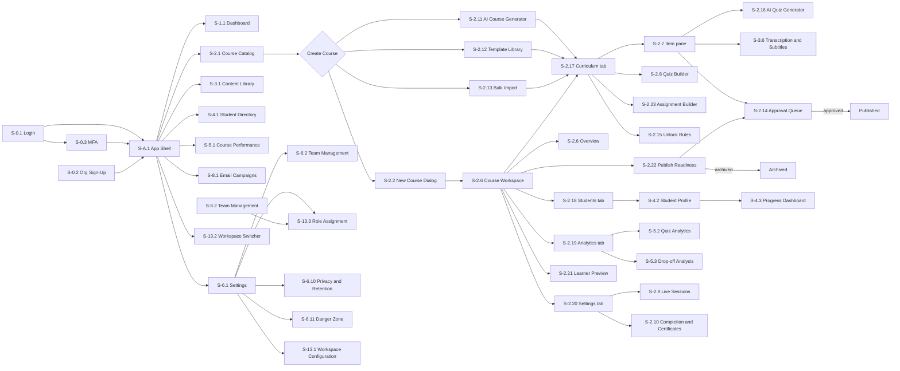

# Global Standards & Design System

> **Abugida Academy — UX Design Specification** · Part 11 of 11 · [↑ Overview & Sitemap](00-Overview-and-Sitemap.md) · [← Marketing & Growth](10-Marketing-and-Growth.md)

## What changed in Part 11 (Revision 3)

- **The palette is now measured and AA-compliant.** Every status is a **fill / text / tint** triple instead of a single hue; the previous values failed 4.5:1 as text and five of them failed even 3:1 as UI. Button and link colour moved from `#8b5cf6` (4.23:1) to `#7c3aed` (5.70:1).
- **Localization & Formatting** (new section) is normative: the Noto Sans Ethiopic stack, `line-height: 1.6` for Ge'ez, per-block `lang`, ETB/USD via `Intl.NumberFormat`, one date/time rule, and an Ethiopian-calendar option.
- **Notification Delivery** (new section) replaces the email assumption throughout: in-app always, Telegram by default, email optional and disabled-with-reason.
- **Resilience States** (new section) makes 403 / offline / session-expiry / conflict / partial-failure a required block on all 73 screens.
- **Success Criteria & Instrumentation** (new section) makes events, acceptance criteria, and performance budgets part of the spec format.
- Typography becomes script-aware; the "dark mode" claim is corrected; the legacy two-level list entry is deleted; `finance.view_revenue` and full Support coverage are added to the capability list.

## What changed in Part 11 (Revision 2)

- The reusable component library gains the seven components the [Course Workspace](04-Courses.md#the-course-workspace-model) needs (items 22–28 below).
- **Status colours are now defined once**, in a single mapping table covering the course lifecycle, curriculum item review states, and the save-state indicator. Revision 1 described the Published pill as purple in one place and green in another; the mapping table resolves the ambiguity.
- Autosave is specified as a **per-surface** contract, and a new rule requires a dirty buffer to be **flushed before any item, tab, section, or route change**.
- The roles matrix gains the course-lifecycle capabilities introduced by the [Draft → In Review → Published → Archived](04-Courses.md#course-lifecycle) workflow.
- Accessibility gains tree semantics and drag-keyboard parity requirements for the curriculum tree.
- The navigation flow diagram is redrawn around the workspace.

## Cross-Cutting UX Considerations

### Reusable Component Library

1.  **Sidebar Navigation ([S-A.1](02-Global-Navigation.md#scr-a-1)):** Fixed left navigation with icons, labels, active state, and collapse toggle.
2.  **Course Card:** Reusable card for course grid with thumbnail, title, description, status pill, authoring-health line, and metadata footer.
3.  **Status Pill:** Color-coded status indicator. **Colour mapping is defined once** in [Status Colour Mapping](#status-colour-mapping) — never chosen locally. Rendered as a fill + text + tint triple, never as coloured text alone.
4.  **Data Table:** Reusable table with sorting, filtering, pagination, and bulk selection. Specified as [S-7.12](09-Shared-Components.md#scr-7-12).
5.  **Skeleton Loader:** Shimmer effect for loading states across all list/dashboard views.
6.  **Confirmation Dialog ([S-7.1](09-Shared-Components.md#scr-7-1)):** Reusable modal for destructive actions, offering the reversible alternative first. Also hosts the **Unsaved Changes** variant.
7.  **Toast Notifications ([S-7.2](09-Shared-Components.md#scr-7-2)):** Non-blocking feedback with auto-dismiss, plus a timed Undo for reversible destructive actions.
8.  **Empty State Component ([S-7.3](09-Shared-Components.md#scr-7-3)):** Standardized empty states for all modules, with a multi-action variant for the curriculum.
9.  **Breadcrumb:** Hierarchical navigation showing current location, workspace-aware (`Courses / <course> / <tab>`).
10. **Multi-Step Wizard:** Progress indicator + step navigation. **Retired from the course creation flow** in Revision 2; still used by [S-2.13](04-Courses.md#scr-2-13) Bulk Import and any genuinely finite flow.
11. **Drop Zone:** Drag-and-drop file upload area with progress indicator. Specified as [S-7.12](09-Shared-Components.md#scr-7-12) with resumable upload.
12. **Notification Bell ([S-1.4](03-Dashboard.md#scr-1-4)):** Header icon with unread-count badge and dropdown preview.
13. **Command Palette ([S-7.5](09-Shared-Components.md#scr-7-5)):** ⌘K/Ctrl+K launcher available globally, with course-contextual actions.
14. **File Preview Modal ([S-3.5](05-Content-Library.md#scr-3-5)):** Reusable overlay for video/PDF/image preview.
15. **Permission Matrix Table ([S-6.9](08-Settings.md#scr-6-9)):** Reusable grid of module × capability toggles, also used for custom-role creation.
16. **Rule Builder:** Visual WHEN / AND / THEN builder used in [S-4.8](06-Students.md#scr-4-8) enrollment rules and [S-6.10](08-Settings.md#scr-6-10) retention policies, always paired with a dry-run preview.
17. **AI Prompt Panel ([S-2.11](04-Courses.md#scr-2-11), [S-2.16](04-Courses.md#scr-2-16)):** Prompt input, parameters, streaming output, per-item regenerate, and explicit accept/discard — AI content is always editable and labeled ✨.
18. **Approval Status Stepper ([S-2.14](04-Courses.md#scr-2-14)):** Draft → In Review → Changes Requested → Approved → Published, shown on curriculum rows and in the item pane.
19. **Badge Card ([S-4.7](06-Students.md#scr-4-7)):** Icon, name, trigger, and status pill; renders in management grids and on student profiles.
20. **Rich-Text Authoring Surface ([S-2.7](04-Courses.md#scr-2-7)):** The item editor's content canvas, specified in detail in [Part 12](12-Course-Editor-Markdown-Lessons.md) — rich / split / preview view modes, grouped toolbar, and idle-timer autosave.
21. **Workspace Shell ([S-2.6](04-Courses.md#scr-2-6)) 🆕:** The sticky identity header (title, status pill, lifecycle stepper, lifecycle CTA, `⋯` menu) above a five-destination tab nav with a fixed content region. The shell is a layout, not a page: nothing inside it may navigate away from it.
22. **Lifecycle Stepper 🆕:** `Draft → In Review → Approved → Published → Archived` in the workspace identity header. Each reachable step is clickable, labelled, and never colour-only. Defined with the lifecycle in [Part 04](04-Courses.md#course-lifecycle).
23. **Save-State Indicator ([S-7.8](09-Shared-Components.md#scr-7-8)) 🆕:** One component and one state machine for every editing surface — idle, dirty, saving, saved, error, conflict, suspended, offline.
24. **Curriculum Tree ([S-7.9](09-Shared-Components.md#scr-7-9)) 🆕:** The persistent two-level sidebar with `tree` semantics, drag-and-drop plus keyboard-move parity, inline add/rename, filters, and an archived view.
25. **Item Actions Menu ([S-7.10](09-Shared-Components.md#scr-7-10)) 🆕:** The single `⋯` menu for every curriculum row and pane header, with archive ordered before delete and a separated destructive zone.
26. **Publish Readiness Checklist ([S-7.11](09-Shared-Components.md#scr-7-11)) 🆕:** Server-evaluated check list with blocking/advisory grouping and a **Fix** deep link into the field that resolves each failure.
27. **Preview Frame 🆕:** Fixed-width device frame (desktop / tablet / mobile) used by [S-2.21](04-Courses.md#scr-2-21) so a preview never reflows the workspace behind it. A labelled region, not a resized page.
28. **Form & Data Primitives ([S-7.12](09-Shared-Components.md#scr-7-12)) 🆕:** Input, Select, Combobox, MultiSelect, DateTimePicker, Tabs, DataTable, Pagination, Skeleton, CopyButton, StatusPill, Avatar, Money, and DropZone — the cross-cutting controls every module depends on.

> **This list is an index, not a second source of truth.** Where a component is defined in [Part 09](09-Shared-Components.md), that definition governs. Components owned elsewhere: Notifications drawer [S-1.4](03-Dashboard.md#scr-1-4), breadcrumb [S-A.1](02-Global-Navigation.md#scr-a-1), workspace shell [S-2.6](04-Courses.md#scr-2-6), preview frame [S-2.21](04-Courses.md#scr-2-21).

### Global Validation and Feedback Patterns

- **Real-time Validation:** All forms validate inline with immediate feedback.
- **Auto-save (per-surface):** autosave is a contract of the surface, not a global timer. **Content editing** (item body, quiz, course settings text) autosaves **60 seconds after the last edit** — an idle timer, not a wall-clock interval — and flushes on `Ctrl/⌘+S`. **Structural changes** (add, rename, reorder, move, duplicate, archive, delete, toggles) commit **immediately** with optimistic UI and roll back with an error toast. See [Part 12 § 8](12-Course-Editor-Markdown-Lessons.md#8-persistence--state) for the item editor specifically.
- **Save-state:** every editing surface reports state through the [S-7.8](09-Shared-Components.md#scr-7-8) indicator and obeys its behaviour contract. No surface may invent its own "Saving…" string, and the word "Saved" may only appear after the server confirms.
- **Unsaved Changes:** Warning dialog on navigation with unsaved changes. **Context switching flushes first:** changing curriculum item, workspace tab, settings section, or route triggers a save; if that save fails, navigation is blocked with **Retry / Discard / Stay**. A dirty buffer is never discarded silently.
- **Loading States:** Skeleton loaders for all data fetching operations. In a persistent layout a skeleton replaces **only the loading region** — the workspace shell, the tree's selection, and the surrounding navigation stay mounted, so the user is never thrown back to a blank screen.
- **Success/Error Toasts:** Non-blocking feedback for all user actions; errors offer a Retry action and a timed Undo where the action was reversible.
- **Bulk Actions:** Select mode for tables and for the curriculum tree, with batch operations.
- **Keyboard Shortcuts:** The authoritative table, with separate macOS and Windows/Linux columns, lives in [Part 09 § Keyboard Shortcuts](09-Shared-Components.md#keyboard-shortcuts). `Ctrl/⌘+S` flushes the dirty buffer, `Ctrl/⌘+Z` undoes, `Ctrl/⌘+K` opens the [Command Palette](09-Shared-Components.md#scr-7-5), and `⌘K` must reach the palette from inside the item editor. Every shortcut has a visible, labelled control equivalent — a shortcut is never the only route to an action.
- **Dark Mode:** deferred. The shell defines dark **sidebar** tokens now (the sidebar ships dark in Revision 2); a full dark theme is not in scope, and no component may claim dark support it does not have. Focus rings are defined once on light surfaces and reused unchanged when dark tokens land.
- **Empty vs. Zero-Result States:** A module with genuinely no records ever created uses the [S-7.3](09-Shared-Components.md#scr-7-3) Empty State with creation actions; a module with records that a filter/search has excluded uses a lighter "No matches — adjust filters" message with a **Clear filters** action instead of a CTA.
- **AI-Assistance Pattern:** AI output (course drafts, quiz questions, transcripts) always streams into an editable draft state, is labeled ✨, and requires explicit human acceptance before it affects students; per-item regenerate and cancel are available throughout.
- **Optimistic UI:** Low-risk actions (mark as read, reorder, approve, archive) update instantly and roll back with an error toast on failure. **The server response is authoritative for order** — after a reorder the client adopts the returned ordering rather than assuming its own.
- **Permission-Aware UI — three distinct cases, not interchangeable:**
  - **Out of capability** → the control is **absent** entirely ([S-A.1](02-Global-Navigation.md#scr-a-1)).
  - **Capable but blocked by current state** (review lock, archived, first item, single-section course, seat capacity) → **disabled with a reason**, exposed in a tooltip _and_ in `aria-describedby`. Never a silent no-op.
  - **Whole surface locked** → replaced with an explanation of what locked it and how to unlock it.
- **Gate-with-a-Way-Out:** any blocking readiness check must offer a **Fix** action that reaches the exact field. A blocker the author cannot act on is a report, not a gate.
- **Reversible before irreversible:** destructive actions offer their reversible counterpart first. Archive precedes Delete in menus, in confirmation dialogs, and in archived-item views.
- **Delivery:** every outbound message follows [Notification Delivery](#notification-delivery). No surface may assume an email address exists.
- **Resilience:** every screen ships the states in [Resilience States](#resilience-states). They are part of the screen definition, not an implementation detail.
- **Dates, times, money, and text:** every surface follows [Localization & Formatting](#localization--formatting). There are no per-screen format exceptions.
- **Measurability:** every screen ships [Success Criteria & Instrumentation](#success-criteria--instrumentation) — events, binary acceptance criteria, and performance budgets.

---

### Notification Delivery

Sign-in is Google or Telegram only. **A user authenticated by Telegram may have no email address at all.** No screen may assume one.

| Rule                 | Behaviour                                                                                                                                    |
| -------------------- | -------------------------------------------------------------------------------------------------------------------------------------------- |
| **In-app**           | Always on, not user-disableable. Every notification and every system message is written to the in-app feed first.                            |
| **Telegram**         | The default secondary channel. Shown in [S-6.1](08-Settings.md#scr-6-1) with the linked handle: _"Your Telegram is linked as @handle."_      |
| **Email**            | Optional. Where no verified address exists the control is **disabled with the reason** _"No verified email on this account"_ — never hidden. |
| **Delivery failure** | Any surface that cannot reach a recipient states it: _"{name} has no email on file — sent in-app and via Telegram."_                         |
| **Bulk send**        | The confirmation shows the per-channel breakdown: _"1,204 recipients — 1,204 in-app · 1,180 Telegram · 610 email (594 have no email)."_      |

**Where this replaces "email":** team invites, student invites, data-export downloads, billing receipts, consent records, retention warnings, review requests, publish results, session reminders, and every campaign in [S-8.1](10-Marketing-and-Growth.md#scr-8-1). Each of these ships a **Telegram-safe** path:

- **Invites** ([S-6.2](08-Settings.md#scr-6-2), [S-4.1](06-Students.md#scr-4-1)) → a **claimable link** (`/invite/:token`, single-use, 7-day expiry) **or an 8-character code**, shared over any channel the inviter chooses. The invitee's own name is captured after sign-in; it is never collected from the inviter.
- **Data export** ([S-6.10](08-Settings.md#scr-6-10), [S-6.11](08-Settings.md#scr-6-11)) → retrievable **in-app behind re-authentication** at `/settings/privacy/requests/:id/download`, with a 7-day expiry. The Danger Zone's _Export workspace data_ is the same artefact produced on demand; both routes emit the identical download. An emailed copy is an additional convenience, never the only route.
- **Account-linking errors** ([S-0.1](01-Authentication-and-Onboarding.md#scr-0-1)) → describe the **provider identity**, not the email address. _"You signed in with an account that isn't linked to an invitation. Sign in with the account the invitation was issued to, or request a new one."_

---

### Resilience States

Required on **every** screen, in addition to its own States list. They were previously absent from 73 of 73 screens.

| State               | Required behaviour                                                                                                                                                                      |
| ------------------- | --------------------------------------------------------------------------------------------------------------------------------------------------------------------------------------- |
| **Forbidden (403)** | A dedicated page, never a silent empty list. Message names the resource: _"You don't have access to {course}."_ Plus a request ID and **Ask an Admin for access**.                      |
| **Not found (404)** | _"This course was deleted, or you followed an old link."_ Offers **Back to {module}** and a request ID. Retired screen IDs are never reused, so a 404 here usually means a hard delete. |
| **Offline**         | A persistent banner, not a toast. Reads queue per the autosave contract; the surface renders **read-only** until reconnection with an inline count: _"3 changes waiting to sync."_      |
| **Reconnected**     | Queued writes flush in order. A queued write whose `rowVersion` is now stale resolves to **Conflict**, never a silent overwrite.                                                        |
| **Session expired** | A 2-minute warning modal before expiry, listing the surfaces with unsaved work. On expiry the buffer is preserved and the user returns to the same screen.                              |
| **Conflict**        | `rowVersion` mismatch → _"Changed by {actor} {N} minutes ago."_ Actions: **Review changes / Keep mine / Take theirs**. Never Reload-only.                                               |
| **Partial failure** | A field-level error with the rest of the section saved: _"Saved 8 of 9 fields. Discount limit was rejected — see below."_                                                               |
| **Server error**    | A retry affordance with a request ID, stated in the voice pattern (_"We couldn't load … your work is safe."_), never a bare _"Retry?"_ with no context.                                 |

> **Rule:** an error a user can fix themselves must state the fix. Contacting support is never the only affordance on a problem the user can resolve.

**Which states apply to which surface.** Not every state is meaningful everywhere, and a component should not grow a fictional state to satisfy a checklist.

| Surface type                   | Loading | Empty | Error | Examples                                                                               |
| ------------------------------ | ------- | ----- | ----- | -------------------------------------------------------------------------------------- |
| **Data list / table / grid**   | ✔       | ✔     | ✔     | S-2.1 catalog, S-4.1 students, S-6.2 team, S-8.3 coupons                               |
| **Record detail**              | ✔       | ✔     | ✔     | S-3.3 asset, S-4.2 student, S-4.3 progress                                             |
| **Editor / authoring surface** | ✔       | ✔     | ✔     | S-2.7 lesson, S-2.8 quiz — "empty" means _no content yet_, with the creation path      |
| **Settings section**           | ✔       | n/a   | ✔     | S-6.x — a form is never "empty"; it is pre-filled or unset                             |
| **Modal / dialog**             | ✔       | n/a   | ✔     | S-7.1, S-7.7 — a dialog has no empty state                                             |
| **Transient component**        | n/a     | n/a   | ✔     | S-7.2 toast, S-7.8 save indicator, S-7.10 menu — these _are_ the loading/error surface |
| **Auth screen**                | ✔       | n/a   | ✔     | S-0.1 – S-0.4 — there is no collection to be empty                                     |

An "empty" state must distinguish **true empty** (nothing ever created → offer a creation path) from **zero-result** (a filter excluded records → offer _Clear filters_), per [Global Validation and Feedback Patterns](#global-validation-and-feedback-patterns).

---

### Localization & Formatting

The product is named for the Ethiopic abugida. These are normative, not optional, and there are **no per-screen format exceptions**.

| Area               | Rule                                                                                                                                                                                                                                         |
| ------------------ | -------------------------------------------------------------------------------------------------------------------------------------------------------------------------------------------------------------------------------------------- |
| **Script**         | Ge'ez is **left-to-right**. `dir="ltr"` is the document default; no RTL work is required or planned.                                                                                                                                         |
| **UI language**    | All strings externalized. English and Amharic at launch. A per-user language preference lives in [S-6.5](08-Settings.md#scr-6-5); the workspace default lives in [S-6.1](08-Settings.md#scr-6-1).                                            |
| **Font stack**     | `Inter, "Noto Sans Ethiopic", system-ui, sans-serif` — loaded as a subset with `font-display: swap`. A Ge'ez glyph-coverage test runs in CI.                                                                                                 |
| **Line height**    | **1.6** when content language is `am` / `ti` / `gez`, 1.5 otherwise, switched by a `:lang()`-derived class from the content's language field — not a global constant.                                                                        |
| **Letter spacing** | `normal` on all Ethiopic text. No tracking, ever.                                                                                                                                                                                            |
| **Truncation**     | **No fixed-px line clamps and no fixed-height text nodes anywhere.** Growth of 30–40% must not clip. The full value is always available on hover and as the accessible name.                                                                 |
| **Inline `lang`**  | A `lang` attribute is a first-class authoring feature on any text run. Mixed-direction content renders inside a `dir="auto"` container. A missing `lang` is an **advisory** readiness check, never a save error.                             |
| **Money**          | `Intl.NumberFormat` in the workspace locale. The **currency code is always visible** (`ETB 1,240.00`), including when the symbol is not. ETB and USD are supported, per-course. Telebirr and bank-transfer amounts render with their status. |
| **Times**          | All times display in `Africa/Addis_Ababa` with the UTC offset in a tooltip, **24-hour with a 12-hour suffix**: `6:00 PM EAT`. Never `2026-09-12 23:59 EAT`, never a bare `09:00`.                                                            |
| **Relative time**  | Governed by the **personal** timezone, not the workspace's: _"2 hours ago"_, _"today"_, _"yesterday"_. The audit log and every export use absolute ISO-8601 with offset — never relative time.                                               |
| **Calendar**       | A per-user **Gregorian / Ethiopian** calendar toggle applies to every date surface, always with an unambiguous Gregorian fallback in exports, the audit log, and certificates.                                                               |
| **Names**          | One word, Ge'ez script, or long patronymic chains are all valid. Forms never require a first/last split, and no name field truncates below 40 characters.                                                                                    |
| **Read time**      | `ceil(wordCount / 180)` for `am`/`ti`/`gez`, `/ 220` otherwise, computed from the same text the renderer uses. Both constants are named and unit-tested.                                                                                     |
| **Search**         | Catalog, tree, and global search tokenize Ge'ez as **2-syllable n-grams** so inflected forms match: `እንግሊዝ` matches `እንግሊዝኛ`. Matches are highlighted in card titles and tree rows.                                                          |
| **Expansion**      | No fixed-width buttons or single-line label clamps. Icons and labels use hugeicons; emoji are not UI icons.                                                                                                                                  |

---

### Success Criteria & Instrumentation

The spec is a build contract, so every screen states how it is measured. Added per screen, in the format: `**Instrumentation & acceptance:**`

- **Events** — name plus properties, carrying IDs and counts only. **No PII and no authored content in event properties.**
- **Acceptance criteria** — 3–5 binary statements a tester can fail.
- **Budgets** — render, interaction, and payload targets.

| Surface               | Budget                                                                                                                    |
| --------------------- | ------------------------------------------------------------------------------------------------------------------------- |
| Course catalog        | 25-row pages, server-side sort past 100 rows, first paint < 1.5 s                                                         |
| Curriculum tree       | 200 items interactive in < 500 ms; keyboard move applies in < 200 ms                                                      |
| Publish readiness     | Server-evaluated in < 1 s; re-check streams the verdict change                                                            |
| Item editor           | 200k-character lesson hydrates < 1.5 s; Rich→Source sync ≤ 50 ms at 50k; INP < 200 ms                                     |
| Dashboard / analytics | LCP < 2.5 s; a chart's accessible data table renders on demand, not on load                                               |
| Uploads               | Progress starts within 1 s of the file being dropped; resume continues from the last byte                                 |
| Settings              | A section paints its skeleton < 500 ms; a save round-trip resolves in < 1 s; switching sections flushes before the switch |

Product-level success measures: course-creation completion rate, review turnaround, publish-blocked rate, and support tickets. Each is fed by the per-screen events above.

---

### Status Colour Mapping

Defined once here; components reference it rather than choosing locally. **Status is never conveyed by colour alone** — every pill and badge pairs the colour with a label and an icon.

Each status is a **fill / text / tint** triple, never a single hue. The **text** token is what appears as the label or the icon on the **tint** background; the **fill** token is used for chart marks and large UI, where the 3:1 bar applies. Every text token clears 4.5:1 on its tint.

| Meaning                                       | Text token (label + icon)         | Tint (pill background)            | Fill (chart, large UI) | Icon | Label shown             |
| --------------------------------------------- | --------------------------------- | --------------------------------- | ---------------------- | ---- | ----------------------- |
| Published / live / success                    | `--color-success-text` `#166534`  | `--color-success-tint` `#dcfce7`  | `#15803d`              | ✔    | Published               |
| Draft / needs attention / warning             | `--color-warning-text` `#9a3412`  | `--color-warning-tint` `#fef3c7`  | `#b45309`              | ●    | Draft, Needs content    |
| In review / pending decision / informational  | `--color-info-text` `#1d4ed8`     | `--color-info-tint` `#dbeafe`     | `#1d4ed8`              | ◐    | In review               |
| Archived / disabled / inactive                | `--color-archived-text` `#475569` | `--color-archived-tint` `#f1f5f9` | `#64748b`              | 🗄    | Archived                |
| Destructive / error / delete                  | `--color-danger-text` `#b91c1c`   | `--color-danger-tint` `#fee2e2`   | `#b91c1c`              | ✕    | Delete, Save failed     |
| Approved (item review)                        | `--color-success-text` `#166534`  | `--color-success-tint` `#dcfce7`  | `#15803d`              | ✔    | Approved                |
| Changes requested (item review)               | `--color-warning-text` `#9a3412`  | `--color-warning-tint` `#fef3c7`  | `#b45309`              | ↻    | Changes requested       |
| Unpublished content inside a published course | `--color-archived-text` `#475569` | `--color-archived-tint` `#f1f5f9` | `#64748b`              | ◌    | Unpublished             |
| Locked by unlock rules                        | `--color-neutral-500` `#475569`   | `--color-archived-tint` `#f1f5f9` | `#64748b`              | 🔒   | Locked                  |
| AI-generated                                  | `--color-ai-text` `#7e22ce`       | `--color-ai-tint` `#f3e8ff`       | `#a855f7`              | ✨   | AI-drafted              |
| Primary action / active nav                   | `--color-primary` `#7c3aed`       | `--color-primary-tint` `#ede9fe`  | `#7c3aed`              | —    | — (actions, not status) |

A **status pill** is: tint background · text token for the label · fill token for the icon · 1px hairline. In grayscale the fill collapses to a pale tone, so the **icon and label carry the meaning** — colour is redundant by design.

> **Resolved ambiguities:**
>
> 1. Revision 1 described the Published pill as purple while the palette is green. **Published is green; purple is reserved for primary actions, links, and active navigation, never for a status.**
> 2. Revision 1 used single hues as text. `#22c55e` measured **2.28:1** on white and `#f59e0b` **2.15:1** — both below even the 3:1 UI floor. The text tokens above replace them.
> 3. `--color-primary` moved `#8b5cf6` → `#7c3aed` for buttons, links, and active nav, because white on `#8b5cf6` measured **4.23:1**, below the 4.5:1 text bar. `#8b5cf6` is retained only for the focus ring, large UI, and chart marks, where 3:1 applies.

---

## Roles & Permissions Matrix

Every screen's **User Role(s)** field in this document refers back to this matrix. Fine-grained, per-workspace customization of these defaults is available in [S-6.9](08-Settings.md#scr-6-9) Roles & Permissions.

| Module                                                                                                                                                         | Admin      | Editor                            | Reviewer                                               | Viewer     | Support                            |
| -------------------------------------------------------------------------------------------------------------------------------------------------------------- | ---------- | --------------------------------- | ------------------------------------------------------ | ---------- | ---------------------------------- |
| Dashboard & Analytics ([Sec. 1](03-Dashboard.md#section-1-dashboard), [Sec. 5](07-Analytics.md#section-5-analytics--reporting))                                | Full       | Full (Revenue: view only)         | View only                                              | View only  | No revenue access                  |
| Courses ([Sec. 2](04-Courses.md#section-2-course-workspace--course-authoring))                                                                                 | Full       | Create / Edit / Submit for review | Review — approve, request changes, reject (no editing) | View only  | No access                          |
| Content Library ([Sec. 3](05-Content-Library.md#section-3-content-library))                                                                                    | Full       | Full                              | View only                                              | View only  | No access                          |
| Students & Cohorts ([Sec. 4](06-Students.md#section-4-student--enrollment-management))                                                                         | Full       | Create / Edit                     | View only                                              | View only  | View + Message                     |
| Badges & Enrollment Automation ([S-4.7](06-Students.md#scr-4-7), [S-4.8](06-Students.md#scr-4-8))                                                              | Full       | Full                              | View only                                              | View only  | View only                          |
| Marketing & Growth ([Sec. 8](10-Marketing-and-Growth.md#section-8-marketing--growth))                                                                          | Full       | Full (Payout runs: Admin)         | View only                                              | View only  | View only (no send, no financials) |
| Settings — General/Branding/Integrations ([S-6.1](08-Settings.md#scr-6-1), [S-6.3](08-Settings.md#scr-6-3), [S-6.4](08-Settings.md#scr-6-4))                   | Full       | No access                         | No access                                              | No access  | No access                          |
| Team, Roles, Security, Billing, API, Privacy, Danger Zone ([S-6.2](08-Settings.md#scr-6-2), [S-6.6](08-Settings.md#scr-6-6)–[S-6.11](08-Settings.md#scr-6-11)) | Full       | No access                         | No access                                              | No access  | No access                          |
| My Profile ([S-6.5](08-Settings.md#scr-6-5))                                                                                                                   | Own record | Own record                        | Own record                                             | Own record | Own record                         |

**Notes:**

- Roles are workspace-scoped: a user can hold different roles in different workspaces if they belong to more than one.
- "No access" hides the corresponding sidebar item entirely rather than showing a disabled state, per [S-A.1](02-Global-Navigation.md#scr-a-1).
- Custom roles created in [S-6.9](08-Settings.md#scr-6-9) inherit this table as their starting defaults.
- The **Reviewer** role is granted in [S-6.2](08-Settings.md#scr-6-2) Team Management and exists to separate authoring from approval: a Reviewer can approve or reject curriculum items **and whole courses** ([S-2.14](04-Courses.md#scr-2-14), [S-2.22](04-Courses.md#scr-2-22)) but cannot author or edit course content.
- Approval gating is configured per course; when enabled, publication is blocked for items without an Approved state, regardless of role.

### Course Lifecycle Capabilities 🆕

The course lifecycle ([S-2.22](04-Courses.md#scr-2-22)) introduces capabilities finer-grained than the module rows above. They are toggled individually in [S-6.9](08-Settings.md#scr-6-9) and are why a course's _approval gate_ and _publish permission_ are separate concerns.

| Capability                      | Admin | Editor                          | Reviewer              | Viewer | Notes                                                                             |
| ------------------------------- | ----- | ------------------------------- | --------------------- | ------ | --------------------------------------------------------------------------------- |
| `course.create`                 | ✔     | ✔                               | ✖                     | ✖      |                                                                                   |
| `course.edit_details`           | ✔     | ✔                               | ✖                     | ✖      | Title, description, tags, thumbnail; the slug is editable only while Draft        |
| `course.edit_pricing`           | ✔     | ✔                               | ✖                     | ✖      | Changing price on a live course also requires `course.publish`                    |
| `course.manage_curriculum`      | ✔     | ✔                               | ✖                     | ✖      | Add / rename / reorder / move / duplicate / archive / delete sections and items   |
| `course.archive_item`           | ✔     | ✔                               | ✖                     | ✖      | Reversible hide of a single section or item                                       |
| `course.submit_review`          | ✔     | ✔                               | ✖                     | ✖      | Draft → In Review                                                                 |
| `course.review`                 | ✔     | ✖ on own work                   | ✔                     | ✖      | A user can never approve a submission they authored                               |
| `course.publish`                | ✔     | Only when the course is ungated | With `course.publish` | ✖      | When `requiresApproval` is on, an Editor cannot self-publish                      |
| `course.unpublish`              | ✔     | ✖                               | ✖                     | ✖      | Admin-only; it removes student access                                             |
| `course.archive` / `restore`    | ✔     | ✖                               | ✖                     | ✖      | Admin-only                                                                        |
| `course.delete`                 | ✔     | ✖                               | ✖                     | ✖      | Admin-only; blocked while issued certificates exist                               |
| `course.duplicate` / `template` | ✔     | ✔                               | ✖                     | ✖      |                                                                                   |
| `assignment.grade`              | ✔     | ✔                               | ✖                     | ✖      | Scoring submissions and releasing feedback                                        |
| `finance.view_revenue`          | ✔     | ✔ (view only)                   | ✖                     | ✖      | **Server-side redaction.** Absent from the payload for Support, not hidden by CSS |
| `students.read`                 | ✔     | ✔                               | ✖                     | ✖      | Also gates search recents, exports, and the command palette                       |

**Support role — full coverage.** Support has no course-authoring access at all. The previous matrix left Support ambiguous on three rows, which is why [S-1.1](03-Dashboard.md#scr-1-1) and [S-2.18](04-Courses.md#scr-2-18) contradicted it. Support's complete grant is: `students.read`, `students.message`, `courses.read_enrolled_context` (a student's enrollment record, not the course content), `assets.read`, `testimonials.moderate`, and `audit.read_own_actions`.

**Out-of-capability means absent, not disabled.** A module Support cannot use does not appear in its navigation at all. Revenue is different: it is redacted **server-side**, because a Support user must never receive the figure in the payload and then have a control that merely looks disabled.

**Self-approval guard:** a user can never approve a submission they authored. Where a workspace has a single reviewer who authored the change, the queue row reads **"Yours — awaiting another reviewer"** with a Reassign action, rather than failing silently.

**How these capabilities are stored.** The tables above are the _enforcement layer_; the values live in two independent systems, reconciled in [Part 13 § The Two Role Systems](13-Identity-and-Workspaces.md#the-two-role-systems). A **member role** (`member.role`, workspace-wide) is a bare text column holding `owner`, `admin`, or `member`, and answers only one question: _may this person change the workspace itself?_ **Reviewer** and **Support** are therefore **not** member roles — they are capability-shaped, expressible as a per-course role (`roles` + `course_roles`) or a member flag, but not as a `member.role` string. The **effective role** is the union of the member role and every non-revoked course role, **capped by** the member role: a course role never grants a capability the member role denies. That is why Viewer and Support appear in the matrix above without appearing in the role column.

---

## Design System / Tokens

### Design Principles

1. **Clarity over density:** Every screen answers "what do I do next?" within five seconds; secondary metadata is visually muted.
2. **Progressive disclosure:** Advanced controls (unlock rules, workflow settings, API config) live behind explicit affordances, not on the main canvas.
3. **Consistent interaction grammar:** One meaning per color, one pattern per interaction (destructive = red + confirmation; AI-assisted = ✨ + editable draft; money = right-aligned, tabular numerals).
4. **Human-in-the-loop by default:** AI-generated content is always labeled, always editable, and never applied or published silently.
5. **Structure and content, side by side (new):** in the Curriculum tab the author never has to choose between seeing the course structure and editing an item. The tree persists beside the pane; a screen that forces that choice is a screen the author will navigate away from.
6. **Reversible before irreversible (new):** anything that can be undone is offered before anything that cannot — in menus, in confirmation dialogs, and in empty states.
7. **A blocker must be actionable (new):** every blocking check, error, and empty state offers the next concrete step. Contacting support is never the only affordance on a problem the user can fix themselves.

### Color Palette

Palette values **define** semantic tokens; components consume only the semantic tokens. Every `-text` value below is measured and clears 4.5:1 on its own tint and on the app background.

| Token                   | Hex       | Usage                                                     | On white  |
| ----------------------- | --------- | --------------------------------------------------------- | --------- |
| `--color-primary`       | `#7c3aed` | Buttons, links, active nav, focus ring (5.70:1)           | 5.70:1 ✅ |
| `--color-primary-dark`  | `#6d28d9` | Hover/pressed, gradients (7.10:1)                         | 7.10:1 ✅ |
| `--color-primary-tint`  | `#ede9fe` | Selected row, active nav background                       | —         |
| `--color-ai-text`       | `#7e22ce` | ✨ AI-drafted label and border (6.98:1)                   | 6.98:1 ✅ |
| `--color-ai-tint`       | `#f3e8ff` | AI-drafted surface                                        | —         |
| `--color-bg`            | `#f8fafc` | App background                                            | —         |
| `--color-surface`       | `#ffffff` | Cards, modals, tables                                     | —         |
| `--color-success-text`  | `#166534` | Published/Active/success labels, toasts (7.13:1)          | 7.13:1 ✅ |
| `--color-success-tint`  | `#dcfce7` | Success pill background                                   | —         |
| `--color-warning-text`  | `#9a3412` | Draft/warning, at-risk flags (7.31:1)                     | 7.31:1 ✅ |
| `--color-warning-tint`  | `#fef3c7` | Warning pill background                                   | —         |
| `--color-danger-text`   | `#b91c1c` | Destructive actions, error toasts (6.47:1)                | 6.47:1 ✅ |
| `--color-danger-tint`   | `#fee2e2` | Danger pill / error surface                               | —         |
| `--color-info-text`     | `#1d4ed8` | Informational toasts, neutral highlights (6.70:1)         | 6.70:1 ✅ |
| `--color-info-tint`     | `#dbeafe` | Info pill background                                      | —         |
| `--color-neutral-500`   | `#475569` | Secondary text, muted metadata (7.58:1)                   | 7.58:1 ✅ |
| `--color-archived-text` | `#475569` | Archived status, disabled states                          | 7.58:1 ✅ |
| `--color-archived-tint` | `#f1f5f9` | Archived pill background                                  | —         |
| `--color-badge-gold`    | `#854d0e` | Gamification badges, tier gold — **text**, on `#fef3c7`   | 6.79:1 ✅ |
| `--color-badge-silver`  | `#475569` | Gamification badges, tier silver — **text**, on `#f1f5f9` | 7.24:1 ✅ |
| `--color-brand-mark`    | `#8b5cf6` | Focus ring, large UI, chart marks only — 3:1 bar (4.23:1) | 4.23:1 ✅ |

> **Why the values changed in Revision 3.** The Revision 2 palette used single hues for text. Measured against `#ffffff`, `--color-success` was **2.28:1**, `--color-warning` **2.80:1**, `--color-archived` **2.56:1**, and `--color-badge-gold` **2.15:1** — four tokens below even the 3:1 non-text floor, and all ten below 4.5:1 for text. `--color-primary` was `#8b5cf6`, where white text measured 4.23:1, failing AA for the primary button. Every `-text` token above is a darkened variant of the original hue, so the palette reads the same while becoming legible. Ratios are asserted by a test; a token that fails blocks the build.

Status colors are never used alone: every status pill pairs color with a label and icon (see [Status Colour Mapping](#status-colour-mapping)) so state survives color-vision differences and grayscale printing.

**Tenant branding may not override** `--color-*-text`, `--color-*-tint`, the focus ring, or `--color-danger-*` (`DESIGN.md` §11). Branding sets `--color-primary` and `--color-primary-tint` only, each validated live to clear 4.5:1 against white text.

### Typography

**Font tokens.** Components use these tokens; they never name a font family directly.

| Token              | Value                                                                  | Usage                                       |
| ------------------ | ---------------------------------------------------------------------- | ------------------------------------------- |
| `--font-ui`        | `Inter, "Noto Sans Ethiopic", system-ui, sans-serif`                   | All interface text and lesson prose         |
| `--font-mono`      | `"JetBrains Mono", "Noto Sans Ethiopic Mono", ui-monospace, monospace` | Source panes, codes, IDs, ETB amounts       |
| `--font-measure`   | `75ch`                                                                 | Max line length in prose-heavy surfaces     |
| `--leading-script` | `1.6`                                                                  | Line height for `am` / `ti` / `gez` content |
| `--leading-latin`  | `1.5`                                                                  | Line height otherwise                       |

Noto Sans Ethiopic is subsetted with `font-display: swap`; Ge'ez glyph coverage is asserted in CI. The product is named for the abugida, so a Ge'ez course must never render in a fallback face.

| Style   | Font Size  | Weight | Usage                                |
| ------- | ---------- | ------ | ------------------------------------ |
| Display | 28px / 1.2 | 700    | Page titles ("Dashboard", "Courses") |
| Heading | 20px / 1.3 | 600    | Card/section headers, modal titles   |
| Body    | 14px / 1.5 | 400    | Table cells, form labels, body copy  |
| Caption | 12px / 1.4 | 400    | Metadata, timestamps, helper text    |

- **Line height is script-aware.** The ratios above apply to Latin content. Ge'ez content (`am`, `ti`, `gez`) uses **`--leading-script` (1.6)** on Body and **1.7** on Display, switched by a `:lang()`-derived class from the content's language field — never a global constant, and never a screen-level override. Ge'ez syllable clusters need the extra leading; 1.5 clips the ascenders and descenders of ፪, በ, and ረ.
- **No letter-spacing on Ge'ez, ever.** `letter-spacing: normal` is inherited by every text token; tracking applies to Latin only and never to mixed-script runs.
- **No fixed-px line clamps and no fixed-height text nodes.** Growth of 30–40% is expected — Ge'ez is shorter in characters but wider in glyphs. The full value is always available on hover and as the accessible name.
- Tabular numerals (`font-variant-numeric: tabular-nums`) in all metrics, money, and table columns.
- Prose-heavy surfaces (lesson preview, email preview) cap at `--font-measure`. This is a **max-width, not a truncation**: text wraps, it never clips.

### Spacing & Layout

- Base spacing unit: **4px**; component padding in multiples of 8px (8/16/24/32).
- Sidebar width: 240px expanded / 64px collapsed. Header height: 64px.
- **Curriculum sidebar: 320px**, resizable between 240px and 480px, and collapsible to 0 so the item pane can use the full width. This applies to the **inline** presentation only (≥ 1024px) — below that the tree is an overlay drawer, per [Responsive Breakpoints](#responsive-breakpoints). Its width is a user preference, not a screen-specific value.
- **Workspace identity header: 64px** (title row) + **56px** (workspace nav row) = 120px of persistent chrome; both are sticky and never scroll away.
- Grid gutters: 24px on desktop, 16px on tablet, 12px on mobile.
- Page canvas: 24px outer padding; content blocks separated by 24px, related controls by 8px (proximity = relatedness).

### Radius, Elevation & Layering

- Corner radius: 8px for cards/inputs/buttons, 12px for modals, full-round for pills and avatars.
- Elevation: modals and dropdowns use a 3-step shadow scale (subtle / medium / prominent) instead of borders; cards use surface color + 1px hairline border (no shadow) to keep dense tables calm.
- Z-index scale: content 0 · sticky headers 10 · **drag-lift 50** · slide-overs 100 · modals 200 · toasts 300 · command palette 400. Modals always sit above toasts; a toast never covers a dialog's confirm action.

### Motion

- Durations: 120ms (hovers, presses), 200ms (dropdowns, tooltips), 300ms (modals, slide-overs) with `ease-out` entrances and `ease-in` exits.
- Skeleton shimmer and drag-lift animations respect `prefers-reduced-motion` (cross-fade instead of movement).
- Motion never blocks input: all transitions are interruptible.

### Iconography & Focus States

- Icons: single outline family on a 20px grid, 1.5px stroke, always paired with a text label or `aria-label` when used alone.
- Focus ring: 2px `--color-primary` outline with 2px offset on all interactive elements; visible on every surface (light and dark).
- Interactive targets meet a minimum 40×40px hit area on touch devices.

---

## Responsive Breakpoints

Component-level behavior for every shared component is in [Part 09 § Responsive Behaviour](09-Shared-Components.md#responsive-behaviour). This table governs page layout only.

| Breakpoint | Width       | Layout Behavior                                                                                                                                                                                                                                                                      |
| ---------- | ----------- | ------------------------------------------------------------------------------------------------------------------------------------------------------------------------------------------------------------------------------------------------------------------------------------ |
| Mobile     | < 640px     | Sidebar becomes a slide-out drawer ([S-A.1](02-Global-Navigation.md#scr-a-1)); stat cards and course grid collapse to a single column; tables convert to stacked cards; the workspace nav becomes a horizontally scrollable tab strip. The curriculum tree is an **overlay drawer**. |
| Tablet     | 640–1024px  | Sidebar collapses to icon-only by default; course grid shows 2 columns; charts stack vertically. The curriculum tree is an **overlay drawer** opened by a **Curriculum** button in the workspace header — the tree is never squeezed below a usable width.                           |
| Desktop    | 1024–1440px | Full sidebar; 3-column course grid; 2-column chart rows. The curriculum tree is inline at its 320px default, user-resizable 240–480px, and collapsible to 0.                                                                                                                         |
| Wide       | > 1440px    | Content area gains a max-width (1440px) and centers, rather than stretching charts edge-to-edge. The tree may be widened by the user; the item pane still caps at 75 characters of prose.                                                                                            |

> **The tree has two presentations, not three.** Below 1024px it is an overlay drawer at _both_ tablet and mobile — a 320px tree beside a pane leaves neither usable at 640px. At ≥ 1024px it is inline and resizable. The 240–480px range and collapse-to-0 apply only to the inline presentation.

---

## Accessibility Specification

- **Standard:** Target WCAG 2.2 Level AA across all screens.
- **Keyboard Navigation:** Every interactive element (nav items, table rows, modal controls, drag handles) is reachable and operable via Tab/Shift+Tab and Enter/Space.
- **Tree Semantics (new):** the curriculum tree ([S-7.9](09-Shared-Components.md#scr-7-9)) is a single Tab stop using `role="tree"` / `role="treeitem"` with `aria-level`, `aria-expanded`, and `aria-selected`. `↑`/`↓` move between visible rows, `→`/`←` expand and collapse, `Home`/`End` jump to the ends, and type-ahead jumps by title. Selecting a row moves focus to the item pane; returning to the tree restores the previously selected row.
- **Drag-and-Drop Parity (new):** **drag is never the only way to reorder.** Every drag gesture in the curriculum has a menu equivalent — _Move up_, _Move down_, _Move to section_ ([S-7.10](09-Shared-Components.md#scr-7-10)) — and a keyboard drag mode (`Space` to pick up, arrows to move, `Space` to drop, `Esc` to cancel) with a live region announcing every position change. This applies equally to the tree and to quiz question reordering in [S-2.8](04-Courses.md#scr-2-8).
- **Focus Management:** Opening a modal or slide-over (e.g. [S-2.7](04-Courses.md#scr-2-7), [S-7.1](09-Shared-Components.md#scr-7-1)) traps and moves focus to the first field; closing returns focus to the triggering control. The multi-step AI generators ([S-2.11](04-Courses.md#scr-2-11), [S-2.16](04-Courses.md#scr-2-16)) announce generation progress and completion via `aria-live="polite"` regions. **A `Fix` deep link from the [S-7.11](09-Shared-Components.md#scr-7-11) checklist moves focus to the offending field**, not merely to the screen containing it.
- **Save-State Announcements:** the [S-7.8](09-Shared-Components.md#scr-7-8) indicator is a live region: `polite` for saving/saved, `assertive` for error and conflict only.
- **Color Contrast:** All text/background pairs meet a minimum 4.5:1 and all non-text UI a minimum 3:1, asserted per token rather than reviewed by eye (see [Color Palette](#color-palette)). Status is never conveyed by color alone — pills and badges always pair color with a label and an icon.
- **Ethiopic & Text Expansion:** The full Ge'ez type rules apply to every screen, not only the editor: the Noto Sans Ethiopic stack, `line-height: 1.6`, `letter-spacing: normal`, and **no fixed-px line clamps**. Content is verified with real Ge'ez strings — 300-character Amharic titles, mixed Amharic/English runs, and a single-word patronymic — at 320px, 200% zoom, and 400% reflow.
- **Per-block language:** any run of non-default-language text carries a `lang` attribute, set from the item pane's _Set language_ action. Screen-reader pronunciation follows `lang`; a missing `lang` is an advisory readiness check, never a save error. Mixed-direction runs render inside `dir="auto"`.
- **Zoom & Reflow:** Content reflows to 320px CSS width with no horizontal scrolling and no loss of function at 400% zoom. No fixed-px line clamps are used to buy layout space (WCAG 2.2 §1.4.10).
- **Screen Reader Support:** Charts ([S-1.1](03-Dashboard.md#scr-1-1), [S-5.1](07-Analytics.md#scr-5-1), etc.) expose an underlying data table as an accessible alternative; icons without visible text carry `aria-label`s; live-region announcements cover async results (imports finished, campaigns sent, rules dry-run counts, reorders, readiness re-checks).
- **Media Accessibility:** Every video lesson offers editable captions/transcript ([S-3.6](05-Content-Library.md#scr-3-6)); captions are on by default and audio-only states are never the sole channel for instructions. `RC-5` blocks publishing a video item without captions. Every image inserted into lesson content requires non-empty alt text before the node is committed.
- **Target Sizes:** Interactive targets meet a minimum 40×40px hit area on touch devices; adjacent targets keep ≥ 8px separation. Drag handles and row `⋯` menus are at least 32px with a 40px hit area, because a dense tree is where 24px targets quietly break touch use.
- **Motion:** Skeleton shimmer and drag-lift animations respect `prefers-reduced-motion`; no essential information is conveyed through animation alone.
- **Forms:** Every input has a programmatically associated label; validation errors are announced via `aria-live` regions, not color alone; error messages state both what is wrong and how to fix it.
- **Grayscale & Print:** Every status survives grayscale and monochrome printing because the icon and label carry the meaning. A print stylesheet expands stack-collapsed tables, forces fills to their tints, prints link URLs after the text, and hides nav, toasts, and hover-only affordances.

---

## Navigation Flow Diagram

```mermaid
flowchart LR
    Login[S-0.1 Login] --> MFA[S-0.3 MFA]
    Login --> Shell[S-A.1 App Shell]
    MFA --> Shell
    SignUp[S-0.2 Org Sign-Up] --> Shell
    Shell --> Dash[S-1.1 Dashboard]
    Shell --> Courses[S-2.1 Course Catalog]
    Shell --> Library[S-3.1 Content Library]
    Shell --> Students[S-4.1 Student Directory]
    Shell --> Analytics[S-5.1 Course Performance]
    Shell --> Marketing[S-8.1 Email Campaigns]
    Shell --> Settings[S-6.1 Settings]
    Courses --> CreateMenu{Create Course}
    CreateMenu --> NewCourse[S-2.2 New Course Dialog]
    CreateMenu --> AICourse[S-2.11 AI Course Generator]
    CreateMenu --> Templates[S-2.12 Template Library]
    CreateMenu --> Bulk[S-2.13 Bulk Import]
    NewCourse --> WS[S-2.6 Course Workspace]
    AICourse --> Curric[S-2.17 Curriculum tab]
    Templates --> Curric
    Bulk --> Curric
    WS --> Overview[S-2.6 Overview]
    WS --> Curric
    WS --> WStudents[S-2.18 Students tab]
    WS --> WAnalytics[S-2.19 Analytics tab]
    WS --> WSettings[S-2.20 Settings tab]
    Curric --> Item[S-2.7 Item pane]
    Curric --> Quiz[S-2.8 Quiz Builder]
    Curric --> Assign[S-2.23 Assignment Builder]
    Item --> AIQuiz[S-2.16 AI Quiz Generator]
    Item --> Transcribe[S-3.6 Transcription and Subtitles]
    Curric --> Rules[S-2.15 Unlock Rules]
    WS --> Preview[S-2.21 Learner Preview]
    WS --> Publish[S-2.22 Publish Readiness]
    Item --> Submit[S-2.14 Approval Queue]
    Publish --> Submit
    Submit -->|approved| Live[Published]
    Publish -->|archived| Archived[Archived]
    WStudents --> Profile[S-4.2 Student Profile]
    Profile --> Progress[S-4.3 Progress Dashboard]
    WAnalytics --> QuizA[S-5.2 Quiz Analytics]
    WAnalytics --> DropOff[S-5.3 Drop-off Analysis]
    WSettings --> Sessions[S-2.9 Live Sessions]
    WSettings --> Certs[S-2.10 Completion and Certificates]
    Settings --> Team[S-6.2 Team Management]
    Settings --> Roles[S-6.9 Roles and Permissions]
    Settings --> Privacy[S-6.10 Privacy and Retention]
    Settings --> Danger[S-6.11 Danger Zone]
    Shell --> WsSwitch[S-13.2 Workspace Switcher]
    Settings --> WsConfig[S-13.1 Workspace Configuration]
    TeamMgmt[S-6.2 Team Management] --> Roles[S-13.3 Role Assignment]
```

_(Rendered as an interactive diagram where the viewer supports Mermaid; otherwise read as a plain-text flow — arrows indicate the primary "happy path" navigation between screens, not every possible link.)_
