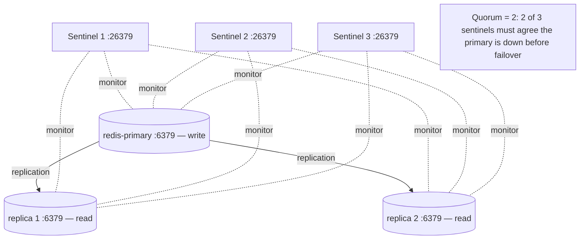

# ADR-014: Redis Sentinel for High Availability

## Status

Accepted

## Context

Redis is used for session storage, application caching, and rate limiting across API and Dashboard services. A single Redis instance creates a single point of failure — if Redis goes down, all sessions are lost and caching stops working, causing degraded performance and potential service outages.

Requirements for Redis availability:

1. **Automatic failover**: If the primary crashes, a replica must be promoted automatically without manual intervention.
2. **Data durability**: Writes must replicate to at least one replica before acknowledgment (to prevent data loss on failover).
3. **Access control**: Different consumers need different permission levels (app read/write, admin full, monitoring read-only).
4. **Dangerous command protection**: Operators must not accidentally run `FLUSHALL` or `FLUSHDB` in production.

Options considered:

- **Redis Cluster**: Overkill for our scale (5+ shards minimum, requires sharding-aware clients). Adds complexity for minimal benefit.
- **Single Redis with persistence**: Does not handle node failure; only protects against data loss on restart.
- **Redis Sentinel**: Standard HA solution for single-shard Redis with automatic failover and quorum-based decision making.

## Decision

Deploy Redis Sentinel with the following topology:

### Topology



- **1 primary + 2 replicas**: In production. Dev uses a single instance.
- **3 sentinels**: Each runs independently. Quorum is set to 2 — meaning 2 sentinels must agree that the primary is down before failover begins. This prevents a split-brain scenario where a single sentinel with a network partition triggers an unnecessary failover.
- **min-replicas-to-write=1**: Primary rejects writes if fewer than 1 replica is connected and in sync. This prevents acknowledged writes from being lost on failover.

### ACL Configuration (ADR-022)

Three Redis ACL users enforce least-privilege access:

| User       | Purpose                                      | Permissions                                      |
| ---------- | -------------------------------------------- | ------------------------------------------------ |
| `app`      | Application sessions, caching, rate limiting | `~* +@all -@dangerous -FLUSHALL -FLUSHDB -DEBUG` |
| `admin`    | Operations, manual inspection, key expiry    | `~* +@all`                                       |
| `readonly` | Monitoring dashboards, SigNoz Redis exporter | `~* +@read +@connection`                         |

### Dangerous Command Renaming

In addition to ACL restrictions, dangerous commands are renamed to empty strings in the Redis configuration:

```conf
rename-command FLUSHALL ""
rename-command FLUSHDB  ""
rename-command DEBUG    ""
```

This renders the commands completely unavailable, even to the admin user, preventing accidental data destruction.

### Client Discovery Pattern

Application services connect to Redis Sentinel (port 26379) to discover the current primary:

```
1. Service connects to sentinel-1:26379
2. Sends SENTINEL get-master-addr-by-name mymaster
3. Receives IP:port of current primary
4. Connects directly to primary for read/write operations
5. If primary becomes unreachable, sentinel notifies client of new primary
```

## Consequences

### Positive

- **Automatic failover**: Sentinel detects primary failure and promotes a replica within seconds. Application services reconnect transparently.
- **Data safety**: `min-replicas-to-write=1` ensures acknowledged writes survive failover.
- **Quorum-based decisions**: Requiring 2 of 3 sentinels to agree prevents false failovers from network partitions or single-sentinel crashes.
- **Access control**: ACL separates application, admin, and monitoring access with distinct credential sets.
- **Operational safety**: Dangerous commands are disabled at the config level, preventing catastrophic mistakes.

### Negative

- **Write throughput**: `min-replicas-to-write=1` adds latency to write operations (each write must wait for replica sync). This is ~1ms on the local network and is acceptable for caching/session workloads.
- **Sentinel resource usage**: 3 additional containers consume memory and CPU on the infrastructure network. Minimal overhead (~10MB per sentinel).
- **Client complexity**: Application clients must implement Sentinel discovery. The ioredis client handles this natively; minimal custom code required.
- **Dev/prod topology difference**: Dev uses a single Redis instance without sentinels. Application code must handle both modes gracefully.

### Risks

- **Split-brain during network partition**: If sentinels are split across partition boundaries, failover may be delayed. Mitigated by co-locating all sentinels on the same Docker network.
- **Replication lag**: Under heavy write load, replicas may fall behind, causing write rejections from `min-replicas-to-write=1`. Monitoring replication offset is recommended.
- **Sentinel failure**: If 2 of 3 sentinels fail simultaneously, automatic failover stops (quorum cannot be reached). The remaining sentinel continues monitoring but cannot initiate failover.
