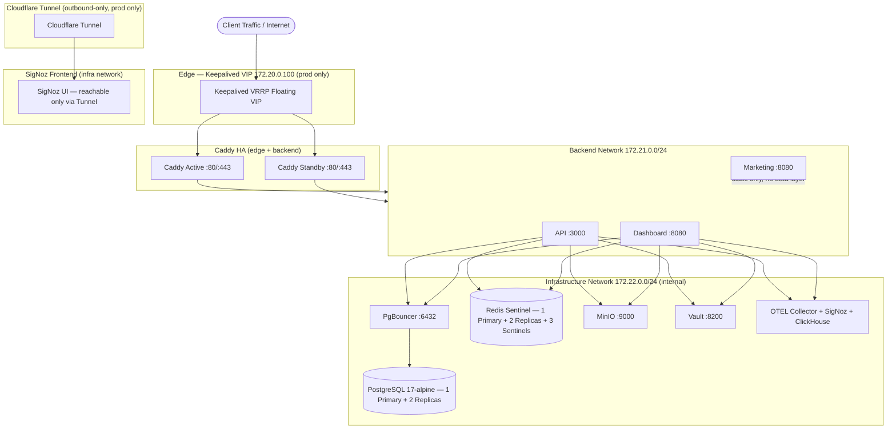

# Architecture Overview

High-level documentation for the Docker Compose + Just infrastructure platform.

## System Diagram



## Three-Environment Deployment Tiers

The modular Compose structure enables three distinct deployment tiers, each assembling a different subset of service modules:

| Tier        | Compose Files                                                                 | Service Count | Includes                                                                     |
| ----------- | ----------------------------------------------------------------------------- | ------------- | ---------------------------------------------------------------------------- |
| **Dev**     | networks + volumes + base + dev.override                                      | 5             | Postgres, PgBouncer, Redis, MinIO, PowerSync                                 |
| **Staging** | base + app + observability + staging.override                                 | 11            | Dev services + ClickHouse, OTEL Collector, SigNoz, API, Dashboard, Marketing |
| **Prod**    | base + app + observability + edge + scaling + security + sync + prod.override | 25            | Staging services + Caddy HA, Keepalived, Vault, replicas, Cloudflared        |

## Service Catalog

| Service                       | Image                                      | Role                                       | Networks       | Port             | Environments   |
| ----------------------------- | ------------------------------------------ | ------------------------------------------ | -------------- | ---------------- | -------------- |
| Caddy Active                  | `caddy:2.8.4-alpine` (custom build)        | Reverse proxy (primary)                    | edge, backend  | 80, 443          | prod only      |
| Caddy Standby                 | `caddy:2.8.4-alpine` (custom build)        | Reverse proxy (hot standby)                | edge, backend  | 80, 443          | prod only      |
| Keepalived                    | `osixia/keepalived:2.0.20-alpine`          | VRRP floating VIP                          | host network   | N/A              | prod only      |
| API                           | `oven/bun:1.2.1-alpine`                    | REST API backend                           | backend, infra | 3000             | staging, prod  |
| Dashboard                     | `oven/bun:1.2.1-alpine` (custom build)     | Web dashboard app                          | backend, infra | 8080             | staging, prod  |
| Marketing                     | `oven/bun:1.2.1-alpine` (custom build)     | Static landing page (no data-layer access) | backend        | 8080             | staging, prod  |
| PostgreSQL Primary            | `postgres:17-alpine`                       | Database (write)                           | infra          | 5432             | all            |
| PostgreSQL Replica x2         | `postgres:17-alpine` (custom build)        | Database (read)                            | infra          | 5432             | prod only      |
| PgBouncer                     | `pgbouncer/pgbouncer:1.15.0`               | Connection pooler                          | infra          | 6432             | all            |
| Redis Primary                 | `redis:7.4-alpine` (custom build)          | Cache (read/write)                         | infra          | 6379             | all            |
| Redis Replica x2              | `redis:7.4-alpine` (custom build)          | Cache (read)                               | infra          | 6379             | prod only      |
| Redis Sentinel x3             | `redis:7.4-alpine` (custom build)          | HA monitor                                 | infra          | 26379            | prod only      |
| MinIO                         | `minio/minio:RELEASE.2025-09-07T16-13-09Z` | S3 object storage                          | infra          | 9000, 9001       | all            |
| MinIO Backup (Staging + Prod) | `minio/minio:RELEASE.2025-04-22T02-16-34Z` | CRR target                                 | infra          | 9000, 9001       | Staging + Prod |
| Vault                         | `hashicorp/vault:1.18-alpine`              | Secrets + PKI                              | infra          | 8200             | Staging + Prod |
| ClickHouse                    | `clickhouse/clickhouse-server:24.8-alpine` | Metrics/trace storage                      | infra          | 8123             | staging, prod  |
| OTEL Collector                | `otel/opentelemetry-collector:0.113.0`     | Telemetry pipeline                         | infra          | 4317, 4318       | staging, prod  |
| SigNoz                        | `signoz/signoz:v0.137.0`                   | Observability (UI + query + alerting)      | infra          | 3001, 8080, 8081 | staging, prod  |
| PowerSync (sync)              | `journeyapps/powersync-service:1.24`       | Real-time sync replication worker          | infra          | 8085 (probes)    | all            |
| PowerSync (api)               | `journeyapps/powersync-service:1.24`       | Client sync API (stateless)                | infra          | 8085             | all            |
| Cloudflared                   | `cloudflare/cloudflared:2024.12.2`         | Tunnel client                              | infra          | N/A              | prod only      |

## Data Flow

1. **Inbound**: Client traffic arrives at the Keepalived VIP (prod) or published ports (staging). Caddy terminates TLS, inspects the `Host` header, and routes to API (`DOMAIN_API`), Dashboard (`DOMAIN_DASHBOARD`), or Marketing (`DOMAIN_MARKETING`) on the backend network.
2. **Application layer**: API and Dashboard connect to PgBouncer (transaction-mode pooling), Redis Sentinel (primary discovery), MinIO (S3), and Vault (dynamic credentials, Staging + Prod) — all on the infrastructure network. Marketing serves static content and has no data-layer access.
3. **Observability**: Services emit OTLP traces/metrics to the OTEL Collector, which forwards to ClickHouse via SigNoz. The SigNoz UI is reachable only through the Cloudflare Tunnel (prod) — no ports are exposed externally.
4. **Secrets**: Dev reads environment variables directly from `.env`. Staging and prod authenticate to Vault and receive dynamic, short-lived credentials. Docker secrets have been removed entirely (ADR-006).

## Modular Compose Structure

The `docker/compose/` directory contains 11 purpose-split YAML files:

| File                            | Purpose                                                               |
| ------------------------------- | --------------------------------------------------------------------- |
| `networks.yml`                  | Network definitions (edge, backend, infrastructure) with IPAM subnets |
| `volumes.yml`                   | Named volume declarations for all stateful services                   |
| `base.yml`                      | Core infrastructure services shared across all environments           |
| `app.yml`                       | Application services (API, Dashboard, Marketing)                      |
| `observability.yml`             | ClickHouse storage, OTEL Collector, SigNoz frontend                   |
| `edge.yml`                      | Caddy active/standby, Cloudflared                                     |
| `scaling.yml`                   | Redis replicas, PostgreSQL replicas, Redis Sentinels                  |
| `security.yml`                  | Vault, MinIO backup (Staging + Prod)                                  |
| `profiles/dev.override.yml`     | Dev: ports, low resources, infrastructure only                        |
| `profiles/staging.override.yml` | Staging: ports, moderate resources, app + observability               |
| `profiles/prod.override.yml`    | Prod: no ports, high resources, full HA stack                         |

## CLI Entry Point

All operations use [Just](https://github.com/casey/just) (v1.40.0):

```
just                    # List all recipes
just dev                 # Start dev environment (5 services)
just staging             # Start staging environment (20 services)
just deploy prod         # Deploy to production (25 services)
just status              # Service health overview
just vault:init          # Bootstrap Vault (prod)
just secrets:rotate      # Rotate dynamic credentials
```
