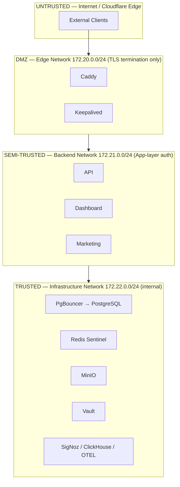
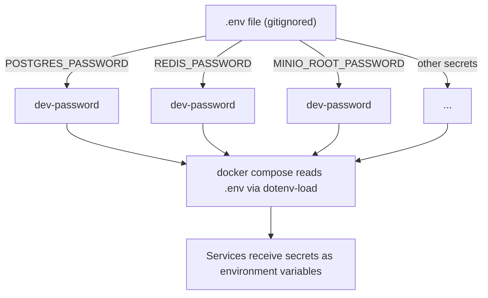
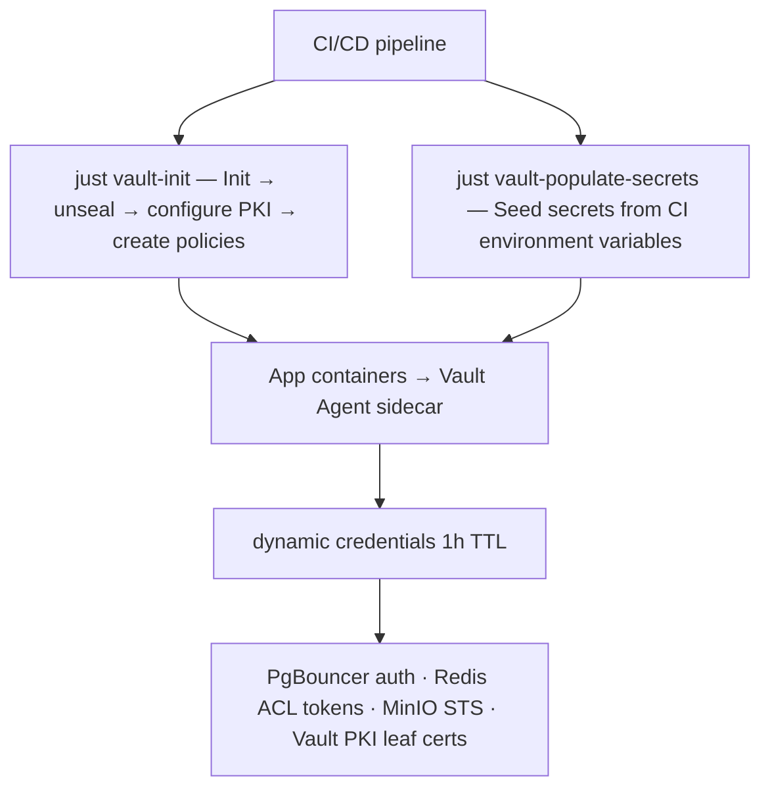

# Security Model

Comprehensive security architecture covering trust boundaries, secret management, network isolation, and image supply chain.

## Trust Boundaries



## Threat Model Summary

| Threat                   | Mitigation                                                                             |
| ------------------------ | -------------------------------------------------------------------------------------- |
| SQL injection            | Parameterized queries in API layer; least-privilege DB users                           |
| Credential leakage       | Vault dynamic credentials (1h TTL) in staging/prod; `.env` not committed to git in dev |
| Network lateral movement | 3-layer isolation; `internal: true` on infrastructure                                  |
| Container escape         | Alpine/distroless images; read-only FS where possible; no `--privileged`               |
| Supply chain attack      | Pinned digests in CI; Trivy scanning on every build; zero `:latest` tags               |
| Data exfiltration        | Infrastructure cannot reach internet; iptables DROP on 172.22.0.0/24                   |
| DDoS                     | Cloudflare rate-limiting at edge; Caddy connection limits                              |
| Redis compromise         | ACL with 3 users; dangerous commands disabled (FLUSHALL/FLUSHDB/DEBUG)                 |
| Man-in-the-middle        | Vault PKI with auto-rotating leaf certs; Caddy automatic HTTPS                         |

## Secret Management Flow

The project uses a **tiered secrets strategy** that varies by environment (ADR-006). Docker secrets have been removed entirely; sensitive values reach containers as environment variables everywhere.

### Development (.env Environment Variables)



- Secrets are stored as environment variables in the `.env` file (gitignored via `.gitignore`).
- Docker Compose reads `.env` automatically and injects values into container environment.
- No Docker secrets infrastructure, no Vault cluster — just a flat `.env` file.
- This is the simplest possible approach, appropriate for local development where security requirements are minimal.
- This is the simplest possible approach, appropriate for local development where security requirements are minimal.
- The previous Docker-secrets approach (`secrets/` files mounted at `/run/secrets/`) has been fully removed.

### Staging & Production (HashiCorp Vault)



- **Bootstrap sequence**: `vault operator init` → save unseal keys → `vault operator unseal` → configure PKI backend → create ACL policies → enable dynamic secret engines.
- **Dynamic credentials**: PostgreSQL roles, Redis ACL tokens, and MinIO STS credentials are generated on-demand with configurable TTL (default 1 hour).
- **PKI**: Vault issues short-lived leaf certificates for internal mTLS between services.
- **Environment detection**: Services check for the `VAULT_ADDR` environment variable. If present, they use Vault dynamic credentials. If absent (dev), they fall back to environment variables.

### Removed: Docker Secrets

The 8 Docker secrets previously defined in `docker/compose/secrets.yml` have been removed (migration complete):

| Secret                    | Previous Location                      | Replacement                          |
| ------------------------- | -------------------------------------- | ------------------------------------ |
| `postgres_password`       | `/run/secrets/postgres_password`       | `.env` (dev) / Vault (staging, prod) |
| `redis_password`          | `/run/secrets/redis_password`          | `.env` (dev) / Vault (staging, prod) |
| `redis_admin_password`    | `/run/secrets/redis_admin_password`    | `.env` (dev) / Vault (staging, prod) |
| `redis_readonly_password` | `/run/secrets/redis_readonly_password` | `.env` (dev) / Vault (staging, prod) |
| `redis_sentinel_password` | `/run/secrets/redis_sentinel_password` | `.env` (dev) / Vault (staging, prod) |
| `minio_root_password`     | `/run/secrets/minio_root_password`     | `.env` (dev) / Vault (staging, prod) |
| `api_secret_key`          | `/run/secrets/api_secret_key`          | `.env` (dev) / Vault (staging, prod) |
| `ps_replication_password` | —                                      | `.env` (dev) / Vault (staging, prod) |
| `ps_storage_password`     | —                                      | `.env` (dev) / Vault (staging, prod) |

## Network Isolation

| Boundary                  | Enforcement            | Mechanism                                               |
| ------------------------- | ---------------------- | ------------------------------------------------------- |
| Internet → Edge           | Docker port publishing | Only 80/443 exposed (prod) or debug ports (dev/staging) |
| Edge → Backend            | Docker bridge routing  | Caddy cross-attached to backend                         |
| Backend → Infrastructure  | Docker bridge routing  | API/Dashboard cross-attached to infra                   |
| Infrastructure → Internet | `internal: true`       | No gateway, no NAT                                      |
| Edge → Infrastructure     | **Blocked**            | No cross-attachment, no route                           |

## Redis ACL Configuration

Three distinct users enforce least-privilege access (ADR-014/022):

```redis
# Application — read/write for sessions/caching
user app on ><password> ~* +@all -@dangerous -FLUSHALL -FLUSHDB -DEBUG

# Admin — full access for ops
user admin on ><password> ~* +@all

# Readonly — monitoring dashboards
user readonly on ><password> ~* +@read +@connection
```

Dangerous commands (`FLUSHALL`, `FLUSHDB`, `DEBUG`) are renamed to empty strings via `rename-command` in the Redis config, preventing any user from invoking them.

## Image Security

- **Base images**: All services use Alpine or distroless variants to minimize attack surface.
- **No `:latest` tags**: Every image is pinned to a specific version (e.g., `postgres:17-alpine`, `caddy:2.8.4-alpine`).
- **Trivy scanning**: CI pipeline runs `trivy image` on every build; high/critical CVEs block the merge.
- **Runtime**: Bun 1.2.1-alpine replaces Node.js for API, Dashboard, and Marketing — smaller image, faster startup.
- **Dockerfile location**: App Dockerfiles live at `app/<name>/Dockerfile` (built with a repo-root build context); infrastructure Dockerfiles remain under `docker/dockerfiles/<service>/Dockerfile`.

## Firewall Layers

Security is enforced at two levels:

1. **Docker network isolation**: Bridge networks segment traffic; `internal: true` removes the gateway. This is the primary defense.
2. **Host iptables**: Additional host-level rules block direct access to infrastructure ports from external interfaces, providing defense in depth if Docker's network driver is misconfigured.
