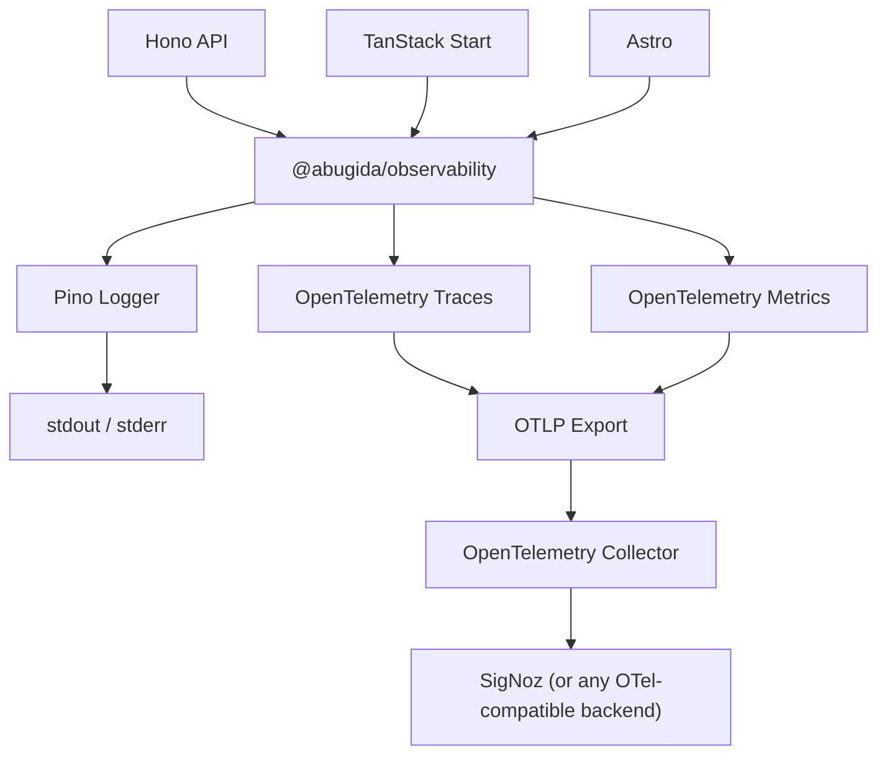

# @abugida/observability

A shared observability layer for the Abugida backend ecosystem.

Provides a thin, reliable abstraction over **Pino** (structured JSON logging) + **OpenTelemetry** (distributed tracing & metrics) + **OTLP** (telemetry export), designed for **Bun** runtimes.

## Architecture



### Data Flow

| Signal      | Path                                                         |
| ----------- | ------------------------------------------------------------ |
| **Logs**    | Application → Pino → stdout/stderr                           |
| **Traces**  | Application → OpenTelemetry → OTLP → OTel Collector → SigNoz |
| **Metrics** | Application → OpenTelemetry → OTLP → OTel Collector → SigNoz |

## Installation

```bash
pnpm add @abugida/observability
```

### Peer Dependencies

| Package | Required | When                                |
| ------- | -------- | ----------------------------------- |
| `hono`  | Optional | Using `@abugida/observability/hono` |

## Dependencies

| Package                                      | Purpose                                                                        |
| -------------------------------------------- | ------------------------------------------------------------------------------ |
| `@opentelemetry/api`                         | OpenTelemetry API surface                                                      |
| `@opentelemetry/core`                        | W3C propagator implementations                                                 |
| `@opentelemetry/context-async-hooks`         | AsyncLocalStorage-based context manager (required for `context.with()` in Bun) |
| `@opentelemetry/sdk-trace-base`              | TracerProvider & span processors                                               |
| `@opentelemetry/sdk-metrics`                 | MeterProvider & metric readers                                                 |
| `@opentelemetry/exporter-trace-otlp-proto`   | OTLP trace exporter (protobuf over HTTP)                                       |
| `@opentelemetry/exporter-metrics-otlp-proto` | OTLP metric exporter (protobuf over HTTP)                                      |
| `@opentelemetry/resources`                   | Resource attribute construction                                                |
| `@opentelemetry/semantic-conventions`        | Standard attribute names                                                       |
| `pino`                                       | Structured JSON logging                                                        |

## Quick Start

```ts
import { initObservability, logger, shutdownObservability } from '@abugida/observability'

await initObservability({
  serviceName: 'api',
  serviceVersion: '1.0.0',
  environment: 'production',
})

logger.info({ userId: 'u_123' }, 'Request received')

// On shutdown:
await shutdownObservability()
process.exit(0)
```

## Initialization

```ts
import { initObservability } from '@abugida/observability'

await initObservability({
  serviceName: 'api', // unique per application
  serviceVersion: '1.0.0',
  environment: 'production',
})
```

**Idempotent** — calling `initObservability()` multiple times is safe. It will not create duplicate providers or exporters.

### Per-Application Service Names

| Application     | `serviceName`    |
| --------------- | ---------------- |
| Hono API        | `api`            |
| TanStack Start  | `course-builder` |
| Astro Marketing | `marketing`      |

## Environment Variables

All configuration is read from environment variables. No hostnames, URLs, or credentials are hard-coded.

| Variable                      | Default                    | Description                                            |
| ----------------------------- | -------------------------- | ------------------------------------------------------ |
| `OTEL_SERVICE_NAME`           | (from `initObservability`) | Service identity                                       |
| `OTEL_SERVICE_VERSION`        | (from `initObservability`) | Service version                                        |
| `OTEL_DEPLOYMENT_ENVIRONMENT` | (from `initObservability`) | Deployment environment                                 |
| `OTEL_EXPORTER_OTLP_ENDPOINT` | `http://localhost:4318`    | OTLP collector URL                                     |
| `OTEL_EXPORTER_OTLP_PROTOCOL` | `http/protobuf`            | OTLP protocol (`grpc` or `http/protobuf`)              |
| `OTEL_TRACES_EXPORTER`        | `otlp`                     | Trace exporter (`otlp` or `none`)                      |
| `OTEL_METRICS_EXPORTER`       | `otlp`                     | Metric exporter (`otlp` or `none`)                     |
| `OTEL_TRACES_SAMPLER`         | `parentbased_always_on`    | Sampling strategy                                      |
| `OTEL_TRACES_SAMPLER_ARG`     | `1`                        | Sampler argument (e.g. probability for `traceidratio`) |
| `LOG_LEVEL`                   | `info`                     | Pino log level                                         |

## Logging

### Basic Usage

```ts
import { logger } from '@abugida/observability'

logger.info({ userId: 'u_123', courseId: 'c_456' }, 'Course published')
logger.error({ err }, 'Failed to publish course')
logger.warn({ retries: 3 }, 'Retry limit approaching')
```

### Structured Output

```json
{
  "level": 30,
  "time": "2025-06-15T10:30:00.000Z",
  "msg": "Course published",
  "userId": "u_123",
  "courseId": "c_456",
  "trace_id": "abc123...",
  "span_id": "def456...",
  "trace_flags": 1
}
```

### Automatic Trace Correlation

When an OpenTelemetry span is active, the logger automatically includes `trace_id`, `span_id`, and `trace_flags` in every log line. When no span is active, these fields are omitted (no fake IDs).

## Tracing

### Creating Spans

```ts
import { withSpan } from '@abugida/observability'

await withSpan('course.publish', async (span) => {
  span.setAttribute('course.id', courseId)
  return publishCourse(courseId)
})
```

### Getting a Tracer

```ts
import { getTracer } from '@abugida/observability'

const tracer = getTracer('my-module')
const span = tracer.startSpan('manual.operation')
// ...
span.end()
```

### Database Instrumentation

```ts
await withSpan('db.course.find', async (span) => {
  span.setAttribute('db.system', 'postgresql')
  span.setAttribute('db.operation', 'SELECT')
  return db.query('SELECT * FROM courses WHERE id = $1', [courseId])
})
```

## Metrics

```ts
import { getMeter, createCounter, createHistogram } from '@abugida/observability'

const meter = getMeter('course')

const publishCounter = createCounter(meter, 'course.publish.count', {
  description: 'Number of course publish operations',
})

const httpDuration = createHistogram(meter, 'http.request.duration', {
  description: 'HTTP request duration in milliseconds',
  unit: 'ms',
})

// Record
publishCounter.add(1, { method: 'POST', route: '/courses' })
httpDuration.record(120, { method: 'GET', route: '/courses' })
```

### High-Cardinality Guardrails

The package warns (via `console.warn`) when metric attributes include known high-cardinality labels: `user_id`, `course_id`, `request_id`, `email`, `session_id`, `token`, `password`, `ip_address`.

## Error Handling

```ts
import { recordError } from '@abugida/observability'

try {
  await publishCourse(courseId)
} catch (error) {
  recordError(error)
  throw error
}
```

`recordError()`:

- Records the exception on the active span
- Marks the span status as `ERROR`
- Logs the error via Pino (unless `silent: true`)
- Preserves the original error object

## Context Propagation

W3C `traceparent` / `tracestate` propagation is configured automatically during initialization.

```text
Incoming request
      ↓
Extract trace context (traceparent header)
      ↓
Create/continue server span
      ↓
Make context active
      ↓
Application logic + child spans
      ↓
Pino logs auto-correlated with trace_id
      ↓
Response
```

## Hono Integration

```ts
import { Hono } from 'hono'
import { observabilityMiddleware } from '@abugida/observability/hono'

const app = new Hono()
app.use('*', observabilityMiddleware())

app.get('/health', (c) => c.json({ status: 'ok' }))
```

The middleware:

1. Extracts incoming trace context from `traceparent` header
2. Creates an HTTP `SERVER` span with semantic attributes
3. Activates the context for downstream spans and logging
4. Captures the response status code
5. Records errors and marks 5xx responses as `ERROR`
6. Ends the span

**No request/response bodies are captured. Sensitive headers are never included in span attributes.**

## TanStack Start Integration

```ts
import { withServerSpan, recordServerError } from '@abugida/observability/tanstack'

export const publishCourse = createServerFn({ method: 'POST' }).handler(async ({ data }) => {
  return withServerSpan('course-builder.publish', async (span) => {
    span.setAttribute('course.id', data.courseId)
    return publish(data.courseId)
  })
})
```

> **Server-side only.** This module never exposes OTLP endpoints, collector configuration, or server credentials to browser bundles.

## Astro Integration

```ts
// astro.config.ts
import { astroObservability } from '@abugida/observability/astro'

export default defineConfig({
  integrations: [
    astroObservability({
      serviceName: 'marketing',
      serviceVersion: '1.0.0',
      environment: 'production',
    }),
  ],
  output: 'server', // or "hybrid"
})
```

### Per-Page Spans

```astro
---
import { withPageSpan } from "@abugida/observability/astro";

const data = await withPageSpan("page.home", (span) => {
  span.setAttribute("astro.page", "/");
  return fetchHomeData();
});
---
```

> **No browser analytics.** This integration only instruments server-side rendering. Static mode introduces no unnecessary server runtime requirements.

---

## Examples

Practical, copy-paste-ready examples for each Abugida application. Every import and function call below uses the actual `@abugida/observability` public API.

### Hono API

A complete Hono API service on Bun with observability wired end-to-end.

#### Installation

```bash
pnpm add @abugida/observability hono
```

#### Application Setup

```ts
// src/index.ts
import { Hono } from 'hono'
import {
  initObservability,
  shutdownObservability,
  logger,
  withSpan,
  recordError,
} from '@abugida/observability'
import { observabilityMiddleware } from '@abugida/observability/hono'

const app = new Hono()

// ── Middleware ─────────────────────────────────────────────

app.use('*', observabilityMiddleware())

// ── Routes ─────────────────────────────────────────────────

app.get('/courses/:id', async (c) => {
  const courseId = c.req.param('id')

  return withSpan('course.get', async (span) => {
    span.setAttribute('course.id', courseId)

    const course = await fetchCourse(courseId)

    logger.info({ courseId }, 'Course fetched')

    return c.json(course)
  })
})

app.post('/courses/:id/publish', async (c) => {
  const courseId = c.req.param('id')

  return withSpan('course.publish', async (span) => {
    span.setAttribute('course.id', courseId)

    try {
      const result = await publishCourse(courseId)

      logger.info({ courseId }, 'Course published')

      return c.json(result)
    } catch (error) {
      recordError(error)
      throw error
    }
  })
})

// ── Startup & Shutdown ─────────────────────────────────────

const PORT = parseInt(process.env.PORT ?? '3000', 10)

logger.info({ port: PORT }, 'Starting API server')

process.on('SIGTERM', async () => {
  logger.info('Shutting down')
  await shutdownObservability()
  process.exit(0)
})

export default {
  port: PORT,
  fetch: app.fetch,
}
```

#### Separate Init File

In most projects, initialization lives in a dedicated entry point that runs before the server starts:

```ts
// src/observability.ts
import { initObservability } from '@abugida/observability'

let initialised = false

export async function ensureObservability(): Promise<void> {
  if (initialised) return
  await initObservability({
    serviceName: 'api',
    serviceVersion: process.env.APP_VERSION ?? '0.0.0',
    environment: process.env.NODE_ENV ?? 'development',
  })
  initialised = true
}
```

```ts
// src/index.ts
import { ensureObservability } from './observability'
import { shutdownObservability, logger } from '@abugida/observability'

await ensureObservability()

// ... app setup, routes, middleware ...

process.on('SIGTERM', async () => {
  await shutdownObservability()
  process.exit(0)
})
```

#### Telemetry Correlation

When a request hits `POST /courses/:id/publish`, the resulting telemetry forms a single correlated trace:

```text
HTTP POST /courses/:id/publish          ← created by observabilityMiddleware
  └── course.publish                      ← created by withSpan
        └── Pino log "Course published"   ← auto-injects trace_id, span_id
```

Every log line within the `withSpan` callback automatically includes the active `trace_id` and `span_id` — no manual correlation needed.

---

### TanStack Start

TanStack Start server functions run on the server only. The `@abugida/observability/tanstack` subpath export provides utilities designed for this boundary.

> **Important:** Never import `@abugida/observability` or its subpaths in client-side code. Only use these utilities inside server functions and server-side modules.

#### Installation

```bash
pnpm add @abugida/observability
```

#### Server Function Setup

```ts
// app/server/observability.ts
// This file is imported only by server-side code.
import { initObservability } from '@abugida/observability'

let initialised = false

export async function ensureObservability(): Promise<void> {
  if (initialised) return
  await initObservability({
    serviceName: 'course-builder',
    serviceVersion: process.env.APP_VERSION ?? '0.0.0',
    environment: process.env.NODE_ENV ?? 'development',
  })
  initialised = true
}
```

```ts
// app/server/init.ts
// Import and call during server startup.
import { ensureObservability } from './observability'
import { shutdownObservability, logger } from '@abugida/observability'

await ensureObservability()

process.on('SIGTERM', async () => {
  await shutdownObservability()
  process.exit(0)
})
```

#### Instrumented Server Functions

```ts
// app/routes/courses/-functions.ts
import { createServerFn } from '@tanstack/react-start'
import { withServerSpan, recordServerError } from '@abugida/observability/tanstack'
import { logger } from '@abugida/observability'

export const publishCourse = createServerFn({ method: 'POST' }).handler(
  async ({ courseId }: { courseId: string }) => {
    return withServerSpan('course.publish', async (span) => {
      span.setAttribute('course.id', courseId)

      try {
        const result = await publishCourseInDb(courseId)

        logger.info({ courseId }, 'Course published')

        return result
      } catch (error) {
        recordServerError(error)
        throw error
      }
    })
  },
)

export const getCourse = createServerFn({ method: 'GET' }).handler(
  async ({ courseId }: { courseId: string }) => {
    return withServerSpan('course.get', async (span) => {
      span.setAttribute('course.id', courseId)

      const course = await fetchCourseFromDb(courseId)

      logger.info({ courseId }, 'Course fetched')

      return course
    })
  },
)
```

#### Explicit Instrumentation

This package does not automatically instrument every server function. You choose which operations to trace by wrapping them with `withServerSpan`. This keeps telemetry intentional and avoids noise from low-value spans.

```ts
import { createInstrumentedHandler } from '@abugida/observability/tanstack'

const instrumentedFetch = createInstrumentedHandler('courses.list', async (span, page: number) => {
  span.setAttribute('courses.list.page', page)
  return fetchCoursesPage(page)
})

// Call like a regular function — the span is created automatically.
const courses = await instrumentedFetch(1)
```

#### Client / Server Boundary

```text
Client component
  │
  ↓  (network call)
TanStack Start server function
  │
  ↓  withServerSpan("course.publish")
Business logic + DB operations
  │
  ↓  logger.info(...)
Pino log with trace_id / span_id
```

---

### Astro

The Astro integration provides server-side telemetry for `server` and `hybrid` output modes. In `static` mode, no server-side code runs, so telemetry is not applicable.

#### Installation

```bash
pnpm add @abugida/observability
```

#### Integration Setup

```ts
// astro.config.ts
import { defineConfig } from 'astro/config'
import { astroObservability } from '@abugida/observability/astro'

export default defineConfig({
  integrations: [
    astroObservability({
      serviceName: 'marketing',
      serviceVersion: '1.0.0',
      environment: process.env.NODE_ENV ?? 'development',
    }),
  ],
  output: 'server', // or "hybrid"
})
```

When `output` is `"server"` or `"hybrid"`, the integration automatically calls `initObservability` during `astro:server:setup` and `shutdownObservability` during `astro:server:done`. No manual init is needed unless you want to control the timing yourself.

#### Request Middleware

Use Astro's `defineMiddleware` to create an instrumented HTTP span for each incoming request. This extracts the `traceparent` header so traces from upstream services connect seamlessly.

```ts
// src/middleware.ts
import { defineMiddleware } from 'astro:middleware'
import { instrumentRequest, recordAstroError } from '@abugida/observability/astro'
import { logger } from '@abugida/observability'

export const onRequest = defineMiddleware(async (context, next) => {
  logger.info({ pathname: context.url.pathname }, 'Incoming request')

  return instrumentRequest(context.request.headers, context.url.pathname, next)
})
```

#### Per-Page Spans

Wrap data fetching inside individual page components. The span inherits the request-level trace context created by the middleware.

```astro
---
import { withPageSpan, recordAstroError } from "@abugida/observability/astro";
import { logger } from "@abugida/observability";

const courses = await withPageSpan("page.courses", async (span) => {
  span.setAttribute("astro.page", "/courses");

  try {
    const data = await fetchCourses();
    logger.info({ count: data.length }, "Courses loaded");
    return data;
  } catch (error) {
    recordAstroError(error);
    throw error;
  }
});
---

<h1>All Courses</h1>
<ul>
  {courses.map((c) => <li>{c.title}</li>)}
</ul>
```

#### Rendering Modes

| Mode     | Server-Side Telemetry           | Notes                                     |
| -------- | ------------------------------- | ----------------------------------------- |
| `server` | Yes — all pages                 | Middleware and per-page spans both apply  |
| `hybrid` | Only on `server`-prefixed pages | Static pages produce no telemetry         |
| `static` | No                              | No server runtime; integration is a no-op |

---

### Shared Patterns

These patterns apply regardless of which framework you are using.

#### Initialization

Each Abugida application should call `initObservability` exactly once during startup, with a unique `serviceName`. The function is idempotent, so calling it multiple times is safe but unnecessary.

```ts
import { initObservability } from '@abugida/observability'

await initObservability({
  serviceName: 'api',
  serviceVersion: '1.0.0',
  environment: 'production',
})
```

Each application in the ecosystem uses a distinct `serviceName` so that traces and metrics can be filtered by service in your observability backend.

#### Structured Logging

Use the shared `logger` for all application log output. The logger writes structured JSON to stdout/stderr and automatically injects `trace_id` and `span_id` when a span is active.

```ts
import { logger } from '@abugida/observability'

logger.info({ courseId, userId }, 'Course published')
```

The resulting JSON includes correlation fields when called inside a span:

```json
{
  "level": 30,
  "time": "2026-08-31T12:00:00.000Z",
  "name": "api",
  "courseId": "course_123",
  "userId": "user_456",
  "trace_id": "4bf92f3577b34da6a3ce929d0e0e4736",
  "span_id": "00f067aa0ba902b7",
  "trace_flags": 1,
  "msg": "Course published"
}
```

When no span is active, the log line is emitted without `trace_id`, `span_id`, or `trace_flags`. No fake IDs are ever generated.

#### Tracing

Use `withSpan` to wrap business operations. The span is automatically activated in the current context, so any downstream `logger` calls and child spans inherit the same trace.

```ts
import { withSpan } from '@abugida/observability'

await withSpan('course.publish', async (span) => {
  span.setAttribute('course.id', courseId)
  return publishCourse(courseId)
})
```

Span names should describe the operation (`course.publish`, `db.course.find`). Attributes should be low-cardinality and useful for filtering. Never attach sensitive values (tokens, passwords, API keys) to spans.

Child spans automatically inherit the parent trace context:

```ts
await withSpan('course.publish', async (parentSpan) => {
  // This child span shares the same trace_id
  await withSpan('db.course.update', async (childSpan) => {
    await db.query('UPDATE courses SET published = true WHERE id = $1', [courseId])
  })
})
```

#### Error Recording

Use `recordError` inside catch blocks. It records the exception on the active span and logs it via Pino. Always re-throw the original error — `recordError` never swallows it.

```ts
import { recordError } from '@abugida/observability'

try {
  await publishCourse(courseId)
} catch (error) {
  recordError(error)
  throw error
}
```

Use `{ silent: true }` when you have already logged the error or when the caller will handle logging:

```ts
try {
  await publishCourse(courseId)
} catch (error) {
  logger.error({ courseId, err: error }, 'Publish failed')
  recordError(error, { silent: true }) // span only, no duplicate log
  throw error
}
```

Error messages passed to the span are automatically sanitized to strip references to passwords, tokens, and credentials.

#### Metrics

Create instruments through the package's helper functions. The `getMeter` call returns an OpenTelemetry `Meter` scoped to the given name.

```ts
import {
  getMeter,
  createCounter,
  createHistogram,
  incrementCounter,
  recordHistogram,
} from '@abugida/observability'

const meter = getMeter('course')

const publishCounter = createCounter(meter, 'course.publish.count', {
  description: 'Number of course publish operations',
})

const httpDuration = createHistogram(meter, 'http.request.duration', {
  description: 'HTTP request duration in milliseconds',
  unit: 'ms',
})

// Recording
incrementCounter(publishCounter, 1, { method: 'POST', route: '/courses' })
recordHistogram(httpDuration, 142, { method: 'POST', route: '/courses/:id/publish' })
```

You can also use the OpenTelemetry Meter API directly:

```ts
import { getMeter } from '@abugida/observability'

const meter = getMeter('course')

const counter = meter.createCounter('course.publish.count', {
  description: 'Number of course publish operations',
})

counter.add(1, { method: 'POST', route: '/courses' })
```

**High-cardinality warning:** Avoid using identifiers like `user_id`, `course_id`, `request_id`, `email`, `session_id`, `token`, `password`, or `ip_address` as metric attributes. These create unbounded time series that can overwhelm your metrics backend. The package emits a `console.warn` when it detects these labels.

#### Trace and Log Correlation

Correlation is automatic. When a span is active, every `logger` call includes the current `trace_id` and `span_id`. This works across nested spans, framework middleware, and asynchronous boundaries.

```ts
import { withSpan } from '@abugida/observability'
import { logger } from '@abugida/observability'

await withSpan('course.publish', async (span) => {
  // This log line automatically includes trace_id and span_id
  logger.info({ courseId: 'course_123' }, 'Publishing course')

  await publishCourse('course_123')

  // This log line shares the same trace_id and has a different span_id
  logger.info({ courseId: 'course_123' }, 'Course published')
})
```

The same `trace_id` appears in both log lines and in the exported OpenTelemetry span, so you can trace a single request from log aggregation to span visualization.

---

### End-to-End Telemetry Flow

A single HTTP request to the Hono API produces the following correlated telemetry:

```text
Incoming HTTP request (traceparent header, if present)
        ↓
observabilityMiddleware extracts W3C trace context
        ↓
HTTP SERVER span created (e.g. "HTTP POST /courses/:id/publish")
        ↓
withSpan("course.publish") creates a child span
        ↓
logger.info(...) emits JSON with trace_id + span_id
        ↓
HTTP response (status code captured on SERVER span)
        ↓
OTLP export to OpenTelemetry Collector
        ↓
SigNoz (or any OTel-compatible backend)
```

The same `trace_id` connects the HTTP span, the application span, and every Pino log line produced during the request.

---

### Environment Configuration

Applications should configure telemetry through environment variables, not source code. A typical production `.env` or deployment config:

```env
OTEL_EXPORTER_OTLP_ENDPOINT=http://otel-collector:4318
OTEL_EXPORTER_OTLP_PROTOCOL=http/protobuf

OTEL_TRACES_EXPORTER=otlp
OTEL_METRICS_EXPORTER=otlp

OTEL_TRACES_SAMPLER=parentbased_traceidratio
OTEL_TRACES_SAMPLER_ARG=1.0

LOG_LEVEL=info
```

Applications send telemetry to the OpenTelemetry Collector rather than directly to SigNoz. The collector handles processing, batching, and routing to one or more backends.

---

### Application Comparison

| Application    | Runtime              | Framework      | Integration                       | Observability                              |
| -------------- | -------------------- | -------------- | --------------------------------- | ------------------------------------------ |
| API            | Bun                  | Hono           | `@abugida/observability/hono`     | HTTP spans + traces + metrics + logs       |
| Course Builder | Bun                  | TanStack Start | `@abugida/observability/tanstack` | Server functions + traces + metrics + logs |
| Marketing      | Bun/server or static | Astro          | `@abugida/observability/astro`    | Server-side telemetry where applicable     |

---

## OTLP Configuration

The package communicates using standard OTLP (protobuf over HTTP by default). Configure your OpenTelemetry Collector to receive traces and metrics:

```yaml
# otel-collector-config.yml
receivers:
  otlp:
    protocols:
      http:
        endpoint: 0.0.0.0:4318

processors:
  batch:
    timeout: 5s
    send_batch_size: 1024

exporters:
  signoz:
    endpoint: 'http://signoz:4317'
    tls:
      insecure: true

service:
  pipelines:
    traces:
      receivers: [otlp]
      processors: [batch]
      exporters: [signoz]
    metrics:
      receivers: [otlp]
      processors: [batch]
      exporters: [signoz]
```

## Graceful Shutdown

```ts
import { shutdownObservability } from '@abugida/observability'

process.on('SIGTERM', async () => {
  await shutdownObservability()
  process.exit(0)
})
```

Flushes all pending telemetry and shuts down providers/exporters cleanly.

## Bun Compatibility

This package is designed for **Bun** runtimes. It:

- Uses lower-level OpenTelemetry APIs and explicit instrumentation
- Does **not** require `@opentelemetry/auto-instrumentations-node` or `@opentelemetry/sdk-node`
- Does **not** require `node --require`, `NODE_OPTIONS`, or `--import` flags
- Works with Bun's native ESM and TypeScript support

## Security Considerations

- **Sensitive headers** (`authorization`, `cookie`, `x-api-key`, etc.) are never captured in span attributes
- **Pino redact paths** are configured for `password`, `token`, `secret`, `accessToken`, `apiKey`, and more
- **Error messages** are sanitized to remove references to passwords, tokens, and credentials
- **High-cardinality labels** (`user_id`, `email`, `course_id`, etc.) are warned against in metrics
- **No request/response bodies** are captured
- **No SigNoz-specific SDKs** are imported — communication is via standard OTLP only
- **Browser bundles** never receive OTLP endpoints, collector config, or server credentials

## Public API

### Root Export (`@abugida/observability`)

| Export                                           | Type        | Description                                      |
| ------------------------------------------------ | ----------- | ------------------------------------------------ |
| `initObservability(options)`                     | function    | Bootstrap all providers, logger, and propagation |
| `shutdownObservability()`                        | function    | Flush and shut down all providers                |
| `logger`                                         | Pino Logger | Shared structured logger with trace correlation  |
| `getTracer(name, version?)`                      | function    | Obtain an OpenTelemetry Tracer                   |
| `getMeter(name, version?)`                       | function    | Obtain an OpenTelemetry Meter                    |
| `createCounter(meter, name, options?)`           | function    | Create a Counter instrument                      |
| `createHistogram(meter, name, options?)`         | function    | Create a Histogram instrument                    |
| `createUpDownCounter(meter, name, options?)`     | function    | Create an UpDownCounter instrument               |
| `incrementCounter(counter, value?, attributes?)` | function    | Record a counter increment                       |
| `recordHistogram(histogram, value, attributes?)` | function    | Record a histogram observation                   |
| `withSpan(name, fn, options?)`                   | function    | Execute code inside a managed span               |
| `recordError(error, options?)`                   | function    | Record an exception on the active span + log     |

### Subpath Exports

| Path                              | Export                                                                                | Description                                    |
| --------------------------------- | ------------------------------------------------------------------------------------- | ---------------------------------------------- |
| `@abugida/observability/hono`     | `observabilityMiddleware()`                                                           | Hono middleware for HTTP spans                 |
| `@abugida/observability/tanstack` | `withServerSpan()`, `recordServerError()`, `createInstrumentedHandler()`              | TanStack Start server function instrumentation |
| `@abugida/observability/astro`    | `astroObservability()`, `withPageSpan()`, `instrumentRequest()`, `recordAstroError()` | Astro SSR instrumentation                      |

## License

Private — Abugida Project
